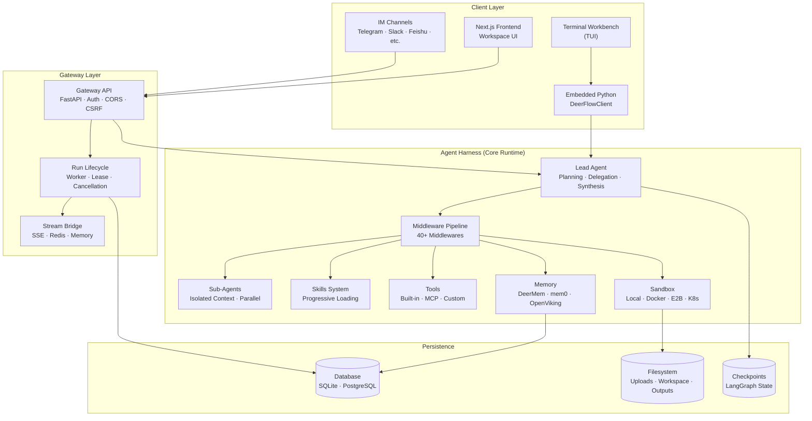

---
slug:1-overview
blog_type:normal
---


**DeerFlow**（**D**eep **E**xploration and **E**fficient **R**esearch **Flow**）是由字节跳动开发的一款开源**超级 Agent 框架**。它通过编排子 Agent、持久化记忆和沙盒执行环境，在渐进式加载且可扩展的技能系统驱动下，完成复杂的多步骤任务。Version 2.0 是一次彻底的重写，未保留原 v1 深度研究框架的任何代码，现在被重新构想为一个运行时环境，为 AI agents 提供完成实际工作所需的完整基础设施：文件系统、记忆、技能、支持沙盒的代码执行，以及规划、委派和自我纠正的能力。DeerFlow 基于 **LangGraph** 和 **LangChain** 构建，开箱即用，同时通过自定义技能、MCP 服务器、插件中间件和可插拔的模型提供商保持完全的可扩展性。

来源：[README.md](/README.md#L1-L55), [README.md](/README.md#L764-L780)

---

## DeerFlow 的功能

DeerFlow 将对话式 LLM 转变为拥有独立计算机的自主 Agent。DeerFlow Agent 不仅能回答问题，还能读写文件、在隔离的沙盒中执行 shell 命令、交互式浏览网页、生成图像和视频、创建幻灯片、进行深度研究，并管理长期的多会话工作流。这种框架架构意味着每个 Agent 都能获得一个完整的执行环境，包含文件系统视图（`/mnt/user-data/` 目录包含上传、工作区和输出文件夹）、限定作用域的工具、持久化记忆，以及生成专门子 Agent 以进行并行或隔离工作的能力。该系统与模型无关——兼容任何 OpenAI 兼容的 LLM——并在具备长上下文窗口（100k+ tokens）、推理能力、多模态输入和强大工具调用能力的模型上表现最佳。

<CgxTip>
DeerFlow 的核心架构理念在于技能是**渐进式**加载的——仅当任务需要时才加载，而非一次性全部加载。这使得上下文窗口保持精简，即便在 token 敏感的模型上也能良好运行。技能可以由 Agent 的规划逻辑自动激活，也可以由用户通过斜杠命令（如 `/data-analysis analyze uploads/foo.csv`）显式激活。
</CgxTip>

来源：[README.md](/README.md#L764-L773), [README.md](/README.md#L972-L1003), [README.md](/README.md#L1156-L1170)

---

## 架构概览

DeerFlow 采用分层架构，主要分为三个层级：提供工作区 UI 的 **Next.js 前端**、作为 HTTP 入口并附带身份验证、路由和运行生命周期管理的 **Gateway API**，以及 **Agent 框架**——这是核心的 Python 运行时，负责将 LangGraph Agent 与中间件管道、工具、技能、记忆和沙盒执行环境组装在一起。Gateway 直接内嵌了 Agent 运行时（通过 `runtime/runs/worker.py`），同时另一种可选的**嵌入式 Python 客户端**（`DeerFlowClient`）提供了进程内访问方式，完全无需依赖任何 HTTP 服务。这种双模设计意味着 DeerFlow 既可以作为生产级服务器平台运行，也可以作为库直接导入使用。



中间件管道是 Agent 运行时的架构骨干。超过 40 个中间件类——涵盖意图澄清处理、记忆注入、技能激活、token 预算控制、工具输出摘要、内容总结、循环检测、安全防护等——被组装成一个确定性的链条，包裹每一次模型调用和工具执行。工厂函数 `create_deerflow_agent` 接受普通的 Python 参数（模型、工具、中间件、特性），并作为底层 `langchain.agents.create_agent` 原语与配置驱动的 `make_lead_agent` 应用工厂之间的桥梁，为开发者同时提供了编程式 SDK 入口和声明式配置路径。

来源：[README.md](/README.md#L318-L340), [factory.py](/backend/packages/harness/deerflow/agents/factory.py#L1-L100), [client.py](/backend/packages/harness/deerflow/client.py#L1-L80), [README.md](/README.md#L1196-L1215)

---

## 仓库结构

该仓库组织为两个主要应用目录（`backend/` 和 `frontend/`）、一个共享技能目录、部署基础设施以及项目级工具脚本。后端的核心逻辑位于 `backend/packages/harness/deerflow/` 中作为一个 Python 包，另有一个单独的 `extension-api` 包为插件开发提供契约。前端是一个 Next.js 应用，采用面向工作区的组件架构。

```
deer-flow/
├── backend/                          # Python backend (FastAPI + LangGraph)
│   ├── app/                          # Gateway app, channels, scheduler
│   │   ├── gateway/                  # HTTP API routers, auth, middleware
│   │   ├── channels/                 # IM channel adapters (7 platforms)
│   │   ├── scheduler/                # Scheduled task service
│   │   └── mcp_tasks/               # Durable MCP task service
│   ├── packages/
│   │   ├── harness/deerflow/         # ★ Core agent runtime (the harness)
│   │   │   ├── agents/               # Lead agent, sub-agents, middlewares
│   │   │   ├── tools/                # Built-in tools + MCP bridge
│   │   │   ├── skills/               # Skill catalog, parser, installer
│   │   │   ├── sandbox/              # Sandbox providers & security
│   │   │   ├── models/               # Model provider integrations
│   │   │   ├── runtime/              # Checkpointing, streams, goals
│   │   │   ├── persistence/          # Database models & migrations
│   │   │   ├── memory/               # Long-term memory backends
│   │   │   ├── guardrails/           # Safety middleware
│   │   │   ├── extensions/           # Plugin/middleware loading
│   │   │   ├── community/            # Search & sandbox providers
│   │   │   ├── tui/                  # Terminal UI (Textual)
│   │   │   └── client.py             # ★ Embedded Python client
│   │   └── extension-api/            # Plugin contract package
│   ├── langgraph.json                # LangGraph Server config
│   └── pyproject.toml
├── frontend/                         # Next.js frontend
│   ├── src/
│   │   ├── app/                      # Routes: workspace, auth, blog
│   │   ├── components/               # UI: workspace, ai-elements, landing
│   │   └── core/                     # State: agents, skills, memory, tools
│   └── package.json
├── skills/public/                    # 20+ built-in skills (SKILL.md)
├── docker/                           # Docker Compose & container configs
├── deploy/helm/                      # Helm charts for Kubernetes
├── scripts/                          # Setup wizard, doctor, deployment
├── config.example.yaml               # Full configuration reference (2560 lines)
├── Makefile                          # Unified dev commands
└── contracts/                        # API contracts & schemas
```

来源：[README.md](/README.md#L1-L55), [Makefile](/Makefile#L1-L177), [config.example.yaml](/config.example.yaml#L1-L50)

---

## 核心能力

DeerFlow 的功能集涵盖六大核心能力领域，每一项都旨在为 agents 提供真实的基础设施，而非模拟的工具访问。下表提供了这些能力及其配置位置的高阶概览。

| 能力 | 描述 | 配置位置 | 关键文件 |
|---|---|---|---|
| **技能系统** | 渐进式加载结构化能力模块（基于 Markdown 定义的工作流）。内置 20+ 技能。支持通过 `/skill-name` 激活自定义技能。 | `extensions_config.json` + `config.yaml → skills` | [skills/public/](/skills/public/) |
| **Sub-Agents** | 主 Agent 可委派任务给拥有独立上下文、工具和终止条件的隔离子 Agent。支持在有益时并行执行。 | `config.yaml → subagents` | [subagents/](/backend/packages/harness/deerflow/subagents/) |
| **沙盒与文件系统** | 提供具备完整文件系统的按任务隔离执行环境。支持 Local、Docker、E2B 和 Kubernetes 配置模式。 | `config.yaml → sandbox` | [sandbox/](/backend/packages/harness/deerflow/sandbox/) |
| **长期记忆** | 跨会话持久化用户画像、偏好和知识。支持 DeerMem（默认）、mem0 或 OpenViking 后端。 | `config.yaml → memory` | [agents/memory/](/backend/packages/harness/deerflow/agents/memory/) |
| **上下文工程** | 激进的内容摘要、上下文压缩（`/compact`）、子 Agent 上下文隔离、严格的工具调用恢复机制。 | `config.yaml → summarization` | [runtime/context_compaction.py](/backend/packages/harness/deerflow/runtime/context_compaction.py) |
| **IM 渠道集成** | 从 7 个消息平台接收任务，支持自动启动，无需公网 IP。 | `config.yaml → channels` | [app/channels/](/backend/app/channels/) |

### 内置技能目录

DeerFlow 内置了 20 多个公开技能，每个技能由一个 `SKILL.md` 文件定义，其中规定了工作流、最佳实践和辅助资源。技能以渐进方式发现，并根据上下文激活。

| 技能 | 用途 |
|---|---|
| `deep-research` | 结合网络搜索与合成的多步骤研究 |
| `data-analysis` | 使用 Python 脚本进行 CSV/数据分析 |
| `chart-visualization` | 生成图表与可视化 |
| `ppt-generation` | 创建 PowerPoint 演示文稿 |
| `image-generation` | AI 图像生成工作流 |
| `video-generation` | AI 视频生成工作流 |
| `music-generation` | AI 音乐创作 |
| `podcast-generation` | 生成播客音频内容 |
| `newsletter-generation` | 基于研究内容创建时事通讯 |
| `frontend-design` | 构建前端 UI 组件 |
| `web-design-guidelines` | 网页设计最佳实践 |
| `code-documentation` | 生成代码文档 |
| `academic-paper-review` | 审阅学术论文 |
| `consulting-analysis` | 商业咨询分析 |
| `systematic-literature-review` | 系统性学术文献综述 |
| `github-deep-research` | 针对 GitHub 仓库的深度研究 |
| `vercel-deploy-claimable` | 部署至 Vercel 并生成可认领的 URL |
| `skill-creator` | 编写新的自定义技能 |
| `skill-reviewer` | 审查技能质量（只读） |
| `claude-to-deerflow` | 从 Claude Code 与 DeerFlow 交互 |
| `bootstrap` | 项目初始化模板 |
| `find-skills` | 发现并搜索可用技能 |
| `surprise-me` | 创意惊喜任务 |

来源：[README.md](/README.md#L764-L820), [README.md](/README.md#L905-L950), [skills/public/](/skills/public/)

---

## 技术栈

| 层级 | 技术 | 详情 |
|---|---|---|
| **Agent 运行时** | Python 3.12+ · LangGraph · LangChain | LangGraph 用于有状态图执行；LangChain 用于模型抽象 |
| **后端 API** | FastAPI · Uvicorn | 具备身份验证、CORS、CSRF 及运行生命周期管理的网关 |
| **前端** | Next.js · React · TypeScript · pnpm | 具备实时流式传输的工作区 UI |
| **数据库** | SQLite（默认） · PostgreSQL（生产环境） | 供检查点存储、LangGraph Store 和应用数据共享使用 |
| **沙盒** | Docker · E2B · Local · Kubernetes | 按任务隔离执行 |
| **包管理器** | uv（后端） · pnpm（前端） | 快速依赖解析 |
| **反向代理** | Nginx | 运行在 2026 端口的同源统一端点 |
| **可观测性** | LangSmith · Langfuse · Monocle | 可插拔的链路追踪后端 |
| **终端 UI** | Textual | 基于 DeerFlowClient 的内嵌 TUI |

<CgxTip>
`DeerFlowClient` 类是嵌入式使用的编程入口。它提供与 HTTP Gateway API 相同的响应模式，并在 CI 中针对 Gateway Pydantic 模型进行验证，确保嵌入式路径与 HTTP 保持同步。这意味着你可以将 DeerFlow 作为库（`from deerflow.client import DeerFlowClient`）使用而无需运行任何服务器，也可以将其部署为完整的生产级平台。
</CgxTip>

来源：[README.md](/README.md#L1196-L1215), [client.py](/backend/packages/harness/deerflow/client.py#L1-L80), [Makefile](/Makefile#L1-L50), [config.example.yaml](/config.example.yaml#L1-L50)

---

## 部署模式

DeerFlow 支持四种部署模式，分别适用于不同的使用场景。统一的 Makefile 为所有模式提供了单命令入口，统一的 Nginx 端点可通过 `http://localhost:2026` 访问。

| | **本地前台运行** | **本地守护进程** | **Docker 开发环境** | **Docker 生产环境** |
|---|---|---|---|---|
| **开发环境** | `make dev` | `make dev-daemon` | `make docker-start` | — |
| **生产环境** | `make start` | `make start-daemon` | — | `make up` |
| **热重载** | ✅ | ✅ | ✅ | ❌ |
| **沙盒隔离** | 宿主机（受限） | 宿主机（受限） | Docker 容器 | Docker 容器 |

对于生产环境部署，推荐的起始配置为 8 vCPU / 16 GB 内存 / 40 GB SSD；对于共享的多 Agent 工作负载，可扩展至 16 vCPU / 32 GB 内存。推荐的生产环境目标平台为搭载 Docker 的 Linux。Gateway 在进程内管理活跃的运行任务，因此生产环境默认使用单个 Gateway 工作进程（`GATEWAY_WORKERS=1`）；多工作进程部署需要配合 PostgreSQL、Redis 流桥接以及租约心跳配置。

来源：[README.md](/README.md#L235-L260), [README.md](/README.md#L340-L395), [Makefile](/Makefile#L1-L177)

---

## 配置理念

配置由单个 `config.yaml` 文件（以 2560 行的 `config.example.yaml` 作为完整参考）以及用于 MCP 服务器和技能的 `extensions_config.json` 驱动。交互式设置向导（`make setup`）可在大约两分钟内引导新用户完成提供商选择、网络搜索配置以及沙盒/安全偏好设置，生成最小化的 `config.yaml` 并将密钥写入 `.env`。所有配置字段值均支持环境变量（例如，`api_key: $OPENAI_API_KEY`），且可随时通过 `make doctor` 命令验证设置是否正确。系统会跟踪配置版本（`config_version: 33`），当结构发生变更时，`make config-upgrade` 可将新字段合并到现有配置中。

模型配置中的 `use` 字段是一个 Python 导入路径（例如，`langchain_openai:ChatOpenAI` 或 `deerflow.models.patched_deepseek:PatchedChatDeepSeek`），能够支持任何 LangChain 兼容的模型提供商。DeerFlow 内置了针对 DeepSeek、MiniMax、StepFun、MiMo、vLLM、OpenAI Codex CLI 和 Claude Code OAuth 的修补版提供商，并兼容标准的 OpenAI 和 OpenRouter 配置。

来源：[config.example.yaml](/config.example.yaml#L1-L50), [README.md](/README.md#L92-L220), [README.md](/README.md#L196-L230)

---

## 进阶指南

既然你已经了解了 DeerFlow 是什么以及它的结构，以下是阅读文档的逻辑路径：

1. **动手实践** → [快速开始](2-quick-start) — 在 10 分钟内克隆、配置并运行 DeerFlow
2. **配置环境** → [配置与设置向导](3-configuration-and-setup-wizard) — 深入了解 `config.yaml`、模型提供商和设置向导
3. **理解架构** → [架构概览](7-architecture-overview) — 详细的系统设计与组件交互
4. **探索 Agent 编排** → [主 Agent 设计](8-lead-agent-design) → [子 Agent 执行引擎](9-subagent-execution-engine) → [Agent 中间件管道](10-agent-middleware-pipeline)
5. **基于技能构建** → [技能系统](11-skills-system) → [内置技能目录](12-built-in-skills-catalog) → [自定义技能编写](13-custom-skill-authoring)
6. **部署至生产环境** → [Docker 部署策略](26-docker-deployment-strategies) → [防护机制与安全中间件](25-guardrails-and-safety-middleware)

如需获取最新的社区动态，请参阅[最新动态](4-latest-updates)与[关于贡献者](6-about-contributors)。若要报告问题或提供反馈，请访问[问题与反馈](5-issues-and-feedbacks)。
