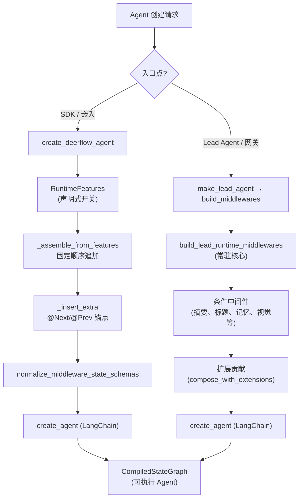

---
slug:10-agent-middleware-pipeline
blog_type:normal
---


Agent 中间件流水线是每个 DeerFlow Agent 执行过程的核心支柱。它是一个**声明式组装、对顺序敏感的 `AgentMiddleware` 实例链**，包裹着每一次模型调用——在请求到达 LLM 之前对其进行拦截、转换和校验，在响应到达用户之前同样进行拦截和处理。对于任何想要扩展 Agent 行为、调试工具调用失败或编写自定义中间件的人来说，理解这条流水线都是必不可少的。本页将涵盖两个组装入口（`create_deerflow_agent` 和 `build_middlewares`）、中间件顺序不变量、`@Next`/`@Prev` 定位协议，以及定义流水线运行时语义的各个中间件的具体职责。

---

## 流水线架构：两条组装路径

DeerFlow 提供了**两条截然不同的中间件组装路径**，它们服务于不同的部署场景，但共享同一套概念模型。SDK 级别的工厂函数 `create_deerflow_agent` 提供了一个无需配置、由功能开关驱动的入口点，便于将 Agent 嵌入到自定义应用中。应用级别的 `build_middlewares` 函数在 `make_lead_agent` 内部被调用，它负责组装完整的 Lead Agent 链，包含基于配置的条件加载、授权以及扩展贡献的中间件。



**SDK 路径**（`create_deerflow_agent`）接收一个 `RuntimeFeatures` 数据类，其布尔值或 `AgentMiddleware` 字段控制着哪些中间件会被包含在内。它在设计上明确支持组装时无需配置文件——工厂函数的文档字符串指出：“工厂组装本身无需配置，但部分注入的运行时组件在调用时可能仍会读取全局配置。”

来源：[factory.py](backend/packages/harness/deerflow/agents/factory.py#L1-L176), [features.py](backend/packages/harness/deerflow/agents/features.py#L1-L71), [agent.py](backend/packages/harness/deerflow/agents/lead_agent/agent.py#L382-L634)

---

## RuntimeFeatures：声明式功能开关

`RuntimeFeatures` 数据类是 SDK 级别中间件组装的声明式契约。每个字段都遵循**三态约定**，赋予调用者对中间件组合的精确控制权：

| 功能开关 | 类型 | 默认值 | 内置中间件 | 说明 |
|---|---|---|---|---|
| `sandbox` | `bool \| AgentMiddleware` | `True` | `ThreadDataMiddleware` → `UploadsMiddleware` → `SandboxMiddleware` | 三中间件集群 |
| `memory` | `bool \| AgentMiddleware` | `False` | `MemoryMiddleware` | 感知配置：工具模式 vs. 被动写入 |
| `summarization` | `Literal[False] \| AgentMiddleware` | `False` | 无（需自定义实例） | 需要模型参数 |
| `subagent` | `bool \| AgentMiddleware` | `False` | `SubagentLimitMiddleware` | 同时注入 `task_tool` |
| `vision` | `bool \| AgentMiddleware` | `False` | `ViewImageMiddleware` | 同时注入 `view_image_tool` |
| `auto_title` | `bool \| AgentMiddleware` | `False` | `TitleMiddleware` | — |
| `guardrail` | `Literal[False] \| AgentMiddleware` | `False` | 无（需自定义实例） | 暂无内置默认值 |
| `loop_detection` | `bool \| AgentMiddleware` | `True` | `LoopDetectionMiddleware` | 基于配置的默认值 |
| `token_budget` | `bool \| AgentMiddleware` | `False` | `TokenBudgetMiddleware` | 单次运行 Token 限制 |

三态约定的工作原理如下：`False` 完全跳过该中间件；`True` 实例化内置默认实现（针对拥有默认值的开关）；传入 `AgentMiddleware` 实例则使用该自定义实现作为直接替代。其中有两个例外——`summarization` 和 `guardrail`，当它们被设为 `True` 时会抛出 `ValueError`，因为它们的中间件需要构造函数参数（模型实例），而工厂函数无法推断该参数。

来源：[features.py](backend/packages/harness/deerflow/agents/features.py#L17-L41), [factory.py](backend/packages/harness/deerflow/agents/factory.py#L184-L358)

---

## SDK 中间件链：固定顺序组装

`_assemble_from_features` 函数通过**确定性的顺序追加**来构建中间件链。这种顺序并非随意设定，每个位置都反映了对前置中间件所建立状态的依赖。标准链条（启用所有功能时）如下：

```mermaid
flowchart LR
    subgraph "沙箱基础设施 [0–2]"
        M0["ThreadDataMiddleware\n(thread_id 可用)"]
        M1["UploadsMiddleware\n(文件上下文)"]
        M2["SandboxMiddleware\n(代码执行环境)"]
    end
    subgraph "常驻核心 [3–5]"
        M3["DanglingToolCallMiddleware\n(修补缺失的 ToolMessages)"]
        M4["GuardrailMiddleware\n(安全门)"]
        M5["ToolErrorHandlingMiddleware\n(转换工具异常)"]
    end
    subgraph "功能中间件 [6–14]"
        M6["SummarizationMiddleware\n(精简上下文)"]
        M7["TodoMiddleware\n(任务追踪)"]
        M8["TitleMiddleware\n(自动生成标题)"]
        M9["MemoryMiddleware\n(排队记忆更新)"]
        M10["ViewImageMiddleware\n(注入图像细节)"]
        M11["SubagentLimitMiddleware\n(截断超额并行调用)"]
        M12["LoopDetectionMiddleware\n(中断重复循环)"]
        M13["TokenBudgetMiddleware\n(单次运行 Token 上限)"]
    end
    M14["ClarificationMiddleware\n(拦截澄清请求)"]

    M0 --> M1 --> M2 --> M3 --> M4 --> M5 --> M6 --> M7 --> M8 --> M9 --> M10 --> M11 --> M12 --> M13 --> M14
```



`build_middlewares` 中的顺序注释明确说明了依赖关系的设计初衷：`ThreadDataMiddleware` 必须位于 `SandboxMiddleware` 之前，以确保 `thread_id` 可用；`DanglingToolCallMiddleware` 必须在模型读取历史记录之前修补缺失的 `ToolMessages`；`SummarizationMiddleware` 需要尽早运行，以便在后续处理前精简上下文；`ClarificationMiddleware` 始终处于最后，这样它就能在模型已有机会响应后拦截澄清请求。

<CgxTip>即使通过 `@Next`/`@Prev` 插入了额外中间件，`ClarificationMiddleware` 的不变量依然会得到保障。插入完成后，工厂函数会显式检查 `ClarificationMiddleware` 是否仍为末尾元素，如果因任何 `@Next(ClarificationMiddleware)` 锚点导致其错位，则会将其重新移回原位。</CgxTip>

来源：[factory.py](backend/packages/harness/deerflow/agents/factory.py#L191-L358), [agent.py](backend/packages/harness/deerflow/agents/lead_agent/agent.py#L372-L382)

---

## `@Next` / `@Prev` 定位协议

当调用者向 `create_deerflow_agent` 传入 `extra_middleware` 时，每个自定义中间件都可以使用 `@Next` 或 `@Prev` 类装饰器，声明其相对于内置锚点的期望位置。这些装饰器会在类上设置 `_next_anchor` 或 `_prev_anchor` 属性，`_insert_extra` 会读取这些属性来确定插入位置。

| 装饰器 | 语义 | 示例 |
|---|---|---|
| `@Next(AnchorMiddleware)` | 插入到链中锚点的**之后** | `@Next(ToolErrorHandlingMiddleware)` 将自定义中间件放置在 `ToolErrorHandlingMiddleware` 紧随其后 |
| `@Prev(AnchorMiddleware)` | 插入到链中锚点的**之前** | `@Prev(ClarificationMiddleware)` 将自定义中间件放置在 `ClarificationMiddleware` 正前方 |
| *(无装饰器)* | 作为默认回退，插入到 `ClarificationMiddleware` **之前** | 未指定锚点的中间件将被集中放置在澄清拦截器之前 |

插入算法分为四个阶段执行：

1. **校验** —— 拒绝任何同时声明 `@Next` 和 `@Prev` 的中间件
2. **冲突检测** —— 若存在针对同一锚点的额外中间件（即便方向相反），则抛出 `ValueError`
3. **无锚点插入** —— 放置在 `ClarificationMiddleware` 之前
4. **有锚点插入** —— 支持跨外部锚点（一个额外中间件以另一个额外中间件的类型为锚点）的迭代式多轮解析，并带有循环依赖检测

之所以需要迭代解析，是因为一个带有锚点的额外中间件，其目标锚点可能尚未被插入。每一轮都会尝试解析所有待插入项；如果进度停滞（一整轮没有执行任何插入），算法会检查剩余项之间是否存在循环依赖，并抛出描述性错误。

<CgxTip>对于观察型中间件，使用 `@Prev(ClarificationMiddleware)` 是最安全的定位策略——这能保证你的中间件在所有处理完成之后、澄清拦截器之前运行，且不会被其他带锚点的额外中间件挤占位置。</CgxTip>

来源：[features.py](backend/packages/harness/deerflow/agents/features.py#L49-L71), [factory.py](backend/packages/harness/deerflow/agents/factory.py#L366-L440)

---

## Lead Agent 中间件链：完整应用级组装

`build_middlewares` 函数组装的链条比 SDK 路径**丰富得多**。它是被 `make_lead_agent` 和嵌入式 `DeerFlowClient` 使用的生产级入口。该链条在概念上分为三层构建：

### 第 1 层：常驻运行时核心

链条以 `build_lead_runtime_middlewares` 开始，该函数返回基础中间件——包括沙箱基础设施（`ThreadDataMiddleware`、`UploadsMiddleware`、`SandboxMiddleware`）、`DanglingToolCallMiddleware` 和 `ToolErrorHandlingMiddleware`。这些中间件均以 `lazy_init=True` 注入，因此初始化过程会延迟到首次调用 Agent 时执行。

### 第 2 层：条件功能中间件

在核心层之后，一系列按条件加载的中间件会以严格的顺序追加：

| 顺序 | 中间件 | 条件 | 目的 |
|---|---|---|---|
| 1 | `DynamicContextMiddleware` | 始终加载 | 将日期/记忆作为 `<system-reminder>` 注入首条 HumanMessage |
| 2 | `SkillActivationMiddleware` | 始终加载 | 在 `/skill-name` 斜杠命令时加载 SKILL.md |
| 3 | `SkillToolPolicyMiddleware` | 始终加载 | 运行时强制执行各技能允许使用的工具 |
| 4 | `DurableContextMiddleware` | 始终加载 | 在摘要压缩前捕获委派/技能信息 |
| 5 | `SummarizationMiddleware` | `summarization` 配置开启 | 通过模型摘要进行上下文压缩 |
| 6 | `TodoMiddleware` | `is_plan_mode == True` | 结构化任务列表追踪 |
| 7 | `TokenUsageMiddleware` | `token_usage.enabled` | Token 用量统计 |
| 8 | `TitleMiddleware` | 始终加载 | 首次交互后自动生成对话标题 |
| 9 | `MemoryMiddleware` | 始终加载（行为随配置而异） | 将对话排入长期记忆队列 |
| 10 | `ViewImageMiddleware` | 模型支持视觉 | 在 LLM 读取历史前注入图像细节 |
| 11 | `MCPRoutingMiddleware` | 提供了 `mcp_routing_middleware` | 自动提升延迟加载的 MCP 架构 |
| 12 | `DeferredToolFilterMiddleware` | `deferred_setup` 包含延迟名称 | 在模型绑定时隐藏延迟工具架构 |
| 13 | `SystemMessageCoalescingMiddleware` | 始终加载 | 合并多条 SystemMessages 为一条（兼容不同提供商） |
| 14 | `SubagentLimitMiddleware` | `subagent_enabled == True` | 截断超额的并行任务调用 |
| 15 | `LoopDetectionMiddleware` | `loop_detection.enabled` | 中断重复的工具调用循环 |
| 16 | `TokenBudgetMiddleware` | `token_budget.enabled` | 强制执行单次运行 Token 限制 |
| 17 | 自定义中间件 | 提供了 `custom_middlewares` | 用户提供的扩展 |
| 18 | 配置的扩展中间件 | 存在扩展配置 | 从扩展配置中加载 |
| 19 | `TerminalResponseMiddleware` | 始终加载 | 重试空的最终响应；持久化可见的兜底响应 |
| 20 | `ModelLengthFinishReasonMiddleware` | 始终加载 | 为触及长度上限的补全标记 `stop_reason` |
| 21 | `SafetyFinishReasonMiddleware` | `safety_finish_reason.enabled` | 在提供商因安全原因终止时抑制工具执行 |
| 22 | `ClarificationMiddleware` | 始终加载（末尾） | 在模型调用后拦截澄清请求 |

### 第 3 层：扩展组合

在完整堆栈组装完成后，`compose_with_extensions` 会将扩展贡献的中间件合并到链中。这是特意在完整的特定 Lead 堆栈建立**之后**执行的——如果在 `build_lead_runtime_middlewares` 内部执行，会将 `MODEL_PHYSICAL` 贡献置于特定 Lead 中间件之上，从而改变“最终请求”对于观察者的语义。扩展系统会接收到包含已解析的 Agent 名称、模型名称和宿主策略（包括 Token 预算和子 Agent 限制）的 `AgentBuildContext`，以便扩展能够做出明智的定位决策。

来源：[agent.py](backend/packages/harness/deerflow/agents/lead_agent/agent.py#L382-L634), [agent.py](backend/packages/harness/deerflow/agents/lead_agent/agent.py#L659-L750)

---

## 中间件顺序不变量

整个代码库中强制执行或记录了若干**不可协商的顺序不变量**。违反这些规则会产生微妙的 Bug——从丢失线程上下文到无声无息地抑制工具调用。

| 不变量 | 原因 | 强制执行方式 |
|---|---|---|
| `ThreadDataMiddleware` 位于 `SandboxMiddleware` 之前 | 沙箱路径解析必须用到 `thread_id` | 注释说明；顺序追加保证 |
| `DanglingToolCallMiddleware` 位于模型之前 | 修补缺失的 `ToolMessages` 以保证模型历史记录一致 | 在 SDK 链中始终处于位置 3 |
| `DurableContextMiddleware` 位于 `SummarizationMiddleware` 之前 | 在压缩丢弃前捕获委派/技能信息 | 在 `build_middlewares` 中顺序追加 |
| `MCPRoutingMiddleware` 位于 `DeferredToolFilterMiddleware` 之前 | 路由必须在过滤器决定隐藏架构前先将其提升 | 运行时断言：`assert_mcp_routing_before_deferred_filter` |
| `SystemMessageCoalescingMiddleware` 位于提供商调用之前 | 严格的后端（vLLM, SGLang, Qwen, Anthropic）会拒绝非首部的 SystemMessages | 顺序追加；在模型看到请求前完成合并 |
| `ClarificationMiddleware` 始终位于最后 | 必须在所有其他处理完成后拦截澄清请求 | 在 `_assemble_from_features` 中显式重定位；在 `build_middlewares` 中有注释说明 |
| `SafetyFinishReasonMiddleware` 位于 `TerminalResponseMiddleware` 之后 | 在终端响应之后注册，使得 LangChain 的逆序 `after_model` 调度优先运行安全检查 | 顺序追加顺序 + LangChain 逆序调度语义 |

`SafetyFinishReasonMiddleware` 的顺序利用了 LangChain 的**逆序 after_model 调度机制**：在列表中后注册的中间件，其 `after_model` 钩子会被先调用。通过将 `SafetyFinishReasonMiddleware` 追加到 `TerminalResponseMiddleware` 之后，其钩子会在终端守卫的钩子之前触发，从而允许它在触发终端响应警报之前清除 `tool_calls`。

来源：[agent.py](backend/packages/harness/deerflow/agents/lead_agent/agent.py#L372-L382), [agent.py](backend/packages/harness/deerflow/agents/lead_agent/agent.py#L529-L544), [agent.py](backend/packages/harness/deerflow/agents/lead_agent/agent.py#L582-L603), [factory.py](backend/packages/harness/deerflow/agents/factory.py#L345-L357)

---

## 中间件分类与职责

`middlewares/` 目录下的 40 多个中间件文件服务于不同的功能类别。以下是架构层面最核心的中间件分类参考：

### 基础设施中间件

| 中间件 | 文件 | 职责 |
|---|---|---|
| `ThreadDataMiddleware` | [thread_data_middleware.py](backend/packages/harness/deerflow/agents/middlewares/thread_data_middleware.py) | 在状态中建立 `thread_id`；延迟初始化 |
| `UploadsMiddleware` | [uploads_middleware.py](backend/packages/harness/deerflow/agents/middlewares/uploads_middleware.py) | 将上传的文件引用解析为上下文 |
| `SandboxMiddleware` | (位于 `deerflow.sandbox.middleware`) | 管理代码执行环境的生命周期 |
| `DanglingToolCallMiddleware` | [dangling_tool_call_middleware.py](backend/packages/harness/deerflow/agents/middlewares/dangling_tool_call_middleware.py) | 为不完整的工具调用修补缺失的 `ToolMessage` 响应 |

### 上下文与记忆中间件

| 中间件 | 文件 | 职责 |
|---|---|---|
| `DynamicContextMiddleware` | [dynamic_context_middleware.py](backend/packages/harness/deerflow/agents/middlewares/dynamic_context_middleware.py) | 将日期/记忆作为 `<system-reminder>` 注入首条 HumanMessage |
| `DurableContextMiddleware` | [durable_context_middleware.py](backend/packages/harness/deerflow/agents/middlewares/durable_context_middleware.py) | 在摘要压缩过程中保留委派/技能信息 |
| `SummarizationMiddleware` | [summarization_middleware.py](backend/packages/harness/deerflow/agents/middlewares/summarization_middleware.py) | Token 超出阈值时通过模型进行上下文压缩 |
| `MemoryMiddleware` | [memory_middleware.py](backend/packages/harness/deerflow/agents/middlewares/memory_middleware.py) | 将对话轮次排入长期记忆后端队列 |
| `SystemMessageCoalescingMiddleware` | [system_message_coalescing_middleware.py](backend/packages/harness/deerflow/agents/middlewares/system_message_coalescing_middleware.py) | 将所有 SystemMessages 合并为单条首部消息 |

### 技能与工具策略中间件

| 中间件 | 文件 | 职责 |
|---|---|---|
| `SkillActivationMiddleware` | [skill_activation_middleware.py](backend/packages/harness/deerflow/agents/middlewares/skill_activation_middleware.py) | 在斜杠激活时确定性地加载 SKILL.md |
| `SkillToolPolicyMiddleware` | [skill_tool_policy_middleware.py](backend/packages/harness/deerflow/agents/middlewares/skill_tool_policy_middleware.py) | 运行时强制执行各技能允许使用的工具 |
| `ToolErrorHandlingMiddleware` | [tool_error_handling_middleware.py](backend/packages/harness/deerflow/agents/middlewares/tool_error_handling_middleware.py) | 将工具异常转换为 `ToolMessage` 响应 |
| `DeferredToolFilterMiddleware` | [deferred_tool_filter_middleware.py](backend/packages/harness/deerflow/agents/middlewares/deferred_tool_filter_middleware.py) | 在 `tool_search` 提升前隐藏延迟加载的 MCP 工具架构 |
| `MCPRoutingMiddleware` | [mcp_routing_middleware.py](backend/packages/harness/deerflow/agents/middlewares/mcp_routing_middleware.py) | 从 PR1 路由元数据中自动提升延迟加载的 MCP 架构 |

### 安全与限制中间件

| 中间件 | 文件 | 职责 |
|---|---|---|
| `LoopDetectionMiddleware` | [loop_detection_middleware.py](backend/packages/harness/deerflow/agents/middlewares/loop_detection_middleware.py) | 检测并中断重复的工具调用模式 |
| `SubagentLimitMiddleware` | [subagent_limit_middleware.py](backend/packages/harness/deerflow/agents/middlewares/subagent_limit_middleware.py) | 截断超额的并行子 Agent 任务调用 |
| `TokenBudgetMiddleware` | [token_budget_middleware.py](backend/packages/harness/deerflow/agents/middlewares/token_budget_middleware.py) | 强制执行单次运行 Token 消耗限制 |
| `SafetyFinishReasonMiddleware` | [safety_finish_reason_middleware.py](backend/packages/harness/deerflow/agents/middlewares/safety_finish_reason_middleware.py) | 在提供商因安全原因终止时抑制工具执行 |
| `ModelLengthFinishReasonMiddleware` | [model_length_finish_reason_middleware.py](backend/packages/harness/deerflow/agents/middlewares/model_length_finish_reason_middleware.py) | 为触及长度上限的补全标记运行级 `stop_reason` |

### 响应与用户体验中间件

| 中间件 | 文件 | 职责 |
|---|---|---|
| `ClarificationMiddleware` | [clarification_middleware.py](backend/packages/harness/deerflow/agents/middlewares/clarification_middleware.py) | 拦截澄清请求；始终处于最后 |
| `TerminalResponseMiddleware` | [terminal_response_middleware.py](backend/packages/harness/deerflow/agents/middlewares/terminal_response_middleware.py) | 重试空的最终响应；持久化可见的错误兜底 |
| `TitleMiddleware` | [title_middleware.py](backend/packages/harness/deerflow/agents/middlewares/title_middleware.py) | 首次交互后自动生成对话标题 |
| `TodoMiddleware` | [todo_middleware.py](backend/packages/harness/deerflow/agents/middlewares/todo_middleware.py) | 针对计划模式的结构化任务列表管理 |
| `TokenUsageMiddleware` | [token_usage_middleware.py](backend/packages/harness/deerflow/agents/middlewares/token_usage_middleware.py) | Token 用量统计与报告 |

来源：[middlewares directory](backend/packages/harness/deerflow/agents/middlewares), [agent.py](backend/packages/harness/deerflow/agents/lead_agent/agent.py#L37-L50), [factory.py](backend/packages/harness/deerflow/agents/factory.py#L22-L27)

---

## 状态模式归一化

在中间件列表传递给 LangChain 的 `create_agent` 之前，会先经过 `normalize_middleware_state_schemas` 处理。该函数确保每个中间件声明的状态模式通道与已解析的检查点通道模式（`"full"` 或 `"delta"`）兼容。在 `"full"` 模式下，累积通道会存储完整的状态快照；在 `"delta"` 模式下，它们以可配置的快照频率存储增量。工厂函数会拒绝将 `"delta"` 模式与检查点处理器结合使用，因为通过此路径构建的持久化图会绕过检查点模式标记注入及故障关闭兼容性门控——这是一种防止在混合模式存储中发生隐性状态损坏的保障措施。

来源：[factory.py](backend/packages/harness/deerflow/agents/factory.py#L125-L166), [thread_state.py](backend/packages/harness/deerflow/agents/thread_state.py)

---

## 扩展中间件集成

Lead Agent 的最终组合步骤是通过 `compose_with_extensions` 合并扩展贡献的中间件。扩展声明作用于 `AgentScope.LEAD` 的中间件贡献，且只有在完整的内置堆栈存在后才会被合并。扩展系统会接收到 `AgentBuildContext`，其中包含：

- **`scope`**：`AgentScope.LEAD` —— 确保扩展仅作用于相应类型的 Agent
- **`agent_name`**：已解析的 Agent 名称，用于实现针对特定 Agent 的行为
- **`model_name`**：已解析的运行时模型，用于感知模型的扩展
- **`policy`**：投影的宿主策略，包括 Token 预算限制和子 Agent 限制，以便扩展能够遵守或扩充操作约束

该设计确保 `MODEL_PHYSICAL` 贡献（修改对模型的物理请求的扩展）叠加在完整的特定 Lead 堆栈之上，从而为所有观察者和追踪系统保留“最终请求”的语义含义。

来源：[agent.py](backend/packages/harness/deerflow/agents/lead_agent/agent.py#L605-L634)

---

## 实践指南：编写自定义中间件

要向流水线中添加自定义中间件，请实现 `AgentMiddleware` 并使用定位装饰器：

```python
from langchain.agents.middleware import AgentMiddleware
from deerflow.agents.features import Next, Prev

@Next(ToolErrorHandlingMiddleware)
class MyObservabilityMiddleware(AgentMiddleware):
    """在工具错误处理之后立即运行。"""

    def before_model(self, state, runtime):
        # 在模型调用前检查状态
        ...

    def after_model(self, state, response, runtime):
        # 检查模型响应
        ...
```

通过 `extra_middleware` 传入：

```python
agent = create_deerflow_agent(
    model=my_model,
    tools=my_tools,
    features=RuntimeFeatures(sandbox=True, loop_detection=True),
    extra_middleware=[MyObservabilityMiddleware()],
)
```

对于 Lead Agent 路径，需将 `custom_middlewares` 传递给 `build_middlewares`，这会将它们插入到 `ClarificationMiddleware` 之前。通过 `load_configured_extension_middlewares` 加载的基于扩展的中间件会追加在自定义中间件之后，但位于 `TerminalResponseMiddleware` 之前。

来源：[features.py](backend/packages/harness/deerflow/agents/features.py#L49-L71), [factory.py](backend/packages/harness/deerflow/agents/factory.py#L349-L357), [agent.py](backend/packages/harness/deerflow/agents/lead_agent/agent.py#L574-L581)

---

## 后续步骤

- 要了解 Lead Agent 如何配置和调用，请阅读 [Lead Agent 设计](8-lead-agent-design)。
- 关于 `SubagentLimitMiddleware` 管理的子 Agent 执行生命周期，请参见[子 Agent 执行引擎](9-subagent-execution-engine)。
- 关于可在位置 4 注入的安全与护栏中间件，请参见[护栏与安全中间件](25-guardrails-and-safety-middleware)。
- 要了解技能如何通过 `SkillActivationMiddleware` 和 `SkillToolPolicyMiddleware` 与流水线交互，请参见[技能系统](11-skills-system)。
- 要了解 `SummarizationMiddleware` 背后的上下文压缩机制，请参见[上下文工程与压缩](16-context-engineering-and-compaction)。
