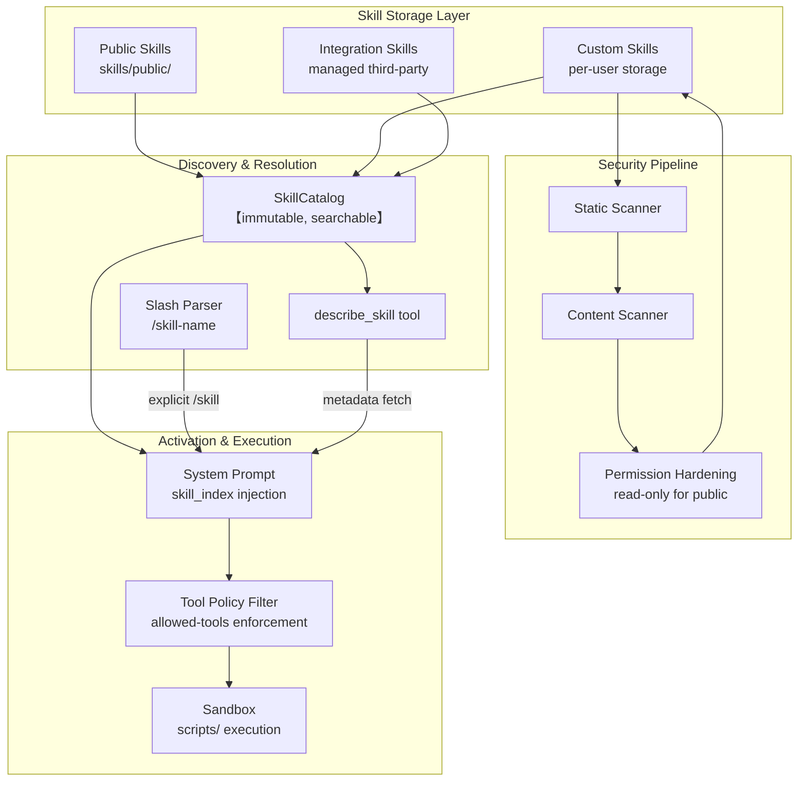
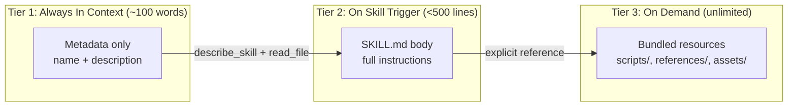
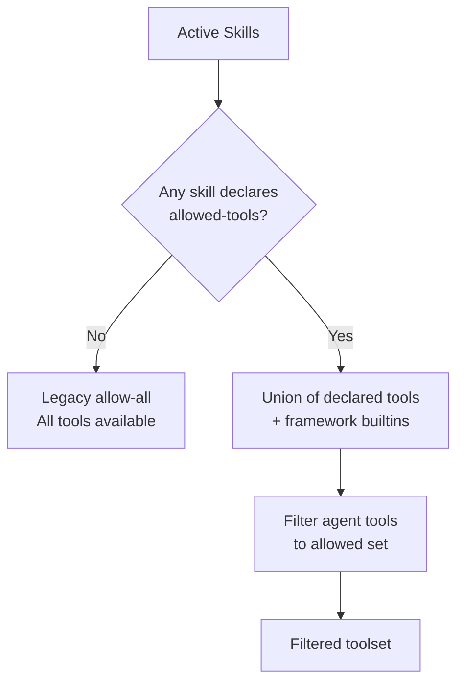
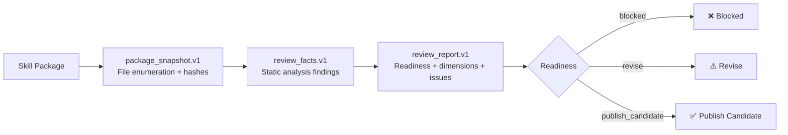

---
slug:11-skills-system
blog_type:normal
---


DeerFlow 技能系统是平台的核心扩展机制 —— 这是一个结构化框架，允许 Agent 按需加载特定领域的工作流、工具限制和过程知识。技能是自包含的包，包含 Markdown 指令、可执行脚本、参考文档和资产模板，能够在不修改核心编排图的情况下增强 Agent 的能力。本页涵盖了技能系统的架构、生命周期、发现模型、安全机制和存储层，为你提供在探索[内置技能目录](12-built-in-skills-catalog)或通过[自定义技能编写](13-custom-skill-authoring)创作自己的技能之前所需的概念基础。

来源：[types.py](backend/packages/harness/deerflow/skills/types.py#L1-L95), [describe.py](backend/packages/harness/deerflow/skills/describe.py#L1-L188)

---

## 架构概述

技能在 DeerFlow 架构中占据独特位置：它们既不是工具（离散的函数调用），也不是 Agent（自主执行单元）。相反，技能是**上下文指令包**，用于塑造 Agent 处理任务的方式。当技能被激活时，其 SKILL.md 主体会进入 Agent 的上下文窗口，提供方法论、约束条件以及指向捆绑资源的指针。随后，Agent 使用其现有工具（如搜索、文件 I/O、代码执行）执行任务，但整个过程受技能过程知识的引导。

该系统围绕三个核心原则设计：

- **渐进式披露** —— 通过分层加载技能内容（从轻量级元数据到完整指令集，再到按需加载的资源文件），最小化 token 消耗。
- **安全优先隔离** —— 每个技能，无论是内置的还是用户编写的，在影响 Agent 行为之前，都必须经过静态和动态安全扫描。
- **延迟发现** —— 目录仅暴露技能名称，让 LLM 通过 `describe_skill` 工具按需获取元数据，而不是将所有技能描述硬编码到系统提示词中。

下图展示了技能从存储、发现到激活和执行的完整生命周期：



来源：[catalog.py](backend/packages/harness/deerflow/skills/catalog.py#L1-L103), [describe.py](backend/packages/harness/deerflow/skills/describe.py#L1-L188), [slash.py](backend/packages/harness/deerflow/skills/slash.py#L1-L75), [installer.py](backend/packages/harness/deerflow/skills/installer.py#L1-L200)

---

## 技能结构与 Frontmatter

每个技能都是一个目录，包含必需的 `SKILL.md` 文件和可选的捆绑资源子目录。SKILL.md 以 YAML frontmatter 开头，用于声明技能的标识、触发行为、工具限制和密钥要求。

### 目录结构

```
skill-name/
├── SKILL.md              # 必需 — frontmatter + Markdown 指令
├── scripts/              # 可选 — 可执行代码 (Python, JS, shell)
│   └── generate.py
├── references/           # 可选 — 按需加载到上下文中的文档
│   └── guide.md
├── assets/               # 可选 — 输出中使用的文件 (模板, 图标)
│   └── template.md
├── templates/            # 可选 — 输出模板
│   └── report.md
└── evals/                # 可选 — 测试用例和断言
    └── evals.json
```

### Frontmatter 模式

Frontmatter 由专用解析器解析，该解析器会验证每个字段。下表记录了所有可识别的属性：

| 属性 | 类型 | 必需 | 描述 |
|---|---|---|---|
| `name` | `string` | 是 | 连字符格式的技能标识符 (`^[a-z0-9-]+$`)，最长 64 个字符，不允许前导、尾随或连续连字符 |
| `description` | `string` | 是 | 触发描述（最长 1024 个字符，不含尖括号）—— 技能激活的主要机制 |
| `license` | `string` | 否 | 技能的许可证标识符 |
| `allowed-tools` | `list[string]` | 否 | 此技能激活时可用工具的白名单；`None` 表示允许所有工具 |
| `required-secrets` | `list[string\|object]` | 否 | 作为环境变量注入的请求级密钥；每项可以是名称字符串或 `{name, optional}` 对象 |
| `secrets-autonomous` | `boolean` | 否 | 密钥是否可在自主模型加载期间绑定（默认为 `true`）；`false` 则限制为仅通过显式 `/slash` 激活 |

`description` 字段在架构上最为重要 —— 它充当技能的路由信号。当 LLM 评估是否调用某个技能时，会将用户查询与可用技能的描述进行匹配。精心编写的描述应同时说明技能能做**什么**以及**何时**使用它，并包含特定的触发短语和上下文。

来源：[parser.py](backend/packages/harness/deerflow/skills/parser.py#L1-L201), [validation.py](backend/packages/harness/deerflow/skills/validation.py#L1-L87), [types.py](backend/packages/harness/deerflow/skills/types.py#L1-L95)

---

## 技能类别与生命周期

技能分为四个类别，这决定了它们的存储位置、可变性和可见性：

| 类别 | 存储位置 | 可变性 | 描述 |
|---|---|---|---|
| **PUBLIC** | `skills/public/<name>/` | 只读 | 与平台捆绑的内置技能；在沙箱中挂载于 `/mnt/skills/public/<name>/` |
| **CUSTOM** | 用户专用存储目录 | 可编辑、可删除 | 通过 `skill_manage` 工具创建的用户自定义技能；在沙箱中挂载于 `/mnt/skills/custom/<name>/` |
| **INTEGRATION** | 托管第三方目录 | 只读 | 托管的集成技能；在沙箱中挂载于 `/mnt/skills/integrations/<name>/` |
| **LEGACY** | 全局自定义（迁移前） | 只读 | 用户隔离迁移前的技能；可见但不可编辑；在沙箱中挂载于 `/mnt/skills/legacy/<name>/` |

`SkillCategory` 枚举同时驱动存储解析和沙箱路径计算。每个 `Skill` 数据类实例都携带其类别，并能计算其容器路径 —— 即沙箱环境访问技能文件的位置：

```python
def get_container_path(self, container_base_path: str = DEFAULT_SKILLS_CONTAINER_PATH) -> str:
    category_base = f"{container_base_path}/{self.category}"
    skill_path = self.skill_path
    if skill_path:
        return f"{category_base}/{skill_path}"
    return category_base
```

容器基础路径默认为 `/mnt/skills`，可通过 `SkillsConfig.container_path` 设置进行配置。

来源：[types.py](backend/packages/harness/deerflow/skills/types.py#L11-L95), [skills_config.py](backend/packages/harness/deerflow/config/skills_config.py#L1-L78)

---

## 渐进式披露模型

技能系统采用三层加载策略，以在最大化能力的同时最小化 token 消耗：



**第 1 层 —— 元数据（始终加载）：** Agent 上下文中仅包含来自 frontmatter 的技能 `name` 和 `description`。在延迟发现模式下，它们以逗号分隔的列表形式出现在系统提示词的 `<skill_index>` 标签内 —— 仅包含名称，甚至不包含描述。

**第 2 层 —— SKILL.md 主体（触发时加载）：** 当技能被激活时 —— 无论是通过显式的 `/skill-name` 斜杠命令，还是通过 LLM 对技能容器路径调用 `read_file` —— 完整的 Markdown 主体都会进入上下文。建议大小在 500 行以内；接近此限制的技能应将内容拆分为参考文件，并提供明确的指向。

**第 3 层 —— 捆绑资源（按需加载）：** 脚本在沙箱中执行，无需加载到上下文中。只有当 SKILL.md 明确指示时，Agent 才会读取参考文件。这意味着技能可以捆绑数兆字节的支持文档，而在 Agent 实际需要之前，不会产生任何 token 成本。

<CgxTip>
`deferred_discovery` 配置标志控制第 1 层是包含完整描述还是仅包含名称。启用时（`SkillsConfig.deferred_discovery = True`），系统提示词仅包含带有逗号分隔名称的 `<skill_index>`，Agent 必须调用 `describe_skill` 来了解每个技能的功能。这保持了系统提示词的紧凑性并有利于前缀缓存，但每次发现会增加一次工具调用往返。
</CgxTip>

来源：[describe.py](backend/packages/harness/deerflow/skills/describe.py#L130-L188), [skills_config.py](backend/packages/harness/deerflow/config/skills_config.py#L35-L42)

---

## 发现与激活

技能通过两种截然不同的路径到达 Agent：**自主发现**和**显式斜杠激活**。两种路径最终殊途同归 —— 技能的 SKILL.md 内容进入 Agent 的上下文 —— 但区别在于由谁发起该过程。

### 通过 `describe_skill` 自主发现

启用延迟发现后，系统提示词会包含一个带有仅名称 `<skill_index>` 的 `<skill_system>` 块。Agent 能看到存在哪些技能，但必须主动获取元数据才能了解它们：

```
<skill_system>
You have access to skills that provide optimized workflows for specific tasks.

**Skill Discovery:**
1. Check <skill_index> for a skill name that matches your task
2. Call describe_skill(name) to fetch its description and capabilities
3. If the skill matches, call read_file on the returned location to load full instructions
4. Follow the skill's instructions precisely

<skill_index>
chart-visualization, data-analysis, deep-research, podcast-generation, ...
</skill_index>

Skills are located at: /mnt/skills
</skill_system>
```

`describe_skill` 工具是不可变 `SkillCatalog` 的一个闭包。它支持三种查询形式，与目录的搜索接口相对应：

| 查询形式 | 语法 | 行为 | 最大结果数 |
|---|---|---|---|
| 精确选择 | `select:data-analysis,deep-research` | 通过精确名称匹配返回指定技能 | 无限制 |
| 必需前缀 | `+podcast gen` | 名称中要求包含 `podcast`，并按 `gen` 排序 | 5 |
| 自由文本正则 | `chart visualization` | 对名称 + 描述进行正则匹配；名称匹配得分更高 | 5 |

目录的搜索机制具有优雅降级特性 —— 无效的正则表达式会回退为字面子串匹配，确保来自模型的格式错误查询永远不会引发异常。

### 显式斜杠激活

用户可以通过在消息前加上 `/skill-name` 来完全绕过发现过程：

```
/deep-research 比较用于长上下文理解的最新 transformer 架构
```

斜杠解析器（`parse_slash_skill_reference`）使用 `^/([a-z0-9]+(?:-[a-z0-9]+)*)(?:\s+|$)` 模式提取技能名称和剩余任务文本。七个控制命令是保留的，永远不会被解释为技能激活：`bootstrap`、`goal`、`help`、`memory`、`models`、`new`、`status`。这些命令固定在 `contracts/slash_skill_contract.json` 的共享契约夹具中，后端 Python 解析器和前端 TypeScript 显示解析器都必须遵守它 —— CI 中的契约测试会强制执行这种对称性。

`resolve_slash_skill` 函数执行三步解析：解析引用 → 验证技能是否在可用集合中（如果提供了白名单）→ 查找匹配的已启用技能。解析后的结果包含技能对象、剩余任务文本以及用于沙箱访问的容器文件路径。

来源：[catalog.py](backend/packages/harness/deerflow/skills/catalog.py#L1-L103), [describe.py](backend/packages/harness/deerflow/skills/describe.py#L60-L128), [slash.py](backend/packages/harness/deerflow/skills/slash.py#L1-L75), [slash_skill_contract.json](contracts/slash_skill_contract.json#L1-L7)

---

## 工具策略与能力范围界定

技能可以声明 `allowed-tools` frontmatter 字段，以在技能激活期间限制 Agent 的工具集。这创建了一种**能力范围界定**机制 —— 一个专注于图表生成的技能可以将 Agent 限制为仅使用文件 I/O 和脚本执行，防止其进行网络搜索或发送消息。

该策略通过一个联合模型工作，但有一个关键的边界情况：



当**没有**已加载的技能声明 `allowed-tools` 时，适用遗留行为 —— 所有工具保持可用。一旦**任何**技能声明了该字段，所有未声明该字段的已加载技能对工具联合集的贡献为零。这防止了没有工具限制的技能意外禁用另一个声明了限制的技能的限制。

无论 `allowed-tools` 声明如何，四个框架内置工具始终可用，因为它们支持受控的发现和文件工作流，而非业务工具权限：

| 始终可用的工具 | 用途 |
|---|---|
| `describe_skill` | 技能元数据发现 |
| `read_file` | 读取技能指令和资源 |
| `review_skill_package` | 技能审查和质量评估 |
| `tool_search` | 延迟工具发现（不恢复已移除的工具） |

<CgxTip>
通过 `tool_search` 提升工具**不会**恢复被技能工具策略移除的工具。技能的 `allowed-tools` 声明是硬边界 —— 一旦工具被过滤掉，在该技能激活上下文的持续时间内，它将保持不可用状态。
</CgxTip>

来源：[tool_policy.py](backend/packages/harness/deerflow/skills/tool_policy.py#L1-L66)

---

## 安全管道

技能安全在多个层面运作，反映出技能可以包含可执行代码，并且可能由不受信任的用户编写。

### 安装安全性

安装技能归档文件（`.zip`）时，`safe_extract_skill_archive` 函数会强制执行严格的保护措施：

| 保护措施 | 机制 | 缓解的威胁 |
|---|---|---|
| 拒绝路径遍历 | `is_unsafe_zip_member` 检查绝对路径、`..` 组件和冒号 | 目录逃逸、Windows 上的 ADS 走私 |
| 跳过符号链接 | `is_symlink_member` 检查外部属性 | 基于符号链接的文件替换 |
| 可执行二进制检测 | Magic 字节前缀匹配 (ELF, PE, Mach-O) | 任意二进制执行 |
| Zip 炸弹防御 | 最大未压缩总大小 512MB，最多 4096 个条目 | 资源耗尽 |
| macOS 元数据过滤 | 跳过 `__MACOSX` 和点文件 | 噪声注入 |

### 静态和动态扫描

除了归档安全性之外，`skill_manage` 工具在每次技能写入操作时都会运行两阶段扫描器：

1. **静态扫描**（`enforce_static_scan`）：在技能内容触及磁盘之前对其进行基于模式的分析。扫描技能目录的临时副本，并返回带有严重级别的 `StaticFinding` 对象。被阻止的发现会在写入任何文件之前引发 `StaticScanBlockedError`。

2. **内容扫描**（`scan_skill_content`）：更深入的分析，评估技能的可执行意图。对于可执行内容（脚本），只有 `allow` 决定才能通过；对于不可执行内容（SKILL.md），`block` 决定会引发异常，但 `review` 决定可以通过。

两次扫描都会将其决定记录在历史条目中，为每次修改及当时的安全评估创建审计追踪。

### 文件系统权限强化

安装后，`make_skill_tree_sandbox_readable` 会递归设置技能树的权限：目录变为 `0o555`（读 + 执行，无写权限），文件变为 `0o444`（只读）。组和其他写权限位被剥离。这确保了沙箱进程可以读取和执行技能脚本，但不能修改它们 —— 这是一种防止运行时篡改的防御措施。

公共技能和集成技能由于其存储位置而本质上是只读的。自定义技能只能通过 `skill_manage` 工具进行写入，该工具在每次操作时都会运行完整的安全管道。

来源：[installer.py](backend/packages/harness/deerflow/skills/installer.py#L70-L200), [permissions.py](backend/packages/harness/deerflow/skills/permissions.py#L1-L35), [skill_manage_tool.py](backend/packages/harness/deerflow/tools/skill_manage_tool.py#L1-L200)

---

## 技能管理工具

`skill_manage` 工具是面向 Agent 的接口，用于创建和发展自定义技能。它可在沙箱化的 Agent 环境中使用，并提供六种操作：

| 操作 | 参数 | 描述 |
|---|---|---|
| `create` | `name`, `content` | 使用 SKILL.md 内容创建新的自定义技能 |
| `edit` | `name`, `content` | 替换整个 SKILL.md |
| `patch` | `name`, `find`, `replace`, `expected_count?` | 在 SKILL.md 中进行查找和替换 |
| `delete` | `name` | 删除自定义技能 |
| `write_file` | `name`, `path`, `content` | 添加或替换支持文件（脚本、参考等） |
| `remove_file` | `name`, `path` | 移除支持文件 |

每次写入操作都遵循严格的顺序：验证技能名称 → 获取用户和技能级别的异步锁 → 验证 frontmatter → 运行静态扫描 → 运行内容扫描 → 写入存储 → 追加历史记录 → 刷新系统提示词缓存。历史记录捕获操作类型、作者、线程 ID、文件路径、先前和新内容以及扫描器决定 —— 从而创建完整的审计追踪。

用户级隔离通过 `resolve_runtime_user_id(runtime)` 强制执行，该函数从运行时对象确定用户上下文。每个用户都有自己的技能存储目录，`(user_id, skill_name)` 的锁粒度可防止跨用户阻塞，同时对同一技能上的并发操作进行串行化。

`skill_manage` 工具明确指示 Agent **不要**使用沙箱 `write_file` 进行技能操作，因为写入 `/mnt/user-data/outputs/` 的文件是按线程划分的，对未来聊天不可见。通过 `skill_manage` 持久化的技能会存入用户专用存储目录，并可立即在所有新对话中使用。

来源：[skill_manage_tool.py](backend/packages/harness/deerflow/tools/skill_manage_tool.py#L1-L200), [skill-creator SKILL.md](skills/public/skill-creator/SKILL.md#L46-L110)

---

## 技能审查与质量契约

DeerFlow 通过 `contracts/skill_review/` 中的三个 JSON Schema 契约定义了结构化的技能审查系统。这些模式支持对技能包进行自动化、可复现的质量评估：



### 包快照 (v1)

`package_snapshot.v1.schema.json` 捕获技能包文件的完整枚举，包含 SHA-256 哈希、大小限制和截断标志。它记录了技能的来源、类别和显示引用，以及枚举期间遇到的任何读取器错误。此快照作为审查管道的不可变输入 —— 一种精确记录了审查对象的内容寻址指纹。

### 审查事实 (v1)

`review_facts.v1.schema.json` 包含来自静态分析的结构化发现。每个发现包含一个 `rule_id`、`severity`（阻止、错误、警告、信息）、文件路径、行号、消息、修复指南和证据。事实还跟踪 `completeness`（包是否已完全枚举、文本内容是否完整、是否发生截断）以及按严重级别划分的发现汇总计数。`profile` 字段用于区分 `deerflow` 和 `agentskills` 审查配置文件。

### 审查报告 (v1)

`review_report.v1.schema.json` 是顶级输出。它将事实综合为 `readiness` 判定（`blocked`、`revise` 或 `publish_candidate`）和 `assurance` 级别（`static_only`、`trigger_checked`、`behavior_verified` 或 `regression_verified`）。报告包含多维度的评估，每个维度都有状态（`pass`、`concern`、`blocker`、`not_assessed`），以及带有严重性和置信度级别的结构化问题列表、证据元数据（运行时运行、基线、保留的工件）和建议操作。

来源：[package_snapshot.v1.schema.json](contracts/skill_review/package_snapshot.v1.schema.json#L1-L50), [review_facts.v1.schema.json](contracts/skill_review/review_facts.v1.schema.json#L1-L67), [review_report.v1.schema.json](contracts/skill_review/review_report.v1.schema.json#L1-L77)

---

## 存储与配置

技能系统的存储层通过 `SkillsConfig.use` 设置实现可插拔，该设置接受 `SkillStorage` 实现的 Python 类路径。默认实现是 `LocalSkillStorage`，它从本地文件系统读取技能。

### 路径解析

技能目录解析遵循严格的优先级顺序：

| 优先级 | 来源 | 示例 |
|---|---|---|
| 1 | 显式 `SkillsConfig.path` 字段 | `path: /data/my-skills` |
| 2 | `DEER_FLOW_SKILLS_PATH` 环境变量 | `DEER_FLOW_SKILLS_PATH=/opt/skills` |
| 3 | 项目根目录下的 `skills/` | `./skills/` |
| 4 | 遗留的仓库根目录候选 | `../skills/`（monorepo 兼容性） |

容器路径 —— 即技能在沙箱内挂载的位置 —— 默认为 `/mnt/skills`，可通过 `SkillsConfig.container_path` 进行配置。

### 用户级存储

自定义技能通过 `get_or_new_user_skill_storage(user_id)` 按用户进行存储，该函数为每个用户延迟创建存储实例。存储接口（`SkillStorage`）定义了用于写入、读取、验证和管理技能文件的方法，自定义实现则在此之上添加用户级逻辑。

存储层还为每个技能维护一个**历史日志**，每次通过 `skill_manage` 修改时都会追加记录。每个历史条目记录操作、作者、线程 ID、文件路径、先前内容、新内容和扫描器决定 —— 从而能够完整重构技能随时间的演变过程。

来源：[skills_config.py](backend/packages/harness/deerflow/config/skills_config.py#L1-L78), [skill_manage_tool.py](backend/packages/harness/deerflow/tools/skill_manage_tool.py#L100-L130), [__init__.py](backend/packages/harness/deerflow/skills/__init__.py#L1-L24)

---

## 密钥与密钥绑定

技能可以在 frontmatter 中声明 `required-secrets` —— 即技能激活时平台注入到沙箱子进程中的环境变量。此机制允许技能访问 API 密钥、令牌和其他凭证，而无需将其硬编码到技能内容中。

`secrets-autonomous` 标志控制着安全边界：当为 `true`（默认值）时，密钥在自主模型加载期间（即 LLM 决定加载技能时）绑定。当为 `false` 时，密钥仅在用户显式执行 `/slash` 激活时绑定。格式错误的非布尔值会**故障关闭**为 `false`，默认采用更严格的方向 —— 这是一种优先考虑注入安全性而非便利性的设计选择。

密钥名称必须匹配 POSIX 环境变量模式 `^[A-Za-z_][A-Za-z0-9_]*$`。具有无效名称的条目会在发出警告后被静默丢弃，而不是使整个技能失效，因此一个格式错误的声明不会破坏解析过程。

来源：[parser.py](backend/packages/harness/deerflow/skills/parser.py#L82-L130), [types.py](backend/packages/harness/deerflow/skills/types.py#L26-L35)

---

## Frontmatter 验证规则

验证层对 SKILL.md frontmatter 强制执行严格的契约，在编写错误到达运行时之前将其捕获：

| 规则 | 约束 | 违规时报错 |
|---|---|---|
| 名称格式 | `^[a-z0-9-]+$`（连字符格式） | 验证失败 |
| 名称长度 | 最长 64 个字符 | 验证失败 |
| 名称边界情况 | 无前导/尾随连字符，无连续连字符 | 验证失败 |
| 描述长度 | 最长 1024 个字符 | 验证失败 |
| 描述内容 | 无尖括号（`<` 或 `>`） | 验证失败 |
| 意外的键 | 仅接受允许的 frontmatter 属性 | 验证失败 |
| allowed-tools | 必须是非空字符串列表 | 验证失败 |
| required-secrets | 必须是列表（字符串或带有 `name` 的对象） | 验证失败 |
| secrets-autonomous | 必须是布尔值 | 验证失败 |

允许的 frontmatter 属性定义在 `ALLOWED_FRONTMATTER_PROPERTIES`（位于 `frontmatter.py`）中，任何不在此集合中的键都会导致验证失败，并显示列出了意外键的错误消息。

来源：[validation.py](backend/packages/harness/deerflow/skills/validation.py#L1-L87), [parser.py](backend/packages/harness/deerflow/skills/parser.py#L30-L80)

---

## 后续步骤

既然你已经了解了技能系统架构，接下来自然有两个步骤：

- **[内置技能目录](12-built-in-skills-catalog)** —— 探索 DeerFlow 附带的 20 多个公共技能，从 `deep-research` 和 `chart-visualization` 到 `podcast-generation` 和 `skill-creator`，每个技能都有各自的方法论、脚本和资源包。

- **[自定义技能编写](13-custom-skill-authoring)** —— 学习创建、测试和迭代自己技能的实用工作流，包括由 `skill-creator` 技能本身支持的评估驱动开发循环。

为了更深入地了解技能如何与执行环境交互，[沙箱与文件系统](14-sandbox-and-file-system)解释了技能脚本如何隔离运行，而 [Agent 中间件管道](10-agent-middleware-pipeline)涵盖了技能激活如何与 Agent 的请求处理链集成。
