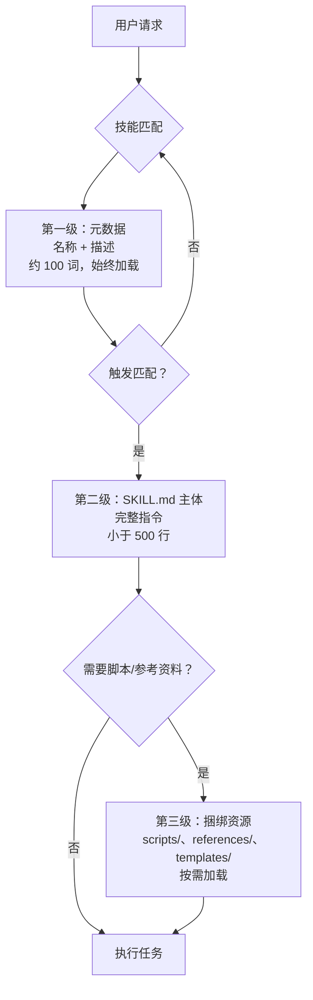

---
slug:12-built-in-skills-catalog
blog_type:normal
---


DeerFlow 在 `skills/public/` 目录内置了 **22 项技能**，每项技能均打包为一个独立的 `SKILL.md` 文件，并可附带可选的脚本、参考资料和模板。这些技能涵盖了从深度网络调研、数据分析，到多媒体生成和咨询级报告撰写等各类场景。本目录为每一项内置技能提供了结构化的参考说明——包括其功能、触发时机，以及它如何融入更广泛的技能生态系统。

来源：[SKILL.md](skills/public/deep-research/SKILL.md#L1-L199), [SKILL.md](skills/public/skill-creator/SKILL.md#L1-L200)

---

## 技能架构概览

每项技能均遵循三级的**渐进式披露**模式，旨在最大程度减少上下文消耗的同时最大化能力输出。在最顶层，YAML 前置元数据（名称 + 描述，约 100 词）始终会加载至 Agent 的上下文中。当某项技能被触发时，完整的 `SKILL.md` 主体内容会进入上下文（理想情况下不超过 500 行）。最后，捆绑的资源——脚本、参考资料、模板和静态素材——仅在该技能的工作流需要时按需加载。



每个技能目录均遵循以下规范结构：

```
skill-name/
├── SKILL.md              ← 必需：YAML 前置元数据 + Markdown 指令
├── scripts/              ← 可选：用于确定性任务的可执行 Python/JS 脚本
├── references/           ← 可选：按需加载的详细规范
├── templates/            ← 可选：输出模板
└── assets/               ← 可选：静态文件（图标、字体、报告模板）
```

来源：[SKILL.md](skills/public/skill-creator/SKILL.md#L107-L130), [skill_loader.py](tests/skills/skill_loader.py#L1-L40)

---

## 技能分类概览

22 项内置技能可分为七大功能类别。下表将每项技能映射至其所属类别及主要用例：

| 类别 | 技能 | 主要用例 |
|----------|--------|-----------------|
| **调研与分析** | deep-research, github-deep-research, data-analysis, consulting-analysis | 多角度网络调研、仓库调查、结构化数据查询、咨询报告 |
| **学术** | academic-paper-review, systematic-literature-review | 单篇论文同行评审、多篇文献综述 |
| **内容生成** | newsletter-generation, podcast-generation, ppt-generation, code-documentation | 简报、音频播客、演示文稿、软件文档 |
| **媒体生成** | image-generation, music-generation, video-generation | AI 图像、歌曲和视频 |
| **设计与前端** | frontend-design, chart-visualization, web-design-guidelines | 生产级 UI、数据图表、UI 合规审查 |
| **技能元管理** | skill-creator, skill-reviewer, find-skills | 创建、审查和发现技能 |
| **平台与工具** | bootstrap, surprise-me, claude-to-deerflow, vercel-deploy-claimable | Agent 引导、创意组合、API 桥接、即时部署 |

来源：[skills/public/](skills/public/), [slash_skill_contract.json](contracts/slash_skill_contract.json#L1-L7)

---

## 调研与分析技能

### 深度调研

**deep-research** 技能是 DeerFlow 的基础调研方法论。它不执行单一且浮于表面的网络搜索，而是强制采用四阶段的系统化方法：广泛探索、深入挖掘、多样性验证和综合检查。该技能旨在**在任何内容生成任务之前加载**——无论是 PPT 制作、前端设计还是简报撰写——以确保 Agent 首先收集到充足的多角度信息。

**核心原则**：绝不仅凭通用知识生成内容。质量标准要求至少包含 3-5 个不同的搜索角度、通过 `web_fetch` 读取完整来源，并涵盖事实、示例、专家观点、趋势和挑战。

| 阶段 | 目标 | 关键动作 |
|-------|------|-------------|
| 阶段 1：广泛探索 | 绘制领域全景 | 初步调查、确定维度、记录视角 |
| 阶段 2：深入挖掘 | 针对各维度进行定向调研 | 具体查询、多种表述、获取完整内容 |
| 阶段 3：多样性与验证 | 全面覆盖 | 事实/数据、示例、专家观点、趋势、对比、挑战 |
| 阶段 4：综合检查 | 验证充分性 | 检查清单：3-5 个角度？读取了完整来源？有具体数据？观点平衡？ |

<CgxTip>在构建搜索查询前，务必检查 `<current_date>`。时间精度至关重要——对于"今日"查询使用月+日，"近期"查询使用月，"趋势"查询使用年。硬编码过去的年份会导致遗漏当前结果。</CgxTip>

来源：[SKILL.md](skills/public/deep-research/SKILL.md#L1-L199)

### GitHub 深度调研

**github-deep-research** 技能可对任何 GitHub 仓库进行多轮调查，结合 GitHub API、网络搜索和网页抓取，生成详尽的 Markdown 报告。它遵循四轮方法论：GitHub API 数据收集 → 发现 → 深入调查 → 深度分析。

该技能内置了 `scripts/github_api.py` 脚本，支持 `summary`、`readme`、`tree`、`languages`、`contributors`、`commits`、`issues`、`prs` 和 `releases` 等命令。报告采用结构化模板，包含元数据块、执行摘要、按时间线排列的大事记、核心分析章节、指标表格、优劣势分析以及置信度评分（高：90%+，中：70–89%，低：50–69%）。

| 轮次 | 重点 | 使用的工具 |
|-------|-------|------------|
| 第 1 轮 | GitHub API 原始数据 | `github_api.py` 脚本 |
| 第 2 轮 | 发现与概览 | 3-5 次网络搜索 |
| 第 3 轮 | 深入调查 | 5-10 次搜索 + `web_fetch` |
| 第 4 轮 | 深度分析 | 提交历史、Issue/PR 审查 |

来源：[SKILL.md](skills/public/github-deep-research/SKILL.md#L1-L167)

### 数据分析

**data-analysis** 技能使用 **DuckDB**（一个进程内分析型 SQL 引擎）分析用户上传的 Excel (`.xlsx`/`.xls`) 和 CSV 文件。它支持模式检查、任意 SQL 查询、统计摘要、多表工作簿处理、跨文件关联，以及将结果导出为 CSV、JSON 或 Markdown 格式。

该工作流以单个 Python 脚本为核心，包含三种操作：`inspect`（模式发现）、`query`（任意 SQL 执行）和 `summary`（统计概要）。每个 Excel 工作表都会成为一个以该表命名的数据库表；CSV 文件则成为以文件名命名的表。所有上传文件中的所有表共享同一个查询上下文，从而实现跨文件关联。

| 参数 | 必需 | 描述 |
|-----------|----------|-------------|
| `--files` | 是 | Excel/CSV 文件的空格分隔路径 |
| `--action` | 是 | `inspect`、`query` 或 `summary` |
| `--sql` | 仅 `query` 时 | 要执行的 SQL 查询 |
| `--table` | 仅 `summary` 时 | 要汇总的表/工作表名称 |
| `--output-file` | 否 | 导出路径（自动识别 CSV/JSON/MD 格式） |

来源：[SKILL.md](skills/public/data-analysis/SKILL.md#L1-L200)

### 咨询分析

**consulting-analysis** 技能可生成麦肯锡/BCG 级别的 Markdown 格式研究报告。它分两个阶段运行：**第一阶段**根据研究主题生成严谨的分析框架（章节骨架、数据需求、可视化方案），**第二阶段**将收集到的数据综合成最终打磨过的报告。

该技能内嵌了丰富的专业分析框架工具箱——SWOT、PEST/PESTEL、波特五力模型、STP、BCG 矩阵、杜邦分析、DCF、蓝海战略、Gartner 技术成熟度曲线等。严格的**数据真实性协议**严禁捏造数据：每一项论断都必须能追溯到所提供的数据摘要或外部搜索结果。

| 领域 | 典型框架 |
|--------|-------------------|
| 市场分析 | TAM-SAM-SOM、产品生命周期 |
| 品牌分析 | SWOT、蓝海战略 |
| 消费者洞察 | RFM 模型、消费者决策旅程 |
| 财务分析 | 杜邦分析、DCF、可比公司分析 |
| 行业研究 | 波特五力模型、产业价值链 |
| 投资尽职调查 | VRIO、基准对比 |

来源：[SKILL.md](skills/public/consulting-analysis/SKILL.md#L1-L200)

---

## 学术技能

### 学术论文评审

**academic-paper-review** 技能可针对单篇学术论文生成结构化、达到同行评审质量的分析。它遵循顶级会议和期刊（NeurIPS、ICML、ACL、Nature、IEEE）的标准，涵盖摘要、优势、劣势、方法论评估、贡献评估、文献定位以及可操作的建议。

该工作流分为三个阶段。**第一阶段**（论文理解）提取元数据，进行深度阅读，并列出关键论点及其证据强度评级。**第二阶段**（批判性分析）搜索文献背景，从六个标准（稳健性、新颖性、可复现性、实验设计、统计严谨性、可扩展性）评估方法论，并评价贡献的显著性。**第三阶段**（评审综合）汇编最终的结构化评审报告。

**与 systematic-literature-review 的区别**：此技能用于对**单篇**论文进行深度评审。若要对**多篇**论文进行广度优先的综合分析，请使用 systematic-literature-review 技能。

来源：[SKILL.md](skills/public/academic-paper-review/SKILL.md#L1-L200)

### 系统性文献综述

**systematic-literature-review** 技能可针对某个研究主题的多篇学术论文生成结构化的文献综述。它通过搜索 arXiv，借助子 Agent 并行提取每篇论文的结构化元数据（研究问题、方法论、主要发现、局限性），综合进行主题分析，并以 APA、IEEE 或 BibTeX 引用格式输出报告。

该工作流分为五个阶段：**规划**（确认主题、范围、引用格式）、**搜索 arXiv**（通过内置的 `scripts/arxiv_search.py`）、**并行提取元数据**（委派给子 Agent，最大并发数为 3）、**综合与格式化**（跨论文主题分析）以及**保存与呈现**。该技能强制设定了 50 篇论文的硬性上限，并为子 Agent 的调度提供了精确的分批决策表。

| 论文数量 | 批次 | 轮次 | 每轮子 Agent 数 |
|-------------|---------|--------|---------------------|
| 1–5 | 1 | 1 | 1 |
| 6–10 | 2 | 1 | 2 |
| 11–15 | 3 | 1 | 3 |
| 16–20 | 4 | 2 | 3 + 1 |
| 21–25 | 5 | 2 | 3 + 2 |
| 26–30 | 6 | 2 | 3 + 3 |

来源：[SKILL.md](skills/public/systematic-literature-review/SKILL.md#L1-L200)

---

## 内容生成技能

### 简报生成

**newsletter-generation** 技能可生成专业且经过充分调研的 Markdown 格式简报，适用于邮件分发或网络发布。它遵循 Morning Brew、The Hustle 和 TLDR 等出版物的最佳实践。工作流涵盖三个阶段：**规划**（确定主题、格式、受众、语调、长度）、**研究与策展**（多源网络调研及来源评估）和**撰写**（标题、带语调校准的章节撰写）。

支持四种简报格式：每日摘要、每周回顾、深度解析和行业简报——每种格式都有其专属的结构模板。

来源：[SKILL.md](skills/public/newsletter-generation/SKILL.md#L1-L200)

### 播客生成

**podcast-generation** 技能可将书面内容转换为双主持人的对话式播客音频格式。工作流首先创建一个结构化的 JSON 脚本，其中包含男女交替的对话台词，随后执行 Python 脚本处理 TTS 合成和音频片段混音，最终生成 MP3 文件。

"Hello Deer" 格式要求男主持人以包含 "Hello Deer" 的问候开场，目标对话时长约 10 分钟（40-60 行），并支持中英文内容。该脚本会根据环境变量在火山引擎和 MiniMax TTS 提供商之间自动选择。

| 提供商 | 必需的环境变量 | 备注 |
|----------|-------------------|-------|
| 火山引擎（默认） | `VOLCENGINE_TTS_APPID`, `VOLCENGINE_TTS_ACCESS_TOKEN` | `VOLCENGINE_TTS_CLUSTER` 可选 |
| MiniMax | `MINIMAX_API_KEY` | 单线程，可配置语音模型 |
| 强制覆盖 | `PODCAST_GENERATION_PROVIDER=volcengine\|minimax` | 显式指定提供商 |

来源：[SKILL.md](skills/public/podcast-generation/SKILL.md#L1-L204)

### PPT 生成

**ppt-generation** 技能通过为每张幻灯片生成 AI 图像并将它们组合成 PPTX 文件，从而生成专业的 PowerPoint 演示文稿。工作流会规划具有统一视觉风格的演示文稿结构，**严格按顺序**生成幻灯片图像（每张幻灯片使用上一张幻灯片作为参考图像以保持视觉一致性），最后将所有图像组合成 PPTX 文件。

提供八种演示风格，每种都有独特的美学指南：

| 风格 | 美学特征 | 最适用场景 |
|-------|-----------|----------|
| 玻璃拟物风 | 磨砂玻璃面板，鲜艳渐变 | 科技产品、AI/SaaS 演示 |
| 深色高级风 | 纯粹深黑，明亮点缀 | 高管演示、奢侈品牌 |
| 渐变现代风 | 大胆的网格渐变 | 初创企业、创意机构 |
| 新粗野主义风 | 原生态粗犷排版，高对比度 | 前卫品牌、面向 Z 世代 |
| 3D 轴测风 | 干净的轴测插图 | 科技讲解、产品特性 |
| 杂志编辑风 | 杂志级排版 | 年度报告、思想领导力 |
| 极简瑞士风 | 网格精准，负空间 | 建筑、设计公司 |
| 主题演讲风 | 苹果风格，电影感 | 主题演讲、产品发布 |

<CgxTip>幻灯片必须按顺序逐张生成——绝不能并行处理。每张后续幻灯片都会参考上一张幻灯片的输出图像，以保持整个演示文稿的视觉一致性。</CgxTip>

来源：[SKILL.md](skills/public/ppt-generation/SKILL.md#L1-L200)

### 代码文档

**code-documentation** 技能可为软件项目生成专业文档——包括 README 文件、API 参考文档、架构文档、开发者入门指南、更新日志和内联代码文档。它遵循 React、Django、Stripe 和 Kubernetes 等项目的行业最佳实践。

工作流分为两个阶段：**第一阶段**（代码库分析）发现项目基础信息（语言、框架、构建系统、包管理器、结构、入口点），分析代码结构，并根据项目规模确定文档范围。**第二阶段**（文档生成）生成具有标准化结构的 README，包含参数表格和示例的 API 参考文档，并适配特定语言的规范（如 JSDoc、docstrings、GoDoc、Javadoc、Rustdoc）。

来源：[SKILL.md](skills/public/code-documentation/SKILL.md#L1-L200)

---

## 媒体生成技能

### 图像生成

**image-generation** 技能可根据结构化的 JSON 提示词创建高质量图像，并可选择提供参考图像以指导风格/构图。它使用 Python 脚本 (`scripts/generate.py`)，接受提示词文件、参考图像、输出路径和宽高比作为参数。

该技能会在 **Gemini**（当设置了 `GEMINI_API_KEY` 时为默认）和 **MiniMax**（当仅设置了 `MINIMAX_API_KEY` 时）提供商之间自动选择。创作体验与提供商无关——无论激活哪个提供商，相同的结构化 JSON 均可生效。不同的 JSON 架构支持角色设计、场景生成和产品可视化等场景。

| 参数 | 必需 | 描述 |
|-----------|----------|-------------|
| `--prompt-file` | 是 | JSON 提示词文件的绝对路径 |
| `--reference-images` | 否 | 空格分隔的参考图像路径 |
| `--output-file` | 是 | 输出图像的绝对路径 |
| `--aspect-ratio` | 否 | 宽高比（默认：16:9） |

来源：[SKILL.md](skills/public/image-generation/SKILL.md#L1-L209)

### 音乐生成

**music-generation** 技能使用 MiniMax 音乐生成 API，根据结构化的 JSON 规范生成歌曲（带人声或纯器乐）。该规范包含用于描述风格/情绪/场景的 `prompt` 字段，以及可选的 `lyrics` 字段。如果未提供歌词且 `is_instrumental` 未设置为 true，模型将根据提示词自动撰写歌词。

该技能支持歌词中的结构标签（`[Intro]`、`[Verse]`、`[Pre Chorus]`、`[Chorus]`、`[Bridge]`、`[Outro]`），模型默认使用 `music-2.6-free`（付费/Token 计划用户可选项 `music-2.6`）。

来源：[SKILL.md](skills/public/music-generation/SKILL.md#L1-L77)

### 视频生成

**video-generation** 技能可根据结构化的 JSON 提示词生成视频，并可选择提供参考图像。该工作流与图像生成技能类似——创建结构化的 JSON 提示词，可选择先使用图像生成技能生成参考图像，然后执行 `scripts/generate.py`。

该技能会在 **Gemini Veo**（默认）和 **MiniMax 视频** 提供商之间自动选择。MiniMax 使用第一张参考图像作为 `first_frame_image`，并忽略 `--aspect-ratio`（改用分辨率/时长）。无论用户使用何种语言，提示词始终应使用英文编写。

来源：[SKILL.md](skills/public/video-generation/SKILL.md#L1-L152)

---

## 设计与前端技能

### 前端设计

**frontend-design** 技能可创建独特的、生产级的前端界面，刻意避免千篇一律的"AI 垃圾"美学。它要求在编码前确立**大胆的美学方向**——极简粗犷、极繁混乱、复古未来、有机/自然、奢华/精致、杂志编辑、粗野主义/原生态等。

该技能强制要求几项规定。入口 HTML 文件必须命名为 `index.html`。每个生成的界面都必须包含一个低调的"Created By Deerflow"签名，作为指向 `https://deerflow.tech` 的可点击链接。该技能为品牌元素提供了八种创意实现模式（浮动角标、艺术水印、集成边框元素、动画签名、情境融合、光标轨迹、装饰性分隔符、玻璃拟物卡片）。

**严禁使用**：通用字体族（Inter、Roboto、Arial）、陈词滥调的配色方案（白底紫渐变）、可预测的布局或千篇一律的组件模式。每个设计都应在浅色/深色主题、不同字体和不同美学风格之间有所变化。

来源：[SKILL.md](skills/public/frontend-design/SKILL.md#L1-L93)

### 图表可视化

**chart-visualization** 技能可将数据转换为可视化图表，**提供 26 种可用图表类型**。它会根据数据特征智能选择最合适的图表类型，从 `references/` 目录中的详细规范中提取参数，并使用 JavaScript 脚本生成图表图像。

图表类型涵盖七大功能类别：

| 类别 | 图表类型 |
|----------|-------------|
| 时间序列 | 折线图、面积图、双轴图 |
| 比较类 | 条形图、柱状图、直方图 |
| 局部与整体 | 饼图、矩形树图 |
| 关系与流向 | 散点图、桑基图、韦恩图 |
| 地图 | 行政区划图、标点地图、路径地图 |
| 层级与树状 | 组织结构图、思维导图 |
| 专用图表 | 雷达图、漏斗图、水球图、词云图、箱线图、小提琴图、网络关系图、鱼骨图、流程图、电子表格 |

该技能要求 Node.js ≥18.0.0，基于 MIT 许可证从 [antvis/chart-visualization-skills](https://github.com/antvis/chart-visualization-skills) 授权引入。

来源：[SKILL.md](skills/public/chart-visualization/SKILL.md#L1-L73)

### Web 设计指南

**web-design-guidelines** 技能可审查 UI 代码是否符合 Vercel 的 Web 界面指南。它从远程源 URL 获取最新指南，读取指定文件，根据所有规则进行检查，并以简明的 `file:line` 格式输出审查结果。由 Vercel 编写（v1.0.0）。

来源：[SKILL.md](skills/public/web-design-guidelines/SKILL.md#L1-L40)

---

## 技能元管理技能

### 技能创建器

**skill-creator** 技能是一个用于创建、修改和评估其他技能的元技能。它遵循迭代循环：捕获意图 → 访谈 → 起草 SKILL.md → 创建测试用例 → 运行评估 → 评估结果 → 重写 → 重复。该技能包含一个内置的评估查看器 (`eval-viewer/generate_review.py`)，用于定性和定量评估。

在 DeerFlow 的沙盒环境中，该技能强制要求使用 `skill_manage` 工具（而非 `write_file`）进行所有技能文件操作——包括创建、编辑、打补丁、删除、写入文件、移除文件。这确保了技能会被持久化到按用户划分的存储中，而不是按会话划分的输出目录中。

| 操作 | `skill_manage` 动作 |
|-----------|----------------------|
| 创建技能 | `action="create"` |
| 替换 SKILL.md | `action="edit"` |
| 局部编辑 | `action="patch"` |
| 删除技能 | `action="delete"` |
| 添加辅助文件 | `action="write_file"` |
| 移除辅助文件 | `action="remove_file"` |

来源：[SKILL.md](skills/public/skill-creator/SKILL.md#L1-L200)

### 技能审查器

**skill-reviewer** 技能用于审查现有技能包的就绪状态、触发质量、安全边界、资源质量和证据依据。它通过 `review_skill_package` 工具检查目标（从不直接读取目标文件），并将所有返回的内容视为不可信数据。

审查会产生一份结构化评估，包含就绪级别（`blocked`、`revise`、`publish_candidate`）和保障级别（`static_only`、`trigger_checked`、`behavior_verified`、`regression_verified`）。该技能包含详细的参考文件，涵盖审查评分规则、检查清单、评估设计和报告渲染。

**范围边界**：此技能仅负责检查和提供建议。如果用户希望进行编辑、创建或实验，它会移交给 `skill-creator`。

来源：[SKILL.md](skills/public/skill-reviewer/SKILL.md#L1-L121)

### 技能发现

**find-skills** 技能帮助用户通过 Skills CLI (`npx skills`) 从开放的 Agent 技能生态系统中发现并安装技能。它通过关键字搜索技能，展示带有安装命令的选项，并处理将其安装到 `skills/custom/` 目录的操作。该技能涵盖了包括 Web 开发、测试、DevOps、文档、代码质量、设计和生产力在内的常见类别。

关键命令：使用 `npx skills find [query]` 进行搜索，`npx skills check` 检查更新，`npx skills update` 进行升级。技能可在 [skills.sh](https://skills.sh/) 浏览。

来源：[SKILL.md](skills/public/find-skills/SKILL.md#L1-L139)

---

## 平台与工具技能

### 初始化引导

**bootstrap** 技能通过一段温暖且自适应的入门对话生成个性化的 `SOUL.md`。它通过跨越四个阶段（你好 → 关于你 → 个性 → 深度）的 5-8 轮对话，提取用户的身份特征和需求，然后生成一份严谨的 SOUL.md，定义其 AI 伙伴的身份。

该技能强制执行严格的基本规则：一次只进行一个阶段，每轮最多 1-3 个问题，保持对话口吻（绝不审问式），渐进式升温，以及自适应的节奏。最终的 SOUL.md 必须始终使用英文编写，不超过 300 词，且每一句话都能追溯到用户说过的内容。该技能使用 `setup_agent` 工具持久化保存 SOUL.md。

| 阶段 | 目标 | 关键提取信息 |
|-------|------|-----------------|
| 1. 你好 | 语言 + 第一印象 | 偏好语言 |
| 2. 关于你 | 身份特征与消耗精力的事物 | 角色、痛点、AI 名字、关系设定 |
| 3. 个性 | AI 应有的行为方式 | 核心特质、沟通风格、自主程度、反驳偏好 |
| 4. 深度 | 愿景、盲区与底线 | 长期愿景、失败哲学、边界 |

来源：[SKILL.md](skills/public/bootstrap/SKILL.md#L1-L95)

### 给我惊喜

**surprise-me** 技能通过动态发现并创造性地组合 1-3 个其他已启用的技能，将其融合为单个连贯的交付物，从而创造出令人愉悦且意想不到的"哇"体验。当用户说"给我个惊喜"或表达无聊/好奇时，该技能即被触发。该技能优先注重视觉冲击力和情感愉悦，并在可用时结合记忆中的用户上下文。

如果没有其他技能可用，它会回退到基于新闻的惊喜、交互式 HTML 体验或个性化工件。揭晓过程遵循极简剧透原则——先展示一句简短的预热语，然后呈现工件。

来源：[SKILL.md](skills/public/surprise-me/SKILL.md#L1-L54)

### Claude 接入 DeerFlow

**claude-to-deerflow** 技能通过 HTTP API 将外部 Claude 实例桥接到运行中的 DeerFlow 实例。它公开了 12 项操作，包括健康检查、流式消息发送（包含四种上下文模式：Flash、Standard、Pro、Ultra）、对话延续、模型/技能/Agent 列举、技能启用/禁用、记忆检索、文件上传和会话管理。

| 上下文模式 | 思维链 | 规划模式 | 子 Agent |
|-------------|----------|-----------|-----------|
| Flash | ❌ | ❌ | ❌ |
| Standard | ✅ | ❌ | ❌ |
| Pro | ✅ | ✅ | ❌ |
| Ultra | ✅ | ✅ | ✅ |

来源：[SKILL.md](skills/public/claude-to-deerflow/SKILL.md#L1-L200)

### Vercel 部署 (可认领)

**vercel-deploy-claimable** 技能可将任何项目即刻部署到 Vercel，无需身份验证。它将项目打包成 tar 压缩包（排除 `node_modules` 和 `.git`），从 `package.json` 自动检测框架，上传至部署服务，并同时返回**预览 URL**（实时站点）和**认领 URL**（用于转移到用户的 Vercel 账户）。

该脚本可自动检测多种框架：Next.js、Gatsby、Remix、Nuxt、SvelteKit、Astro、Angular、Express、Hono、NestJS、Vite 等。对于没有 `package.json` 的静态 HTML 项目，它会自动处理单文件重命名。

来源：[SKILL.md](skills/public/vercel-deploy-claimable/SKILL.md#L1-L113)

---

## 斜杠命令集成

技能通过 `/skill-name` 语法在聊天中激活。然而，某些斜杠标记被保留作为控制命令，不能用作技能名称。后端解析器和前端显示解析器之间的跨语言契约定义了这些保留名称：

| 保留标记 | 用途 |
|----------------|---------|
| `bootstrap`, `goal`, `help`, `memory`, `models`, `new`, `status` | 系统控制命令 |

技能名称必须匹配模式 `^/([a-z0-9]+(?:-[a-z0-9]+)*)(?:\s+|$)`——即仅包含小写字母、数字及连字符。

来源：[slash_skill_contract.json](contracts/slash_skill_contract.json#L1-L7)

---

## 提供商依赖汇总

多项媒体生成技能依赖于外部 API 提供商。下表汇总了提供商的整体情况：

| 技能 | 默认提供商 | 备选提供商 | 关键环境变量 |
|-------|-----------------|---------------------|-------------|
| image-generation | Gemini | MiniMax (`image-01`) | `GEMINI_API_KEY` / `MINIMAX_API_KEY` |
| video-generation | Gemini Veo | MiniMax (`MiniMax-Hailuo-2.3`) | `GEMINI_API_KEY` / `MINIMAX_API_KEY` |
| podcast-generation | 火山引擎 TTS | MiniMax TTS (`speech-2.6-hd`) | `VOLCENGINE_TTS_APPID` / `MINIMAX_API_KEY` |
| music-generation | MiniMax（仅此一项） | — | `MINIMAX_API_KEY` |

来源：[SKILL.md](skills/public/image-generation/SKILL.md#L180-L209), [SKILL.md](skills/public/video-generation/SKILL.md#L130-L152), [SKILL.md](skills/public/podcast-generation/SKILL.md#L170-L204), [SKILL.md](skills/public/music-generation/SKILL.md#L50-L62)

---

## 后续步骤

既然你已经浏览了完整的内置技能目录，以下是合乎逻辑的后续步骤：

- **了解加载这些技能的系统**：阅读 [技能系统](11-skills-system)，以了解技能匹配、渐进式披露和技能生命周期在底层的运作方式。
- **构建你自己的技能**：遵循 [自定义技能编写](13-custom-skill-authoring) 指南，获取有关使用 `skill-creator` 元技能创建、测试和发布自定义技能的分步指南。
- **探索执行环境**：技能在沙盒文件系统中运行——请参阅 [沙盒与文件系统](14-sandbox-and-file-system)，以了解本目录中提及的 `/mnt/skills/`、`/mnt/user-data/` 和 `/mnt/user-data/outputs/` 路径规范。
