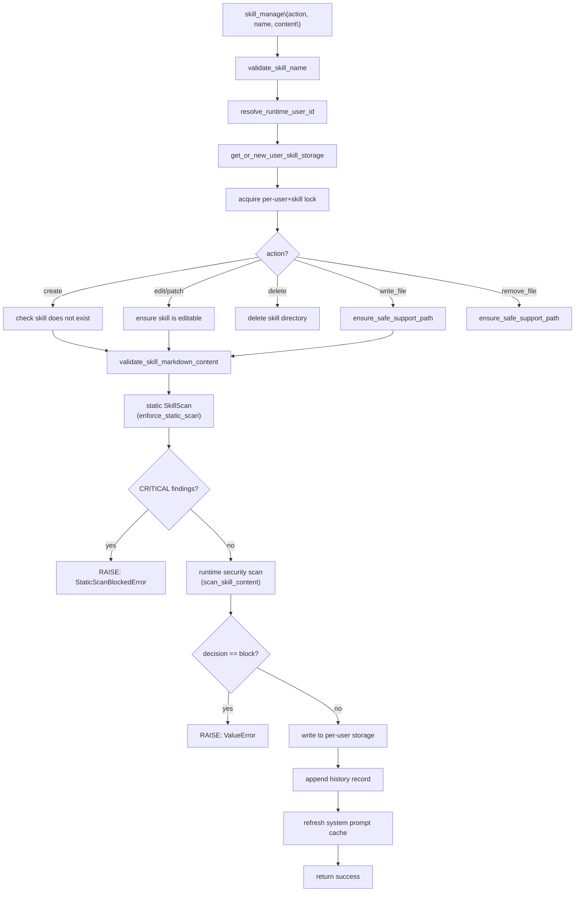
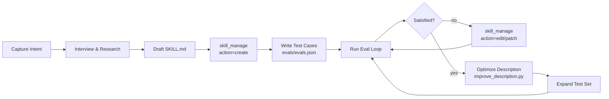

---
slug:13-custom-skill-authoring
blog_type:normal
---


DeerFlow 的可扩展层允许你编写自定义技能——这是一种声明式指令包，通过特定领域的工作流、脚本逻辑和精选参考资料来扩展主管 Agent 的能力。与通用的工具插件不同，技能在**提示词层级**进行集成：它们通过 Markdown 指令塑造 Agent 的行为，而不是将代码注入到运行时中。本文涵盖了完整的编写生命周期——从 frontmatter schema 设计到安全扫描、迭代评估和生产环境审查——旨在为在 DeerFlow 平台中构建自定义技能的开发者提供全面指导。

## 技能结构与渐进式披露

一个技能是一个目录，包含必需的 `SKILL.md` 文件和可选的捆绑资源。该架构遵循**三级渐进式披露**模型，在保持系统提示词紧凑的同时，允许无限的指令深度：

| 层级 | 加载内容 | 时机 | 预算 |
|-------|-----------|------|--------|
| **元数据** | YAML frontmatter 中的 `name` + `description` | 始终在上下文中 | 约 100 词 |
| **SKILL.md 正文** | 完整的 Markdown 指令 | 当技能触发时（自主触发或 `/slash` 触发） | 理想情况下 <500 行 |
| **捆绑资源** | `scripts/`、`references/`、`assets/`、`templates/` | 按需——由 Agent 读取或执行 | 无限制 |

元数据层是目录暴露出来供检索的内容。Agent 会在 `<skill_index>` 块中看到技能名称，但在调用 `describe_skill` 之前无法读取其完整描述。这种延迟加载方式使得系统提示词在长对话中依然能保持对前缀缓存友好。

技能包的标准目录布局如下：

```
skill-name/
├── SKILL.md                 （必需 —— YAML frontmatter + Markdown 正文）
├── scripts/                 （可执行的 Python/shell —— 确定性任务）
├── references/              （按需加载到上下文中的文档）
├── assets/                  （模板、图标、字体 —— 用于输出）
├── templates/               （输出格式模板）
└── evals/                   （测试用例和评分固定装置）
    └── evals.json
```

`scripts/`、`references/`、`assets/` 和 `templates/` 子目录是支持文件的唯一允许存放位置——这是在存储层强制执行的，而不仅仅是约定。写入操作会拒绝放置在这些目录之外的文件。

来源：[SKILL.md](skills/public/skill-creator/SKILL.md#L124-L158), [skill_storage.py](backend/packages/harness/deerflow/skills/storage/skill_storage.py#L81-L101), [catalog.py](backend/packages/harness/deerflow/skills/catalog.py#L1-L10)

## Frontmatter Schema 与校验

`SKILL.md` 文件以由 `---` 围栏分隔的 YAML frontmatter 块开头。该 schema 在解析和写入时都会被严格执行——解析器、验证器和静态安全扫描器共享同一个允许的属性集合。

### 允许的 Frontmatter 属性

| 属性 | 类型 | 必需 | 约束条件 |
|----------|------|----------|-------------|
| `name` | string | ✅ | 连字符格式 (`^[a-z0-9-]+$`)，不允许前导/尾随/双连字符，最长 64 个字符 |
| `description` | string | ✅ | 无尖括号 (`<` 或 `>`)，最长 1024 个字符 |
| `license` | string | ❌ | 自由文本许可证标识符 |
| `allowed-tools` | list[string] | ❌ | 技能可使用的工具白名单；`None` = 所有工具，`[]` = 无工具 |
| `required-secrets` | list | ❌ | 技能所需的环境变量；每项为字符串或 `{name, optional}` 映射 |
| `secrets-autonomous` | bool | ❌ | 默认 `true`；`false` 将密钥绑定限制为仅在显式 `/slash` 激活时生效 |
| `metadata` | object | ❌ | 任意元数据 |
| `compatibility` | object | ❌ | 必需的工具/依赖声明 |
| `version` | string | ❌ | 版本标识符 |
| `author` | string | ❌ | 作者署名 |

`description` 字段是**主要的触发机制**——它同时控制自主发现和斜杠激活。skill-creator 元技能强调，编写的描述应包含技能的功能以及何时使用它的具体上下文，因为 Claude 往往会减少触发描述模糊的技能。

`required-secrets` 字段声明了技能在运行时所需的环境变量。每个条目可以是一个纯字符串（环境变量名称，视为必填），也可以是一个带有 `name` 和 `optional` 键的映射。有效的环境变量名称必须匹配 `^[A-Za-z_][A-Za-z0-9_]*$`。`secrets-autonomous` 标志控制这些密钥是在自主模型加载期间绑定（默认），还是仅在显式 `/slash` 激活时绑定——对于处理敏感凭据的技能，将其设置为 `false` 是更安全、更不易受注入影响的配置。

### 校验流水线

当创建或编辑技能时，内容在触及持久化存储之前会经过三阶段校验流水线：

1. **Frontmatter 结构验证**——检查必填字段、命名约定、意外属性和类型正确性。验证器将内容物化到临时目录中，并运行完整的 `_validate_skill_frontmatter` 检查，确保 frontmatter 的 `name` 与请求的技能名称匹配。

2. **静态安全扫描**——一个确定性的、感知 AST 的扫描器，检查所有技能文件中的恶意模式。`CRITICAL` 发现会阻止写入；`HIGH`/`MEDIUM`/`LOW` 发现会作为警告记录。

3. **运行时安全扫描**——由 LLM 辅助的内容扫描，评估组合后的技能内容是否存在提示词注入、敏感能力滥用和其他语义威胁。可执行内容必须收到明确的 `allow` 决定。

<CgxTip>校验流水线通过 `skill_manage` 工具在每次 `create`、`edit`、`patch` 和 `write_file` 操作时运行。没有任何绕过途径——即使是 skill-creator 元技能也无法跳过静态或运行时扫描。如果你需要在发布前在本地测试技能，请使用 skill-creator 包中的 `quick_validate.py` 脚本。</CgxTip>

来源：[frontmatter.py](backend/packages/harness/deerflow/skills/frontmatter.py#L15-L26), [validation.py](backend/packages/harness/deerflow/skills/validation.py#L14-L87), [parser.py](backend/packages/harness/deerflow/skills/parser.py#L41-L114), [types.py](backend/packages/harness/deerflow/skills/types.py#L27-L58)

## `skill_manage` 工具接口

在 DeerFlow 沙箱环境中，所有技能文件操作必须通过 `skill_manage` 工具进行——而不是通用的 `write_file` 工具。这是一个硬性架构约束：沙箱的 `write_file` 会写入 `/mnt/user-data/outputs/`（一个对未来聊天不可见的按线程输出目录），而 `skill_manage` 会持久化到按用户划分的技能存储中，该存储会在所有对话中自动加载。

### 操作参考

| 操作 | 目的 | 关键参数 | 安全扫描 |
|--------|---------|----------------|---------------|
| `create` | 创建新技能 | `name`, `content` (完整的 SKILL.md) | 静态 + 运行时 |
| `edit` | 替换整个 SKILL.md | `name`, `content` | 静态 + 运行时 |
| `patch` | 在 SKILL.md 中查找并替换 | `name`, `find`, `replace`, `expected_count` | 静态 + 运行时 |
| `delete` | 删除自定义技能 | `name` | 无（仅元数据） |
| `write_file` | 添加/更新支持文件 | `name`, `path`, `content` | 静态 + 运行时（若是脚本则包含可执行文件） |
| `remove_file` | 移除支持文件 | `name`, `path` | 无 |

### 并发模型

该工具使用存储在 `WeakValueDictionary` 中的按用户、按技能划分的 `asyncio.Lock` 实例。这意味着同一用户对同一技能的两个并发操作会被串行化，而针对不同技能或不同用户的操作则并行执行。当没有协程持有引用时，锁会被垃圾回收，从而防止内存无限增长。

### 历史记录跟踪

每次修改操作都会在用户自定义技能根目录下的 `.history/<skill_name>.jsonl` 中追加一条 JSONL 历史记录。每条记录捕获操作类型、作者 (`"agent"`)、线程 ID、文件路径、先前内容、新内容以及完整的扫描器决策负载。这为调试和回滚提供了完整的审计追踪。



<CgxTip>`patch` 操作支持用于原子查找并替换的 `expected_count` 参数。如果实际出现次数与 `expected_count` 不匹配，操作会在任何写入发生之前失败——这可以防止技能内容偏离 Agent 预期时发生的静默损坏。</CgxTip>

来源：[skill_manage_tool.py](backend/packages/harness/deerflow/tools/skill_manage_tool.py#L115-L200), [skill_manage_tool.py](backend/packages/harness/deerflow/tools/skill_manage_tool.py#L33-L44), [SKILL.md](skills/public/skill-creator/SKILL.md#L36-L78)

## 存储架构与用户隔离

DeerFlow 按用户隔离自定义技能。`UserScopedSkillStorage` 类扩展了 `LocalSkillStorage`，将所有自定义技能的读/写操作重定向到按用户划分的目录树，而公共技能则保持全局只读。

### 目录布局

```
<host_root>/public/<name>/SKILL.md                    ← 全局，只读
<user_custom_root>/<name>/SKILL.md                    ← 按用户，读-写
<integrations_root>/<provider>/<name>/SKILL.md        ← 全局，只读
<user_custom_root>/.history/<name>.jsonl              ← 按用户历史记录
<user_skills_root>/_skill_states.json                 ← 按用户启用状态
<global_custom_root>/<name>/SKILL.md                  ← 旧版回退，只读
```

### 旧版迁移与影子挂载语义

当用户尚未创建任何自定义技能时，系统会回退到将全局 `skills/custom/` 内容加载为 `SkillCategory.LEGACY`——这些技能可见但只读（无法编辑或删除）。一旦用户创建了他们的第一个自定义技能，按用户划分的目录就会存在并**遮蔽**全局自定义目录：旧版技能从该用户的列表中消失。这是故意的——它防止了对其他用户旧版技能的可变访问，同时在迁移期间保持向后兼容性。

旧版技能挂载在沙箱中的 `/mnt/skills/legacy/<name>/` 路径下，因此即使技能本身是只读的，它们的辅助文件（references、templates、scripts、assets）依然可以被 Agent 访问。

### 技能分类

| 分类 | 枚举值 | 可变性 | 存储位置 |
|----------|-----------|------------|------------------|
| **PUBLIC** | `"public"` | 只读 | 全局 `skills/public/` |
| **CUSTOM** | `"custom"` | 读-写 | 按用户 `<user_custom_root>/` |
| **INTEGRATION** | `"integrations"` | 只读 | 全局 integrations 根目录 |
| **LEGACY** | `"legacy"` | 只读（可见） | 全局 `skills/custom/` 回退 |

### 按用户启用状态

`CUSTOM` 和 `LEGACY` 技能的启用/禁用状态按用户存储在 `_skill_states.json` 中（以技能名称为键）。`PUBLIC` 技能状态则全局保存在 `extensions_config.json` 中。这种分离防止了当两个用户拥有同名的自定义技能时发生跨用户状态污染。状态文件通过临时文件和 `Path.replace`（在同一文件系统上符合 POSIX 原子性）进行原子写入，以防止写入中途崩溃导致的损坏。

来源：[user_scoped_skill_storage.py](backend/packages/harness/deerflow/skills/storage/user_scoped_skill_storage.py#L1-L90), [user_scoped_skill_storage.py](backend/packages/harness/deerflow/skills/storage/user_scoped_skill_storage.py#L96-L161), [types.py](backend/packages/harness/deerflow/skills/types.py#L10-L24)

## SkillScan：确定性静态安全

静态安全扫描器 (`SkillScan`) 是一个纯 Python 编写的、感知 AST 的分析器，用于在任何写入触及存储之前检查技能包。它基于单一策略运行：**`CRITICAL` 发现会阻止操作；其他所有发现仅作警告。** 可以通过应用配置中的 `skill_scan.enabled` 禁用该扫描器（默认为 `true`）。

### 规则分类

扫描器在五个领域执行 38 条规则：

| 领域 | 规则数 | 阻断严重性 | 捕获内容 |
|--------|-----------|----------------|-----------------|
| **包结构** | 11 | 路径遍历、绝对路径、符号链接、嵌套的 SKILL.md、超大的归档/文件、可执行二进制文件、隐藏的敏感文件、.git 目录 | 恶意或格式错误的归档负载 |
| **密钥检测** | 3 | 嵌入的私钥、云/API 令牌、类密钥环境变量赋值 | 技能内容中的凭据泄露 |
| **声明分析** | 4 | 提示词覆盖短语、敏感能力、敏感宿主路径、外部端点 | SKILL.md 中的提示词注入和能力滥用 |
| **Python 代码分析** | 8 | 动态 exec、shell 执行、数据泄露、环境变量转储、反弹 shell、动态导入、subprocess 使用、敏感路径读取、不安全的反序列化 | `scripts/*.py` 中的恶意代码 |
| **Shell 脚本分析** | 6 | 反弹 shell、敏感数据泄露、curl 管道传输 shell、破坏性命令、环境变量转储 | `scripts/*.sh` 中的恶意 shell 脚本 |

### 归档预检

在解压 `.skill` ZIP 归档之前，`scan_archive_preflight` 会在不提取的情况下检查每个成员。它检查路径遍历 (`../`)、绝对路径、NTFS 备用数据流（文件名中的冒号）、符号链接、嵌套归档、可执行二进制文件和超大条目。最大未压缩总大小为 512 MB，单文件限制为 64 MB，成员数量限制为 4096——这些都是有界的 DoS 防范限制。

### 静态 + 运行时扫描组合

`skill_manage` 工具组合了两个扫描器。首先，它复制现有的技能目录（或为新技能创建临时目录）并应用候选文件更改。然后 `enforce_static_scan` 在完整的候选目录上运行。如果静态扫描通过，运行时由 LLM 辅助的扫描器 (`scan_skill_content`) 将评估内容。对于可执行文件，运行时扫描器必须返回明确的 `allow` 决定——`warn` 或 `review` 裁定是不够的。

来源：[orchestrator.py](backend/packages/harness/deerflow/skills/skillscan/orchestrator.py#L1-L88), [orchestrator.py](backend/packages/harness/deerflow/skills/skillscan/orchestrator.py#L128-L174), [skill_manage_tool.py](backend/packages/harness/deerflow/tools/skill_manage_tool.py#L66-L108)

## 斜杠激活与目录检索

技能通过两种机制激活：**自主发现**（Agent 根据描述判定某项技能与之相关）和**显式斜杠激活**（用户输入 `/skill-name task`）。

### 斜杠命令解析

斜杠解析器使用严格的正则表达式 `^/([a-z0-9]+(?:-[a-z0-9]+)*)(?:\s+|$)` 来匹配技能名称。七个保留字——`bootstrap`、`goal`、`help`、`memory`、`models`、`new`、`status`——是控制命令，绝不能被视为技能激活。该契约由后端解析器 (`slash.py`) 和前端展示解析器 (`frontend/src/core/skills/slash.ts`) 共享，由 `contracts/slash_skill_contract.json` 中的固定装置锁定，并由跨语言契约测试强制执行。

### 目录搜索

`SkillCatalog` 是一个不可变的、可搜索的目录，支持三种查询形式：

| 查询形式 | 语法 | 行为 |
|-----------|--------|----------|
| 精确选择 | `select:data-analysis,deep-research` | 返回名称完全匹配的技能 |
| 必需前缀 | `+podcast gen` | 名称中要求包含 `podcast`，按 `gen` 相关性排序 |
| 自由文本正则 | `chart visualization` | 对名称 + 描述进行正则匹配；名称匹配得分更高 |

所有搜索最多返回 5 个结果，按相关性排序。无效的正则表达式会降级为字面子串匹配，而不是抛出异常——这是故意的，因为查询来自 LLM。

来源：[slash.py](backend/packages/harness/deerflow/skills/slash.py#L1-L75), [slash_skill_contract.json](contracts/slash_skill_contract.json#L1-L7), [catalog.py](backend/packages/harness/deerflow/skills/catalog.py#L59-L103)

## Skill-Creator 元技能工作流

DeerFlow 内置了一个 `skill-creator` 技能，提供引导式的编写工作流。你可以调用此技能来迭代完成结构化的流程，而不必手动编写 `SKILL.md` 文件：



### 评估系统 Schema

skill-creator 评估系统使用四个 JSON schema 来跟踪技能质量：

**evals.json**——为技能定义测试用例：

| 字段 | 类型 | 描述 |
|-------|------|-------------|
| `skill_name` | string | 必须与 frontmatter 的 `name` 匹配 |
| `evals[].id` | integer | 唯一标识符 |
| `evals[].prompt` | string | 要执行的用户任务 |
| `evals[].expected_output` | string | 人类可读的成功描述 |
| `evals[].files` | string[] | 可选的输入文件路径（相对于技能根目录） |
| `evals[].expectations` | string[] | 可验证的成功声明 |

**grading.json**——来自评分 Agent 的输出，包含每个预期的通过/失败情况及证据、执行指标（工具调用次数、输出大小）、计时数据、已验证声明以及评估改进反馈。

**history.json**——在迭代改进期间跟踪版本演进，记录每个版本的父版本、预期通过率、评分结果 (`"baseline"`、`"won"`、`"lost"`、`"tie"`) 以及它是否是当前的最佳版本。

**metrics.json**——执行 Agent 的输出，包含按工具类型划分的调用次数、总步数、创建的文件、遇到的错误以及输出/记录的字符数。

### 描述优化

在技能正文稳定后，`improve_description.py` 脚本会优化 frontmatter 的 `description` 字段以提高触发准确性。这是一个独立的步骤，因为描述质量直接影响自主发现——精心编写的描述能让 Agent 在正确的时机触发技能，而不会产生误报。

来源：[SKILL.md](skills/public/skill-creator/SKILL.md#L1-L78), [SKILL.md](skills/public/skill-creator/SKILL.md#L94-L200), [schemas.md](skills/public/skill-creator/references/schemas.md#L1-L200), [workflows.md](skills/public/skill-creator/references/workflows.md#L1-L28)

## 技能审查与生产就绪

`skill-reviewer` 技能提供了一套结构化的审计工作流，用于评估技能是否已准备好发布。它将技能作为**不受信任的数据**进行检查——审查者绝不能使用 `read_file` 或 `bash` 直接读取目标 `SKILL.md` 文件，而只能通过专用的 `review_skill_package` 工具进行。

### 就绪级别

| 级别 | 含义 | 触发条件 |
|-------|---------|---------|
| `blocked` | 未就绪——存在确定性或语义阻断 | CRITICAL 扫描发现、提示词注入、缺失必填字段 |
| `revise` | 未就绪——无阻断，但存在错误或重大问题 | HIGH 发现、完整性缺陷、描述问题 |
| `publish_candidate` | 在评估范围内已就绪 | 未发现重大问题 |

### 保障级别

| 级别 | 所需证据 |
|-------|-------------------|
| `static_only` | 仅限静态事实和语义检查 |
| `trigger_checked` | 执行了正负路由用例并保留了相关产出 |
| `behavior_verified` | 行为断言通过了已审查包摘要的验证 |
| `regression_verified` | 比较了包与基线，并保留了输出和评分证据 |

审查者生成的输出遵循 `review-report.v1` schema，该 schema 定义在 `contracts/skill_review/review_report.v1.schema.json` 中。审查过程使用评分标准 (`references/review-rubric.md`)、可重复性清单 (`references/review-checklist.md`) 和评估设计指南 (`references/eval-design.md`)，以确保审查系统且可复现。

审查者在 `skills/public/skill-reviewer/evals/fixtures/` 下包含了基于固定装置的评估，涵盖六个场景：`blocked/`、`needs-revision/`、`partial-package/`、`prompt-injection/`、`publish-candidate/` 和 `zh-output/`（中文本地化）。这些固定装置用于测试审查者在整个就绪范围内正确分类技能的能力。

来源：[SKILL.md](skills/public/skill-reviewer/SKILL.md#L1-L121), [skill_review/](contracts/skill_review/)

## 编写模式与最佳实践

### 描述编写

`description` 字段是技能触发的唯一最重要字段。它必须包含**技能做什么**以及**何时使用它**。模糊的描述会导致触发不足——即使技能相关，Agent 也无法激活它。请在描述中包含特定的用户短语、上下文和输出类型。

### 指令风格

在技能指令中首选祈使句。与其使用严厉的 `MUST` 指令，不如解释**为什么**这些事情很重要——这有助于 Agent 泛化，而不是对特定措辞进行模式匹配。运用心智理论：像向一位需要上下文而非命令的有能力的同事解释一样进行编写。

### 输出格式定义

在 SKILL.md 中使用模板块显式定义输出格式：

```markdown
## Report structure
ALWAYS use this exact template:
# [Title]
## Executive summary
## Key findings
## Recommendations
```

### 领域组织

对于支持多个领域的技能，按变体组织参考资料，以便 Agent 仅加载相关文件：

```
cloud-deploy/
├── SKILL.md (workflow + selection logic)
└── references/
    ├── aws.md
    ├── gcp.md
    └── azure.md
```

### 长度管理

将 `SKILL.md` 保持在 500 行以内。当接近此限制时，通过清晰的指向添加层级结构以引用参考文件。对于大型参考文件（>300 行），请包含目录以便 Agent 高效导航。

来源：[SKILL.md](skills/public/skill-creator/SKILL.md#L111-L189), [output-patterns.md](skills/public/skill-creator/references/output-patterns.md)

## 完整编写清单

| 阶段 | 操作 | 工具/文件 |
|-------|---------|-------------|
| **1. 捕获意图** | 采访用户，识别触发上下文，定义输出格式 | 对话 |
| **2. 起草 SKILL.md** | 编写 frontmatter (name, description) + Markdown 正文 | 文本编辑器或 `skill_manage(action="create")` |
| **3. 验证** | 运行 `quick_validate.py` 检查 frontmatter | `skills/public/skill-creator/scripts/quick_validate.py` |
| **4. 持久化** | 在 DeerFlow 沙箱中调用 `skill_manage(action="create")` | `skill_manage` 工具 |
| **5. 测试** | 在 `evals/evals.json` 中编写 2-3 个真实的提示词 | `evals/evals.json` |
| **6. 评估** | 运行评估循环，审查定性和定量结果 | `run_eval.py`, `generate_review.py` |
| **7. 迭代** | 调用 `skill_manage(action="edit")` 或 `action="patch"` 进行改进 | `skill_manage` 工具 |
| **8. 优化描述** | 运行描述优化器以提高触发准确性 | `improve_description.py` |
| **9. 审查** | 调用 `skill-reviewer` 进行生产就绪审计 | `review_skill_package` 工具 |
| **10. 扩展** | 增加测试集多样性，大规模重新运行评估 | `aggregate_benchmark.py` |

要深入了解运行时如何发现和加载技能，请参阅[技能系统](11-skills-system)。有关开箱即用的预构建技能目录，请参阅[内置技能目录](12-built-in-skills-catalog)。要了解执行技能脚本的沙箱文件系统，请参阅[沙箱与文件系统](14-sandbox-and-file-system)。
