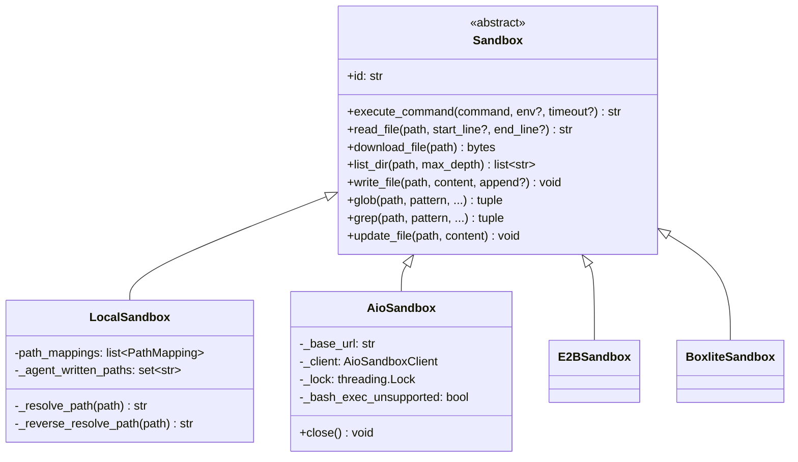
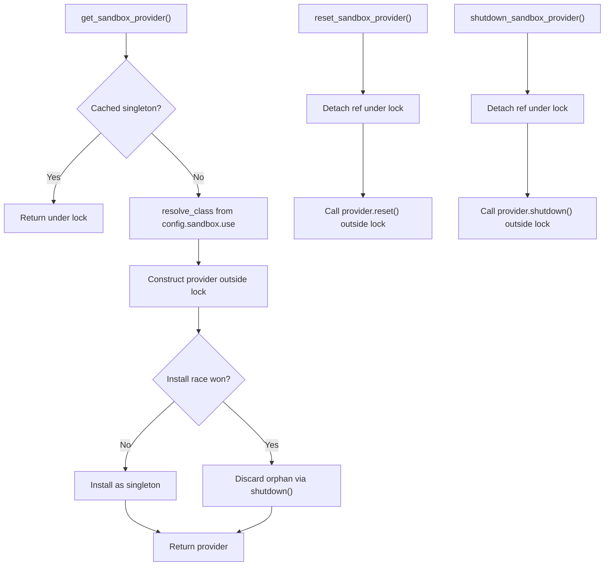
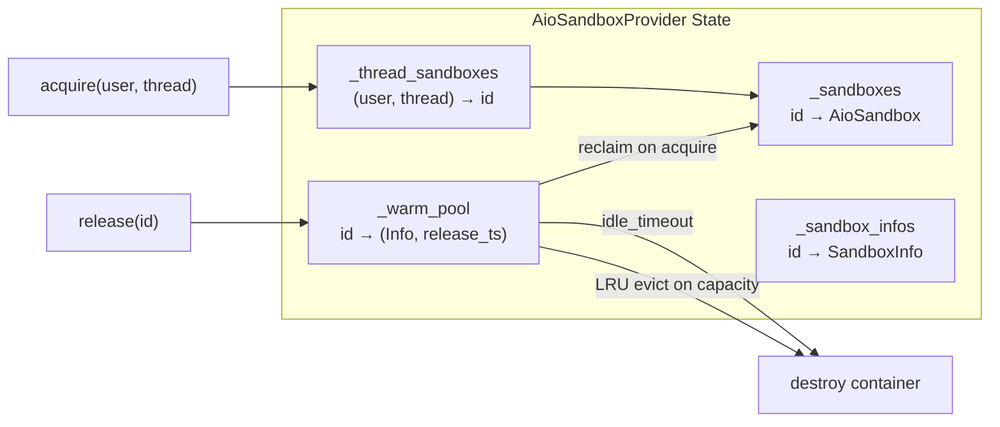
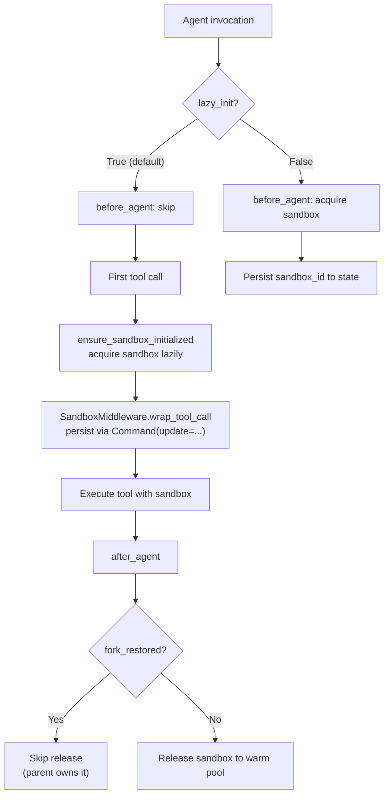
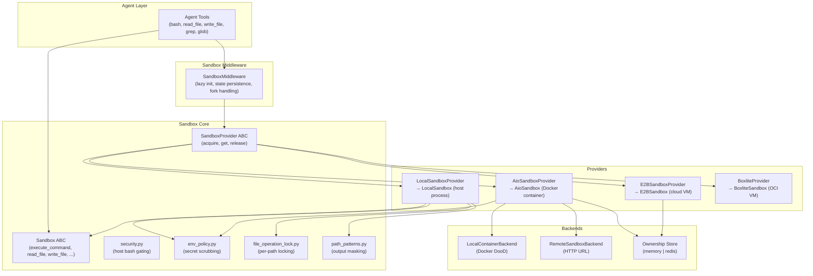

---
slug:14-sandbox-and-file-system
blog_type:normal
---


DeerFlow 的沙箱子系统是一个隔离的执行边界，Agent 发出的 bash 命令、文件读写和搜索操作都在此实际运行。它在单一抽象接口（`Sandbox`）背后封装了多种配置后端——从普通的宿主机进程 `LocalSandbox`，到基于 Docker 的 `AioSandbox` 容器、远程 E2B 虚拟机，以及 BoxLite OCI 运行时——其生命周期由可插拔的 `SandboxProvider` 单例进行管理。本页涵盖了抽象契约、Provider 架构、各个具体实现、路径映射虚拟文件系统、安全控制，以及将沙箱状态接入 LangGraph 执行图的中间件。

来源：[sandbox.py](/backend/packages/harness/deerflow/sandbox/sandbox.py#L1-L183), [sandbox_provider.py](/backend/packages/harness/deerflow/sandbox/sandbox_provider.py#L1-L176), [sandbox_config.py](/backend/packages/harness/deerflow/config/sandbox_config.py#L1-L203)

---

## 抽象沙箱接口

`Sandbox` 抽象基类定义了七个操作，每个 Provider 实现都必须提供这些操作：`execute_command`、`read_file`、`download_file`、`list_dir`、`write_file`、`glob`、`grep` 和 `update_file`。此契约是 Agent 工具与特定后端执行环境之间的通用语言，这意味着从本地宿主机沙箱切换到远程容器化沙箱只需更改配置，无需重写任何工具代码。



该契约中一个关键细节是 `execute_command` 的 `env` 参数。提供此参数时，它会注入每次调用的环境变量（例如请求范围内的短期 OAuth 令牌等机密信息），而无需将其放入命令字符串或提示词中。键名必须匹配 POSIX 环境变量模式 `^[A-Za-z_][A-Za-z0-9_]*$`，并由 `_validate_extra_env` 预先验证，作为防御 shell 注入的纵深防御措施，以防未来实现退化回字符串拼接。实现层通过结构化 API 路由携带环境变量的命令——AIO 沙箱使用带有专用 `env` 字段的 `bash.exec` 端点；本地沙箱直接将字典传递给 `subprocess.run(env=...)`——因此目前不会有任何键被拼接到 shell 字符串中。

来源：[sandbox.py](/backend/packages/harness/deerflow/sandbox/sandbox.py#L14-L91), [aio_sandbox.py](/backend/packages/harness/deerflow/community/aio_sandbox/aio_sandbox.py#L151-L200)

---

## Provider 架构与生命周期

`SandboxProvider` 抽象类将*如何获取和释放沙箱*与*沙箱是什么*解耦。每个 Provider 实现了三个生命周期方法——`acquire(thread_id, user_id)` 返回沙箱 ID，`get(sandbox_id)` 返回活跃的 `Sandbox` 实例，`release(sandbox_id)` 将其返回池中或销毁。可选的 `acquire_async` 将阻塞式配置封装在 `asyncio.to_thread` 中，确保事件循环永远不会被阻塞。

Provider 是一个由 `get_sandbox_provider()` 管理的**线程安全单例**。模块级的 `_provider_lock`（不可重入的 `threading.Lock`）保护着对 `_default_sandbox_provider` 的每一次读写。冷启动路径特意在锁*外部*解析类并构造实例——Provider 构造函数和动态导入是插件提供的代码，可能执行缓慢或重入生命周期函数，在非重入锁内执行这些操作会导致自死锁。如果两个线程竞争构造，失败方会丢弃其孤立实例（如果可用，则调用 `shutdown()`），从而确保不会产生带有副作用的 Provider 泄漏——这是针对 issue #3721 的修复。



<CgxTip>针对不同的销毁需求存在三个生命周期函数：`reset_sandbox_provider()` 清除缓存的实例并调用 `reset()`（适用于测试或配置更改）；`shutdown_sandbox_provider()` 在应用关闭时调用 `shutdown()` 以完全释放资源；`set_sandbox_provider()` 为测试注入自定义实例，但不会关闭被替换的 Provider——该生命周期由调用方负责。</CgxTip>

来源：[sandbox_provider.py](/backend/packages/harness/deerflow/sandbox/sandbox_provider.py#L61-L176)

---

## Provider 实现

DeerFlow 内置了四个具体的 Provider，分别针对不同的隔离级别和部署拓扑：

| Provider | 类路径 | 隔离性 | 后端 | 热池 | 适用场景 |
|---|---|---|---|---|---|
| **LocalSandbox** | `deerflow.sandbox.local:LocalSandboxProvider` | 无（宿主机进程） | 宿主机文件系统 | N/A（单例） | 本地开发、受信任环境 |
| **AioSandbox** | `deerflow.community.aio_sandbox:AioSandboxProvider` | Docker 容器 | 本地 Docker 或远程 HTTP | 是（LRU 淘汰） | 生产环境、多租户 |
| **E2BSandbox** | `deerflow.community.e2b_sandbox:E2BSandboxProvider` | 云端 VM (E2B SDK) | E2B 云 API | 是（带容量管理） | 远程隔离、弹性伸缩 |
| **Boxlite** | `deerflow.community.boxlite:BoxliteProvider` | OCI VM (BoxLite) | BoxLite 运行时 | 是（跳过回收检查） | 轻量级 OCI 隔离 |

### LocalSandbox

`LocalSandbox` 直接在宿主机上通过 `subprocess.run` 运行命令，没有隔离边界。它实现了一个**路径映射**系统：通过 `PathMapping` 对象将虚拟容器路径（例如 `/mnt/skills`、`/mnt/user-data`）映射到真实的宿主机目录，并支持透明的前向解析（容器 → 宿主机）和反向解析（宿主机 → 命令输出中的容器路径）。`DEFAULT_COMMAND_TIMEOUT_SECONDS` 设为 600 秒，限制每个宿主机 bash 命令的执行时间；超时时，会通过 `os.killpg` 终止整个进程组，防止阻塞的前台服务器无限期挂起 Agent 的执行轮次。输出通过 `_BoundedPipeCapture` 捕获，将内存上限设为 10 MB，并在截断时附带明确通知，而不是导致网关发生 OOM。

`LocalSandboxProvider` 上的宿主机 bash 执行**默认禁用**——`security.py` 会检测本地 Provider，并在 `sandbox.allow_host_bash: true` 的控制下限制 `is_host_bash_allowed()`。错误消息会引导用户使用 `AioSandboxProvider` 进行隔离的 bash 访问。此设计可防止本地开发环境意外将非容器化的命令执行暴露给 Agent 提示词。

来源：[local_sandbox.py](/backend/packages/harness/deerflow/sandbox/local/local_sandbox.py#L29-L329), [security.py](/backend/packages/harness/deerflow/sandbox/security.py#L1-L46)

### AioSandboxProvider

`AioSandboxProvider` 是生产级 Provider，负责管理运行字节跳动 `agent-infra/sandbox` 项目中 `all-in-one-sandbox` 镜像的 Docker 容器。它组合了一个可插拔的 `SandboxBackend`——用于 Docker/DooD（Docker-outside-of-Docker）的 `LocalContainerBackend`，或用于通过 URL 访问的预配置沙箱的 `RemoteSandboxBackend`——并处理进程内缓存、空闲超时管理、带有信号处理的优雅关闭，以及针对线程特定数据和技能的挂载计算。

该 Provider 维护着四个关键数据结构：



热池会保留已释放的沙箱容器处于运行状态，以便后续对同一 `(user_id, thread_id)` 的 `acquire()` 调用能避免冷启动。当 `replicas` 容量耗尽时，LRU 淘汰机制会销毁最旧的保温容器。`AioSandbox` 客户端本身通过 HTTP API（默认端口 8080）与容器通信，并通过 `threading.Lock` 序列化 shell 命令，因为 AIO 容器维护着单一的持久化 shell 会话，在并发访问下会发生损坏（issue #1433）。

对于多实例部署，该 Provider 集成了一个**跨实例归属存储**（`SandboxOwnershipStore`），由内存状态（单实例）或 Redis（负载均衡/多 Worker）提供支持。如果没有 Redis 归属管理，一个网关实例的协调循环可能会接管并随后闲置销毁由对等方拥有的活跃容器——issue #4206。归属租约具有 TTL，该 TTL 派生自 `renewal_interval_seconds × ttl_multiplier`（默认 30 秒 × 4 = 120 秒），可容忍连续三次错过续订后才过期。

来源：[aio_sandbox_provider.py](/backend/packages/harness/deerflow/community/aio_sandbox/aio_sandbox_provider.py#L1-L200), [sandbox_config.py](/backend/packages/harness/deerflow/config/sandbox_config.py#L9-L167)

### E2BSandboxProvider 和 BoxliteProvider

E2B Provider 将任务委托给 E2B 云端 SDK，以实现全托管的、基于临时虚拟机的沙箱。它通过 `WarmPoolLifecycleMixin` 共享热池生命周期模式，并增加了具有三种溢出策略的容量管理——`wait`（阻塞直到有容量，受 `acquire_timeout` 限制）、`reject`（立即失败）和 `burst`（通过 `burst_limit` 临时超出 `replicas`）。BoxLite 使用基于 OCI 的虚拟机，并引入了 `health_check_skip_seconds` 回收窗口：最近释放的虚拟机无需健康检查即可重用，在热池回收路径上以安全性换取速度。

来源：[sandbox_config.py](/backend/packages/harness/deerflow/config/sandbox_config.py#L121-L147), [warm_pool_lifecycle.py](/backend/packages/harness/deerflow/community/warm_pool_lifecycle.py)

---

## 虚拟路径映射与文件系统抽象

所有沙箱操作都在**虚拟路径**上运行——这是一个一致的 POSIX 风格命名空间，Agent 无论使用底层哪种 Provider 看到的都是它。`VIRTUAL_PATH_PREFIX` 常量定义了根路径，标准挂载点包括 `/mnt/user-data`（线程范围的数据）、`/mnt/skills`（技能定义）和 `/mnt/acp-workspace`（工作区产物）。

### LocalSandbox 中的路径解析

`LocalSandbox` 通过 `PathMapping` 对象实现双向路径转换，每个对象将一个 `container_path` 绑定到 `local_path`，并带有可选的 `read_only` 标志：

| 方向 | 方法 | 目的 |
|---|---|---|
| 容器 → 宿主机 | `_resolve_path_with_mapping()` | 在文件系统访问前转换 Agent 路径 |
| 宿主机 → 容器 | `_reverse_resolve_path()` | 将命令输出中的宿主机路径转换回虚拟形式 |
| 命令注入 | `_resolve_paths_in_command()` | 执行前重写 bash 命令中的路径 |
| 输出脱敏 | `_reverse_resolve_paths_in_output()` | 从 stdout/stderr 中清除宿主机路径 |

路径解析强制执行**分段边界**——挂载根 `/mnt/skills` 不会匹配到 `/mnt/skills-extra` 内部——使用的是 `path_patterns.py` 中 `build_output_mask_pattern()` 的共享正则规则。该函数在 issue #4035 向一处添加了边界但遗漏了另一处（#4053）导致不一致后被集中处理。`_find_path_mapping` 方法按容器路径的具体程度（最长优先）对映射进行排序，使嵌套挂载解析到最具体的映射，同时 `relative_to()` 检查会在解析路径逃逸出其挂载根时抛出 `PermissionError`（路径遍历防御）。

只读挂载通过 `_is_resolved_path_read_only()` 强制执行，该方法会为解析后的路径查找最具体的映射并检查其 `read_only` 标志——在技能目录和其他受保护的挂载点上阻止 `write_file` 和 `update_file`。

来源：[local_sandbox.py](/backend/packages/harness/deerflow/sandbox/local/local_sandbox.py#L201-L366), [path_patterns.py](/backend/packages/harness/deerflow/sandbox/path_patterns.py#L1-L69)

### 文件操作锁

在单个沙箱内对同一路径的并发文件写入，由 `file_operation_lock.py` 中按 `(sandbox_id, path)` 划分的锁进行串行化。这些锁存在于 `WeakValueDictionary` 中，因此当没有线程持有引用时，它们会被垃圾回收，防止在长时间运行的网关进程中发生内存泄漏。保护锁（`_FILE_OPERATION_LOCKS_GUARD`）仅保护字典的查找/创建，而不保护文件操作本身，因此竞争极小。

来源：[file_operation_lock.py](/backend/packages/harness/deerflow/sandbox/file_operation_lock.py#L1-L28)

---

## 安全：环境策略与能力管控

### 环境变量清洗

`env_policy.py` 为沙箱子进程实现了**安全优先的环境清洗**策略。默认情况下，子进程会继承网关的整个 `os.environ`，其中包含平台凭证（`OPENAI_API_KEY`、追踪键、Provider 机密）。`build_sandbox_env()` 函数通过两种机制过滤继承的变量：

- **通配符模式**（`*KEY*`、`*SECRET*`、`*TOKEN*`、`*PASS*`、`*CREDENTIAL*`、`*DSN*`）捕获任何其大写名称中包含这些标记的变量，包括 `DB_PASS` 等缩写形式和 `GIT_ASKPASS` 等凭证助手。
- **精确名称黑名单**涵盖不含 KEY/SECRET 标记但通常会嵌入密码的连接字符串变量（`DATABASE_URL`、`REDIS_URL`、`MYSQL_PWD`、`PGSERVICEFILE` 等）。

显式注入的请求范围内的机密（来自 `required-secrets` 技能声明）会叠加在其上，并**始终优先**于被阻止的模式，因为注入操作在上游已获授权——技能声明了该机密，且其值来自请求上下文，而非宿主环境。

来源：[env_policy.py](/backend/packages/harness/deerflow/sandbox/env_policy.py#L1-L113)

### 本地 Bash 管控

`security.py` 为 `LocalSandboxProvider` 管控宿主机 bash 执行。当活跃 Provider 是本地 Provider 时，除非显式设置 `sandbox.allow_host_bash: true`，否则 `is_host_bash_allowed()` 返回 `False`。`tools.py` 中的工具层使用此检查拒绝 bash 命令，并附带一条描述性消息引导用户使用 `AioSandboxProvider`。通过将 `config.sandbox.use` 与已知类路径标记进行比对来检测本地 Provider。

来源：[security.py](/backend/packages/harness/deerflow/sandbox/security.py#L1-L46), [tools.py](/backend/packages/harness/deerflow/sandbox/tools.py#L31-L32)

### 输出大小限制

沙箱工具层强制执行可配置的输出截断，以防止过大的命令或文件输出消耗模型的上下文窗口：

| 工具 | 配置键 | 默认值 | 截断策略 |
|---|---|---|---|
| Bash | `bash_output_max_chars` | 20,000 | 中间截断（头 + 尾） |
| 读取文件 | `read_file_output_max_chars` | 50,000 | 头部截断 |
| 列目录 | `ls_output_max_chars` | 20,000 | 头部截断 |
| 写入文件 | `DEERFLOW_WRITE_FILE_MAX_BYTES` (环境变量) | 80 KB | 拒绝超大写入 |

写入文件的大小限制（80 KB ≈ 20K tokens）是在 issue #3189 中引入的，因为超大的单次写入与 LLM 流式分块间隙超时相关——工具调用的 JSON 负载增长超出了安全的流式传输窗口。设置 `DEERFLOW_WRITE_FILE_MAX_BYTES=0` 可禁用此限制。

来源：[tools.py](/backend/packages/harness/deerflow/sandbox/tools.py#L60-L74), [sandbox_config.py](/backend/packages/harness/deerflow/config/sandbox_config.py#L168-L200)

---

## SandboxMiddleware：图状态集成

`SandboxMiddleware` 是一个 `AgentMiddleware`，用于将沙箱生命周期与 LangGraph 的执行图桥接。它通过 `ThreadState` 中的 `sandbox` 通道管理沙箱状态，该通道保存 `{"sandbox_id": str}`。



当 `lazy_init=True`（默认值）时，沙箱获取会延迟到第一次工具调用时——`tools.py` 中的 `ensure_sandbox_initialized` 会调用 `provider.acquire()` 并将沙箱 ID 写入 `runtime.state["sandbox"]`。由于此修改仅限于工具调用内部，不会被 LangGraph 的通道 reducer 捕获，因此 `SandboxMiddleware` 会包装该工具调用，对处理程序执行前后的状态快照进行 diff（比对），并发出规范的 `Command(update={"sandbox": ...})`，以便下游的图步骤和消费者（如 `ToolOutputBudgetMiddleware` 和子 Agent 的 `task_tool`）能够观察到该沙箱 ID。

该中间件还处理**分叉恢复**：当检查点分叉重放父线程的沙箱状态时，沙箱通道的值会以 `langgraph.types.Overwrite` 包装的形式到达。`unwrap_sandbox()` 辅助函数会检测到这一点并返回 `(value, fork_restored=True)`，指示 `after_agent` 跳过释放沙箱——释放它会导致父线程的保温容器被驱逐。

<CgxTip>`lazy_init=True` 默认设置对性能至关重要：它避免了在 Agent 执行轮次不需要工具时启动容器（对于 AIO 沙箱可能需要 5-10 秒）。如果沙箱必须在 Agent 推理前就准备就绪，可以使用急切初始化（`lazy_init=False`），但很少需要这么做。</CgxTip>

来源：[middleware.py](/backend/packages/harness/deerflow/sandbox/middleware.py#L1-L200), [overwrite.py](/backend/packages/harness/deerflow/sandbox/overwrite.py#L1-L22)

---

## 配置参考

沙箱在 `config.yaml` 的 `sandbox:` 部分进行配置。以下是可用选项的完整参考：

```yaml
sandbox:
  # 必需：Provider 类路径
  use: deerflow.community.aio_sandbox:AioSandboxProvider

  # 通用选项
  allow_host_bash: false          # 仅限 LocalSandboxProvider
  image: "all-in-one-sandbox:1.11.0"  # Docker/BoxLite 镜像
  replicas: 3                     # 最大并发沙箱数（热池容量）
  idle_timeout: 600               # 空闲沙箱销毁前的秒数（0 = 永不）
  environment:                    # 注入沙箱容器的环境变量
    NODE_ENV: production
    API_KEY: $MY_API_KEY          # $ 前缀从宿主环境变量解析

  # AioSandboxProvider 特定配置
  port: 8080                      # 本地容器的基础端口
  container_prefix: deer-flow-sandbox
  mounts:                         # 卷挂载（本地 Docker 模式）
    - host_path: /host/data
      container_path: /mnt/data
      read_only: false
  thread_data_mounts: null        # null = 自动检测；true = 跳过上传同步

  # 跨实例归属（多 Worker 部署）
  ownership:
    type: redis                   # memory（单实例）或 redis（多实例）
    redis_url: redis://localhost:6379/0
    renewal_interval_seconds: 30.0
    ttl_multiplier: 4.0
    key_prefix: "deerflow:sandbox:owner"

  # 输出限制
  bash_output_max_chars: 20000
  read_file_output_max_chars: 50000
  ls_output_max_chars: 20000
  bash_command_timeout: 600       # 仅限 LocalSandbox

  # 配置器（远程容器配置）
  provisioner_api_key: "secret-key"
```

安装脚本 `scripts/setup-sandbox.sh` 会预拉取沙箱容器镜像，默认为 `all-in-one-sandbox:1.11.0`（锁定版本，非 `:latest`，因为镜像仓库的 `:latest` 标签冻结在 1.9.3 之前缺少 `/v1/bash/*` 路由的摘要上，而携带环境变量的技能命令需要这些路由——issues #3921/#3922）。

来源：[sandbox_config.py](/backend/packages/harness/deerflow/config/sandbox_config.py#L69-L203), [setup-sandbox.sh](/scripts/setup-sandbox.sh#L1-L64)

---

## 架构总结



沙箱子系统遵循清晰的关注点分离：抽象的 `Sandbox` 定义了存在*哪些*操作，`SandboxProvider` 定义了*如何*管理实例的生命周期，中间件定义了沙箱*何时*进入和退出 Agent 图，而安全模块定义了每次操作内*允许什么*。这种分层结构让 DeerFlow 能够支持从笔记本电脑开发会话（`LocalSandbox`）到水平扩展的生产部署（带有 Redis 归属管理的 `AioSandboxProvider`）的所有场景，而无需更改 Agent 工具代码。

来源：[sandbox.py](/backend/packages/harness/deerflow/sandbox/sandbox.py#L44-L183), [sandbox_provider.py](/backend/packages/harness/deerflow/sandbox/sandbox_provider.py#L10-L59), [middleware.py](/backend/packages/harness/deerflow/sandbox/middleware.py#L29-L58), [aio_sandbox_provider.py](/backend/packages/harness/deerflow/community/aio_sandbox/aio_sandbox_provider.py#L154-L200)

---

## 后续步骤

- 要了解沙箱如何连接到 LLM 后端，请参阅 [Model Provider Integration](15-model-provider-integration)。
- 了解 Agent 轮次间的沙箱状态持久化，请参阅 [Checkpointing and State Management](18-checkpointing-and-state-management)。
- 了解包含沙箱容器网络的 Docker 部署策略，请参阅 [Docker Deployment Strategies](26-docker-deployment-strategies)。
- 要了解护栏如何与沙箱工具输出交互，请参阅 [Guardrails and Safety Middleware](25-guardrails-and-safety-middleware)。
