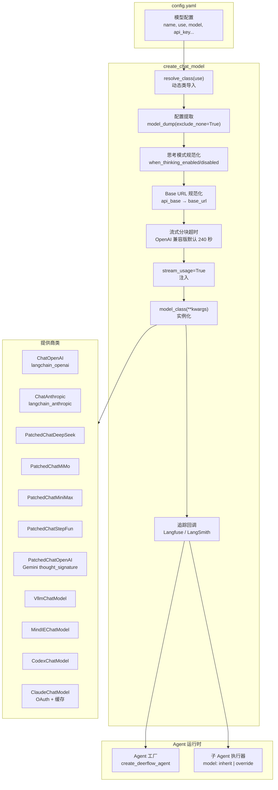
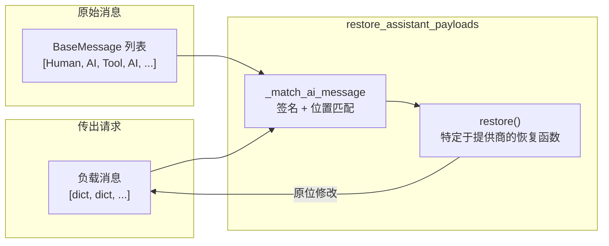
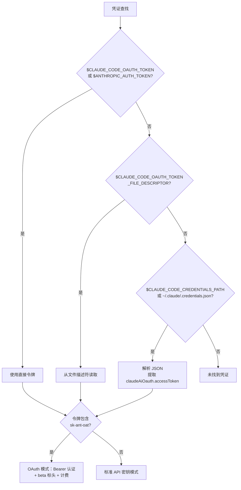

---
slug:15-model-provider-integration
blog_type:normal
---

DeerFlow 的模型集成层将异构的 LLM 提供商抽象在单一的工厂入口点之后，实现了运行时模型选择、思考模式切换以及多轮推理内容保留，同时避免将 Agent 代码与任何特定的提供商 SDK 耦合。本页将介绍工厂架构、修补提供商模式、凭证自动加载，以及将这一切串联起来的配置模式。

## 架构概述

模型集成层遵循**配置驱动的工厂模式**：`config.yaml` 声明了一组模型配置，每个配置通过 `use` 字段指向一个类路径。在运行时，`create_chat_model` 会动态解析该类，规范化特定提供商的怪异行为，应用思考模式转换，并注入追踪回调——所有这些都在返回开箱即用的 `BaseChatModel` 实例之前完成。

工厂的核心职责是将声明式配置与命令式提供商构造连接起来。`config.yaml` 中的每个模型配置都带有一个 `use` 字段——一个点分式类路径，如 `langchain_openai:ChatOpenAI` 或 `deerflow.models.patched_deepseek:PatchedChatDeepSeek`——工厂通过 `resolve_class` 将其解析为具体的 `BaseChatModel` 子类。配置中所有非元数据字段都会作为关键字参数转发给构造函数，这就是为什么 `ModelConfig` 使用 `extra="allow"` 来让特定提供商的键原封不动地通过验证。

来源：[factory.py](/backend/packages/harness/deerflow/models/factory.py#L95-L322), [model_config.py](/backend/packages/harness/deerflow/config/model_config.py#L1-L62), [__init__.py](/backend/packages/harness/deerflow/models/__init__.py#L1-L4)

## 配置模式

`ModelConfig` Pydantic 模型定义了 `models` 数组中每个条目的模式。其 `extra="allow"` 设置是刻意为之：不同提供商的构造函数接受的参数差异很大（例如 DeepSeek 的 `api_base`、OpenAI 的 `base_url`、Google 的 `gemini_api_key`），严格的模式需要枚举每个提供商的字段集。相反，未知键会被转发给构造函数，由工厂针对已知的不兼容性进行有针对性的规范化。

| 字段 | 类型 | 默认值 | 用途 |
|-------|------|---------|---------|
| `name` | `str` | *(必填)* | Agent 工厂和子 Agent 配置使用的唯一标识符 |
| `display_name` | `str\|None` | `None` | UI 下拉菜单的可读标签 |
| `use` | `str` | *(必填)* | 点分式类路径（例如 `langchain_openai:ChatOpenAI`） |
| `model` | `str` | *(必填)* | 特定于提供商的模型标识符 |
| `supports_thinking` | `bool` | `False` | 在 UI 和工厂中启用思考模式切换 |
| `supports_vision` | `bool` | `False` | 激活视觉/图像输入工具 |
| `supports_reasoning_effort` | `bool` | `False` | 允许透传 `reasoning_effort`（low/medium/high） |
| `context_window` | `int\|None` | `None` | 提示词+补全总容量，用于 UI 百分比指示器 |
| `when_thinking_enabled` | `dict\|None` | `None` | 开启思考时注入的额外 kwargs |
| `when_thinking_disabled` | `dict\|None` | `None` | 关闭思考时注入的额外 kwargs |
| `stream_chunk_timeout` | `float\|None` | `None` | 覆盖默认 240 秒的分块间超时时间 |

<CgxTip>`context_window` 字段纯粹是 UI 提示——它驱动“已使用上下文百分比”指示器，但绝不会传递给提供商构造函数。在构建构造函数 kwargs 的 `model_dump` 调用中，工厂会显式排除它（连同 `pricing`、`supports_thinking` 等其他元数据）。将其与 `max_tokens`（单次调用的输出上限）混淆是最常见的配置错误。</CgxTip>

来源：[model_config.py](/backend/packages/harness/deerflow/config/model_config.py#L1-L62), [factory.py](/backend/packages/harness/deerflow/models/factory.py#L211-L235)

## 工厂内部机制：规范化流水线

`create_chat_model` 函数在提取配置**之后**、调用构造函数**之前**，应用一系列规范化转换。每个转换都基于解析出的模型类类型进行门控，确保非 OpenAI 提供商永远不会受到 OpenAI 特定逻辑的影响。

### 思考模式解析

工厂通过将 `thinking` 快捷字段深度合并到 `when_thinking_enabled` 中，计算出一个 `effective_wte`（有效的 `when_thinking_enabled`）字典。当启用思考且模型声明 `supports_thinking: true` 时，此合并后的字典将应用于构造函数 kwargs。当禁用思考时，工厂会根据提供商家族应用四种禁用策略之一：

| 提供商家族 | 禁用策略 | 配置触发器 |
|----------------|-------------------|----------------|
| OpenAI 兼容网关 | `extra_body.thinking.type = "disabled"` + `reasoning_effort = "minimal"` | `when_thinking_enabled.extra_body.thinking` |
| 原生 Anthropic | `thinking = {"type": "disabled"}` 作为直接构造函数 kwarg | `when_thinking_enabled.thinking.type` |
| vLLM / Qwen | `chat_template_kwargs.thinking = False` + `enable_thinking = False` | `when_thinking_enabled.extra_body.chat_template_kwargs` |
| 用户显式 | 用户在 `when_thinking_disabled` 中填写的任何内容 | `when_thinking_disabled` 不为 `None` |

### Base URL 别名规范化

一个常见的配置陷阱是在期望使用 `base_url` 的 `ChatOpenAI` 子类上使用 `api_base`（DeepSeek/LangChain 的规范键）。因为 `ModelConfig` 使用 `extra="allow"`，这种拼写错误在配置加载时无法被捕获——它被转发给构造函数，转移到 `model_kwargs` 中，并在请求时因隐晦的错误被拒绝。`_normalize_openai_base_url` 函数会为任何未将 `api_base` 声明为自身字段的 `BaseChatOpenAI` 子类检测此情况，并在构造之前将键名重命名为 `base_url`。

### 流式分块超时注入

推理模型在发出第一个流式分块之前，可能会有 90 到 150 秒的合理停顿。LangChain 默认的 120 秒 `stream_chunk_timeout` 会在这些停顿期间过早触发。工厂为所有 `BaseChatOpenAI` 子类注入了 240 秒的默认值，同时保留配置中的任何显式覆盖。对于非 OpenAI 兼容的提供商（例如 `ChatAnthropic`），会主动剔除该键，以防止其被转发给未声明该键的构造函数。

来源：[factory.py](/backend/packages/harness/deerflow/models/factory.py#L33-L94), [factory.py](/backend/packages/harness/deerflow/models/factory.py#L236-L322)

## 修补提供商模式

LangChain 标准的聊天模型适配器在请求负载序列化期间会丢弃特定于提供商的字段。这破坏了推理模型的多轮工具调用对话，因为这些模型要求在历史助手消息中原样回显 `reasoning_content` 或 `thought_signature` 等字段。DeerFlow 通过一系列**修补提供商类**解决了这个问题，这些类重写了 `_get_request_payload`，以便在发送请求之前恢复这些字段。

### 共享重放基础设施

`assistant_payload_replay` 模块提供了所有修补提供商共享的匹配逻辑。它使用两阶段策略将序列化的负载消息与其原始 `AIMessage` 对应起来：当消息数量对齐时进行精确位置匹配，当序列化丢弃或重新排序消息时，则使用基于签名的匹配（内容哈希+工具调用 ID）并辅以位置回退。

### 提供商修补目录

| 提供商类 | 基类 | 保留字段 | 解决的问题 |
|---------------|------------|-------------------|----------------|
| `PatchedChatDeepSeek` | `ChatDeepSeek` | `reasoning_content` | DeepSeek/Kimi/豆包思考模型在多轮对话的所有助手消息中要求提供 reasoning_content |
| `PatchedChatOpenAI` | `ChatOpenAI` | `thought_signature` | 通过 OpenAI 兼容网关的 Gemini 会在工具调用时返回 thought_signature，必须原样回显 |
| `PatchedChatMiMo` | `ChatOpenAI` | `reasoning_content` | 小米 MiMo 在思考模式下返回 reasoning_content；同时修补流式增量和非流式结果 |
| `PatchedChatMiniMax` | `ChatOpenAI` | `reasoning_content`（来自 `reasoning_details`） | MiniMax 在 `reasoning_split=true` 时返回结构化的 reasoning_details；同时剔除不一致的用户消息名称 |
| `PatchedChatStepFun` | `ChatOpenAI` | `reasoning` / `reasoning_content` | StepFun 在流式和非流式路径下使用两个不同的字段名返回推理内容 |
| `VllmChatModel` | `ChatOpenAI` | `reasoning` | vLLM 0.19.0 丢弃非标准的 reasoning 字段；同时为 Qwen 模板规范化 `thinking` → `enable_thinking` |
| `MindIEChatModel` | `ChatOpenAI` | *(XML 工具调用解析)* | MindIE 使用 XML 风格的工具调用而非 OpenAI 函数调用格式；适配器将 XML 解析为 LangChain 字典 |
| `ClaudeChatModel` | `ChatAnthropic` | *(OAuth + 缓存 + 预算)* | Claude Code CLI OAuth 认证，带 4 断点预算的提示词缓存，自动思考预算调整 |
| `CodexChatModel` | `BaseChatModel` | *(Responses API)* | 针对 ChatGPT Codex Responses API 端点的自定义 HTTP 客户端；不兼容 OpenAI |

<CgxTip>当添加一个通过 OpenAI 兼容 API 暴露 `reasoning_content` 的新推理模型时，你通常可以直接在 `use` 字段中复用 `PatchedChatDeepSeek` 或 `PatchedChatMiMo`，而无需编写新的适配器。共享的 `restore_assistant_payloads` 基础设施会通用处理重放逻辑。仅当提供商使用非标准字段名或需要现有适配器未覆盖的响应端提取（流式/非流式）时，才创建新的修补类。</CgxTip>

来源：[assistant_payload_replay.py](/backend/packages/harness/deerflow/models/assistant_payload_replay.py#L1-L125), [patched_deepseek.py](/backend/packages/harness/deerflow/models/patched_deepseek.py#L1-L60), [patched_openai.py](/backend/packages/harness/deerflow/models/patched_openai.py#L1-L124), [patched_mimo.py](/backend/packages/harness/deerflow/models/patched_mimo.py#L1-L141), [patched_minimax.py](/backend/packages/harness/deerflow/models/patched_minimax.py#L1-L240), [patched_stepfun.py](/backend/packages/harness/deerflow/models/patched_stepfun.py#L1-L176), [vllm_provider.py](/backend/packages/harness/deerflow/models/vllm_provider.py#L1-L200), [mindie_provider.py](/backend/packages/harness/deerflow/models/mindie_provider.py#L1-L200)

## 凭证自动加载

DeerFlow 支持从 CLI 工具（特别是 Claude Code 和 OpenAI Codex CLI）传递凭证，允许用户使用现有的 CLI 会话进行身份验证，而不是管理单独的 API 密钥。`credential_loader` 模块实现了一个具有优雅降级能力的多源查找链。

### Claude Code OAuth 凭证链

`ClaudeChatModel` 类通过 `sk-ant-oat` 前缀自动检测 OAuth 令牌，并从标准的 `x-api-key` 认证切换为带有必需 beta 标头的 `Authorization: Bearer`。当检测到 OAuth 令牌时，将禁用提示词缓存（OAuth 将 cache_control 块限制为 4 个），并注入一个计费标头作为第一个系统提示词块。

### Codex CLI 凭证

`CodexChatModel` 从 `~/.codex/auth.json`（可通过 `$CODEX_AUTH_PATH` 覆盖）加载凭证，提取 `access_token` 和 `account_id`。该提供商与其他提供商根本不同——它完全不继承 `ChatOpenAI`，而是实现了一个自定义 HTTP 客户端，使用 Responses API 格式而非 Chat Completions 格式，指向 `chatgpt.com/backend-api/codex/responses` 端点。

来源：[credential_loader.py](/backend/packages/harness/deerflow/models/credential_loader.py#L1-L220), [claude_provider.py](/backend/packages/harness/deerflow/models/claude_provider.py#L40-L200), [openai_codex_provider.py](/backend/packages/harness/deerflow/models/openai_codex_provider.py#L1-L200)

## 模型选择与 Agent 集成

在构造 Agent 时会通过名称选择模型。`create_chat_model` 函数接受一个 `name` 参数，映射到 `config.models` 中的配置。当 `name` 为 `None` 时，配置列表中的第一个模型将用作默认值。子 Agent 解析逻辑也共享此默认行为，其中 `SubagentConfig.model = "inherit"` 会传播父 Agent 的模型名称；如果没有可用的父 Agent，则回退到 `models[0].name`。

工厂还接受一个 `model_overrides` 字典，在模型配置之上叠加特定于调用方的采样参数（例如自定义 Agent 的 `temperature` 或 `max_tokens`）。这些覆盖在思考和 Codex 转换**之前**应用，确保特定于提供商的规范化仍然主导合并后的值。覆盖字典中的 `None` 值会被显式忽略，因此未设置的覆盖绝不会覆盖已配置的配置值。

| 调用位置 | 模型名称来源 | 思考状态 | 追踪 |
|-----------|-------------------|----------------|---------|
| 主 Agent (`make_lead_agent`) | 显式指定或配置默认值 | UI 切换 | `attach_tracing=False` (图根节点) |
| 子 Agent 执行器 | `inherit` 或显式覆盖 | 父级设置 | `attach_tracing=True` |
| 标题中间件 | 配置默认值 | `False` | `attach_tracing=False` (图根节点) |
| 记忆更新器 | 配置默认值 | `False` | `attach_tracing=True` |
| 临时工具 (`oneshot_llm`) | 显式指定 | `False` | `attach_tracing=True` |

`attach_tracing` 标志至关重要：已经在 LangGraph 运行根节点处连接了追踪的调用方必须传递 `False` 以避免产生重复的跨度。模型级回调和图级回调会产生独立的追踪层级，当两者同时触发时，模型会变成一个嵌套观察，其 `langfuse_*` 元数据键会被剥离，从而丢失会话/用户关联。

来源：[factory.py](/backend/packages/harness/deerflow/models/factory.py#L195-L210), [factory.py](/backend/packages/harness/deerflow/models/factory.py#L236-L260), [subagents/config.py](/backend/packages/harness/deerflow/subagents/config.py#L44-L64), [agents/factory.py](/backend/packages/harness/deerflow/agents/factory.py#L88-L180)

## 支持的提供商配置示例

`config.example.yaml` 附带了每个受支持提供商家族的注释示例。以下是关键配置模式的精简参考：

| 提供商 | `use` 类 | 认证密钥字段 | 端点字段 | 思考支持 |
|----------|-------------|----------------|----------------|------------------|
| 火山引擎（豆包） | `deerflow.models.patched_deepseek:PatchedChatDeepSeek` | `api_key: $VOLCENGINE_API_KEY` | `api_base` | ✅ 通过 `extra_body.thinking` |
| OpenAI | `langchain_openai:ChatOpenAI` | `api_key: $OPENAI_API_KEY` | *(默认)* | ✅ 通过 `use_responses_api` |
| Anthropic Claude | `langchain_anthropic:ChatAnthropic` | `api_key: $ANTHROPIC_API_KEY` | *(默认)* | ✅ 通过 `thinking.budget_tokens` |
| Google Gemini（原生） | `langchain_google_genai:ChatGoogleGenerativeAI` | `gemini_api_key: $GEMINI_API_KEY` | *(默认)* | ❌ |
| Google Gemini（网关） | `deerflow.models.patched_openai:PatchedChatOpenAI` | `api_key: $GEMINI_API_KEY` | `base_url` | ✅ 通过 `extra_body.thinking` |
| Ollama（本地） | `langchain_ollama:ChatOllama` | *(无)* | `base_url: http://localhost:11434` | ✅ 通过 `reasoning: true` |
| DeepSeek | `deerflow.models.patched_deepseek:PatchedChatDeepSeek` | `api_key: $DEEPSEEK_API_KEY` | *(默认)* | ✅ 通过 `extra_body.thinking` |
| Kimi (Moonshot) | `deerflow.models.patched_deepseek:PatchedChatDeepSeek` | `api_key: $MOONSHOT_API_KEY` | `api_base` | ✅ 通过 `extra_body.thinking` |
| 小米 MiMo | `deerflow.models.patched_mimo:PatchedChatMiMo` | `api_key: $MIMO_API_KEY` | `base_url` | ✅ 通过 `extra_body.thinking` |
| MiniMax | `deerflow.models.patched_minimax:PatchedChatMiniMax` | `api_key: $MINIMAX_API_KEY` | `base_url` | ✅ 通过 `reasoning_details` |
| StepFun | `deerflow.models.patched_stepfun:PatchedChatStepFun` | `api_key: $STEPFUN_API_KEY` | `base_url` | ✅ 通过 `reasoning` 字段 |
| vLLM（自托管） | `deerflow.models.vllm_provider:VllmChatModel` | *(不定)* | `base_url` | ✅ 通过 `chat_template_kwargs` |
| MindIE（华为） | `deerflow.models.mindie_provider:MindIEChatModel` | *(不定)* | `base_url` | ✅ 通过 XML 工具调用解析 |
| Claude Code (OAuth) | `deerflow.models.claude_provider:ClaudeChatModel` | *(自动加载)* | *(默认)* | ✅ 带有自动预算 |
| Codex CLI | `deerflow.models.openai_codex_provider:CodexChatModel` | *(自动加载)* | *(固定端点)* | ✅ 通过 `reasoning_effort` |

来源：[config.example.yaml](/config.example.yaml#L82-L450)

## 未知键检测与调试

工厂包含一个 `_warn_unknown_model_settings` 函数，可在配置拼写错误表现为不透明的请求时错误之前捕获它们。由于 `ModelConfig` 使用 `extra="allow"`，像 `maxx_tokens` 这样拼写错误的键会静默通过配置验证。LangChain 的 `BaseChatOpenAI` 不会拒绝未知的构造函数 kwargs——它将其转移到 `model_kwargs` 中，然后将其展开到每个 `Completions.create()` 调用中，最终被 OpenAI SDK 以 `unexpected keyword argument` 错误拒绝，且几乎无法追溯到配置文件。

此检测仅限于 `BaseChatOpenAI` 子类，因为转移并崩溃的行为是该基类的特性。其他提供商（例如带有 `extra="ignore"` 的 `ChatAnthropic`）会静默丢弃未知键，这是一种不同（且危害较小）的失败模式。该函数从类的 `model_fields`（包括别名）以及标准工厂注入的 kwargs 构建允许列表，并在模型构建时记录列出任何无法识别的键的警告。

来源：[factory.py](/backend/packages/harness/deerflow/models/factory.py#L62-L94), [factory.py](/backend/packages/harness/deerflow/models/factory.py#L290-L300)

## 后续步骤

既然你已经了解了模型是如何配置、实例化和修补的，接下来可以探索 Agent 运行时如何使用它们：

- [Agent 编排](7-architecture-overview) — 主 Agent 如何选择并委派给模型
- [子 Agent 执行引擎](9-subagent-execution-engine) — 子 Agent 如何继承或覆盖模型选择
- [上下文工程与压缩](16-context-engineering-and-compaction) — `context_window` 如何驱动压缩决策
- [追踪与可观测性](27-tracing-and-observability) — `attach_tracing` 如何控制跨度发送
