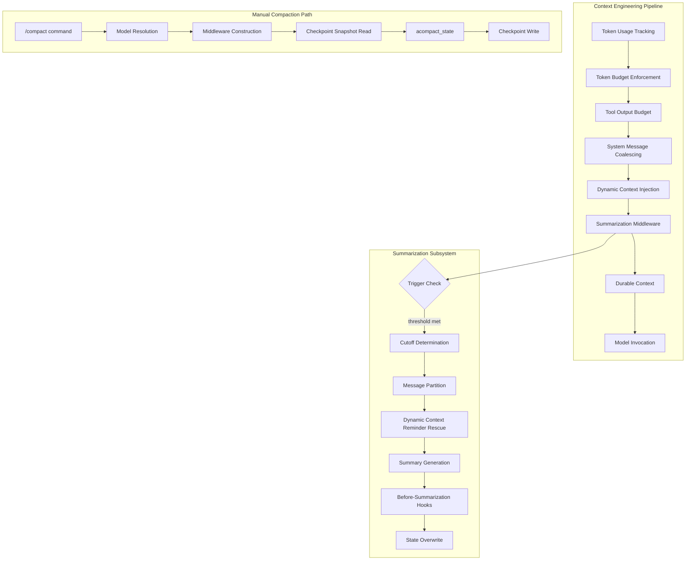
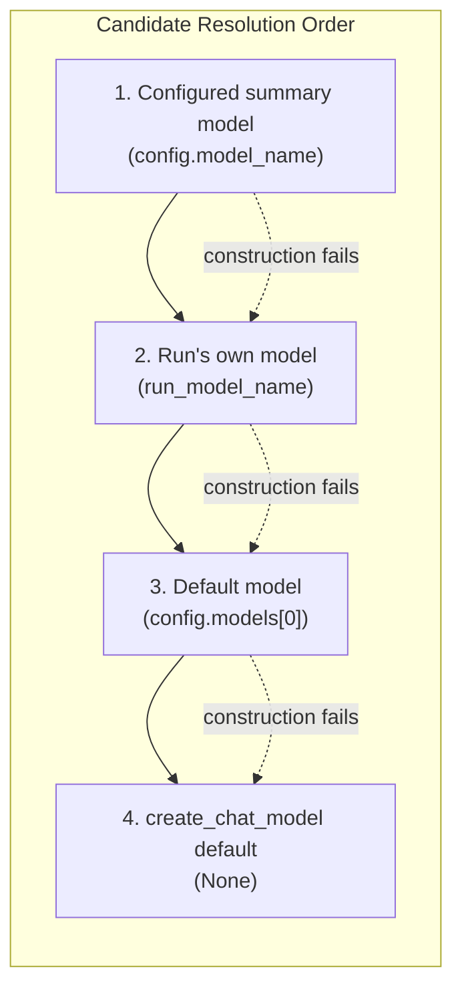
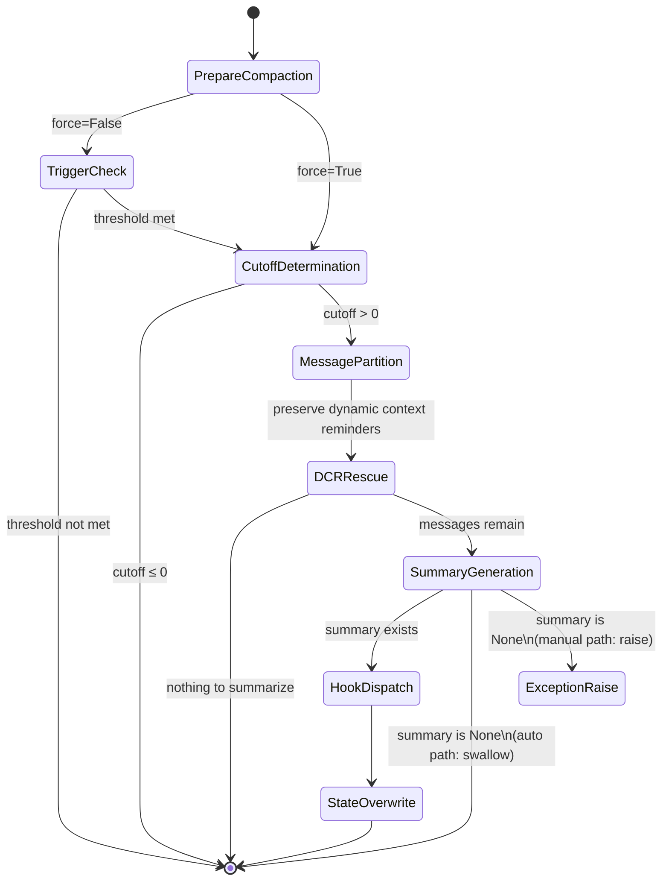
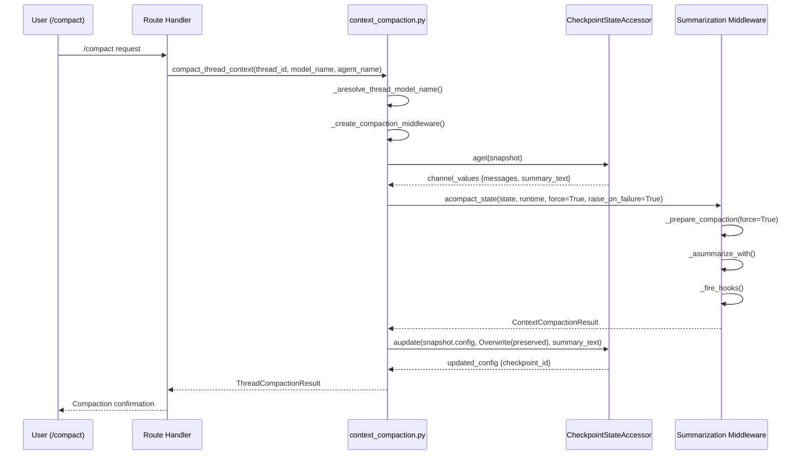

---
slug:16-context-engineering-and-compaction
blog_type:normal
---

DeerFlow 的上下文工程子系统负责管理 Agent 运行生命周期中的对话状态——从 Token 预算限制、工具输出压缩，到自动摘要与手动线程压缩。本文将深入剖析该架构，它既能防止上下文无限增长，又能保持对话的高保真度，从而支持长时间的研究会话，且不会导致模型性能下降或超出服务商的 Token 限制。

## 架构概述

DeerFlow 的上下文工程作为一个**多层中间件管道**运行，在消息缓冲区送达模型之前，对其进行逐步塑形。每一层负责处理特定的关注点：Token 统计、预算限制、工具输出压缩、动态上下文注入以及基于摘要的压缩。该管道运行在 LangGraph 的中间件钩子系统中，其中 `before_model` 钩子会在每次调用 LLM 之前检查并修改 Agent 状态。

摘要中间件作为核心的压缩引擎，服务于两条调用路径：一是在 Agent 正常执行期间由 `before_model` 钩子触发的**自动路径**；二是通过 `/compact` 命令经由 `compact_thread_context` 发起的**手动路径**。两条路径最终汇聚于同一个工厂方法（`create_summarization_middleware`），以确保模型解析、钩子配置和保留默认值保持一致，不会产生偏差。

来源：[summarization_middleware.py](/backend/packages/harness/deerflow/agents/middlewares/summarization_middleware.py#L731-L815), [context_compaction.py](/backend/packages/harness/deerflow/runtime/context_compaction.py#L99-L169)

## 摘要配置模型

`SummarizationConfig` Pydantic 模型定义了上下文压缩的所有可调参数。它支持三种不同的阈值类型——消息数量、绝对 Token 数量以及模型容量的百分比，并且可以同时接受多种触发条件。

| 参数 | 类型 | 默认值 | 描述 |
|-----------|------|---------|-------------|
| `enabled` | `bool` | `False` | 自动摘要的主开关 |
| `model_name` | `str \| None` | `None` | 专用摘要模型；`None` = 使用运行自身的模型 |
| `trigger` | `ContextSize \| list[ContextSize] \| None` | `None` | 触发摘要的一个或多个阈值 |
| `keep` | `ContextSize` | `messages: 20` | 压缩后的保留策略 |
| `trim_tokens_to_summarize` | `int \| None` | `4000` | 摘要提示词输入的最大 Token 数；`None` = 跳过裁剪 |
| `summary_prompt` | `str \| None` | `None` | 自定义提示词模板；`None` = 默认 LangChain 提示词 |
| `skill_file_read_tool_names` | `list[str]` | `["read_file", "read", "view", "cat"]` | 被视为技能文件读取的工具名称，用于持久化上下文捕获 |

`ContextSize` 类型是基于三种策略的辨识联合类型：

| 类型 | 值语义 | 示例 | 使用场景 |
|------|----------------|---------|----------|
| `messages` | 绝对消息数量 | `{"type": "messages", "value": 50}` | 可预测、与模型无关的压缩节奏 |
| `tokens` | 绝对 Token 数量 | `{"type": "tokens", "value": 4000}` | 精确到 Token 的预算控制 |
| `fraction` | 模型最大输入 Token 的百分比 | `{"type": "fraction", "value": 0.8}` | 适配不同模型的上下文窗口 |

<CgxTip>当 `model_name` 为 `None` 时，摘要生成器会使用运行时的**实际执行模型**——而非 `config.models[0]`。这意味着子 Agent 自身的模型或线程自定义 Agent 的模型将负责生成摘要。如果该主模型发生故障（如密钥过期、配额耗尽），中间件会按照有序的候选链进行降级回退，直至全部失败则放弃操作并保持压缩状态不变。</CgxTip>

来源：[summarization_config.py](/backend/packages/harness/deerflow/config/summarization_config.py#L1-L83), [summarization_middleware.py](/backend/packages/harness/deerflow/agents/middlewares/summarization_middleware.py#L170-L192)

## 摘要中间件引擎

`DeerFlowSummarizationMiddleware` 扩展了 LangChain 的基础 `SummarizationMiddleware`，通过五项架构增强使其能够胜任生产环境下的长时间运行 Agent 工作流。

### 模型解析与降级链

中间件并未硬编码单一的摘要模型，而是维护了一个有序的**生成候选模型**列表，该列表采用惰性构建方式，并设有构建失败保护机制：

每个候选模型都会经历完整的生命周期：惰性构建 → `TAG_NOSTREAM` 标记 → 调用 → 文本提取 → 非空校验。任何阶段的失败都会静默降级至下一个候选模型。当显式配置了 `model_name` 时，它将成为首选候选模型，并以运行模型作为独立的降级备选。当 `model_name` 为 `null` 时，运行模型成为唯一候选——此时不会对 `config.models[0]` 产生预先依赖。

`TAG_NOSTREAM` 标记至关重要：它能防止摘要 LLM 调用的 Token 流被消息元组流回调捕获，进而避免作为虚假 AI 消息广播至前端。该标记应用于模型的**副本**（`model.with_config(tags=merged_tags)`），从而保留诸如 `middleware:summarize` 等用于 RunJournal 归因的已有标记。

来源：[summarization_middleware.py](/backend/packages/harness/deerflow/agents/middlewares/summarization_middleware.py#L100-L218), [summarization_middleware.py](/backend/packages/harness/deerflow/agents/middlewares/summarization_middleware.py#L253-L301)

### 压缩状态机

核心压缩逻辑遵循严格的状态机设计，将**触发条件评估**与**生成**及**钩子分发**相互分离：

`_prepare_compaction` 方法负责处理生成前阶段：它确保所有消息均具备 ID，从 `state["summary_text"]` 解析先前的摘要，计算总 Token 数，并确定分割索引，将消息划分为待摘要集合与保留的尾部消息。`force` 参数可绕过手动压缩的触发阈值，而 `raise_on_failure` 作为一项**独立的关注点**，用于控制生成失败时是抛出 `SummaryGenerationError` 还是静默忽略。

状态覆盖操作使用了 `RemoveMessage(id=REMOVE_ALL_MESSAGES)` 随后紧跟保留消息的方式，这是 LangGraph 的幂等替换模式：它能够原子性地清除所有现有消息，并插入保留的尾部消息及新摘要。

来源：[summarization_middleware.py](/backend/packages/harness/deerflow/agents/middlewares/summarization_middleware.py#L508-L625)

### 动态上下文提醒保留

一个微妙但至关重要的特性是：中间件在压缩前会从待摘要集合中**挽救动态上下文提醒**。动态上下文提醒携带当前日期及可选的记忆注入信息。如果摘要过程将其移除，`DynamicContextMiddleware` 可能会丢失已注入的提醒，并在错误的对话位置注入替代内容。

挽救逻辑专门处理由 `_make_reminder_and_user_messages` 生成的**ID 交换三元组**：
- `SystemMessage(id=X)` — 标记为 `dynamic_context_reminder=True`
- `HumanMessage(id=X__memory)` — 标记为 `dynamic_context_reminder=True`
- `HumanMessage(id=X__user)` — 携带原始用户内容，**未标记**

如果不进行同级挽救，未标记的 `__user` 消息将留在待摘要集合中并被压缩成普通文本，从而导致被标记的消息成为孤立项，且模型直接上下文中将丢失用户的提问。挽救逻辑使用 `removesuffix`（而非 `rsplit`）来正确处理中间包含 `__` 的稳定 ID，并执行单次时间顺序分区，确保在单个摘要窗口中跨多个三元组时保持消息顺序。

来源：[summarization_middleware.py](/backend/packages/harness/deerflow/agents/middlewares/summarization_middleware.py#L627-L679)

### 摘要提示词构建与安全性

摘要提示词在 `_build_summary_prompt` 中通过多阶段管道构建，包括 Token 裁剪、HTML 转义及结构化的类 XML 块格式化。当设置了 `trim_tokens_to_summarize`（默认值：4000）时，提示词输入会在新消息与先前的摘要之间进行分配，各自获得按比例的 Token 预算。裁剪操作使用 LangChain 的 `trim_messages` 并设置 `allow_partial=True`，若 Token 计数器失败，则回退至确定性的文本截断（`_bound_text`）。

HTML 转义防御是一种**块溢出预防**机制：`<existing_summary>` 和 `<new_messages>` 内容块在嵌入前均会使用 `html.escape(text, quote=False)` 进行转义。如果未转义的值形如 `</new_messages>...`，可能会提前关闭块并为提取 LLM 伪造授权区域。转义在裁剪之后执行，因此末尾的 `"..."` 不会分割字符实体。

两种**预设摘要**可在边缘情况下短路模型调用：
- `"No previous conversation history."` — 当 `messages_to_summarize` 为空时
- `"Previous conversation was too long to summarize."` — 当裁剪后无内容留存时

这些内容存储在 `frozenset`（`_CANNED_SUMMARIES`）中，并被明确排除在生成失败检测之外。

来源：[summarization_middleware.py](/backend/packages/harness/deerflow/agents/middlewares/summarization_middleware.py#L228-L239), [summarization_middleware.py](/backend/packages/harness/deerflow/agents/middlewares/summarization_middleware.py#L428-L500)

### 摘要前置钩子

中间件**仅在**替换摘要成功生成后分发 `BeforeSummarizationHook` 回调。这种顺序安排是刻意为之：如果摘要最终未能生成，将压缩前的消息刷入持久化记忆会导致下次尝试时重复执行此项工作。钩子会接收一个 `SummarizationEvent`，其中包含待摘要的消息、保留的尾部消息、线程 ID、Agent 名称及运行时上下文。

主要钩子是 `memory_flush_hook`，它负责将压缩前的消息持久化至持久化记忆队列。该钩子采用**条件注册**：主 Agent 链保留该钩子（研究过程应持久化至长期记忆），而子 Agent 链设置 `skip_memory_flush=True`，使得子 Agent 的内部轮次（任务 HumanMessage + 中间 AI/工具轮次）不会写入父线程的持久化记忆——该钩子以 `thread_id` 为键，且子 Agent 共享父级 `thread_id`。

钩子失败会被独立捕获并记录日志；单个钩子失败不会中断压缩过程，也不会阻止后续钩子执行。

来源：[summarization_middleware.py](/backend/packages/harness/deerflow/agents/middlewares/summarization_middleware.py#L681-L704), [summarization_middleware.py](/backend/packages/harness/deerflow/agents/middlewares/summarization_middleware.py#L800-L815)

## 手动线程压缩

`/compact` 命令通过 `compact_thread_context` 触发**带外上下文压缩**，该操作直接作用于检查点状态，而无需执行 Agent。对于希望主动回收上下文空间而非等待自动触发的用户而言，此路径至关重要。

### 压缩流程

### 手动压缩的模型解析

手动压缩不执行 Agent，因此没有承载所选模型的实时运行时。`_aresolve_thread_model_name` 函数使用与 `lead_agent._resolve_model_name` 相同的优先级来解析摘要模型：

1. **显式请求的模型覆盖** — 根据已配置的模型进行校验
2. **线程自定义 Agent 的已配置模型** — 通过 `_safe_load_agent_config` 在事件循环外使用 `asyncio.to_thread` 加载
3. **`config.models[0]`** — 默认模型

自定义 Agent 配置的读取操作被包裹在宽泛的 `except Exception` 中，任何失败均返回 `None`。这种做法是安全的，因为调用方通过 `asyncio.to_thread` 在事件循环外运行它，严格的阻塞 IO 检测器不会标记此文件系统读取，且宽泛的异常处理器不会掩盖循环中抛出的 `BlockingError`。

### 结果上报与错误语义

`ThreadCompactionResult` 数据类提供结构化的反馈：

| 字段 | 类型 | 描述 |
|-------|------|-------------|
| `thread_id` | `str` | 被压缩的线程 |
| `compacted` | `bool` | 是否实际发生了压缩 |
| `reason` | `str \| None` | 跳过压缩的原因（例如 `"not_enough_messages"`） |
| `removed_message_count` | `int` | 被摘要移除的消息数 |
| `preserved_message_count` | `int` | 保留在活动尾部的消息数 |
| `summary_updated` | `bool` | 是否写入了新摘要 |
| `checkpoint_id` | `str \| None` | 写入后的新检查点 ID |
| `total_tokens` | `int` | 压缩时的 Token 数量 |

错误模型区分了三种结果：
- **`compacted=False, reason="not_enough_messages"`** — 线程消息不足，无法压缩；这是正常的空操作
- **`ContextCompactionDisabled`** — 配置中未启用摘要功能
- **`ContextCompactionFailed`** — 线程本可压缩，但在穷尽所有模型候选后，摘要 LLM 生成失败；此错误表现为 HTTP 500 → 前端错误提示，与“无内容可压缩”的结果截然不同

<CgxTip>`force=True` 和 `raise_on_failure=True` 标志在手动压缩中是**独立的关注点**。`force` 绕过触发阈值（手动调用方始终期望执行压缩）。`raise_on_failure` 控制错误传播：即使是满足阈值但生成失败的 `force=False` 调用也会抛出 `SummaryGenerationError`，因为手动调用方始终希望生成失败能被暴露出来——它们不应坍缩至“无内容可压缩”分支。</CgxTip>

来源：[context_compaction.py](/backend/packages/harness/deerflow/runtime/context_compaction.py#L1-L169), [summarization_middleware.py](/backend/packages/harness/deerflow/agents/middlewares/summarization_middleware.py#L533-L601)

## Token 预算限制

与摘要功能相独立，`TokenBudgetConfig` 模型定义了**单次运行的 Token 预算限制**，当累计 Token 消耗超出配置限制时，可强制停止 Agent。

| 参数 | 类型 | 默认值 | 描述 |
|-----------|------|---------|-------------|
| `enabled` | `bool` | `False` | 单次运行预算限制的主开关 |
| `max_tokens` | `int` | `200000` | 每次运行的最大总 Token 数（输入 + 输出） |
| `max_input_tokens` | `int \| None` | `None` | 可选的独立输入 Token 限制 |
| `max_output_tokens` | `int \| None` | `None` | 可选的独立输出 Token 限制 |
| `warn_threshold` | `float` | `0.8` | 触发软警告注入时的 `max_tokens` 百分比 |
| `hard_stop_threshold` | `float` | `1.0` | 剥离工具调用并强制 Agent 生成最终答案时的 `max_tokens` 百分比 |

模型验证器确保 `hard_stop_threshold >= warn_threshold`，防止硬停机在警告之前触发。达到警告阈值时，会向对话中注入软警告消息。达到硬停机阈值时，模型响应中的工具调用将被剥离，并强制 Agent 生成最终答案——从而防止 Agent 循环中出现失控的 Token 消耗。

Token 使用跟踪（`TokenUsageConfig`）是一个轻量子系统（默认 `enabled=True`），它记录 Token 消耗指标而不强制执行限制，为可观测性和链路追踪管道提供数据支持。

来源：[token_budget_config.py](/backend/packages/harness/deerflow/config/token_budget_config.py#L1-L22), [token_usage_config.py](/backend/packages/harness/deerflow/config/token_usage_config.py#L1-L8)

## 中间件管道集成

上下文工程子系统贯穿了一系列中间件模块，这些模块在 Agent 的 `before_model` 钩子链中按既定顺序执行。下表映射了各中间件在上下文工程中的角色：

| 中间件 | 角色 | 关键行为 |
|-----------|------|--------------|
| `token_usage_middleware.py` | 统计 | 跟踪每次运行的累计 Token 消耗 |
| `token_budget_middleware.py` | 限制 | 阈值处警告，超限时硬停机 |
| `tool_output_budget_middleware.py` | 压缩 | 在工具输出进入消息缓冲区前进行限制与压缩 |
| `tool_output_synopsis.py` | 压缩 | 为大型工具输出生成摘要 |
| `tool_result_sanitization_middleware.py` | 清理 | 剥离工具结果中的敏感数据 |
| `system_message_coalescing_middleware.py` | 去重 | 合并冗余的系统消息 |
| `dynamic_context_middleware.py` | 注入 | 注入日期、记忆及运行时上下文提醒 |
| `durable_context_middleware.py` | 持久化 | 将技能文件读取捕获至持久化 skill_context 通道 |
| `summarization_middleware.py` | 压缩 | 摘要旧消息，保留活动尾部 |
| `dangling_tool_call_middleware.py` | 修复 | 修复孤立的工具调用/响应对 |
| `model_length_finish_reason_middleware.py` | 恢复 | 处理模型最大长度截断 |

**顺序至关重要**：Token 统计必须在预算限制之前运行；工具输出压缩必须在摘要之前运行（以便摘要器看到已压缩的内容）；动态上下文注入必须在摘要之前运行，以便提醒挽救逻辑能够识别并保留已注入的上下文标记。

来源：[middlewares directory](/backend/packages/harness/deerflow/agents/middlewares#L1-L40), [summarization_middleware.py](/backend/packages/harness/deerflow/agents/middlewares/summarization_middleware.py#L627-L679)

## 扩展系统集成

异步摘要生成路径通过 `observe_system_model_call` 与 DeerFlow 的扩展系统集成，该调用为 `SystemOperationKind.SUMMARIZATION` 操作包装了 LLM 调用，并附加了扩展观察逻辑。这使得扩展能够观察（而非拦截）摘要模型调用，从而实现自定义可观测性、日志记录或分析，且不干扰压缩生命周期。

此集成是**纯异步的**：同步的 `_summarize_with` 路径刻意不通知扩展，因为同步方法及其唯一宿主调用方（`compact_state`）都是纯异步运行时的同步部分。Agent 通过 `abefore_model` 运行，手动压缩调用 `acompact_state`。在同步路径上发送通知将需要阻塞调用方线程以等待扩展循环，而宿主根本不会触达该调用点。

来源：[summarization_middleware.py](/backend/packages/harness/deerflow/agents/middlewares/summarization_middleware.py#L327-L361)

## 延伸阅读

- **[模型服务商集成](15-model-provider-integration)** — 了解 `create_chat_model` 如何构建摘要中间件所使用的模型，包括受保护的构建模式与思维模式禁用机制。
- **[检查点与状态管理](18-checkpointing-and-state-management)** — 手动压缩路径通过 `CheckpointStateAccessor` 读写检查点状态；此页面介绍了检查点生命周期及压缩期间使用的 `Overwrite` 语义。
- **[长期记忆后端](17-long-term-memory-backends)** — `memory_flush_hook` 将压缩前消息持久化至持久化记忆；此页面详述了记忆后端架构。
- **[Agent 中间件管道](10-agent-middleware-pipeline)** — 完整的中间件顺序与生命周期，包括 `before_model` 钩子如何链接在一起。
