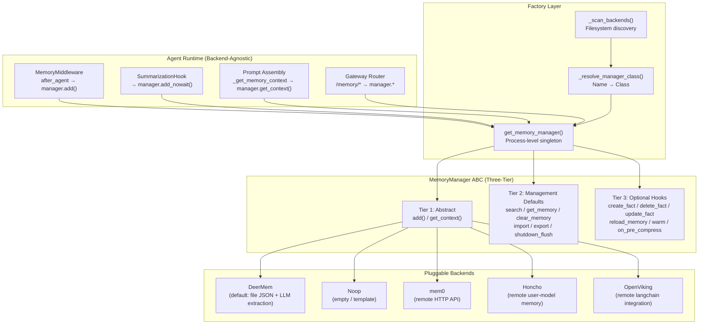
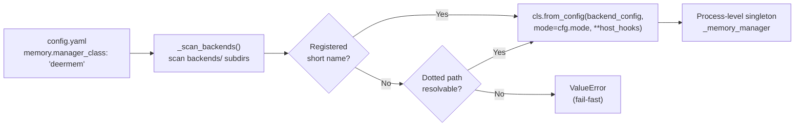
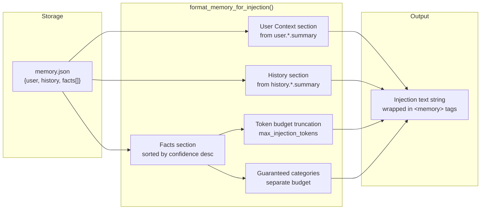

---
slug:17-long-term-memory-backends
blog_type:normal
---


DeerFlow 的长期记忆子系统赋予了对话 Agent 跨会话持久化用户事实、交互历史和上下文摘要的能力，并能将这些知识选择性地注入到未来的提示词中。该系统基于**可插拔后端契约**架构：单个 `MemoryManager` 基类定义了三层方法层级，只需添加一个文件夹并修改配置项，即可接入任意数量的存储/提取后端。本页将深入剖析该契约、内置后端、工厂解析机制，以及生产环境部署中的运维注意事项。

## 架构概述

记忆子系统在 DeerFlow Agent 的流水线中占据特定层级：它位于 Agent 编排循环*之下*（在每轮对话后接收消息），并位于模型调用*之上*（将召回文本注入系统提示词）。两种操作模式——**中间件** 和 **工具**——决定了记忆更新是在每轮对话后被动发生，还是由模型通过显式工具调用主动发起。



宿主运行时（中间件、摘要钩子、提示词组装、网关路由器）完全通过 `MemoryManager` 接口与记忆系统交互。工厂层在进程启动时解析需要实例化的具体后端类，该单例随后服务于所有调用。后端与 deer-flow 内部完全隔离——它们通过 `backend_config` 字典接收配置，并通过 `from_config` 关键字参数接收宿主钩子，绝不直接导入 deer-flow 模块。

来源：[manager.py](/backend/packages/harness/deerflow/agents/memory/manager.py#L1-L15), [backends/__init__.py](/backend/packages/harness/deerflow/agents/memory/backends/__init__.py#L1-L11), [backends/README.md](/backend/packages/harness/deerflow/agents/memory/backends/README.md#L1-L15)

## MemoryManager 契约

该契约被定义为 pydantic `BaseModel`（而非纯 ABC），这为其免费提供了字段验证、序列化，以及与后端配置的共享类型系统兼容性。方法被组织为三个层级，逐步放宽实现要求——新后端最少只需实现两个方法，其余均可继承合理的默认实现。

### 第一层：抽象方法（必需）

每个后端**必须**实现 `add` 和 `get_context`。它们代表了基础的写入和读取注入职责。由于 Pydantic 的元类派生自 `ABCMeta`，未实现的抽象方法会在实例化时抛出 `TypeError`——这是一种快速失败机制，可在任何数据流动之前捕获配置错误的后端。

| 方法 | 签名 | 用途 |
|--------|-----------|---------|
| `add` | `(thread_id, messages, *, agent_name, user_id, trace_id) → None` | 将对话排入异步记忆更新队列。实现内部会将消息过滤为用户输入 + 最终助手回复。 |
| `get_context` | `(user_id, *, agent_name, thread_id) → str` | 返回可直接注入的记忆文本。具体格式由后端自行决定——DeerMem 会加载事实并执行 `format_memory_for_injection`；其他后端可进行自定义搜索与格式化。 |

契约刻意对“记忆”的具体含义保持中立：后端完全不需要存储“事实”。`get_context` 返回的字符串会被调用方原封不动地注入，因此格式决策权完全掌握在后端手中。

### 第二层：管理操作（带默认实现）

第二层方法带有默认实现，通常会抛出 `NotImplementedError`，除了 `add_nowait`（委托给 `add`）和 `shutdown_flush`（返回 `True`）。后端只需重写其支持的操作。

| 方法 | 默认实现 | 调用方 |
|--------|---------|--------|
| `add_nowait` | 委托给 `add()` | 摘要钩子——在消息从状态中移除前捕获内容 |
| `search` | `raise NotImplementedError` | 工具模式的 `memory_search` 工具；网关搜索端点 |
| `get_memory` | `raise NotImplementedError` | 网关 `/memory` GET——返回完整记忆文档 |
| `clear_memory` | `raise NotImplementedError` | 网关 `/memory` DELETE——清空存储桶，返回空文档 |
| `import_memory` | `raise NotImplementedError` | 网关 `/memory/import` POST |
| `shutdown_flush` | 返回 `True` | 网关生命周期——在优雅关闭时对挂起的更新进行有界排空 |
| `delete_memory` / `export_memory` | `raise NotImplementedError` | 废弃契约（零调用方）；通过默认抛出异常保持可用 |

<CgxTip>`supports_search` ClassVar 标志必须与是否实际重写了 `search()` 相匹配。不变性验证器会在实例化时捕获偏差——如果后端重写了 `search()` 却忘记设置 `supports_search = True`，会立即报错，而不是在运行时静默返回空结果。</CgxTip>

### 第三层：可选钩子（带默认实现）

第三层方法是可选的生命周期和 CRUD 钩子。调用方直接调用它们并捕获不支持的 `NotImplementedError`——无需进行 `hasattr` 探测。

| 钩子 | 默认实现 | 用途 |
|------|---------|---------|
| `warm` | `None`（无需预热） | 网关启动时的一次性资源预热（例如 tiktoken 缓存） |
| `reload_memory` | `raise NotImplementedError` | 丢弃缓存的记忆文档并从存储重新加载 |
| `create_fact` | `raise NotImplementedError` | 前端添加事实按钮（返回 `(memory_data, fact_id)`） |
| `delete_fact` | `raise NotImplementedError` | 前端删除事实按钮 |
| `update_fact` | `raise NotImplementedError` | 前端编辑事实按钮 |
| `on_pre_compress` | `""`（无增强） | 记忆 → 压缩器反馈，用于摘要增强 |
| `on_turn_start` | `None`（空操作） | 轮次开始时的提醒，用于未来的后台审查 |

`warm` 方法采用三态返回契约：`True`（预热成功）、`False`（预热失败）、`None`（无需预热）。这让宿主能够准确记录日志，无需猜测非 DeerMem 后端是否触碰了它从未使用的资源。

来源：[manager.py](/backend/packages/harness/deerflow/agents/memory/manager.py#L97-L514), [backends/README.md](/backend/packages/harness/deerflow/agents/memory/backends/README.md#L50-L80)

## 操作模式：中间件 vs. 工具

记忆系统在两种互斥模式下运行，由 `MemoryConfig.mode` 控制。该模式决定了记忆更新是被动发生（每轮对话后），还是由模型主动引导（由 LLM 决定何时搜索/添加）。

**中间件模式**（默认）是被动的：在每轮 Agent 对话后，`MemoryMiddleware` 会带着对话消息调用 `manager.add()`。后端通过调用 LLM 异步提取事实并存储。在下一轮对话前，`_get_memory_context` 会调用 `manager.get_context()` 将召回文本注入系统提示词。此模式无需模型智能参与——LLM 永远不会显式决定与记忆交互。

**工具模式**由模型引导：Agent 获得记忆工具（`memory_search`、`memory_add` 等），并在推理过程中显式调用它们。这要求后端实现 `search()`（由不变性验证器强制执行——在工具模式下不支持搜索的后端会在实例化时报错）。部分后端会设置 `requires_passive_writes_in_tool_mode = True`，以便在通过工具暴露查询感知搜索的同时，通过 `MemoryMiddleware` 保留被动写入——当后端的提取流水线（如 mem0 的服务端去重）受益于被动捕获时，这非常有用。

```python
def should_use_memory_tools(config: MemoryConfig) -> bool:
    """Return True when memory should use model-directed tools."""
    return config.enabled and config.mode == "tool"
```

来源：[memory_config.py](/backend/packages/harness/deerflow/config/memory_config.py#L55-L117), [manager.py](/backend/packages/harness/deerflow/agents/memory/manager.py#L156-L196)

## 后端发现与工厂解析

工厂层使用**文件系统扫描即插即用机制**来发现后端。在进程启动时，`_scan_backends()` 会遍历 `backends/` 的子目录，导入每个包的 `__init__.py`，并检查是否存在作为 `MemoryManager` 子类的 `MANAGER_CLASS` 属性。文件夹名即成为后端的注册名——即插即用契约为：文件夹名 == 后端名 == `MemoryConfig.manager_class` 的值。

当调用 `get_memory_manager()` 时，解析遵循以下两步顺序：

1. **注册的短名称**：如果 `manager_class` 匹配到已发现的后端文件夹，则直接使用该类。
2. **点号导入路径**：如果不是注册名称，则视为 `pkg.mod:Cls` 或 `pkg.mod.Cls` 并尝试 `importlib` 解析。

如果两者均无法解析，则触发**硬错误**——工厂会抛出 `ValueError`，而非静默回退到 DeerMem。这是一种刻意的保障数据完整性的措施：记忆是持久化状态，将写入静默路由到错误的存储无异于埋下静默数据损坏的隐患。



该单例由双重检查锁（`_manager_lock`）保护以保证线程安全。正在运行的进程**不会**热重载后端及其配置——切换后端需要重启。

<CgxTip>工厂层调用 `cls.from_config(backend_config, mode=cfg.mode, **host_hooks)` 而非直接构造类。这使得每个后端能拥有自己的组装逻辑：解析配置、连接依赖项，并选择性地消费宿主钩子（追踪、隐藏消息过滤器、LLM 工厂）。添加后端永远无需修改工厂代码。</CgxTip>

来源：[manager.py](/backend/packages/harness/deerflow/agents/memory/manager.py#L516-L617), [backends/__init__.py](/backend/packages/harness/deerflow/agents/memory/backends/__init__.py#L1-L11)

## 宿主共享配置架构

共享的 `MemoryConfig` 架构仅包含**六个字段**，所有后端、调用点和工厂层均读取这些字段。后端私有配置存在于 `backend_config`（字典）中，由各后端自行解释。这种分离使得后端可替换——DeerMem 的配置项永远不会泄漏到共享契约中。

| 字段 | 类型 | 默认值 | 描述 |
|-------|------|---------|-------------|
| `enabled` | `bool` | `True` | 记忆机制的主调用门控 |
| `mode` | `Literal["middleware", "tool"]` | `"middleware"` | 操作模式（被动 vs. 模型引导） |
| `injection_enabled` | `bool` | `True` | 是否将记忆注入系统提示词 |
| `shutdown_flush_timeout_seconds` | `float` | `30.0` | 关闭时排空挂起更新的硬性时间预算 |
| `manager_class` | `str` | `"deermem"` | 后端选择器（注册名称或点号路径） |
| `backend_config` | `dict[str, Any]` | `{}` | 后端私有配置，原样传递给后端的 `__init__` |

`shutdown_flush_timeout_seconds` 字段值得注意：排空过程会对每个挂起项发起一次 LLM 调用，因此大批量即时消息可能需要更高的值。它必须与通道/调度器停止时间一道，容纳在 Pod 的 K8s `terminationGracePeriodSeconds` 之内，否则 K8s 会在排空过程中发送 SIGKILL。排空在守护线程上运行，一旦超时，进程将继续退出，未完成的部分将被丢弃。

在 `config.yaml` 中，原先位于 `memory:` 顶层的旧版 DeerMem 字段（抽象化之前）会在加载时**自动迁移**到 `backend_config` 中并发出警告，因此升级不会将自定义设置静默恢复为默认值。

来源：[memory_config.py](/backend/packages/harness/deerflow/config/memory_config.py#L55-L229)

## 内置后端

### DeerMem（默认）

DeerMem 是 DeerFlow 的原生记忆后端——基于文件的 JSON 存储，具备防抖 LLM 提取、陈旧度审查及可选的整合功能。它将自身的存储、队列、更新器和 LLM 作为 `PrivateAttr` 依赖项（非 pydantic 对象，不参与验证/序列化），在 `model_post_init` 中根据解析出的 `DeerMemConfig` 构造一次。

**存储**：按用户存储记忆于 `{storage_root}/users/{user_id}/memory.json`，使用跨进程建议性文件锁（`file_lock_timeout_seconds`）。可通过 `storage_class`（点号导入路径）配置替代存储类。检索默认使用 FTS5 适配器。

**提取流水线**：对话经过过滤（移除琐碎消息，检测纠正/强化的信号模式）后，排入 `MemoryUpdateQueue`，具备可配置的防抖（`debounce_seconds`，默认 30 秒）和背压上限（`queue_max_depth`，默认 1000）。信号更新（纠正/强化）即使达到上限也会被接收，确保重要记忆不会丢失。`MemoryUpdater` 调用 LLM 提取结构化事实，这些事实必须通过置信度阈值（`fact_confidence_threshold`，默认 0.7）才会被存储。

**陈旧度审查**：超过 `staleness_age_days`（默认 90）的事实成为审查候选。LLM 会评估陈旧事实应被移除、延长还是保留。受保护类别（默认：`correction`）豁免审查。创建时的生命周期上限（`staleness_max_lifetime_multiplier`，默认 20.0）防止模型设置过长的初始生命周期导致事实永远不被重新评估。

**整合**：默认禁用（`consolidation_enabled: false`）。启用后，LLM 会在常规记忆更新调用中审查碎片化的事实类别，并将相关事实综合为更丰富的单一事实。此过程有损（不保留源内容，仅保留 `consolidatedFrom` ID），因此需显式开启。

**DeerMem 关键配置字段**：

| 字段 | 默认值 | 范围 | 描述 |
|-------|---------|-------|-------------|
| `max_facts` | 100 | 10–500 | 最大存储事实数 |
| `fact_confidence_threshold` | 0.7 | 0.0–1.0 | 事实存储的最低置信度 |
| `max_injection_tokens` | 2000 | 100–8000 | 记忆注入的 Token 预算 |
| `token_counting` | `tiktoken` | `tiktoken` / `char` | 注入预算的 Token 计数策略 |
| `guaranteed_categories` | `["correction"]` | — | 无论 Token 预算如何始终注入的类别 |
| `guaranteed_token_budget` | 500 | 50–2000 | 保证类别事实的 Token 上限 |
| `debounce_seconds` | 30 | 1–300 | 队列防抖延迟 |
| `queue_max_depth` | 1000 | 0+ | 背压上限（0 = 无限） |
| `retrieval_adapter` | `fts5` | — | 检索工厂：`fts5`、`""`（禁用）或点号路径 |

Token 计数策略具备无网络回退机制：`tiktoken` 在可用时使用 `cl100k_base` 编码；如果导入或编码加载失败，则回退到支持中日韩字符的字符估算（中日韩字符 ≈ 2 字符/Token，其他 ≈ 4 字符/Token）。

### Noop（模板）

`noop` 后端不存储也不召回任何内容——每次读取返回空，每次写入均为空操作。它有两个目的：端到端验证可插拔机制（工厂 + 即插即用发现 + 配置切换），以及作为新后端的**即拷即用模板**。其 `noop_manager.py` 文档字符串中包含编写新后端的 6 步指南。

尽管不存储任何内容，noop 重写了 `search()` 以返回 `[]` 并设置 `supports_search = True`——其“不存储/不召回”的设计意味着每次读取返回空而非抛出异常。这使其作为基线在 `mode="tool"` 下也是有效的。

### mem0（远程 HTTP）

`mem0` 后端是 mem0 平台 API（或兼容服务器）的无状态 HTTP 适配器。所有状态均在服务端——mem0 负责去重、提取和存储——因此该后端不保留队列、水位或缓存，对于多 Worker 的网关部署是安全的。

身份标识 1:1 映射：`(user_id, agent_name)` → mem0 `(user_id, agent_id)`；`thread_id` → mem0 `run_id`。该后端实现 `requires_passive_writes_in_tool_mode = True`，因为 mem0 通过 `add()` 从完整对话中提取/去重事实——其事实 CRUD 钩子刻意不予支持，因此工具模式在通过 `memory_search` 工具暴露查询感知搜索的同时保留被动写入。

错误策略可配置：`read_policy`（`fail_open` 或 `fail_closed`）和 `write_policy`（`log_and_drop` 或 `fail_closed`）控制记忆故障是导致 Agent 崩溃还是优雅降级。

### Honcho（远程用户模型记忆）

`honcho` 后端是基于 Honcho（自托管或通过 `api.honcho.dev`）的纯远程 HTTP 适配器，用于用户模型记忆。表示由 Honcho 服务端推导器构建——无本地 LLM 调用。支持按用户隔离工作空间及按用户覆盖。

关键配置包括 `base_url`、`api_key`、`workspace_prefix`（默认 `deerflow-u-`）、用于自定义工作空间映射的 `workspace_overrides`、`max_injection_chars`（默认 6000）以及 `failure_policy.read`（默认 `fail_open`）。通过设置 `requires_passive_writes_in_tool_mode = True` 支持工具模式。

### OpenViking（远程 LangChain 集成）

`openviking` 后端是使用官方 `langchain-openviking` 包的可选远程后端，运行于单用户中间件模式。

来源：[deer_mem.py](/backend/packages/harness/deerflow/agents/memory/backends/deermem/deer_mem.py#L1-L200), [deermem/config.py](/backend/packages/harness/deerflow/agents/memory/backends/deermem/deermem/config.py#L1-L329), [noop_manager.py](/backend/packages/harness/deerflow/agents/memory/backends/noop/noop_manager.py#L1-L190), [mem0_manager.py](/backend/packages/harness/deerflow/agents/memory/backends/mem0/mem0_manager.py#L1-L200), [backends/README.md](/backend/packages/harness/deerflow/agents/memory/backends/README.md#L131-L155)

## DeerMem 数据结构（规范模型）

网关和前端目前硬编码为**DeerMem 结构响应**——任何后端的 `get_memory` / `export_memory` / `clear_memory` / `import_memory` 必须返回可转换为此结构的字典，否则数据会被静默丢弃（pydantic 忽略未知字段），前端将接收到空默认值。

```json
{
  "version": "1.0",
  "lastUpdated": "2026-03-28T10:30:00Z",
  "user": {
    "workContext": { "summary": "...", "updatedAt": "..." },
    "personalContext": { "summary": "...", "updatedAt": "..." },
    "topOfMind": { "summary": "...", "updatedAt": "..." }
  },
  "history": {
    "recentMonths": { "summary": "...", "updatedAt": "..." },
    "earlierContext": { "summary": "...", "updatedAt": "..." },
    "longTermBackground": { "summary": "...", "updatedAt": "..." }
  },
  "facts": [
    {
      "id": "fact_review_001",
      "content": "User prefers Chinese for day-to-day collaboration.",
      "category": "preference",
      "confidence": 0.95,
      "createdAt": "2026-03-28T09:50:00Z",
      "source": "thread_pref_cn"
    }
  ]
}
```

非 DeerMem 后端通过小型适配器辅助函数，将其原生记录（如 mem0 的 `{"results": [...]}`）映射到此结构。`lastUpdated` 字段尤为关键——空字符串会导致前端日期格式化程序崩溃。

来源：[memory-settings-sample.json](/backend/docs/memory-settings-sample.json#L1-L115), [backends/README.md](/backend/packages/harness/deerflow/agents/memory/backends/README.md#L62-L70)

## 记忆注入流水线

注入流水线将存储的记忆数据转换为有界文本字符串，包裹在 `<memory>` 标签中并插入系统提示词。当前实现（经确认适用于最新同步的 `main` 分支）采用基于置信度的排序和 Token 预算截断——基于 TF-IDF 相似度的检索已**计划但尚未合并**。



事实按置信度降序排列并追加，直至达到 Token 预算（`max_injection_tokens`，默认 2000）。保证类别（默认：`correction`）无论常规预算如何都会被注入，但受限于其自身的上限（`guaranteed_token_budget`，默认 500）。

**计划的改进**（在 issue `#1059` 中跟踪）：

- 基于近期对话上下文的 TF-IDF 余弦相似度召回
- 为 `format_memory_for_injection` 添加 `current_context` 参数
- 加权排序：`final_score = (similarity * 0.6) + (confidence * 0.4)`
- 用于上下文感知事实选择的运行时提取/注入流
- 当上下文不可用时回退到仅基于置信度的排序

来源：[MEMORY_IMPROVEMENTS.md](/backend/docs/MEMORY_IMPROVEMENTS.md#L1-L67), [MEMORY_IMPROVEMENTS_SUMMARY.md](/backend/docs/MEMORY_IMPROVEMENTS_SUMMARY.md#L1-L39)

## 宿主钩子与可观测性

工厂层将宿主提供的可调用对象作为 kwargs 传递给 `from_config`（不在 `backend_config` 中），允许后端在不导入基础设施的情况下消费 deer-flow。DeerMem 消费四个宿主钩子；noop 忽略全部。

| 钩子 | 提供者 | 用途 |
|------|----------|---------|
| `callbacks` | `LangfuseMemoryCallbacks` | 在 LLM 调用前合并元数据用于 langfuse 追踪；调用后通过扩展 API 观察结果 |
| `should_keep_hidden_message` | `_host_default_should_keep_hidden_message` | 仅当 `hide_from_ui` 消息携带用户输入的澄清响应时保留 |
| `host_llm_factory` | `_host_default_llm` | 为零配置 DeerMem 提取构建宿主默认聊天模型（等效于 `model_name: null`） |
| `trace_context_manager` | 宿主追踪上下文 | 为记忆操作绑定追踪上下文 |
| `extraction_callback` | `_host_default_extraction_callback` | 记录提取后指标（Token 使用、置信度通过/拒绝率）；标记 >60% 的拒绝率 |

`LangfuseMemoryCallbacks` 类同时实现 `on_memory_llm_call`（在 LLM 调用前将 langfuse 追踪元数据合并到 `invoke_config`）和 `on_memory_llm_result`（通过扩展 API 将提供者结果转发给系统模型观察者）。这使得 langfuse 绑定保留在宿主代码中——可移植的后端包永远不会直接提及 langfuse。

提取回调监控提取健康度：每次更新记录 `facts_extracted`、`facts_passed_confidence`、`rejected_low_confidence` 和 `rejected_by_scope_gate`。拒绝率超过 60% 会触发警告，从而无需检查每条追踪即可发现提示词/阈值的回退。

来源：[manager.py](/backend/packages/harness/deerflow/agents/memory/manager.py#L619-L797), [deer_mem.py](/backend/packages/harness/deerflow/agents/memory/backends/deermem/deer_mem.py#L160-L199)

## 添加自定义后端

即插即用契约使得添加后端只需修改五个文件，且对 deer-flow 核心零修改：

| 步骤 | 文件 | 操作 |
|------|------|--------|
| 1 | `backends/<name>/config.py` | 声明配置字段 + `from_backend_config`（解析 `backend_config`；从中读取 `storage_path`——切勿导入 deer-flow 路径助手） |
| 2 | `backends/<name>/<name>_manager.py` | 实现 `MemoryManager` 子类；在 `model_post_init` 解析配置；实现 `from_config` + `add` + `get_context`；按需重写第二/三层 |
| 3 | `backends/<name>/__init__.py` | 设置 `MANAGER_CLASS = YourManager`（相对导入） |
| 4 | `config.yaml`（仓库根目录） | 设置 `memory.manager_class: <name>` + 在 `memory.backend_config` 下配置参数 |
| 5 | `packages/harness/pyproject.toml` | 仅当需要外部库时：声明依赖 + 为 vendored 源添加 `[tool.uv.sources]` |

**可移植性黄金法则**：后端仅通过两个通道与宿主通信——(1) ABC 方法参数，(2) `backend_config` 字典。后端文件夹中唯一允许的 `from deerflow` 导入是 ABC 契约行：

```python
from deerflow.agents.memory.manager import MemoryManager
```

将后端移植到另一个 Agent 只需修改这一行。切勿导入 deer-flow 路径助手、配置单例或模型——从 `backend_config` 获取 `storage_path` 及其他所有内容。

集成外部后端的**常见陷阱**：

1. **外部依赖必须在 `pyproject.toml` 中声明**——单纯的 `uv pip install` 会在下次 `uv sync` / `langgraph dev` 时被清除。
2. **返回 DeerMem 结构**——否则前端会崩溃并提示 `Invalid time value`，且数据会被静默丢弃。
3. **未实现的事实 CRUD 返回 501**——实现 `delete_fact` 及相关方法以支持前端按钮。
4. **自行限制 `get_context` 长度**——宿主不应用 Token 预算；后端必须截断。
5. **修改后重启 deer-flow**——管理器是进程级单例。

来源：[backends/README.md](/backend/packages/harness/deerflow/agents/memory/backends/README.md#L24-L160), [noop_manager.py](/backend/packages/harness/deerflow/agents/memory/backends/noop/noop_manager.py#L1-L38)

## 后端对比矩阵

| 特性 | DeerMem | Noop | mem0 | Honcho | OpenViking |
|---------|---------|------|------|--------|------------|
| **存储** | 文件 JSON（按用户） | 无 | 远程服务器 | 远程服务器 | 远程服务器 |
| **LLM 提取** | 本地（防抖） | 无 | 服务端 | 服务端推导器 | 服务端 |
| **搜索** | FTS5 + 子字符串 | 返回 `[]` | 服务端 | 服务端 | — |
| **工具模式** | ✅ (supports_search) | ✅ (returns `[]`) | ✅ (passive writes) | ✅ (passive writes) | — |
| **事实 CRUD** | ✅ 完整 | ❌ (501) | ❌ (501) | ❌ (501) | ❌ (501) |
| **陈旧度审查** | ✅ | ❌ | ❌ | ❌ | ❌ |
| **整合** | ✅（显式开启） | ❌ | ❌ | ❌ | ❌ |
| **多 Worker 安全** | ❌（文件锁） | ✅ | ✅（无状态） | ✅（无状态） | ✅ |
| **外部依赖** | tiktoken | 无 | mem0 client | honcho client | langchain-openviking |
| **关闭排空** | ✅（有界排空） | ✅（空操作） | ✅（空操作） | ✅（空操作） | ✅（空操作） |

来源：[deer_mem.py](/backend/packages/harness/deerflow/agents/memory/backends/deermem/deer_mem.py#L93-L111), [noop_manager.py](/backend/packages/harness/deerflow/agents/memory/backends/noop/noop_manager.py#L63-L81), [mem0_manager.py](/backend/packages/harness/deerflow/agents/memory/backends/mem0/mem0_manager.py#L69-L79), [deermem/config.py](/backend/packages/harness/deerflow/agents/memory/backends/deermem/deermem/config.py#L45-L329)

## 运维考量

**优雅关闭**：网关生命周期会在 IM 通道和调度器停止后调用 `shutdown_flush(timeout)`，确保排空期间不会有新更新到达。具有防抖队列的后端（DeerMem）会重写此方法以在硬超时内排空挂起项；无缓冲的后端继承 `True` 默认值。排空执行同步 LLM 调用且无法中断，因此超时设置必须与 K8s 的 `terminationGracePeriodSeconds` 相匹配。

**配置重载**：`_memory_config` 会作为 `get_app_config()` 重载的副作用被刷新。如果读取方未先通过 `get_app_config()` 就访问记忆配置，会触发相同的经签名检查的重载，使单例跟随配置文件。如果配置文件发生短暂损坏，将保留上一个有效的单例，确保进行中的轮次正常完成。

**记忆设置用户体验**：前端的 Settings > Memory 页面支持事实的添加/编辑/删除操作、搜索/过滤及一键清空。提供了示例配置（`memory-settings-sample.json`）和加载脚本（`scripts/load_memory_sample.py`）供人工审查。加载脚本在覆盖运行时记忆文件前会创建带时间戳的备份。

**错误层级**：契约定义了三阶层级：`MemoryManagerError`（基类）、`MemoryConflictError`（乐观并发竞争）和 `MemoryCorruptionError`（持久化记忆不可读）。DeerMem 的 `_call_backend` 装饰器将私有存储错误转换为这些公共契约错误。

来源：[memory_config.py](/backend/packages/harness/deerflow/config/memory_config.py#L72-L154), [MEMORY_SETTINGS_REVIEW.md](/backend/docs/MEMORY_SETTINGS_REVIEW.md#L1-L64), [manager.py](/backend/packages/harness/deerflow/agents/memory/manager.py#L85-L95), [deer_mem.py](/backend/packages/harness/deerflow/agents/memory/backends/deermem/deer_mem.py#L57-L65)

## 延伸阅读

- [Checkpointing and State Management](18-checkpointing-and-state-management) — 对话状态如何持久化与恢复（作为短期持久层补充长期记忆）
- [Agent Middleware Pipeline](10-agent-middleware-pipeline) — `MemoryMiddleware` 在 Agent 执行生命周期中的位置
- [Context Engineering and Compaction](16-context-engineering-and-compaction) — 记忆注入如何与上下文窗口管理和摘要化交互
- [Gateway API and Auth](23-gateway-api-and-auth) — 暴露记忆 CRUD 操作的 HTTP 端点
