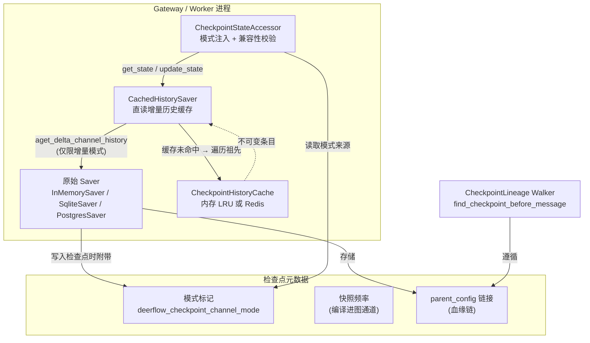
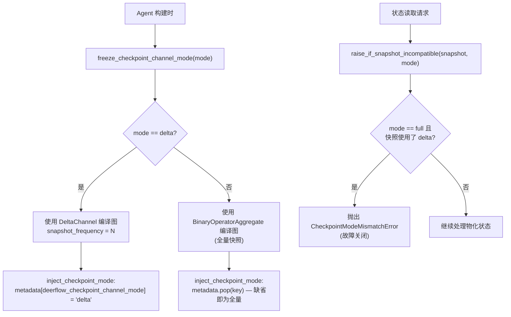

---
slug:18-checkpointing-and-state-management
blog_type:normal
---


DeerFlow 的检查点子系统是其持久化骨干，为每个对话线程提供持久、可重放且模式安全的状态历史。该子系统基于 LangGraph 的 `BaseCheckpointSaver` 协议构建，并新增了上游库未提供的三个架构层：带有故障关闭安全门的**双模式通道系统**（全量快照与增量）、用于多 Worker 部署的**直读增量历史缓存**，以及用于回滚和重放操作的**检查点血缘解析**。本文将阐述这些层级如何交互、如何选择与配置后端，以及系统如何保证跨进程边界的正确性。

## 架构概述

从宏观来看，检查点栈包含四个同心层。最内层是**原始 LangGraph saver**（InMemorySaver、SqliteSaver 或 PostgresSaver），DeerFlow 通过工厂函数对其进行实例化，以处理连接池、Schema 创建和资源清理。包裹在该 saver 外层的是可选的 **CachedHistorySaver**——一个透明装饰器，用于拦截 `get_delta_channel_history` 调用，并通过 LRU 或 Redis 缓存为其提供服务。saver 之上是 **CheckpointStateAccessor**，这是所有线程状态读写的必经瓶颈点；它负责将模式标记注入配置中，并执行兼容性校验。最后，**检查点血缘解析器**会遍历父配置链，为消息重生成等操作寻找正确的重放基准。



模式系统是决定性的架构决策。在**全量模式**下，每个检查点存储完整的通道值——整个消息列表会被序列化到每个快照中。在**增量模式**下，LangGraph 的 `DeltaChannel` 存储 sentinel blob 以及每步写入，因此每个检查点体积更小，但状态物化需要遍历祖先链。DeerFlow 将全量→增量视为受支持的单向迁移：增量模式进程能透明读取旧版全量检查点，但全量模式进程在打开增量线程时会立即抛出 `CheckpointModeMismatchError`，而不是默默物化为空或不完整的状态。

来源：[checkpoint_state.py](/backend/packages/harness/deerflow/runtime/checkpoint_state.py#L1-L15), [checkpoint_mode.py](/backend/packages/harness/deerflow/runtime/checkpoint_mode.py#L1-L10), [cached_saver.py](/backend/packages/harness/deerflow/runtime/checkpointer/cached_saver.py#L1-L17)

## 后端配置与选择

DeerFlow 在 `config.yaml` 的单个 `database` 配置段下统一了 checkpointer 和应用数据存储的配置，同时保持与旧版独立 `checkpointer` 配置段的向后兼容性。解析优先级非常明确：如果存在旧版 `checkpointer` 配置段，则优先采用；否则由统一的 `database` 配置段同时驱动 checkpointer 和存储；如果两者均未配置，则默认使用 `InMemorySaver`。

### 后端对比

| 属性 | `memory` | `sqlite` | `postgres` |
|---|---|---|---|
| **持久化** | 重启后丢失 | 本地文件（WAL 模式） | 网络数据库 |
| **并发性** | 单进程 | 单节点（WAL 多读 + 1 写） | 多节点（连接池） |
| **增量缓存后端** | 仅内存 LRU | 仅内存 LRU | 内存 LRU 或 Redis |
| **Schema 隔离** | 不适用 | 单个 `.db` 文件 | 可配置的 `postgres_schema` |
| **依赖包** | 内置 | `langgraph-checkpoint-sqlite` | `langgraph-checkpoint-postgres` |
| **同步路径 (TUI/内嵌)** | ✅ | ✅ | ✅ |
| **异步路径 (Gateway)** | ✅ | ✅ | ✅ (带保活的 AsyncConnectionPool) |

统一的配置模型意味着，单个 `database.backend` 值即可同时为 LangGraph 检查点表和 DeerFlow 应用 ORM 表（运行记录、线程元数据、用户等）选定存储方案。在 SQLite 模式下，两者共享一个开启 WAL 日志模式的 `.db` 文件，允许并发读取和单个写入且互不阻塞。在 PostgreSQL 模式下，两者使用相同的连接 URL，但维护着生命周期不同的独立连接池。

```yaml
# config.yaml — 统一的数据库配置
database:
  backend: postgres
  postgres_url: $DATABASE_URL
  postgres_schema: deerflow
  checkpoint_channel_mode: delta
  checkpoint_delta:
    snapshot_frequency: 10
  checkpoint_cache:
    type: redis
    redis_url: $REDIS_URL
    ttl_seconds: 86400
    max_entries: 128
  checkpoint_graph_cache:
    accessor_graph_max: 64
```

同步工厂（`get_checkpointer()`）维护着受线程锁保护的全进程单例，而异步工厂（`make_checkpointer()`）则是为 FastAPI lifespan 设计的上下文管理器——它在进入时打开资源，在退出时关闭资源，不保留任何全局状态。这两个工厂都委托给相同的 `_resolve_checkpointer_config` 逻辑，确保在同步（TUI、CLI）和异步（Gateway、Workers）执行路径中后端选择保持一致。

<CgxTip>`checkpoint_channel_mode` 在 Agent 构建时被**冻结到进程中**，并且在共享同一检查点数据库的每个进程间必须保持一致。更改它需要全面重启所有进程。快照频率同样是被冻结的——它被编译到每个图的通道表中，而非按检查点存储。</CgxTip>

来源：[database_config.py](/backend/packages/harness/deerflow/config/database_config.py#L1-L31), [checkpointer_config.py](/backend/packages/harness/deerflow/config/checkpointer_config.py#L1-L76), [provider.py](/backend/packages/harness/deerflow/runtime/checkpointer/provider.py#L57-L94), [async_provider.py](/backend/packages/harness/deerflow/runtime/checkpointer/async_provider.py#L187-L254)

## 双模式检查点通道

模式系统旨在解决有状态 Agent 系统中的一项核心矛盾：全量快照检查点虽然易于物化，但其体积会随对话长度线性增长；而增量检查点虽然紧凑，但重构状态需要遍历祖先链。DeerFlow 的实现让这种权衡变得明确且安全。

### 模式冻结与元数据标记

在 Agent 构建时，`freeze_checkpoint_channel_mode()` 会将模式锁定到一个进程全局变量中。在运行中的进程里尝试更改它将抛出 `CheckpointModeReconfigurationError`。随后，该模式会通过 `inject_checkpoint_mode()` 被注入到每个检查点的元数据中：增量模式检查点在其元数据中携带 `deerflow_checkpoint_channel_mode: "delta"` 标记，而全量模式检查点则完全省略该键。这种“缺省即全量”的约定意味着旧版检查点（在模式系统存在之前创建的检查点）天然兼容全量模式。



兼容性校验在**每次**状态读取时都会运行。`raise_if_snapshot_incompatible()` 会检查由 `get_state` / `get_state_history`（单次检查点获取）返回的 `StateSnapshot` 元数据，并在调用方看到可能为空或不完整的状态之前，抛出 `CheckpointModeMismatchError`。对于写入操作，`ensure_checkpoint_mode_compatible()` 会提前执行相同的检查，因为写入操作无法撤销。增量模式进程会完全跳过此校验：它们被设计为可透明读取全量和增量检查点，这使得全量→增量成为受支持的迁移方向。

### 快照频率

在增量模式下，`DeltaChannel` 每进行 N 次每步写入就会存储一次完整的消息快照（默认 N=10）。较高的值会产生较小的检查点，但代价是状态物化变慢（需要更长的祖先遍历）。此频率在构建时通过 `freeze_checkpoint_snapshot_frequency()` 被编译到图的通道表中，并且与模式本身一样，它在共享同一检查点数据库的所有进程间必须保持一致。如果出现不一致，进程会对相同的线程应用不同的频率，从而导致物化后的状态不一致。

来源：[checkpoint_mode.py](/backend/packages/harness/deerflow/runtime/checkpoint_mode.py#L1-L143), [database_config.py](/backend/packages/harness/deerflow/config/database_config.py#L59-L83)

## CheckpointStateAccessor：唯一瓶颈点

`CheckpointStateAccessor` 是 DeerFlow 应用代码读写线程检查点状态的唯一接口。它将已编译的图（携带模式匹配的通道 Schema）、一个 checkpointer 以及冻结的通道模式绑定到一个单独的 dataclass 中。每个操作——`get`、`aget`、`history`、`ahistory`、`update`、`aupdate`——都遵循相同的三步协议：通过注入模式标记准备配置，通过图执行操作，并在结果上强制执行兼容性校验。

之所以采用这种设计，是因为增量检查点不存储完整的 `channel_values`——原始 saver 读取看到的是 sentinel blob，而非物化后的数据。消费者必须通过 accessor（进而通过图的 reducer 逻辑）进行操作，而不能直接调用 checkpointer。accessor 还提供了用于内省已编译图的实用方法：`graph_writable_channels()` 返回用户可见的状态通道名称（排除 Pregel 内部通道和分支扇入通道）；`graph_reducer_channels()` 用于识别写入通过 reducer 合并的通道（包括 `BinaryOperatorAggregate` 和 `DeltaChannel`），这些通道在任何模式下进行替换式写入时都需要进行 `Overwrite` 包装。

### 状态变更图

对于全面状态替换操作——如回滚恢复和上下文压缩——DeerFlow 通过 `build_state_mutation_graph()` 构建了一个专用的**纯状态图**。该图包含一个返回空字典的无操作节点（`_finish_state_mutation`），其入口点和结束点均设为该节点。当对该图调用 `update_state(..., as_node=...)` 时，会应用 reducer 写入并生成变更检查点，但不会调度任何 Agent 节点——写入后的头部保持闲置状态，没有待处理的 `next` 节点。这对回滚至关重要：重放基准必须是线程处于静止状态时的状态，如果使用带有待处理任务的一次运行中检查点，将会重放回滚本意要替换的那一轮对话。

来源：[checkpoint_state.py](/backend/packages/harness/deerflow/runtime/checkpoint_state.py#L1-L197)

## 增量历史缓存：不可变的直读

当 `checkpoint_channel_mode` 为 `delta` 时，物化状态需要遍历祖先链，以从 sentinel blob 和每步写入中组合出每个通道的历史记录。对于长对话，这种遍历可能会成为性能瓶颈。DeerFlow 通过 `CachedHistorySaver` 解决了这个问题，这是一个包裹在任何 `BaseCheckpointSaver` 之外的透明包装器，能拦截 `aget_delta_channel_history`（及其同步对应方法）并从缓存中提供结果。

### 正确性基础：不可变条目

缓存的正确性论证非常精妙，它基于检查点血缘的一项基本属性：检查点的增量历史是其已封闭祖先链的**纯函数**。LangGraph 的契约将目标自身待处理的写入排除在历史之外；父链接在创建时即固定；且一旦子节点存在，其祖先的写入即被封闭。因此，以 `(thread, namespace, checkpoint_id, channel)` 元组为键的条目是**不可变的**——一旦写入便永不改变。无需任何失效处理，共享后端（Redis）也无需任何协调协议即可在进程间保持一致性。

### 缓存后端

| 属性 | `memory` (LRU) | `redis` |
|---|---|---|
| **作用域** | 进程本地 | 跨 Worker 共享 |
| **淘汰机制** | LRU (可配置 `max_entries`，默认 128) | TTL (可配置，默认 86400s) + 服务器 maxmemory |
| **支持同步路径** | ✅ | ❌ (在同步内嵌路径上会抛出异常) |
| **支持异步路径** | ✅ | ✅ |
| **故障行为** | 不适用 | 全部未命中旁路 (绝不影响可用性) |
| **序列化** | 无 (命中路径零拷贝) | LangGraph `serde.dumps_typed` / `loads_typed` |
| **线程清理** | 前缀扫描 + 删除 | SCAN + UNLINK (失败时降级为受 TTL 约束的保留) |

内存后端使用具有 LRU 语义和写时复制/读时复制特性的 Python `OrderedDict`，以防止修改别名。Redis 后端使用 saver 自身的 `serde` 进行类型安全的序列化，将条目存储为 `tag + NUL 分隔符 + payload` 的形式，并通过 pipeline 在单次往返中写入多个条目。Redis 故障属于**仅影响性能的旁路**：`mget` 失败被视为全部未命中，写入失败会被跳过（下次读取会重新计算），线程清理失败会降级为受 TTL 约束的残留保留。缓存绝不会向应用路径抛出异常。

### 递归组合策略

`CachedHistorySaver._aresolve()` 方法实现了一种带有深度预算（`_COMPOSE_MAX_DEPTH = 8`）的递归组合策略。当目标检查点未命中缓存时，包装器会沿着父链向上寻找“已预热”的祖先（即历史记录已缓存的祖先）。在稳态下，真实的运行会在每个超级步中创建多个检查点，但只有部分会被物化为目标，因此父节点通常是未预热的中间检查点。每经过一个中间节点递归一层，大约在 2 层内就能找到一个已预热的祖先，并且每个组合层都会被缓存，因此预热边界会随着运行不断推进。在冷链的深度 0 处，它会委托执行一次内部快速路径遍历（2 次 SQL 查询），而不是逐个元组地爬取祖先。

<CgxTip>缓存键前缀包含部署标识哈希（`checkpoint_cache_db_hash`），因此共享同一个 Redis 实例的两个部署绝不会发生冲突。对于 PostgreSQL，该哈希派生自 `host:port/database`——不含凭据——因此凭据轮换不会使缓存命名空间失效。对于 SQLite，该哈希包含文件路径。</CgxTip>

来源：[cached_saver.py](/backend/packages/harness/deerflow/runtime/checkpointer/cached_saver.py#L1-L178), [base.py](/backend/packages/harness/deerflow/runtime/checkpoint_cache/base.py#L1-L81), [redis.py](/backend/packages/harness/deerflow/runtime/checkpoint_cache/redis.py#L1-L117), [memory.py](/backend/packages/harness/deerflow/runtime/checkpoint_cache/memory.py#L1-L80), [provider.py](/backend/packages/harness/deerflow/runtime/checkpoint_cache/provider.py#L1-L102)

## 检查点血缘与重放解析

当用户重新生成消息或回滚到对话中的特定点时，系统必须找到正确的**重放基准**——即代表生成目标消息之前线程状态的检查点。这并非简单的按时间顺序查找，因为线程中可能包含同级的检查点分支（源自先前的重新生成），全局按时间排序的扫描可能会选错分支的检查点。

### 通过 `parent_config` 遍历血缘

主要解析路径 `find_checkpoint_before_message()` 会从头部检查点向后追踪 `parent_config` 链接。每一步都会读取一次祖先，遍历过程会识别出第一个其消息列表中**不**包含目标消息 ID 的检查点。几项安全检查为该遍历保驾护航：

- **环路检测**：跟踪每个已访问的检查点标识 `(thread_id, checkpoint_ns, checkpoint_id)`；若出现重复则抛出 `CheckpointLineageIntegrityError`。
- **仅时长检查点**：会跳过仅携带 `runtime_run_duration` 元数据（无对话状态）的检查点——它们不代表可寻址的对话状态。
- **待处理任务**：重放基准必须是线程处于静止状态时的状态。会跳过带有待处理 `next` 节点的检查点，因为从它们恢复会重放重新生成本意要替换的那一轮对话。仅靠消息 ID 无法检测到这一点，因为中间件可能会在产生该消息的同一次运行中重写其 ID。
- **可寻址性验证**：解析出的父节点标识必须与请求的 `parent_config` 标识匹配，以确保血缘链接完整且可安全使用。

### 按时间顺序的后备方案

对于缺少 `parent_config` 链接的旧版或导入检查点，`find_checkpoint_before_message_chronologically()` 提供了一种兼容性后备方案。它会扫描最新优先的检查点历史记录，跳过仅时长检查点，并返回出现在第一个包含目标消息的检查点之前的最后一个已落定（具有可寻址 ID 且无待处理任务）的检查点。当链接可用时，调用方必须优先选择遍历血缘，因为按时间顺序的扫描无法区分同级的检查点分支。

来源：[checkpoint_lineage.py](/backend/app/gateway/checkpoint_lineage.py#L1-L184)

## 针对 LangGraph 内部的兼容性补丁

DeerFlow 的 `checkpoint_patches.py` 模块在导入时对 LangGraph 的检查点机制应用了两个定向的 monkey-patch。这些补丁是**幂等、带防护且自文档化**的——每个补丁都包含一个版本验证探针，如果上游修复了底层问题，它们就会自动让位。

### 补丁 1：InMemorySaver 增量历史丢失

LangGraph 1.2.9 中的 `InMemorySaver.get_delta_channel_history` 用单次遍历版本覆盖了基础遍历方法，当检查点引用了从更早祖先延续下来的 blob 版本时，该版本会错误地跳过待处理写入。这恰好发生在全量→增量迁移后的第一个超级步中，此时输入写入落在了仍然引用增量前 blob 版本的检查点上——迁移后追加的第一条消息会从物化状态中消失。该补丁将 `InMemorySaver` 委托给基础的 `BaseCheckpointSaver` 实现，后者会在将其 blob 视为种子之前收集终止检查点的写入。

### 补丁 2：BinaryOperatorAggregate 覆盖首次写入

上游的 `BinaryOperatorAggregate.update` 会原封不动地使用 `values[0]` 为空通道赋值——没有应用该方法其余部分所使用的 `Overwrite` 解包。类型为 Union（例如 `SandboxState | None`、`GoalState | None`）的通道没有可构造的默认值，因此它们以 `MISSING` 状态开始；随后对新线程（分支）或从未写入的通道（状态更新）进行替换式写入，会将 `Overwrite` 包装器本身持久化到检查点中，导致下一个消费者崩溃并报错 `TypeError: 'Overwrite' object is not subscriptable`。该补丁仅拦截空通道 + 前导 Overwrite 的情况并对其进行解包，将其他所有情况交由上游实现处理。

这两个补丁均从 `deerflow.agents.thread_state` 锚定加载，因此每个构建 DeerFlow 图的进程（Gateway、Workers、进程内运行时、测试）都会在修复生效的情况下运行。

来源：[checkpoint_patches.py](/backend/packages/harness/deerflow/checkpoint_patches.py#L1-L193)

## 序列化与状态投影

DeerFlow 的序列化层（`serialization.py`）提供了单一事实来源，用于将 LangChain 消息对象、Pydantic 模型和 LangGraph 状态字典转换为可进行 JSON 序列化的结构，以供 SSE 流式传输和 REST 响应使用。核心函数 `serialize_lc_object()` 会递归遍历任何对象，尝试调用 `model_dump()`（Pydantic v2），然后调用 `dict()`（Pydantic v1），并对 LangGraph `Interrupt` 对象（一个没有 `model_dump`/`dict`/`__dict__` 的 `__slots__` 类）进行特殊处理。

对于暴露给前端的检查点状态，`serialize_channel_values()` 会剥离内部的 `__pregel_*` 键，同时刻意保留 `__interrupt__`，以便 LangGraph SDK 能够从值块中检测到中断事件。伴随函数 `strip_data_url_image_blocks()` 会从 `hide_from_ui` 消息中移除 `data:` 方案的 base64 图像载荷——这些是由 `ViewImageMiddleware` 存储的内部模型上下文，绝不能通过网络传输。支持模式感知的 `serialize()` 分发器会将 `messages` 模式元组、`values` 模式完整状态字典以及其他所有内容路由到相应的处理路径。

来源：[serialization.py](/backend/packages/harness/deerflow/runtime/serialization.py#L1-L147)

## 运行事件存储：互补的持久化

除了 LangGraph checkpointer 之外，DeerFlow 还为运行事件流维护了一个独立的 **RunEventStore**——即可显示的消息和执行轨迹，它们为前端的对话视图以及调试/审计轨迹提供支持。这并非检查点的替代品；它是一个互补的持久化层，专为基于游标分页的顺序事件检索而优化。

`RunEventStore` 接口保证线程内严格的 `seq` 单调性、基于类别的过滤（`message` 与 `trace` 事件）以及双向游标分页（`before_seq` / `after_seq`）。目前存在三种实现：`MemoryRunEventStore`（开发用）、`DbRunEventStore`（基于 SQLAlchemy ORM 的生产环境用）和 `JsonlRunEventStore`（本地/调试文件持久化用）。一个关键的持久化原语是 `put_if_absent()`，它会原子性地写入事件，除非该运行已经具有相同的事件类型——这是 Worker 崩溃后恢复终态运行凭证的机制。

来源：[base.py](/backend/packages/harness/deerflow/runtime/events/store/base.py#L1-L158)

## 配置参考

下表汇总了 `database` 配置段下所有与检查点相关的配置键：

| 键 | 类型 | 默认值 | 需要重启 | 描述 |
|---|---|---|---|---|
| `backend` | `memory` \| `sqlite` \| `postgres` | `memory` | 是 | checkpointer 和应用数据的存储后端 |
| `checkpoint_channel_mode` | `full` \| `delta` | `full` | 是 | 累积通道的检查点表示形式 |
| `checkpoint_delta.snapshot_frequency` | `int ≥ 1` | `10` | 是 | DeltaChannel 全量快照频率（每 N 次写入） |
| `checkpoint_cache.type` | `memory` \| `redis` | `memory` | 否 | 增量历史缓存后端 |
| `checkpoint_cache.max_entries` | `int ≥ 0` | `128` | 否 | LRU 容量（内存）；0 表示禁用缓存 |
| `checkpoint_cache.redis_url` | `str` | 环境变量回退 | 否 | Redis URL (环境变量: `DEER_FLOW_CHECKPOINT_CACHE_REDIS_URL` → `REDIS_URL` → `redis://localhost:6379/0`) |
| `checkpoint_cache.ttl_seconds` | `int ≥ 0` | `86400` | 否 | Redis 条目 TTL（仅作泄漏安全网）；0 表示禁用过期 |
| `checkpoint_cache.key_prefix` | `str` | 自动哈希 | 否 | 覆盖 Redis 键前缀（默认为部署标识哈希） |
| `checkpoint_graph_cache.accessor_graph_max` | `int ≥ 1` | `64` | 否 | Gateway 缓存的最大已编译 accessor 图数量 |
| `postgres_schema` | `str` | `""` | 是 | 用于检查点 + 应用表的 PostgreSQL Schema |
| `sqlite_dir` | `str` | `.deer-flow/data` | 是 | 存放统一 SQLite 文件的目录 |

来源：[database_config.py](/backend/packages/harness/deerflow/config/database_config.py#L59-L320), [checkpointer_config.py](/backend/packages/harness/deerflow/config/checkpointer_config.py#L12-L38)

## 后续步骤

- 如需了解包括长期向量存储在内的更广泛内存架构，请参阅 [Long-Term Memory Backends](17-long-term-memory-backends)。
- 如需了解检查点状态如何汇入流式事件管道，请参阅 [Stream Bridge and Event Pipeline](24-stream-bridge-and-event-pipeline)。
- 如需了解在 Docker 中配置这些后端的部署模式，请参阅 [Docker Deployment Strategies](26-docker-deployment-strategies)。
- 如需深入了解检查点操作和缓存命中率，请参阅 [Tracing and Observability](27-tracing-and-observability)。
