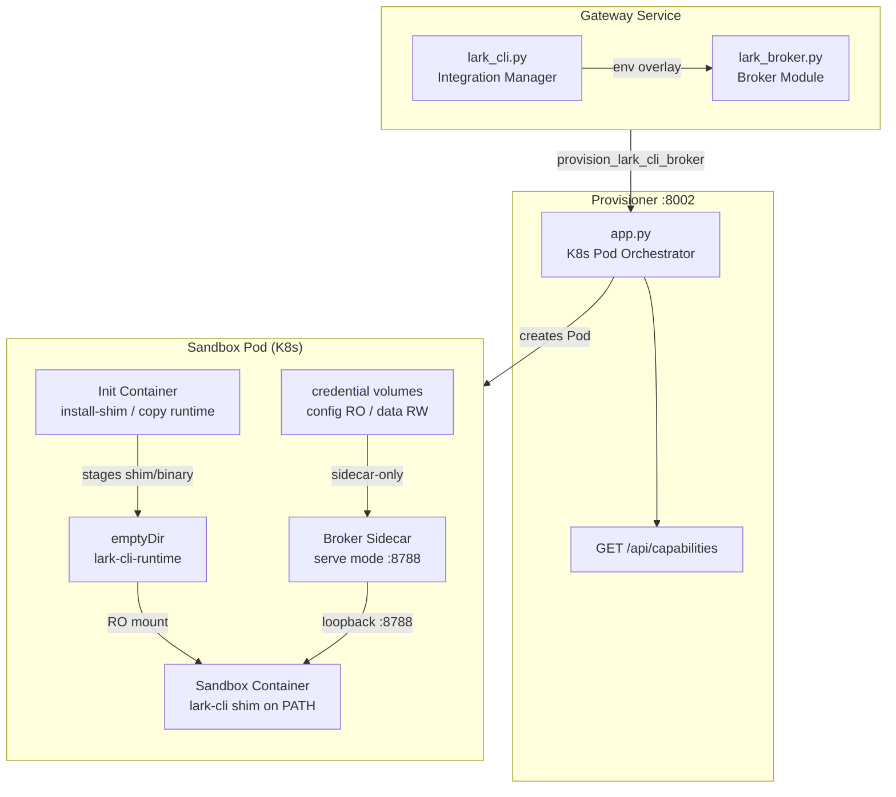
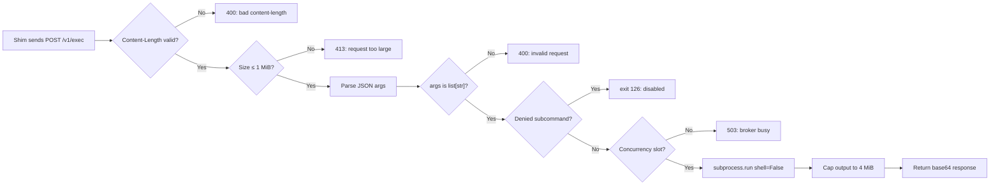
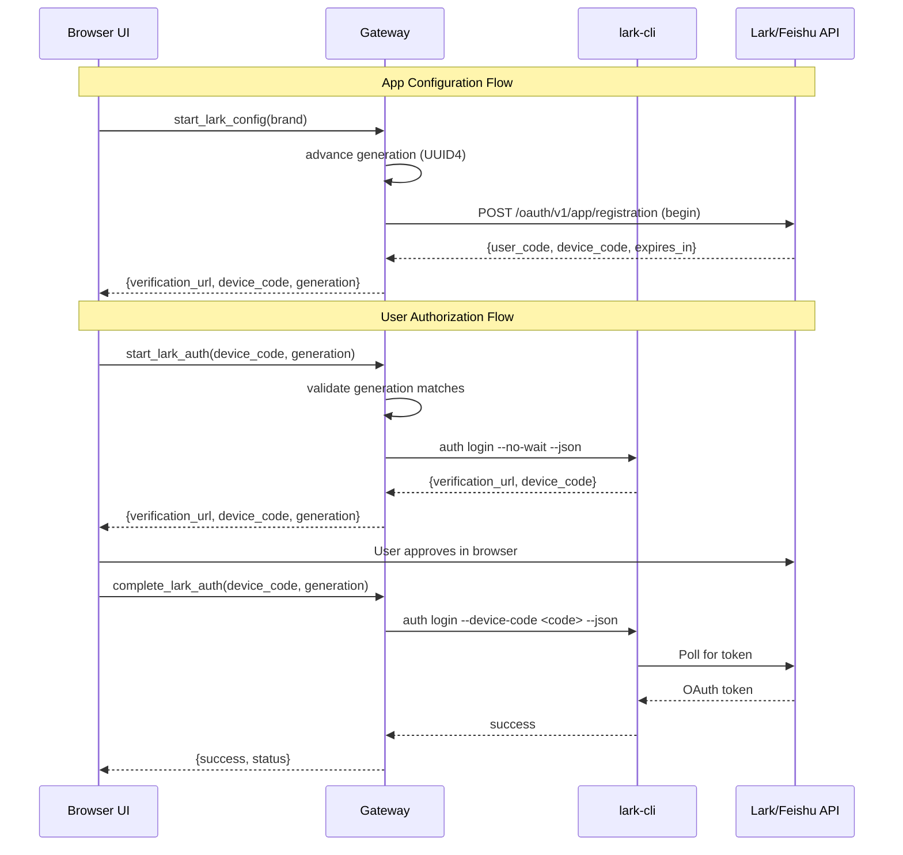
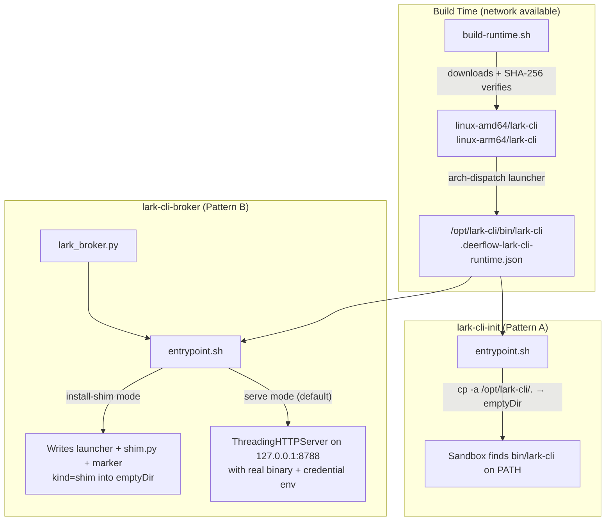

---
slug:19-im-channel-adapters
blog_type:normal
---


DeerFlow 的 IM 通道适配器将 Agent 运行时与即时通讯平台（目前为 Lark/飞书）桥接起来，使 Agent 能够通过受管理的 CLI 集成与 IM 服务进行交互。适配器层涵盖三个核心关注点：**凭证隔离**（确保明文密钥永远不会触及沙箱文件系统）、**运行时配置**（将 CLI 二进制文件暂存到沙箱容器中）以及**技能包管理**（安装供 Agent 调用的版本对齐的 Lark 技能包）。本文将探讨支配此集成的架构模式、安全模型和操作配置。

## 架构概述

Lark/飞书集成采用分层架构，其中 Gateway 负责管理凭证和技能包，Provisioner 服务负责编排 Kubernetes 沙箱 Pod，而 Docker 镜像负责暂存 CLI 运行时。两种截然不同的部署模式 —— **模式 A**（带凭证挂载的 init container）和 **模式 B**（带凭证隔离的 broker sidecar）—— 决定了 `lark-cli` 二进制文件及其凭证如何抵达沙箱。



Gateway 的 `lark_cli_env_overlay` 函数是关键的决策点：当 broker 模式处于活动状态时，它仅返回 `DEERFLOW_LARK_BROKER_URL` 和指向 shim 的 `PATH` —— 绝不返回凭证环境变量。当 broker 模式处于非活动状态（模式 A 或本地 AIO）时，它返回指向已挂载凭证目录的 `LARKSUITE_CLI_CONFIG_DIR` 和 `LARKSUITE_CLI_DATA_DIR`，这意味着沙箱容器可以读取明文的 `appSecret` 和 OAuth 令牌。

来源：[lark_broker.py](backend/packages/harness/deerflow/integrations/lark_broker.py#L1-L458), [lark_cli.py](backend/packages/harness/deerflow/integrations/lark_cli.py#L595-L630), [app.py](docker/provisioner/app.py#L1-L200)

## 安全模型：模式 A 与模式 B

这两种模式之间的根本安全区别在于沙箱执行期间**凭证的存放位置**。模式 A 将按用户划分的凭证目录（包含长效 `appSecret` 的 `config`，以及包含 OAuth 令牌的 `data`）直接挂载到沙箱容器中。模式 B 则引入了一个 broker sidecar，它同时拥有 `lark-cli` 二进制文件和凭证，仅通过回环 HTTP 端点暴露命令接口。

| 维度 | 模式 A (Init Container) | 模式 B (Broker Sidecar) |
|---|---|---|
| **凭证位置** | 挂载至沙箱文件系统 | 仅限 sidecar；绝不进入沙箱 |
| **CLI 二进制文件** | 通过 init container 暂存至 emptyDir | 由 sidecar 持有；沙箱仅获取 shim |
| **沙箱可见密钥？** | 是 — 可通过 `cat` 或数据窃取获取 | 否 — 仅可访问命令接口 |
| **Shell 注入风险** | 直接执行 `lark-cli` | `shell=False` argv 列表；无 shell 解释 |
| **相对于 cwd 的文件 I/O** | 支持（二进制文件可访问沙箱文件系统） | 不支持（sidecar 拥有独立文件系统） |
| **子命令黑名单** | 不适用 | 可通过 `DEERFLOW_LARK_BROKER_DENY_SUBCOMMANDS` 配置 |
| **并发控制** | 无 | 有界信号量（最大并发 8） |
| **请求大小限制** | 不适用 | 请求 1 MiB / 输出 4 MiB |
| **启用机制** | provisioner 上的 `LARK_CLI_INIT_IMAGE` | provisioner 上的 `LARK_CLI_BROKER_IMAGE` |
| **优先级** | 配置 broker 后被取代 | 两者均设置时优先生效 |

模式 B 是推荐的生产配置。Broker 彻底将凭证文件从沙箱中移除，但完整的 `lark-cli` 命令接口依然可达 —— 任何能打印或导出令牌的子命令仍可能将其窃取。可选的黑名单（匹配前导的非 flag 参数，因此 `config --json show` 仍会被 `config show` 规则捕获）缩小了这一攻击面。运维人员在生产环境中启用 broker 模式之前，应审计所部署的 `lark-cli` 版本的子命令接口。

<CgxTip>模式 B 的 broker 在 **sidecar 的**工作目录中运行 `lark-cli`，而非沙箱的工作目录。那些需要读写相对于沙箱 cwd 的文件的子命令（例如上传本地文件）在 broker 模式下不受支持 —— 这是一个仅限命令接口的桥接器，而非文件系统桥接器。</CgxTip>

来源：[lark_broker.py](backend/packages/harness/deerflow/integrations/lark_broker.py#L34-L55), [lark_broker.py](backend/packages/harness/deerflow/integrations/lark_broker.py#L191-L298), [broker README](docker/lark-cli-broker/README.md#L1-L118)

## Broker HTTP 契约与传输协议

Broker 暴露了一个仅绑定到回环地址（`127.0.0.1:8788`）的极简 REST API。在 Kubernetes 中，沙箱和 sidecar 共享 Pod 网络命名空间，因此 `127.0.0.1` 只能抵达 sidecar，Pod 外部无法访问。传输协议使用 base64 编码的有效载荷来传输二进制安全的 stdin/stdout/stderr。

### 端点概览

| 端点 | 方法 | 请求体 | 响应体 | 用途 |
|---|---|---|---|---|
| `/v1/exec` | POST | `{"args": [...], "stdin_b64": "..."}` | `{"exit_code", "stdout_b64", "stderr_b64", "truncated"}` | 执行 `lark-cli` 命令 |
| `/v1/health` | GET | — | `{"ok": true}` | 存活探针 |

### 请求处理流水线



Broker 自身注入凭证环境变量（`LARKSUITE_CLI_CONFIG_DIR`、`LARKSUITE_CLI_DATA_DIR`）—— 客户端无法覆盖它们。这防止了被攻破的沙箱将 `lark-cli` 指向不同的配置文件。参数以 argv 列表形式传入，且设置 `shell=False`，因此沙箱提供的参数绝不会被 shell 解释为第二条命令。

### Shim 架构

沙箱在 `bin/` 目录中看到两个文件：一个 POSIX-sh **启动器**（`lark-cli`）和一个 Python **shim 主体**（`lark-cli-shim.py`）。启动器仅使用 shell 内建命令解析 Python 3 解释器（因此即使 `PATH` 为空也能工作），并执行 shim。如果未找到 `python3`，它会以退出码 `127` 明确报错，并给出一条可操作的提示建议设置 `DEERFLOW_LARK_BROKER_PYTHON`，而不是抛出晦涩的 `ENOEXEC`。Shim 读取 argv/stdin，向 broker 发送 POST 请求，并回放 broker 的 stdout/stderr/exit code —— 任何传输失败都会导致非零退出码，因此 broker 宕机绝不会看起来像是一次成功的 `lark-cli` 运行。

来源：[lark_broker.py](backend/packages/harness/deerflow/integrations/lark_broker.py#L42-L55), [lark_broker.py](backend/packages/harness/deerflow/integrations/lark_broker.py#L123-L185), [lark_broker.py](backend/packages/harness/deerflow/integrations/lark_broker.py#L300-L382), [lark_broker.py](backend/packages/harness/deerflow/integrations/lark_broker.py#L394-L424)

## 凭证管理与授权流程

该集成管理两类凭证：**应用凭证**（`appId` + `appSecret`，长期有效）和**用户 OAuth 令牌**（按用户划分，存储在 `data/` 中）。两者均存储在 `~/.deer-flow/users/<user_id>/integrations/lark-cli/{config,data}` 下按用户划分的目录中，并具有严格的权限 —— 目录权限为 `0o700`，文件权限为 `0o600`，并且在任何 chmod 之前拒绝符号链接，以防止受损的目录树重定向写入操作。

### 凭证目录树结构

```
~/.deer-flow/users/<user_id>/integrations/lark-cli/
├── config/                 # 0o700 — app credentials
│   ├── config.json         # 0o600 — {apps: [...], currentApp: "..."}
│   └── locks/              # 0o700 — per-credential file locks
└── data/                   # 0o700 — OAuth token storage
```

### 授权流程时序

Lark 集成使用基于生成令牌的并发控制**设备授权流程**。在每次流程开始前，通过 `os.replace` 原子地写入一个 `generation` 令牌（UUID4 hex），随后的完成调用必须提供匹配的 generation，否则将收到 `LarkFlowSupersededError`。这可以防止延迟的集成流程覆盖较新操作已更改的凭证。



<CgxTip>`probe_lark_auth` 函数默认执行离线的令牌存在性检查（`auth status --json`），适用于高频轮询。仅在显式的“完成授权”步骤中才传入 `verify=True` —— 因为它每次调用都会触发与 Lark 的实时网络往返通信。</CgxTip>

来源：[lark_cli.py](backend/packages/harness/deerflow/integrations/lark_cli.py#L300-L326), [lark_cli.py](backend/packages/harness/deerflow/integrations/lark_cli.py#L497-L520), [lark_cli.py](backend/packages/harness/deerflow/integrations/lark_cli.py#L662-L728), [lark_cli.py](backend/packages/harness/deerflow/integrations/lark_cli.py#L1038-L1229)

## 技能包管理

该集成将 27 个官方 `lark-*` AI-agent 技能安装为一个全局共享、只读的受管技能目录 —— 刻意与用户自定义的技能路径分离。版本对齐至关重要：安装的技能包版本与 Gateway 运行时的 `lark-cli` 二进制文件版本（`lark-cli --version`）保持一致，确保受管技能与执行它们的服务器端 CLI 同步。

### 受管 Lark 技能

| 类别 | 技能 |
|---|---|
| **通讯** | `lark-im`, `lark-mail`, `lark-event` |
| **文档** | `lark-doc`, `lark-sheets`, `lark-slides`, `lark-wiki`, `lark-note`, `lark-markdown` |
| **数据与存储** | `lark-base`, `lark-drive` |
| **生产力** | `lark-calendar`, `lark-task`, `lark-approval`, `lark-attendance`, `lark-okr` |
| **协作** | `lark-contact`, `lark-apps`, `lark-shared` |
| **会议** | `lark-vc`, `lark-vc-agent`, `lark-minutes`, `lark-workflow-meeting-summary`, `lark-workflow-standup-report` |
| **开发** | `lark-openapi-explorer`, `lark-skill-maker` |
| **可视化** | `lark-whiteboard` |

### 完整性校验

集成并未固定每个版本归档的字节哈希（GitHub 不保证源归档在内部 git 升级时的字节稳定性），而是通过对每个归档成员的结构性防护来强制实施完整性：zip-slip 防护、符号链接拒绝、可执行二进制文件检测、大小限制、必需技能完整性校验以及 `SKILL.md` 解析验证。在注入 DeerFlow 的共享指导后，对提取的技能树计算**内容 SHA-256** 并记录在清单中，因此如果重装后的有效技能内容发生改变，将是可检测和可审计的。

来源：[lark_cli.py](backend/packages/harness/deerflow/integrations/lark_cli.py#L1-L42), [lark_cli.py](backend/packages/harness/deerflow/integrations/lark_cli.py#L139-L168), [lark_cli.py](backend/packages/harness/deerflow/integrations/lark_cli.py#L936-L984)

## 运行时配置与沙箱模式

沙箱运行时就绪解析器（`_resolve_sandbox_runtime_readiness`）根据沙箱提供者类型和 provisioner 的能力，决定应用以下四种模式中的哪一种。此解析驱动了 Settings UI 的状态信号以及每次 bash 调用时的环境覆盖选择。

### 运行时模式解析

| 模式 | 条件 | 就绪时机 | 凭证处理方式 |
|---|---|---|---|
| `none` | 非 AIO 沙箱提供者 | 永不就绪（沙箱中无 lark-cli） | 不适用 |
| `gateway-download` | 本地 AIO（无远程 provisioner） | `sandbox-cli` 目录校验通过 | 凭证目录挂载至沙箱 |
| `init-container` | 远程 provisioner，设置了 `LARK_CLI_INIT_IMAGE` | Provisioner 报告镜像已配置 | 凭证目录挂载至沙箱 |
| `broker` | 远程 provisioner，设置了 `LARK_CLI_BROKER_IMAGE` | Provisioner 报告 broker 已配置 | 凭证仅在 sidecar 中；沙箱中只有 shim |

### Broker 模式检测（热路径）

`sandbox_lark_broker_active` 函数在每次 `lark-cli` 的 bash 调用时被触发。为了避免热路径上的延迟，它使用非对称 TTL 缓存结果：肯定结果（broker 处于活动状态）每 60 秒刷新一次，而否定结果（broker 处于非活动状态）缓存 300 秒 —— 因为一个非 broker 的远程 provisioner 部署保持非 broker 状态的频率远高于被开启的频率。Provisioner 能力探针使用严格的 1.5 秒超时，因此不可达的 provisioner 不会给非 broker 部署增加数秒的延迟。

### Docker 镜像架构

两个 Docker 镜像实现了配置流水线，它们共享 `build-runtime.sh` 脚本，用于对官方 `larksuite/cli` Linux 发行版二进制文件进行经 SHA-256 校验的下载：



Broker 镜像运行在由第一个 CLI 参数分发的两种模式下：`install-shim <dest>`（init container 模式，写入 shim 后以 0 退出）和 `serve`（默认 CMD，sidecar 模式，运行 HTTP 服务器）。启动器模板和 shim 脚本均作为 `lark_broker.py` 中的进程内 Python 常量定义，确保镜像的副本永远不会与 Gateway 的副本发生偏差。

来源：[lark_cli.py](backend/packages/harness/deerflow/integrations/lark_cli.py#L731-L831), [lark_cli.py](backend/packages/harness/deerflow/integrations/lark_cli.py#L987-L1035), [lark-cli-init/Dockerfile](docker/lark-cli-init/Dockerfile#L1-L64), [lark-cli-broker/Dockerfile](docker/lark-cli-broker/Dockerfile#L1-L80), [build-runtime.sh](docker/lark-cli-init/build-runtime.sh#L1-L88)

## Provisioner 集成

Provisioner 服务（`docker/provisioner/app.py`）是创建各沙箱 Pod 的 Kubernetes 编排器。当沙箱创建请求包含 `provision_lark_cli_broker` 时，provisioner 会组装一个包含四个容器/卷的 Pod：一个在 init container 和沙箱之间共享的 `lark-cli-runtime` emptyDir，一个用于暂存 shim 的 `lark-cli-shim-init` init container，一个挂载了按用户划分的 `config`（只读）和 `data`（读写）凭证且仅挂载至该 sidecar 的 `lark-cli-broker` sidecar，以及一个接收运行时只读挂载和 `DEERFLOW_LARK_BROKER_URL` 的沙箱容器 —— 但不挂载 `config`/`data`。

### Provisioner 能力上报

Provisioner 通过 `GET /api/capabilities` 暴露其 lark-cli 配置，返回 `{"lark_cli_init_image": true|false, "lark_cli_broker_image": true|false}`。Gateway 探测此端点以确定运行时就绪状态（为 Settings 状态页设置 5 秒超时），并在 bash 热路径上选择 broker 还是二进制模式（设置 1.5 秒超时）。Gateway 在 `/api/integrations/lark/status` 中将结果显示为 `sandbox_runtime_mode: "broker"` 或 `"init-container"`。

### 环境配置

| 变量 | 作用域 | 默认值 | 用途 |
|---|---|---|---|
| `LARK_CLI_INIT_IMAGE` | Provisioner | `""` (关闭) | 模式 A init container 镜像标签 |
| `LARK_CLI_BROKER_IMAGE` | Provisioner | `""` (关闭) | 模式 B broker sidecar 镜像标签 |
| `DEERFLOW_LARK_BROKER_DENY_SUBCOMMANDS` | Broker sidecar | `""` (无) | 逗号分隔的子命令黑名单 |
| `DEERFLOW_LARK_BROKER_URL` | Sandbox | `http://127.0.0.1:8788` | Shim 用于连接 broker 的回环 URL |
| `DEERFLOW_LARK_BROKER_PYTHON` | Sandbox | (自动检测) | 为 shim 启动器固定 Python 解释器 |
| `LARK_CLI_NPM_VERSION` | Gateway Dockerfile | `1.0.65` | 固定的 lark-cli npm 版本 |
| `LARK_CLI_VERSION` | Broker/init 镜像 | `v1.0.65` | 用于二进制文件下载的上游发行版标签 |

这两种模式均为**需显式开启且默认关闭**。未发布或未配置的镜像等同于空操作 —— 系统将回退到传统的 hostPath/Gateway 下载路径，且行为无任何改变。当同时设置了 `LARK_CLI_INIT_IMAGE` 和 `LARK_CLI_BROKER_IMAGE` 时，Broker 模式优先于模式 A。

来源：[app.py](docker/provisioner/app.py#L56-L119), [docker-compose.yaml](docker/docker-compose.yaml#L151-L191), [broker README](docker/lark-cli-broker/README.md#L59-L83), [init README](docker/lark-cli-init/README.md#L47-L67)

## 延伸阅读

- 要了解沙箱容器本身是如何构建的以及代码执行如何在其中流转，请参阅 [Sandbox and File System](14-sandbox-and-file-system)。
- 有关公开集成状态并触发授权流程的 Gateway API 端点详情，请参阅 [Gateway API and Auth](23-gateway-api-and-auth)。
- 要了解 Redis 流桥接如何跨工作线程交付 SSE 事件（当 IM 通道服务按工作线程运行时相关），请参阅 [Stream Bridge and Event Pipeline](24-stream-bridge-and-event-pipeline)。
- 有关受管 Lark 技能所插入的更广泛的技能系统架构，请参阅 [Skills System](11-skills-system)。
