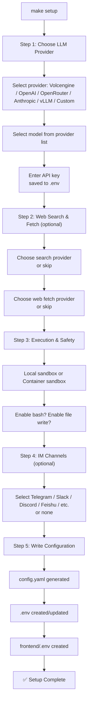
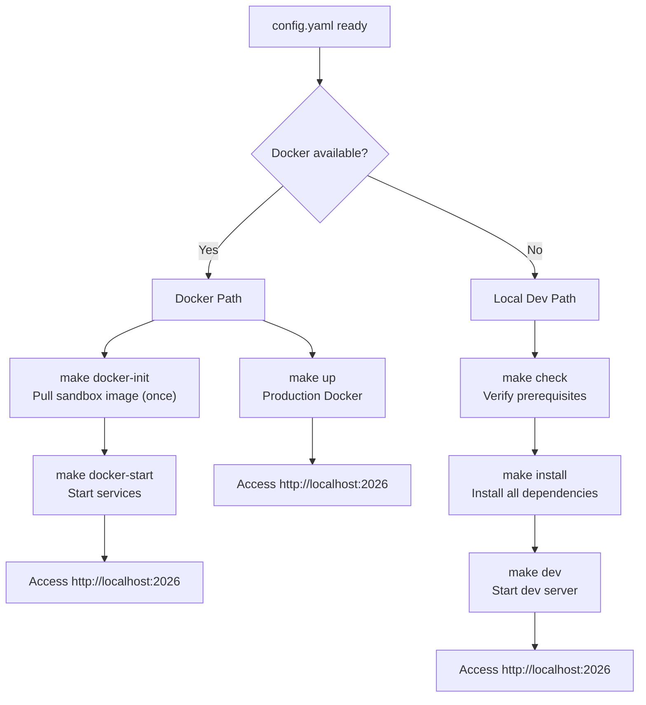
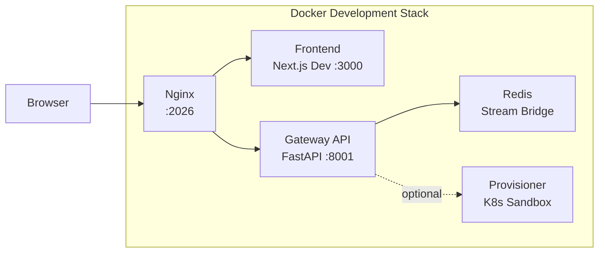
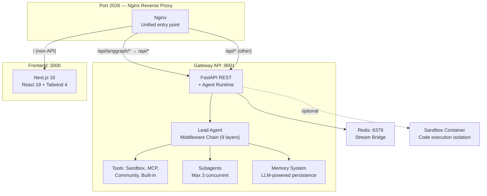

---
slug:2-quick-start
blog_type:normal
---


DeerFlow（**D**eep **E**xploration and **E**fficient **R**esearch **Flow**）是一个开源的**超级 Agent 框架**，它通过编排子 Agent、记忆和沙箱来完成几乎所有的任务——这一切均由可扩展的技能驱动。本指南将引导你完成克隆代码仓库、运行交互式设置向导、选择部署模式以及启动你的首个 Agent 会话。整个过程大约需要 5 到 10 分钟，具体耗时取决于你的网络状况以及你是选择使用 Docker 还是进行本地开发。

来源: [README.md](/README.md#L1-L17), [Install.md](/Install.md#L1-L14)

## 前置条件一览

DeerFlow 是一个全栈应用，包含 Python 后端（网关 API + Agent 运行时）和 Next.js 前端。下表汇总了在开始之前你需要安装的工具。

| 工具 | 最低版本 | 用途 | 安装链接 |
|------|----------------|---------|--------------|
| **Python** | 3.12+ | 后端 Agent 运行时、设置向导、诊断工具 | [python.org](https://www.python.org/) |
| **Node.js** | 22+ | 前端开发服务器、pnpm 生态系统 | [nodejs.org](https://nodejs.org/) |
| **pnpm** | 10.26.2+ | 前端包管理器（支持 Corepack 回退） | [pnpm.io](https://pnpm.io/) |
| **uv** | 最新版 | 用于管理后端依赖的 Python 包管理器 | [docs.astral.sh/uv](https://docs.astral.sh/uv/getting-started/installation/) |
| **nginx** | 任意版本 | 本地反向代理，将前端和 API 统一在 2026 端口 | [nginx.org](https://nginx.org/en/download.html) |
| **Docker**（可选） | 任意较新版本 | 基于容器的部署与沙箱隔离 | [docker.com](https://www.docker.com/) |

在 macOS 上，通过 `brew install nginx` 安装 nginx。在 Ubuntu 上，使用 `sudo apt install nginx`。在 Windows 上，请使用 Docker 模式或 WSL——本地基于 Bash 的服务脚本不支持原生的 `cmd.exe` 和 PowerShell。

来源: [scripts/check.py](/scripts/check.py#L79-L180), [README.md](/README.md#L311-L323), [frontend/README.md](/frontend/README.md#L13-L17)

### 部署规模规划

请根据你计划运行 DeerFlow 的方式来选择硬件配置：

| 部署目标 | 起步配置 | 推荐配置 | 备注 |
|---|---|---|---|
| 本地评估 (`make dev`) | 4 vCPU, 8 GB 内存, 20 GB SSD | 8 vCPU, 16 GB 内存 | 适用于单开发者或使用托管模型 API 的轻量会话 |
| Docker 开发 (`make docker-start`) | 4 vCPU, 8 GB 内存, 25 GB SSD | 8 vCPU, 16 GB 内存 | 镜像构建、绑定挂载和沙箱容器需要更多空间 |
| 长期运行服务器 (`make up`) | 8 vCPU, 16 GB 内存, 40 GB SSD | 16 vCPU, 32 GB 内存 | 推荐用于共享使用、多 Agent 运行和报告生成 |

如果你还在本地托管 LLM（例如通过 vLLM），请单独为该服务规划资源。对于需要持久化运行的服务器，推荐使用 Linux 加 Docker 作为部署目标。

来源: [README.md](/README.md#L230-L242)

## 第一步：克隆代码仓库

```bash
git clone https://github.com/bytedance/deer-flow.git
cd deer-flow
```

请确认你已进入正确的目录——该目录下应包含 `Makefile`、`backend/`、`frontend/` 和 `config.example.yaml`。

来源: [README.md](/README.md#L108-L113), [Install.md](/Install.md#L36-L39)

## 第二步：运行设置向导

在项目根目录下，启动交互式设置向导：

```bash
make setup
```

此命令会在后端环境中通过 `uv run` 运行 `scripts/setup_wizard.py`。向导将引导你完成**五个步骤**，并生成一个精简的 `config.yaml` 以及包含你 API 密钥的 `.env` 文件。整个过程大约需要 2 分钟。

### 向导步骤详解

以下流程图展示了向导的完整流程：



**步骤 1 — LLM 提供商：** 从内置提供商中进行选择，包括火山引擎豆包、火山引擎 Coding Plan（一个密钥通用的多云网关）、OpenAI、OpenAI Responses API、OpenRouter、Anthropic、vLLM 以及自定义的 OpenAI 兼容端点。选择提供商后，从可用列表中选取一个模型并输入你的 API 密钥。该密钥将保存在 `.env` 文件中，对应提供商的环境变量名（例如 `OPENAI_API_KEY`、`VOLCENGINE_API_KEY`）。

**步骤 2 — 网页搜索与抓取（可选）：** 配置网页搜索提供商（Tavily、DuckDuckGo 等）和网页抓取提供商（Jina AI、Crawl4AI、Firecrawl 等）。这两者均可跳过——即便没有网络访问权限，Agent 依然可以正常工作。如果搜索和抓取提供商使用相同的环境变量，向导会自动复用该密钥。

**步骤 3 — 执行与安全：** 在**本地沙箱**（速度最快，使用宿主机文件系统）和**容器沙箱**（隔离性更强，需要 Docker）之间做出选择。然后决定是否启用 Bash 命令执行和文件写入工具。向导会发出警告：本地沙箱并非安全的 Shell 隔离边界。

**步骤 4 — IM 渠道（可选）：** 选择哪些消息平台（Telegram、Slack、Discord、飞书/Lark、钉钉、微信、企业微信）应显示在 DeerFlow 的侧边栏中。凭证信息可以在稍后通过浏览器输入——此步骤仅控制哪些渠道可见。

**步骤 5 — 写入配置：** 向导将写入 `config.yaml`，使用你的 API 密钥更新 `.env`，并根据示例模板创建 `frontend/.env`。最后会打印一份摘要，说明已配置和已跳过的内容。

<CgxTip>
如果你已有 `config.yaml`，向导会检测到它并询问是否需要重新配置。回答 "no" 可保留现有设置，随后运行 `make doctor` 验证一切是否正常。
</CgxTip>

来源: [scripts/setup_wizard.py](/scripts/setup_wizard.py#L21-L167), [scripts/wizard/steps/llm.py](/scripts/wizard/steps/llm.py#L27-L91), [scripts/wizard/steps/search.py](/scripts/wizard/steps/search.py#L19-L66), [scripts/wizard/steps/execution.py](/scripts/wizard/steps/execution.py#L21-L51), [scripts/wizard/steps/channels.py](/scripts/wizard/steps/channels.py#L26-L46), [scripts/wizard/writer.py](/scripts/wizard/writer.py#L176-L200)

### 向导中可用的 LLM 提供商

| 提供商 | 显示名称 | 主要模型 | 环境变量 | 思考支持 |
|----------|-------------|------------|---------|-------------------|
| 火山引擎豆包 | Volcengine Doubao | doubao-seed-1-8-251228 | `VOLCENGINE_API_KEY` | ✓ (OpenAI 兼容) |
| 火山引擎 Coding Plan | Volcengine Coding Plan | 豆包/GLM/DeepSeek/Kimi/MiniMax (11 个模型) | `VOLCENGINE_API_KEY` | ✓ (按模型区分) |
| OpenAI | OpenAI | gpt-5, gpt-5-mini, gpt-4.1, gpt-4o | `OPENAI_API_KEY` | 可配置 |
| OpenAI Responses API | OpenAI Responses API | gpt-5, gpt-5-mini | `OPENAI_API_KEY` | 可配置 |
| OpenRouter | OpenRouter | 通过 base_url 支持多家服务商 | `OPENROUTER_API_KEY` | 提示输入 |
| Anthropic | Anthropic | Claude 模型 | `ANTHROPIC_API_KEY` | ✓ (budget_tokens) |
| vLLM | vLLM (自托管) | 自定义模型名称 | `VLLM_API_KEY` | 提示输入 |
| 自定义 OpenAI 兼容 | 任意 OpenAI 兼容 | 用户指定 | 用户指定 | 提示输入 |

来源: [scripts/wizard/providers.py](/scripts/wizard/providers.py#L116-L200)

### 手动配置替代方案

如果你希望完全掌控配置，可以运行 `make config` 来代替 `make setup`。这会将完整的 `config.example.yaml` 模板（config_version 33，共 2560 行）复制为 `config.yaml`，其中所有选项均已被注释。随后你可以直接编辑该文件，取消注释并自定义模型条目、搜索提供商、沙箱设置、数据库后端、链路追踪等配置。

```bash
make config   # 复制完整模板 — 手动编辑 config.yaml
```

可以在项目根目录的 `.env` 文件中设置关键环境变量：

```bash
OPENAI_API_KEY=your-openai-api-key
TAVILY_API_KEY=your-tavily-api-key
```

来源: [README.md](/README.md#L139-L145), [config.example.yaml](/config.example.yaml#L1-L18), [scripts/configure.py](/scripts/configure.py)

## 第三步：验证你的设置

向导运行完毕后，运行诊断工具以验证你的配置：

```bash
make doctor
```

诊断工具会检查 Python 版本、Node.js、pnpm、uv、nginx、config.yaml 的有效性、模型配置、环境变量引用以及可选组件。它会打印一份带颜色标记的报告，并为发现的任何问题提供可操作的修复提示。退出码 `0` 表示所有必要检查均已通过；`1` 则表示存在一个或多个失败项。

在提交 GitHub Issue 时，请使用 `make support-bundle` 命令——它会生成一份脱敏的诊断摘要、一份 AI 辅助的 Issue 草稿，以及一个可选的证据压缩包。该打包文件会排除 `.env`、原始对话消息和用户文件内容。

来源: [scripts/doctor.py](/scripts/doctor.py#L1-L10), [README.md](/README.md#L127-L138), [Makefile](/Makefile#L56-L62)

## 第四步：选择你的部署路径

DeerFlow 支持两种主要部署路径。下图展示了完整的启动决策流程：



### 选项 1：Docker（推荐）

Docker 模式是启动 DeerFlow 实例的最快途径。它会在容器内处理所有依赖，并同时支持开发（热重载）和生产模式。



**开发模式**（热重载，源码挂载）：

```bash
make docker-init    # 拉取沙箱镜像（仅在首次或镜像更新时执行）
make docker-start   # 启动服务（根据 config.yaml 自动检测沙箱模式）
make docker-logs    # 查看日志
```

`make docker-start` 会根据 `config.yaml` 自动检测你的沙箱模式，并且仅在配置了 provisioner 模式时才启动 `provisioner` 服务。对于网络受限的环境，你可以配置更快的镜像源：

```bash
export UV_INDEX_URL=https://pypi.tuna.tsinghua.edu.cn/simple
export NPM_REGISTRY=https://registry.npmmirror.com
```

**生产模式**（本地构建镜像，运行时已优化）：

```bash
make up     # 构建镜像并启动所有生产服务
make down   # 停止并移除容器
```

<CgxTip>
在 Linux 上，如果 Docker 命令因 `permission denied` 失败，请将你的用户添加到 `docker` 组并重新登录：`sudo usermod -aG docker $USER`。详情请参阅 CONTRIBUTING.md。
</CgxTip>

来源: [README.md](/README.md#L244-L309), [scripts/docker.sh](/scripts/docker.sh#L113-L200), [docker/docker-compose-dev.yaml](/docker/docker-compose-dev.yaml#L1-L14), [docker/docker-compose.yaml](/docker/docker-compose.yaml#L1-L25)

### 选项 2：本地开发

如果你倾向于在机器上原生运行服务（应用本身不需要 Docker，但基于容器的沙箱仍需使用 Docker）：

```bash
# 1. 检查前置条件
make check    # 验证 Node.js 22+, pnpm, uv, nginx

# 2. 安装所有依赖
make install  # 后端 + 前端 + pre-commit 钩子

# 3. （可选）为容器沙箱模式预先拉取沙箱镜像
make setup-sandbox

# 4. 启动服务
make dev

# 5. 访问应用
# 在浏览器中打开 http://localhost:2026
```

`make install` 命令会依次执行三项操作：在后端目录执行 `uv sync`，在前端目录执行 `pnpm install`，以及为 Git 钩子执行 `pre-commit install`。在 Windows 上，请在 **Git Bash** 中运行这些步骤——不支持原生的 `cmd.exe` 和 PowerShell。

来源: [README.md](/README.md#L311-L348), [Makefile](/Makefile#L77-L97), [scripts/check.py](/scripts/check.py#L79-L180)

### 启动模式参考

DeerFlow 提供了四种启动模式，将开发/生产与前台/守护进程相结合：

| | **本地前台** | **本地守护进程** | **Docker 开发** | **Docker 生产** |
|---|---|---|---|---|
| **开发** | `make dev` | `make dev-daemon` | `make docker-start` | — |
| **生产** | `make start` | `make start-daemon` | — | `make up` |

| 操作 | 本地 | Docker 开发 | Docker 生产 |
|---|---|---|---|
| **停止** | `make stop` | `make docker-stop` | `make down` |
| **重启** | `./scripts/serve.sh --restart [flags]` | `./scripts/docker.sh restart` | — |
| **日志** | 查看终端或 `logs/` | `make docker-logs` | `docker logs` |

来源: [README.md](/README.md#L350-L363), [Makefile](/Makefile#L103-L177)

## 架构一览

当你运行 `make dev` 或 `make docker-start` 时，DeerFlow 会启动一个三层架构，并通过 2026 端口上的单个 nginx 反向代理统一管理：



**请求路由**（通过 Nginx）：`/api/langgraph/*` 路径会被重写为 `/api/*`，并路由到网关的 LangGraph 兼容 API，用于 Agent 交互、线程管理和流式传输。其他 `/api/*` 路由会发送至网关，用于处理模型、MCP、技能、记忆和制品管理。所有非 API 流量均由 Next.js 前端提供服务。

网关在进程内托管了 Agent 运行时——Lead Agent 结合了动态模型选择、9 层中间件链、工具生态系统（沙箱、MCP、社区、内置）、子 Agent 委派以及记忆注入。后端进程会在下次访问配置时自动应用 `config.yaml` 的更改，因此在开发过程中更新模型元数据无需手动重启。

来源: [backend/README.md](/backend/README.md#L9-L37), [README.md](/README.md#L263-L267)

## 配置文件概述

设置向导会生成一个精简的 `config.yaml`。对于高级用例，完整模板（`config.example.yaml`，config_version 33）涵盖了以下顶级部分：

| 部分 | 用途 | 是否必需？ |
|---------|---------|-----------|
| `config_version` | 用于检测升级的架构版本 | 是（自动生成） |
| `log_level` | 日志详细程度（debug/info/warning/error） | 是（默认：info） |
| `models` | LLM 模型定义，包含提供商、密钥、能力 | **是 — 至少需要一个模型** |
| `tools` | Agent 工具注册表（搜索、沙箱、文件操作） | 由向导自动生成 |
| `sandbox` | 执行隔离提供商（本地或容器） | 由向导自动生成 |
| `database` | 用于 checkpointer 和 store 的持久化后端 | 可选（默认：基于文件） |
| `channel_connections` | 启用 IM 渠道（Telegram、Slack 等） | 可选 |
| `token_budget` | 单次运行的令牌限制，防止成本失控 | 可选（默认禁用） |
| `token_usage` | 令牌使用量收集与展示 | 可选（默认启用） |
| `max_recursion_limit` | Agent 递归深度的上限 | 可选（默认：1000） |

所有字段值均支持使用 `$VAR_NAME` 语法引用环境变量。配置文件路径默认为项目根目录下的 `config.yaml`，但可以通过 `DEER_FLOW_CONFIG_PATH` 覆盖。运行时状态默认存储在项目根目录下的 `.deer-flow/` 中，可通过 `DEER_FLOW_HOME` 覆盖。

来源: [config.example.yaml](/config.example.yaml#L1-L91), [README.md](/README.md#L315-L316), [scripts/wizard/writer.py](/scripts/wizard/writer.py#L176-L200)

## 项目结构

```
deer-flow/
├── Makefile                    # 统一的开发命令（setup, dev, docker 等）
├── config.example.yaml         # 完整配置模板（2560 行）
├── config.yaml                 # 你的配置文件（由 `make setup` 生成）
├── .env                        # API 密钥（由向导生成）
├── Install.md                  # Agent 可读的引导说明
│
├── backend/                    # Python 后端 — 网关 API + Agent 运行时
│   ├── app/                    # FastAPI 应用、网关、Agent 逻辑
│   ├── packages/               # 内部 Python 包
│   ├── pyproject.toml          # 后端依赖（由 uv 管理）
│   ├── langgraph.json          # LangGraph Studio 集成配置
│   └── Dockerfile              # 后端容器镜像
│
├── frontend/                   # Next.js 16 前端
│   ├── src/                    # App Router 页面、组件、核心逻辑
│   ├── package.json            # 前端依赖（由 pnpm 管理）
│   ├── Dockerfile              # 前端容器镜像
│   └── .env                    # 前端环境变量（由向导生成）
│
├── docker/                     # Docker Compose 配置
│   ├── docker-compose-dev.yaml # 开发环境（热重载）
│   ├── docker-compose.yaml     # 生产环境
│   ├── nginx/                  # Nginx 配置模板
│   └── dev-entrypoint.sh       # 容器启动脚本
│
├── scripts/                    # 自动化与工具脚本
│   ├── setup_wizard.py         # 交互式设置向导（`make setup`）
│   ├── doctor.py               # 健康诊断（`make doctor`）
│   ├── check.py                # 前置条件检查器（`make check`）
│   ├── serve.sh                # 本地服务启动器（`make dev/start`）
│   ├── docker.sh               # Docker 服务管理器（`make docker-*`）
│   ├── deploy.sh               # 生产 Docker 部署器（`make up`）
│   └── wizard/                 # 设置向导模块（LLM、搜索、执行、渠道）
│
├── skills/                     # 技能定义（公开 + 自定义）
└── docs/                       # 额外文档
```

来源: [README.md](/README.md#L48-L93), [backend/README.md](/backend/README.md#L1-L5), [frontend/README.md](/frontend/README.md#L1-L9), [Makefile](/Makefile#L1-L53)

## 常见问题排查

| 问题 | 可能原因 | 解决方案 |
|---------|-------------|-----|
| `make setup` 提示 "Non-interactive environment" | 在管道或非 TTY 环境中运行 | 请在支持 TTY 的终端中直接运行 |
| `make check` 报告缺少 `uv` | uv 未安装或不在 PATH 中 | 安装命令：`curl -LsSf https://astral.sh/uv/install.sh \| sh` |
| `make check` 报告缺少 `nginx` | nginx 未安装 | macOS: `brew install nginx` · Ubuntu: `sudo apt install nginx` |
| `make docker-start` 因权限不足失败 | Docker 守护进程 Socket 权限问题 | 执行 `sudo usermod -aG docker $USER` 后重新登录 |
| Agent 返回缺少模型的错误 | `config.yaml` 中未配置模型 | 在 config.yaml 的 `models:` 下添加至少一个条目 |
| `.env` 引用了未解析的 `$OPENAI_API_KEY` | 环境变量未设置 | 在项目根目录的 `.env` 文件中填入真实值 |
| 2026 端口已被占用 | 之前的 DeerFlow 实例仍在运行 | 运行 `make stop`（本地）或 `make docker-stop`（Docker） |
| 修改配置后前端未加载 | 浏览器缓存了旧版本构建 | 强制刷新（Ctrl+Shift+R）或使用 `make dev` 重启 |

来源: [scripts/check.py](/scripts/check.py#L88-L158), [scripts/setup_wizard.py](/scripts/setup_wizard.py#L22-L28), [README.md](/README.md#L277-L278), [Install.md](/Install.md#L48-L55)

## 单行 Agent 设置（面向编程 Agent）

如果你使用 Claude Code、Codex、Cursor、Windsurf 或其他编程 Agent，你可以将整个设置过程委托给它：

```text
Help me clone DeerFlow if needed, then bootstrap it for local development by following https://raw.githubusercontent.com/bytedance/deer-flow/main/Install.md
```

这个提示词会指示 Agent 克隆代码仓库，在条件允许时优先使用 Docker，运行 `make docker-init` 或 `make check` + `make install`，并在需要用户提供缺失配置时停下，同时给出下一步的确切命令。`Install.md` 文件包含幂等且安全的操作规则：未经批准不使用 `sudo`，不覆盖现有配置，并在失败时停止同时提供可操作的下一步指引。

来源: [README.md](/README.md#L94-L102), [Install.md](/Install.md#L1-L88)

## 后续步骤

现在 DeerFlow 已在 `http://localhost:2026` 成功运行，以下是我们推荐的后续阅读路径：

1. **[配置与设置向导](3-configuration-and-setup-warker)** — 深入了解完整的 `config.yaml` 架构、模型配置模式（OpenAI 兼容、vLLM、CLI 支持的提供商）、沙箱模式以及配置升级工作流。

2. **[架构概览](7-architecture-overview)** — 理解 Lead Agent 设计、中间件管道、子 Agent 执行引擎，以及网关 API 如何统筹全局。

3. **[模型提供商集成](15-model-provider-integration)** — 配置多个提供商、定价区块、思考/推理开关，以及像 OpenRouter 这样的 OpenAI 兼容网关。

4. **[沙箱与文件系统](14-sandbox-and-file-system)** — 了解本地与容器沙箱模式、虚拟路径转换以及文件写入安全机制。

5. **[Docker 部署策略](26-docker-deployment-strategies)** — 生产级 Docker 部署、多进程配置、Redis 流桥接及安全加固。
