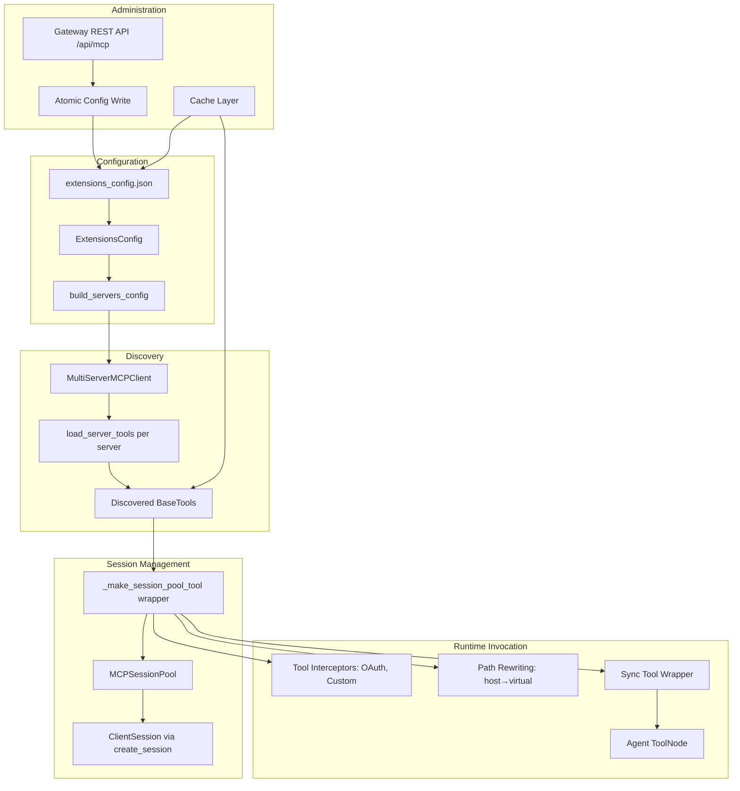
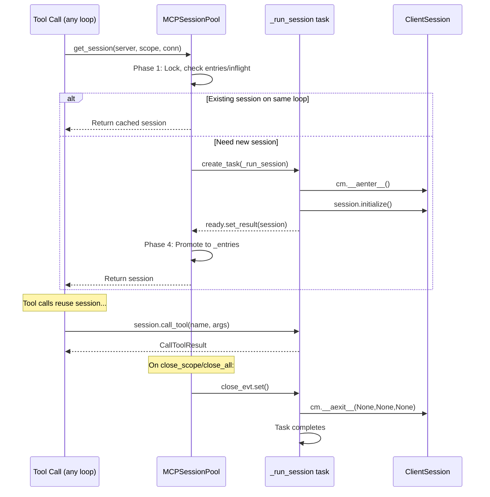

---
slug:20-mcp-server-and-tool-bridge
blog_type:normal
---

DeerFlow 的 MCP (Model Context Protocol) 集成是 Agent 运行时与外部工具服务器之间的桥梁——这些服务器可以是 Playwright 浏览器自动化服务器，也可以是作为 MCP 工具暴露的自定义内部 API。该子系统负责处理传输协商、持久化会话管理、OAuth 令牌注入、文件系统路径转换、工具发现缓存，以及用于运行时配置的 REST API——同时在不同用户和线程之间维持严格的隔离边界。接下来，我们将从配置解析到工具调用，深入剖析这座桥梁各层的架构设计。

## 架构概述

MCP 桥梁由五个功能层组成：**配置层**（将扩展配置解析为服务器连接参数）、**发现层**（通过 `langchain-mcp-adapters` 从 MCP 服务器加载工具）、**会话管理层**（为有状态服务器池化持久化会话）、**运行时调用层**（通过拦截器、路径重写和同步兼容性包装工具），以及**管理层**（提供带有安全验证的 Gateway REST API，用于实时配置）。每一层都被设计为可独立故障——单个损坏的 MCP 服务器绝不会阻碍其他服务器提供工具。

来源：[__init__.py](backend/packages/harness/deerflow/mcp/__init__.py#L1-L19), [tools.py](backend/packages/harness/deerflow/mcp/tools.py#L610-L700), [mcp.py](backend/app/gateway/routers/mcp.py#L1-L30)

## 配置与传输解析

MCP 服务器定义存放在由 `ExtensionsConfig` 类管理的扩展配置文件（`extensions_config.json`）中。每个服务器条目指定了传输类型、连接参数、可选的 OAuth 配置、路由提示以及针对特定工具的覆盖配置。`client.py` 中的 `build_server_params` 函数负责将单个 `McpServerConfig` 转换为 `langchain-mcp-adapters` 的 `MultiServerMCPClient` 所期望的字典格式，并在边界处强制执行特定于传输的要求。

系统支持三种传输类型：`stdio`（通过 stdin/stdout 通信的子进程）、`sse`（基于 HTTP 的 Server-Sent Events）和 `http`（可流式传输的 HTTP）。每种类型都有不同的参数要求：stdio 需要 `command` 以及可选的 `args`/`env`，而 SSE 和 HTTP 需要 `url` 以及可选的 `headers`。如果遇到不支持的传输类型，系统会立即抛出异常，以防止配置错误的服务器在后续的发现阶段中悄无声息地失败。`build_servers_config` 函数会遍历所有已启用的服务器，并捕获单个服务器的故障，从而确保一条不良配置不会影响其他服务器。

| 传输类型 | 必填字段 | 可选字段 | 会话池化 | 使用场景 |
|-----------|-----------------|-----------------|------------------|----------|
| `stdio` | `command` | `args`, `env` | ✅ 是 | 本地子进程服务器 (npx, uvx) |
| `sse` | `url` | `headers` | ❌ 否 | 基于远程 SSE 的 MCP 服务器 |
| `http` | `url` | `headers` | ❌ 否 | 基于远程 HTTP 的 MCP 服务器 |

HTTP/SSE 传输被刻意排除在会话池化之外。这些传输在内部使用了 anyio `TaskGroup`，其强制要求取消作用域必须由进入它的同一个任务退出——跨调用池化它们会在清理时引发 `RuntimeError`（已在 issue #3203 中追踪记录）。

来源：[client.py](backend/packages/harness/deerflow/mcp/client.py#L1-L69), [tools.py](backend/packages/harness/deerflow/mcp/tools.py#L690-L720)

## 具备故障隔离的工具发现

`get_mcp_tools` 函数负责编排完整的发现管道。它从磁盘读取最新配置（而非从缓存的单例中读取），构建服务器配置映射，注入用于连接时身份验证的初始 OAuth 标头，组装工具拦截器，然后通过 `asyncio.gather` 并发调度所有服务器的工具发现任务。这种并发调度至关重要：每个服务器的 `load_server_tools` 都独立运行，因此缓慢或损坏的服务器无法阻塞健康的服务器。

每个服务器都有其专属的 `session_init_timeout`——这是子进程生成、MCP `initialize()` 握手及 `tools/list` 调用的单服务器截止时间。当服务器超时，系统会发出警告并跳过该服务器，而不是无休止地阻塞 Agent 的构建过程。该超时时间由 `_resolve_session_init_timeout` 解析，对于无效值将应用默认值（`DEFAULT_MCP_SESSION_INIT_TIMEOUT`），同时尊重显式设置为 `None` 以选择退出的行为。在发现过程中进行取消操作是安全的：适配器的嵌套异步上下文管理器会干净地展开，而 `stdio_client` 的 `finally` 代码块会关闭 stdin，等待其优雅退出，随后在 POSIX 系统上依次升级至 `SIGTERM`→`SIGKILL`，确保不会累积产生孤儿进程。

来自外部服务器的工具名称会根据严格的字符集（`[A-Za-z0-9_-]+`）进行校验。这是一道安全边界：延迟加载的 MCP 工具（通过 `tool_search` 加载的那些）由于在调用时未绑定，永远不会通过模型提供商的函数名校验——它们仅存在于系统提示词字符串中。如果工具名称被恶意伪造，包含换行符、Markdown 或尖括号，就有可能篡改框架的提示词结构。在加载边界处进行名称规范化，可将已绑定和延迟加载的名称统一限制在相同的安全标识符字符集内。

<CgxTip>
发现管道使用基于来源分组的工具路由，而非基于名称前缀的推断。`asyncio.gather` 结果中来自服务器 `i` 的工具会归属于 `servers_config` 中的第 `i` 个服务器，而不是通过扫描前缀匹配来归属。这可以防止 `web_scraper` 的工具因为 `"web_scraper_search".startswith("web_")` 错误地优先匹配到 `web` 服务器，而被错误地归入其下。
</CgxTip>

来源：[tools.py](backend/packages/harness/deerflow/mcp/tools.py#L610-L799), [mcp_metadata.py](backend/packages/harness/deerflow/tools/mcp_metadata.py#L1-L53)

## 持久化会话池架构

有状态的 MCP 服务器（尤其是用于浏览器自动化的 Playwright）需要会话连续性——每次工具调用都必须复用同一个 MCP 会话，以保留浏览器状态（已打开的页面、已填写的表单、Cookie 等）。`MCPSessionPool` 通过维护以 `(server_name, scope_key)` 为作用域的持久化 `ClientSession` 实例解决了这一问题，其中 `scope_key` 为 `"{user_id}:{thread_id}"`。这种双重作用域键至关重要：文件系统隔离是按 `(user_id, thread_id)` 划分的，如果仅按 `thread_id` 划分作用域，可能会导致两个具有相同 `thread_id` 的用户共享同一个有状态的 MCP 会话。

会话池的生命周期模型解决了一个微妙的并发约束问题。MCP 的 `ClientSession` 构建于 `anyio` 任务组之上，其强制要求取消作用域必须由进入它的**同一个任务**退出。同步工具调用路径（`make_sync_tool_wrapper`）在全新的 OS 线程上通过全新的 `asyncio.run` 事件循环来驱动每次调用，因此，如果在响应某次调用时进入了会话，可能会在响应另一次调用时被从另一个不同的任务中退出——从而导致崩溃并抛出 `RuntimeError: Attempted to exit cancel scope in a different task`。

为了杜绝这种情况，每个池化会话都由一个专属的 `_run_session` 任务所拥有。该任务进入会话上下文管理器，对其进行初始化，通过 `ready` future 发布活跃会话，然后**阻塞**等待一个关闭事件。所有的关闭路径都仅仅是**通知（signal）**该事件；由所属任务自身执行 `__aexit__`，以此保证进入和退出始终发生在同一个任务中。

该会话池在 `threading.Lock`（而非 `asyncio.Lock`，因为调用者可能处于不同的事件循环中）的保护下使用四阶段并发协议：**阶段 1** 原子性地检查注册表并决定三种结果之一——返回现有会话、加入正在进行的创建过程，或成为创建者；**阶段 2** 关闭被淘汰的会话，并通过 `call_soon_threadsafe` 将关闭信号路由至其所属循环；**阶段 3** 等待所属任务发布已初始化的会话；**阶段 4** 将正在进行的创建提升为已注册条目。如果在创建会话期间会话池被关闭（并发的 `close_all` 或 `close_scope`），该会话将被直接销毁，而非恢复使用。

当会话池达到 `MAX_SESSIONS`（256）时，会触发 LRU（最近最少使用）淘汰机制。被淘汰的会话将通过其所属任务进行关闭——同循环的所属任务被直接 await，跨循环的所属任务通过 `run_coroutine_threadsafe` 路由，而正在进行的创建将被取消（因为 `close_evt` 无法唤醒阻塞在 `initialize()` 内部的任务）。`SESSION_CLOSE_TIMEOUT` 设为 5 秒，用于限制跨循环的销毁时间。

来源：[session_pool.py](backend/packages/harness/deerflow/mcp/session_pool.py#L1-L461)

## 工具调用管道

`_make_session_pool_tool` 函数将每个已发现的 MCP 工具封装为 `StructuredTool`，用池化管理的会话替代每次调用时的临时会话创建。该封装器的 `call_with_persistent_session` 协程在每次调用时执行多阶段管道处理：

**阶段 1 —— 工作空间准备（仅限 stdio）：** 在获取会话之前，通过 `_prepare_stdio_workspace` 准备线程的工作空间，这包括创建线程的沙盒目录、设置专属的临时目录（权限为 0700 的 `.mcp/tmp`），并获取调用前的文件快照。该快照以递归方式遍历工作空间根目录，记录每个常规文件的 `(mtime_ns, size)`——它使得系统能够在调用后，将纯文本中的裸文件名与工具实际创建的文件关联起来。

**阶段 2 —— 获取会话：** 通过 `pool.get_session` 并结合用户作用域键来获取池化会话。对于 stdio 传输，会话的 `cwd` 被锁定到线程的沙盒工作目录，并通过 `TMPDIR`/`TMP`/`TEMP` 环境变量覆盖进程的临时目录。这确保了 Playwright 的 `browser_take_screenshot` 等工具生成的文件能够准确落入挂载的用户数据目录树中，以便沙盒/制品 API 可以提供这些文件——而不是存放到无法访问的主机临时路径上。获取过程受 `session_init_timeout` 约束，防止无响应的服务器阻塞对话轮次。

**阶段 3 —— 拦截器链：** 工具拦截器（OAuth、自定义拦截器）作为中间件链被应用。每个拦截器接收一个 `MCPToolCallRequest` 和一个 `handler`，可以检查/修改请求，并委派给下一个 handler。基础 handler 使用原始工具名（已去除前缀）调用 `session.call_tool`，并通过 MCP 的 `call_meta` 转发任何由拦截器注入的标头。自定义拦截器通过点分路径解析（`"pkg.module:builder_func"`）从 `extensions_config.json` 加载，无需修改代码即可实现第三方请求转换。

**阶段 4 —— 结果转换与路径重写：** `_convert_call_tool_result` 函数将 MCP 内容块（`TextContent`、`ImageContent`、`ResourceLink`、`EmbeddedResource`）转换为 LangChain 内容块。在转换期间，本地文件引用会从主机路径重写为虚拟路径（`/mnt/user-data/...`）。针对不同服务器的行为，系统采用三种重写策略：直接解析 `ResourceLink` URI；通过正则表达式匹配并解析自由文本中的路径引用；对于文本中的裸文件名，将其与调用后的文件快照差异进行关联，仅在能够唯一映射到一个已创建文件时才进行重写。每一次重写都保持保守原则——如果某个路径未能解析为线程用户数据目录树中实际存在的文件，则保持原样不作改动。

| 重写策略 | 触发条件 | 安全机制 |
|------------------|---------|-----------------|
| `ResourceLink` URI | 结构化的 MCP 响应块 | 仅当文件存在于线程的用户数据目录树中时才重写 |
| 自由文本路径正则 | 匹配路径模式的文本内容 | 针对每个 Token 进行 `_local_uri_to_virtual_path` 校验 |
| 裸文件名关联 | 文本内容 + 变更文件快照 | 仅在唯一 1:1 匹配时重写 |

来源：[tools.py](backend/packages/harness/deerflow/mcp/tools.py#L400-L600), [tools.py](backend/packages/harness/deerflow/mcp/tools.py#L200-L400)

## OAuth 令牌管理

通过 HTTP/SSE 访问的 MCP 服务器通常需要 OAuth 身份验证。`OAuthTokenManager` 负责处理完整的令牌生命周期：获取、缓存、刷新和轮换。它支持两种授权类型——`client_credentials`（使用客户端 ID/密钥进行服务器间通信）和 `refresh_token`（自动轮换返回的刷新令牌，这对于 Auth0、Okta 和 Google 等会在使用后使刷新令牌失效的提供商至关重要）。

令牌管理器为每个服务器使用 `threading.Lock` 而非 `asyncio.Lock`——这是基于同步工具调用路径的深思熟虑的选择。当工具被同步调用时（TUI/嵌入式模式），`make_sync_tool_wrapper` 会在全新的 OS 线程上为每次并发调用创建一个全新的 `asyncio.run` 循环。`asyncio.Lock` 会绑定到最先与其发生竞争的循环；第二个调用者在跨循环释放锁时，要么会悄无声息地死锁，要么会抛出 "bound to a different event loop" 异常。而 `threading.Lock` 没有循环亲和性，这使得它在任意数量的事件循环和线程间都是安全的。

令牌刷新是主动的：`_is_expiring` 会检查令牌是否在 `refresh_skew_seconds`（默认为 60 秒）内过期，并在到期前触发刷新。锁的获取过程本身免受取消操作的影响——一旦 `lock.acquire()` 在执行线程上开始，便无法中断，因此被取消的调用者必须等待获取完成然后立即释放锁，从而防止发生永久性的锁泄漏。

<CgxTip>
OAuth 标头在两个不同的节点注入：初始标头在工具发现之前注入到服务器连接配置中（从而确保 `initialize()` 和 `tools/list` 调用通过身份验证），工具拦截器则在后续每次 `call_tool` 调用时注入最新的标头。这种两阶段方法确保了发现阶段和运行时调用都能携带有效的令牌。
</CgxTip>

来源：[oauth.py](backend/packages/harness/deerflow/mcp/oauth.py#L1-L217), [tools.py](backend/packages/harness/deerflow/mcp/tools.py#L630-L660)

## 工具缓存与配置热重载

`cache.py` 模块为 MCP 工具提供了模块级缓存，以避免在每次构建 Agent 时重复进行发现。`initialize_mcp_tools` 在应用启动时在 `asyncio.Lock` 的保护下运行一次，将结果存储在 `_mcp_tools_cache` 中，并记录配置文件的内容签名。`get_cached_mcp_tools` 为未执行启动初始化的上下文（例如 LangGraph Studio）提供延迟初始化，并通过委派给 `ThreadPoolExecutor` 来处理事件循环已在运行的情况。

缓存失效策略基于内容而非时间。`_is_cache_stale` 将当前配置文件的 `(mtime, size, sha256)` 签名与初始化时记录的签名进行比较。这能够捕获同秒内的编辑、向后的 mtime 变动（常见于 `git checkout`、`cp -p`、对象存储挂载及 `rsync` 操作）以及配置文件路径切换——所有这些情况都是简单的 mtime `>` 比较无法捕捉的。当检测到缓存过期时，`reset_mcp_tools_cache` 会清除缓存并关闭所有持久的 MCP 会话，从而强制在下一次调用 `get_cached_mcp_tools` 时进行完整的重新发现。

缓存被刻意设计为软失败：如果在初始化后配置文件变得不可读（如运行中被删除、Docker 挂载异常），过期检查将返回 `False` 而非引发崩溃，且缓存会继续提供其最后已知的有效 MCP 工具。这是一种谨慎的运维选择——因为如果失效导致进入未配置状态，会悄无声息地从所有运行中的 Agent 上移除所有的 MCP 工具。

来源：[cache.py](backend/packages/harness/deerflow/mcp/cache.py#L1-L228)

## 工具集成至 Agent 运行时

`tools.py` 中的 `get_available_tools` 函数负责组装 Agent 可用的完整工具目录：配置加载的工具、内置工具、MCP 工具以及 ACP (Agent Communication Protocol) 工具。MCP 工具通过 `get_cached_mcp_tools()` 获取，并使用 `tag_mcp_tool` 打上 `deerflow_mcp` 元数据标签，以便下游系统（`tool_search.py` 中的延迟工具组装、`agent.py` 中的 Agent 构建）可以通过导入 `is_mcp_tool` 谓词来识别源自 MCP 的工具，而无需检查私有的跨模块状态。

按名称对工具进行去重可以防止一种严重的故障模式：当两个工具同名时，LLM 会接收到含糊不清或拼接在一起的函数 schema，且运行时路由器识别的名称与模型调用的名称不一致——从而产生 "not a valid tool" 错误（issue #1803）。去重优先级依次为：配置加载的工具、内置工具、MCP 工具、ACP 工具，重复项会被记录为警告。

纯异步的 MCP 工具通过 `_ensure_sync_invocable_tool` 实现可同步调用，该函数将一个同步包装器（`make_sync_tool_wrapper`）附加到工具的 `func` 属性上。此包装器会检测协程是否声明了 `RunnableConfig` 参数，并为 LangChain 的运行时配置注入暴露 `config` 参数，随后通过共享的 `ThreadPoolExecutor` 上的 `asyncio.run` 运行协程。这在异步 MCP 工具和同步 Agent 调用者（TUI、嵌入式模式）之间架起了桥梁。

来源：[tools.py](backend/packages/harness/deerflow/tools/tools.py#L1-L184), [sync.py](backend/packages/harness/deerflow/tools/sync.py#L1-L93), [mcp_metadata.py](backend/packages/harness/deerflow/tools/mcp_metadata.py#L1-L53)

## Gateway REST API 与安全校验

Gateway 在 `/api/mcp` 暴露了 REST API，用于运行时的 MCP 服务器管理——无需重启应用即可列出、创建、更新和删除服务器配置。所有端点均要求通过 `require_admin_user` 进行管理员身份验证。API 在持久化任何配置更改之前会执行深度的安全校验，即使在认证之后，依然将 HTTP 边界视为不可信环境。

**命令白名单：** 通过 API 提交的 stdio 命令被限制在白名单内（默认为：`npx`、`uvx`，可通过 `DEER_FLOW_MCP_STDIO_COMMAND_ALLOWLIST` 扩展）。该命令必须是单个可执行文件名——不得包含路径分隔符、空格或 Shell 元字符（`;|&\`$<>\n\r`）。这可以防止在配置层发生 Shell 注入。

**任意执行防范：** 即使使用了白名单内的启动器，`args` 也会被筛查，以防范可能将包运行器转变为代码执行器的标志。对于 `npx`，系统会使用 npm 完整的布尔配置集（由 `@npmcli/config` 的定义生成）来解析启动器自身的选项区域，并拒绝 `--call`/`-c`（npm exec 的执行字符串标志）等标志。对于 `uvx`，则适用另一套语法规则：uv 没有“执行此字符串”的选项，因此其筛查机制是利用 uv 接收值的选项设置的触发陷阱。通过熟知每个启动器标志的参数个数来界定选项区域——例如 `npx -p <pkg>` 会将 `<pkg>` 作为值消耗，因此该区域不会过早结束。短选项簇（如 `-pe`、`-Ic`）会被逐字母分解，以防将执行标志伪装混入仅以 `=` 分割的检查中。

**环境变量筛查：** 包含代码注入风险的环境变量黑名单（如 `PYTHONPATH`、`NODE_OPTIONS`、`LD_PRELOAD`、`BASH_ENV`、`PERL5OPT`、`RUBYOPT` 等）会拦截可能导致进程启动时执行任意代码的配置。值得注意的是，`LD_LIBRARY_PATH`/`DYLD_LIBRARY_PATH` 被**排除**在此列表之外，因为具有原生依赖的服务器需要合法地设置它们；`NODE_PATH` 也被排除在外，因为 Node 的解析器会在本地 `node_modules` 之后才搜索它，使其无法覆盖已安装的依赖项。

| 安全层 | 作用范围 | 机制 |
|---------------|-------|-----------|
| 命令白名单 | stdio `command` 字段 | 精确匹配 `npx`、`uvx` 或环境变量扩展 |
| 执行标志筛查 | stdio `args` | 基于启动器的语法解析 + 簇分解 |
| 环境变量筛查 | stdio `env` | 无条件代码注入变量黑名单 |
| 密钥掩码 | GET 响应 | 所有 env/header 值替换为 `***`；移除 OAuth 密钥 |
| 密钥保留 | PUT 往返 | `***` 值与磁盘上的现有真实密钥合并 |

API 会在 GET 响应中对敏感字段进行掩码处理（如环境变量值、标头值、OAuth 密钥），并提供 `_merge_preserving_secrets` 函数用于 PUT 往返：当前端切换服务器的 `enabled` 状态时，会发回完全掩码后的配置，此时该合并函数会将 `***` 占位符替换为磁盘上的真实密钥——从而确保掩码值永远不会覆盖真实密钥。

来源：[mcp.py](backend/app/gateway/routers/mcp.py#L1-L200), [mcp.py](backend/app/gateway/routers/mcp.py#L500-L700)

## MCP 任务系统：长时间运行的异步工作

除了同步工具调用之外，DeerFlow 还支持用于长时间运行异步操作的 MCP 任务协议。`McpTaskDriver` 协议定义了一个与传输无关的接口，包含三个操作：`submit`（启动任务）、`get_status`（轮询更新）和 `cancel`（中止任务）。驱动程序在 Gateway 启动时注册到进程局部的 `McpTaskDriverRegistry` 中，并以名称为键。

任务状态由包含六种生命周期的 `TaskStatus` 枚举建模：`submitted`、`working`、`input_required`、`completed`、`failed` 和 `cancelled`。它们被划分为三组——`POLLABLE_TASK_STATUSES`（运行中）、`TERMINAL_TASK_STATUSES`（已完成）和 `ATTENTION_TASK_STATUSES`（需要用户或系统关注）。`TaskSnapshot` 携带状态以及可选的结果、错误、需输入的负载，还有用于控制轮询频率的 `poll_after_seconds` 提示。

`TaskReference` 数据类是一种能够跨越发起 Agent 运行周期而持久存在的句柄——它包含本地任务 ID、用户 ID、线程 ID、服务器名称、远程任务 ID 以及特定于驱动程序的数据。这使得系统能够跨 Agent 调用来轮询任务状态，即使原始运行已经结束。

来源：[driver.py](backend/packages/harness/deerflow/mcp/tasks/driver.py#L1-L37), [models.py](backend/packages/harness/deerflow/mcp/tasks/models.py#L1-L116)

## MCP 路由与工具延迟加载

每个 MCP 工具都可以通过 `tag_mcp_routing` 携带路由元数据，该函数会在工具元数据的 `deerflow_mcp_routing` 键下附加一个序列化的 `McpRoutingConfig`。路由模式决定了工具是预先绑定到 Agent 的函数 schema 中，还是延迟交由 `tool_search` 机制处理（在 Agent 判定需要该能力时按需加载）。当路由模式为 `"off"` 时，该工具将完全从预先绑定和延迟加载中排除。

`resolve_effective_mcp_routing` 函数将服务器级别的路由默认值与针对特定工具的覆盖配置进行合并，因此运维人员可以设置服务器范围的路由策略（例如，延迟加载某重型服务器的所有工具），同时仍然可以预先绑定特定的高价值工具。`get_mcp_routing` 谓词仅针对路由模式处于激活状态的 MCP 源工具读取路由元数据，提供一种干净的读取 API，对于非 MCP 工具或禁用了路由的工具则返回 `None`。

该路由系统与更广泛的技能和延迟工具基础设施相集成：在组装延迟工具期间，通过 `is_mcp_tool` 识别带有 MCP 源标签的工具，其路由元数据决定了它们是出现在 Agent 的初始工具目录中，还是通过基于搜索的发现路径呈现。

来源：[mcp_metadata.py](backend/packages/harness/deerflow/tools/mcp_metadata.py#L1-L53), [tools.py](backend/packages/harness/deerflow/mcp/tools.py#L770-L799)

## 后续步骤

MCP 服务器与工具桥梁位于 Agent 执行与外部工具集成的交汇处。要了解周边的基础设施，请参阅：

- **[Extensions API](21-extensions-api)** —— 探索 MCP 服务器所属的更广泛的扩展系统，包括 `ExtensionsConfig` 模型及其生命周期。
- **[Agent Middleware Pipeline](10-agent-middleware-pipeline)** —— 介绍如何将工具（包括 MCP 工具）组装到 Agent 工具节点中，以及中间件链如何处理工具调用。
- **[Sandbox and File System](14-sandbox-and-file-system)** —— 详细介绍 MCP 工具输出被重写入的虚拟路径系统（`/mnt/user-data/...`），以及会话池作用域所遵循的隔离边界。
- **[Gateway API and Auth](23-gateway-api-and-auth)** —— 解释保护 MCP 配置端点的身份验证与授权框架。
