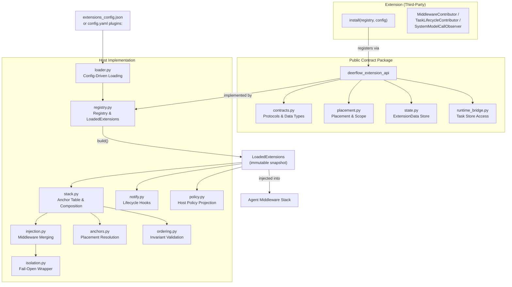
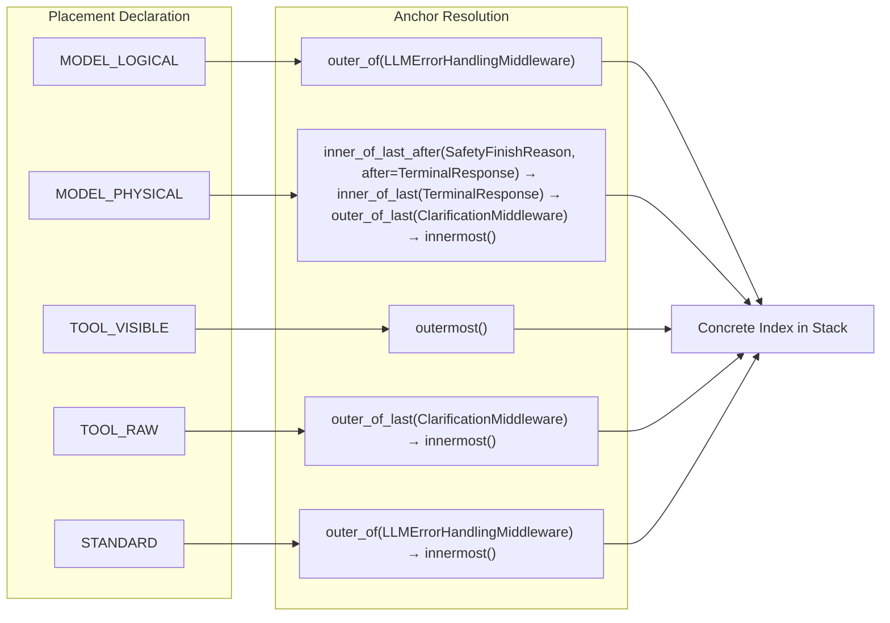
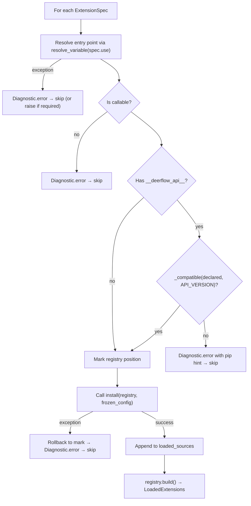

---
slug:21-extensions-api
blog_type:normal
---


DeerFlow 的 Extensions API 是一个**契约优先的插件系统**，允许第三方代码观察并介入 Agent 中间件栈、任务生命周期和系统模型调用——而无需与宿主的内部实现耦合。公共契约存在于一个独立且无依赖的包（`deerflow-extension-api`）中，而宿主侧则负责处理加载、隔离、排序和注入。本页涵盖了契约接口、注册生命周期、中间件放置语义、隔离保证以及配置。

## 架构概览

扩展系统被拆分为两个包，二者之间有严格的依赖边界：扩展依赖的**公共契约包**（`deerflow-extension-api`），以及测试工具包内的**宿主实现**（`deerflow.extensions`），后者负责加载、验证、隔离并注入扩展贡献。



该扩展包特意设计为**零运行时依赖**——它仅提供基于标准库的协议和不可变的数据类（frozen dataclasses），因此扩展可以独立于宿主进行发布和版本控制。宿主则负责实现具体的注册表、加载机制和运行时钩子。

来源：[__init__.py](backend/packages/extension-api/deerflow_extension_api/__init__.py#L1-L64), [pyproject.toml](backend/packages/extension-api/pyproject.toml#L1-L16)

## 公共契约接口

扩展作者所需的每种类型都从顶层 `deerflow_extension_api` 包导出。该契约围绕三个**贡献者协议**（中间件、任务生命周期、系统模型观察）、一个**注册表协议**，以及用于放置、状态和宿主策略的支撑数据类型进行构建。

### API 版本控制与 `@extension` 装饰器

当前契约版本为 **`API_VERSION = "0.1.1"`**。在 1.0 版本之前，契约接口**仅限观察**——即贡献者和观察者无法更改 Agent 的决策——因此小版本更新可能会引入破坏性变更，而补丁版本仅承诺做增量更新。从 1.0 版本开始，破坏性变更需要提升主版本号。

可选的 `@extension` 装饰器会在安装函数上标记其编写时所依据的 API 版本：

```python
from deerflow_extension_api import extension, ExtensionRegistry
from collections.abc import Mapping
from typing import Any

@extension(api="0.1", name="my-extension")
def install(registry: ExtensionRegistry, config: Mapping[str, Any]) -> None:
    registry.middlewares(MyMiddlewareContributor())
```

Pip 的依赖解析是主要的兼容性校验机制，但该装饰器可覆盖 `--no-deps` 安装和可编辑的单体仓库检出（在这些场景下版本可能发生偏离）的情况。当检测到版本不匹配时，宿主将拒绝该扩展，并给出包含正确 pip 安装范围的可操作提示信息。

来源：[__init__.py](backend/packages/extension-api/deerflow_extension_api/__init__.py#L36-L40), [contracts.py](backend/packages/extension-api/deerflow_extension_api/contracts.py#L186-L200)

### 版本兼容性规则

宿主在扩展声明的版本与宿主的 `API_VERSION` 之间执行**单向兼容性检查**：

| 契约阶段 | 兼容窗口 | 原因 |
|---|---|---|
| 1.0 之前 (`0.x.y`) | 相同的 `major.minor`，宿主 ≥ 声明 | 小版本可能包含破坏性变更；补丁为增量更新 |
| 1.0 及之后 (`x.y.z`) | 相同的主版本，宿主 ≥ 声明 | 同一主版本内契约只增不减 |
| 无法解析的版本 | 拒绝 | 不对无效标记进行静默放行 |

当扩展声明 `api="0.1"` 而宿主提供 `0.1.1` 时，检查通过。如果它声明 `api="0.2"` 而宿主提供 `0.1.1`，宿主将拒绝它并提示类似如下的信息：`pip install 'deerflow-extension-api>=0.2,<0.3'`。

来源：[loader.py](backend/packages/harness/deerflow/extensions/loader.py#L76-L118)

### 贡献者协议

三个协议定义了扩展可以贡献的内容。所有协议方法都带有默认实现（返回 `None` 或空元组），因此后续添加方法对已发布的扩展而言是**纯增量**的。

| 协议 | 用途 | 关键方法 | 接收的数据 |
|---|---|---|---|
| `MiddlewareContributor` | 将中间件注入 Agent 栈 | `contribute_middlewares(app_store, ctx)` → `Sequence[MiddlewarePlacement]` | `ExtensionData` (app store), `AgentBuildContext` |
| `TaskLifecycleContributor` | 观察任务启动/停止事件 | `on_task_start(app_store, task_store, info)`, `on_task_stop(app_store, task_store, info, outcome)` | `ExtensionData` (app + task), `TaskInfo`, `TaskOutcome` |
| `SystemModelCallObserver` | 观察系统级的 LLM 调用 | `on_system_model_call(app_store, task_store, kind, request, result)` | `ExtensionData`, `SystemOperationKind`, `SystemModelRequest`, `SystemModelResult` |

`TaskInfo` 数据类携带单次执行的标识信息：

```python
@dataclass(frozen=True)
class TaskInfo:
    task_id: str
    run_id: str
    thread_id: str
    kind: Literal["lead", "subagent"]
    parent_task_id: str | None = None
    agent_name: str | None = None
    resumed: bool = False
```

`SystemOperationKind` 枚举涵盖四种系统级模型调用类型：`GOAL`、`MEMORY`、`TITLE` 和 `SUMMARIZATION`。`SystemModelRequest` 快照在调用前捕获消息、模型名称和调用配置；`SystemModelResult` 则在调用后捕获响应、错误和耗时。

<CgxTip>`SystemModelRequest.messages` 字段在 `__post_init__` 中被统一标准化为元组——调用处可能传入消息列表或纯提示词字符串，如果不进行标准化，观察者在遍历 `messages` 时会不知不觉地遍历字符串的字符。</CgxTip>

来源：[contracts.py](backend/packages/extension-api/deerflow_extension_api/contracts.py#L46-L141), [contracts.py](backend/packages/extension-api/deerflow_extension_api/contracts.py#L97-L129)

### 注册表协议

`ExtensionRegistry` 是一个**只写的结构性协议**，会被传递给每个扩展的 `install()` 函数。它仅公开三个注册方法——`middlewares()`、`task_lifecycle()` 和 `system_model_observer()`——每个方法接受一个贡献者实例。宿主的具体注册表还额外包含归属信息、位置回滚和构建机制，这些在公共契约中被刻意省略了。

```python
@runtime_checkable
class ExtensionRegistry(Protocol):
    def middlewares(self, contributor: MiddlewareContributor) -> None: ...
    def task_lifecycle(self, contributor: TaskLifecycleContributor) -> None: ...
    def system_model_observer(self, observer: SystemModelCallObserver) -> None: ...
```

来源：[contracts.py](backend/packages/extension-api/deerflow_extension_api/contracts.py#L155-L181)

## 放置语义：中间件落点

中间件放置被声明为一种**语义保证**（“我需要观察原始的工具返回值”），而非结构化位置（“把我放在第 3 层”）。这种抽象确保了当宿主重构其栈时，扩展无需做任何改动。

### Placement 枚举

五个放置值涵盖了两个中间件轴——模型调用和工具调用——以及一个通配选项：

| 放置位置 | 轴 | 保证 |
|---|---|---|
| `MODEL_LOGICAL` | 模型，外层 | 位于重试和错误处理的外层。无论重试多少次，每次逻辑决策仅触发一次。 |
| `MODEL_PHYSICAL` | 模型，内层 | 位于每个转换请求的中间件内层。每次物理提供者调用均会触发；重试会重新进入此处。 |
| `TOOL_VISIBLE` | 工具，外层 | 位于截断、清理和错误包装的外层。观察模型最终看到的内容。 |
| `TOOL_RAW` | 工具，内层 | 紧邻真实的可调用边界。在任何处理之前观察工具的原始返回值。 |
| `STANDARD` | 两者均可 | 无前置/后置处理要求。不保证相对于其他 STANDARD 贡献者的相对顺序。 |

### AgentScope 与 MiddlewarePlacement

每个贡献的中间件都被包装在 `MiddlewarePlacement` 数据类中，捆绑了中间件对象、其放置位置、作用域（主 Agent、子 Agent 或两者兼有）以及用于打破平局的整数顺序：

```python
@dataclass(frozen=True)
class MiddlewarePlacement:
    middleware: Any           # 注入时必须为 AgentMiddleware
    placement: Placement
    scope: AgentScope = AgentScope.BOTH
    order: int = 0
```

`AgentScope` 标志允许扩展仅对主 Agent 中间件、仅对子 Agent 中间件或对两者进行贡献。携带作用域、Agent 名称、模型名称和 `HostPolicySnapshot` 的 `AgentBuildContext` 会被传递给 `contribute_middlewares()`，以便扩展做出基于作用域的决策。

来源：[placement.py](backend/packages/extension-api/deerflow_extension_api/placement.py#L1-L71)

### 锚点表：从语义到索引

宿主通过**锚点表**将每个 `Placement` 转换为具体的栈索引——这是唯一了解 DeerFlow 中间件栈结构的模块。每个锚点都是由 `AnchorRule` 对象组成的有序回退链，通过扫描已知的中间件类型来定位插入索引。



当主锚点规则匹配失败（其目标中间件类型不在栈中）时，锚点会回退到下一条规则，宿主会发出**警告诊断**——因为静默降级的放置会在毫无信号的情况下改变扩展观察到内容。对于子 Agent 作用域，`MODEL_PHYSICAL` 锚点会获得一个针对 `SystemMessageCoalescingMiddleware` 的额外主规则。

<CgxTip>重构中间件栈意味着只需更新 `stack.py` 中的锚点表。仅声明需要观察的内容的扩展完全不受影响——这就是语义放置相对于结构化索引的核心设计优势。</CgxTip>

来源：[anchors.py](backend/packages/harness/deerflow/extensions/anchors.py#L1-L121), [stack.py](backend/packages/harness/deerflow/extensions/stack.py#L33-L76)

## 加载生命周期

扩展加载是**配置驱动、显式且可复现**的。`config.yaml` 中的 `plugins:` 列表（或 `extensions_config.json` 中的 `middlewares` 列表）决定了加载顺序，这一点至关重要，因为中间件栈对位置非常敏感。

### ExtensionSpec 与配置

每个扩展都被声明为包含三个字段的 `ExtensionSpec`：

| 字段 | 类型 | 默认值 | 描述 |
|---|---|---|---|
| `use` | `str` | （必填） | 入口点路径，例如 `my_extension:install` |
| `config` | `dict[str, Any]` | `{}` | 扩展私有配置，原样传递给 `install()` |
| `required` | `bool` | `False` | 当为 `True` 时，加载失败会中止启动，而不是被跳过 |

`config` 字典以**浅冻结副本**的形式传递给扩展——它阻止了顶层键的重新赋值，但嵌套结构仍通过引用共享。如果扩展在意修改隔离性，应使用简单的顶层配置值。

来源：[loader.py](backend/packages/harness/deerflow/extensions/loader.py#L27-L41), [loader.py](backend/packages/harness/deerflow/extensions/loader.py#L216-L225)

### 加载流程

`load_extensions()` 函数通过一个受保护的管道按列表顺序处理每个规格（spec）：



宿主采用**位置回滚**而非基于来源键的丢弃：两个规格可能合法地共享相同的 `use` 字符串但具有不同的配置（同一个扩展被挂载两次），如果按来源丢弃，将会抹除先前成功安装的实例的条目。

来源：[loader.py](backend/packages/harness/deerflow/extensions/loader.py#L121-L213), [registry.py](backend/packages/harness/deerflow/extensions/registry.py#L106-L130)

### 故障放行与故障阻断

默认姿态是**故障放行**：出现问题的扩展会被跳过并生成诊断信息，以便 Gateway 仍能启动。对于缺失会改变 Agent 行为而不仅仅是可观测性的扩展，设置 `required: true` 可将其翻转为故障阻断。每个失败分支都会以 `error` 级别记录日志，而成功加载则以 `info` 级别记录，并带有 `x/y` 计数以区分“全部加载”还是“部分被跳过”。

来源：[loader.py](backend/packages/harness/deerflow/extensions/loader.py#L121-L211)

## 隔离机制：故障放行的中间件包装

每个贡献的中间件都被包装在 `IsolatedMiddleware` 中，因此观察失败会**降级为诊断信息**，而调用会继续透传。这一点至关重要，因为扩展中间件在 LangChain 的调用链内执行——未处理的异常将中止用户的整个运行过程。

### 接口镜像

LangChain 通过**类级别标识检查**（例如 `m.__class__.before_model is not AgentMiddleware.before_model`）来发现中间件能力。因此，`IsolatedMiddleware` 包装器必须镜像内部中间件的完整接口——不仅是四个包装调用钩子，还包括所有生命周期钩子、工具、state_schema 和转换器。

包装器会**为每个钩子集合生成缓存的子类**：每个具有相同已实现钩子组合的内部中间件共享一个 `IsolatedMiddleware` 子类。当内部中间件仅实现了同步/异步包装对中的一侧时（例如实现了 `wrap_model_call` 但未实现 `awrap_model_call`），包装器会提供一个**静默透传的对应方法**，以便 LangChain 正确连接两条执行路径。

来源：[isolation.py](backend/packages/harness/deerflow/extensions/isolation.py#L1-L200)

### 故障遏制策略

隔离包装器区分了三个故障点，并分别进行妥善处理：

| 故障点 | 行为 | 原因 |
|---|---|---|
| 前置处理程序（调用内部之前） | 调用下游处理程序一次 | 避免真实处理程序的重复执行 |
| 后置处理程序（内部返回之后） | 返回内部捕获的结果 | 防止扩展错误污染结果 |
| 处理程序故障 | 由图（Graph）的错误策略接管 | 扩展隔离机制不得掩盖真实的处理程序 Bug |

所有第一版的贡献均为观察性质，因此采用故障放行。未来的拦截（决策）型贡献将需要**故障阻断**，并且必须显式退出此包装器。

来源：[isolation.py](backend/packages/harness/deerflow/extensions/isolation.py#L1-L25)

## 顺序不变性

扩展贡献被合并到栈中后，宿主会验证**顺序约束**——即贡献者不能违反的结构性不变量。在此系统中，破坏不变量是唯一的硬性故障，因为与缺失观察不同，它会在没有报错的情况下产生错误行为。

当前的核心约束要求 `ToolProgressMiddleware` 必须位于 `ToolErrorHandlingMiddleware` 的外层，因为进度中间件会读取由错误处理中间件标记的 `deerflow_tool_meta`。如果扩展的贡献导致它们脱离此顺序，宿主将抛出 `RuntimeError`，并通过来源映射指出负责的扩展。

```python
@dataclass(frozen=True)
class OrderingConstraint:
    outer: type       # 必须处于较低的索引
    inner: type       # 必须处于较高的索引
    reason: str       # 人类可读的解释
```

来源：[ordering.py](backend/packages/harness/deerflow/extensions/ordering.py#L1-L89)

## 状态管理：ExtensionData

扩展接收两个具有作用域的 `ExtensionData` 存储：一个**应用级存储**（随进程存活）和一个**任务级存储**（随一次主 Agent 或子 Agent 执行存活）。宿主会自动创建和销毁任务存储，因此扩展永远不需要检查过期句柄——它们在每次回调时都会获得当前的存储。

### 类型键控存储

`ExtensionData` 按**类型而非字符串**进行索引，因此独立的扩展不会在键上发生冲突。这是一个刻意的设计选择：两个扩展在不同的键下存储 `dict` 可以正常工作，但两个扩展都在字符串 `"state"` 下存储则会静默地相互破坏。

| 方法 | 签名 | 用途 |
|---|---|---|
| `get` | `get[T](typ: type[T]) → T \| None` | 读取类型化的值 |
| `get_or_init` | `get_or_init[T](typ: type[T], init: Callable[[], T]) → T` | 读取或延迟创建（init 在锁下运行） |
| `set` | `set[T](value: T) → None` | 按 `type(value)` 存储 |
| `remove` | `remove[T](typ: type[T]) → T \| None` | 移除并返回 |

### 运行时桥接

中间件在 Agent 图（Graph）内运行，只能通过 `request.runtime` 访问宿主状态。宿主在宿主拥有的键（`__deerflow_extension_task_store`）下安装任务存储，扩展通过 `task_store_from_runtime()` 辅助函数读取它。扩展**绝不能直接写入运行时上下文**——它们应将自己的对象保留在存储内部。

来源：[state.py](backend/packages/extension-api/deerflow_extension_api/state.py#L1-L58), [runtime_bridge.py](backend/packages/extension-api/deerflow_extension_api/runtime_bridge.py#L1-L26)

## 宿主策略投影

扩展通过 `HostPolicySnapshot` 接收宿主配置的**窄投影**，而不是完整的 `AppConfig`。这是刻意为之：暴露 `AppConfig` 会将每个扩展绑定到测试工具包的发布节奏上。该快照仅携带宿主实际强制执行的限制：

| 字段 | 类型 | 描述 |
|---|---|---|
| `token_budget_enabled` | `bool` | Token 预算是否启用 |
| `max_input_tokens` | `int \| None` | 输入 Token 限制 |
| `max_output_tokens` | `int \| None` | 输出 Token 限制 |
| `max_total_tokens` | `int \| None` | 总 Token 限制 |
| `budget_warn_fraction` | `float \| None` | 警告阈值比例 |
| `budget_hard_fraction` | `float \| None` | 硬性停止阈值比例 |
| `max_subagents_per_run` | `int \| None` | 每次主 Agent 运行的最大子 Agent 数 |

宿主侧的 `project_host_policy()` 函数从应用配置的 Token 预算和子 Agent 设置中读取数据，生成通过 `AgentBuildContext` 传递给扩展的 `HostPolicySnapshot`。

来源：[contracts.py](backend/packages/extension-api/deerflow_extension_api/contracts.py#L28-L43), [policy.py](backend/packages/harness/deerflow/extensions/policy.py#L1-L40)

## 生命周期通知管道

宿主通过一个**故障放行、有时间预算的通知管道**触发生命周期钩子，该管道按注册顺序调用每个贡献者。该管道专为健壮性而设计：一个损坏的扩展不会跳过其后续扩展，并且宿主任务取消能正确传播，同时贡献者引发的 `CancelledError` 会被控制在范围内。

### 通知函数

| 函数 | 触发条件 | 调用的贡献者 |
|---|---|---|
| `notify_task_start()` | 主 Agent 或子 Agent 执行开始 | `TaskLifecycleContributor.on_task_start` |
| `notify_task_stop()` | 主 Agent 或子 Agent 执行结束 | `TaskLifecycleContributor.on_task_stop` |
| `notify_system_model_call()` | 系统级模型调用完成 | `SystemModelCallObserver.on_system_model_call` |
| `observe_system_model_call()` | 包装系统模型调用 | 观察成功和失败路径 |

`observe_system_model_call()` 包装器尤为重要：它调用模型，捕获结果或错误，测量持续时间，并在**所有终止路径**上通知观察者——包括成功、失败甚至取消。在取消时，它使用非阻塞提交，因为重复取消会在任何观察者运行之前中断等待。

### 事件循环绑定

通知管道绑定到**特定的事件循环**——即拥有扩展资源的那个循环。子 Agent 可以在隔离的事件循环上运行，但扩展资源必须始终在启动它们的事件循环中被访问。当通知需要跨越循环边界时，它会通过 `asyncio.run_coroutine_threadsafe` 分发到已注册的循环中。

来源：[notify.py](backend/packages/harness/deerflow/extensions/notify.py#L64-L134), [notify.py](backend/packages/harness/deerflow/extensions/notify.py#L227-L294), [notify.py](backend/packages/harness/deerflow/extensions/notify.py#L308-L380)

## 配置参考

扩展通过统一的 `ExtensionsConfig` 模型进行配置，该模型还涵盖 MCP 服务器和技能。配置文件通过优先级链进行解析：显式路径参数 → `DEER_FLOW_EXTENSIONS_CONFIG_PATH` 环境变量 → 项目根目录下的 `extensions_config.json` → 旧版的 `mcp_config.json`。

```json
{
  "middlewares": ["my_extension:install"],
  "mcpServers": { ... },
  "skills": {}
}
```

`extensions_config.json` 中的 `middlewares` 列表和 `config.yaml` 中的 `plugins:` 块作为**同一扩展加载器的两个配置入口**——无论来源如何，`ExtensionSpec` 条目的解析方式都是相同的。每个条目都是一个字符串入口点路径（`module.path:install`），或者是一个包含 `use`、`config` 和 `required` 字段的规格对象。

来源：[extensions_config.example.json](extensions_config.example.json#L1-L70), [extensions_config.py](backend/packages/harness/deerflow/config/extensions_config.py#L153-L169)

## 整合起来：一个最小扩展

以测试固件作为参考，以下是编写扩展的最小模式：

```python
from collections.abc import Mapping
from typing import Any, Sequence
from deerflow_extension_api import (
    extension, ExtensionRegistry,
    MiddlewareContributor, MiddlewarePlacement,
    Placement, AgentScope, AgentBuildContext,
    ExtensionData,
)

class MyObserver(MiddlewareContributor):
    def contribute_middlewares(
        self, app_store: ExtensionData, ctx: AgentBuildContext
    ) -> Sequence[MiddlewarePlacement]:
        return (
            MiddlewarePlacement(
                middleware=MyLoggingMiddleware(),
                placement=Placement.MODEL_LOGICAL,
                scope=AgentScope.BOTH,
                order=0,
            ),
        )

@extension(api="0.1", name="my-logging-extension")
def install(registry: ExtensionRegistry, config: Mapping[str, Any]) -> None:
    if not config.get("enabled", True):
        return  # 禁用时的零成本路径
    registry.middlewares(MyObserver())
```

该扩展仅依赖于 `deerflow-extension-api`，可作为独立的 pip 包发布，宿主通过 `middlewares` 配置项发现它。如果 `install()` 在执行到一半时抛出异常，宿主将回滚自位置标记以来的所有注册操作——扩展的中间状态永远不会泄漏到运行时中。

来源：[demo_extensions.py](backend/extension_test_fixtures/demo_extensions.py#L1-L76), [contracts.py](backend/packages/extension-api/deerflow_extension_api/contracts.py#L143-L181)

## 诊断与可观测性接口

扩展系统维护着一个具有 1,000 条目环形缓冲区的**进程级诊断接收器**。诊断信息产生于两个阶段：加载期间（归属、版本不匹配、安装失败）和运行时（贡献失败、隔离错误、放置回退警告）。每个 `Diagnostic` 都带有级别（`debug`/`info`/`warning`/`error`）、来源字符串（扩展的入口点路径）和消息。

`LoadedExtensions` 不可变快照预计算了布尔标志——`has_middleware_contributors`、`has_task_lifecycle`、`has_system_model_observers`、`needs_task_store`——因此钩子位置可以通过单次属性读取进行短路判断，且零扩展路径不会构造任何内容。

来源：[loader.py](backend/packages/harness/deerflow/extensions/loader.py#L43-L69), [registry.py](backend/packages/harness/deerflow/extensions/registry.py#L26-L44), [__init__.py](backend/packages/harness/deerflow/extensions/__init__.py#L94-L135)

## 接下来去哪

Extensions API 是 DeerFlow 集成和扩展能力的其中一环。要了解它与更广泛的架构之间的关系：

- **[MCP Server and Tool Bridge](20-mcp-server-and-tool-bridge)** —— 涵盖了 MCP 服务器配置、会话池和工具路由，它们与扩展在同一个 `extensions_config.json` 中并行运行
- **[Agent Middleware Pipeline](10-agent-middleware-pipeline)** —— 详细介绍了注入扩展贡献的宿主中间件栈，包括放置表引用的锚点中间件类型
- **[Skills System](11-skills-system)** —— 通过统一的 `ExtensionsConfig` 配置的另一个扩展接口，专注于声明式技能包而不是编程式中间件贡献
- **[Architecture Overview](7-architecture-overview)** —— 获取完整的系统上下文，展示扩展如何处于 Agent 运行时和网关之间
