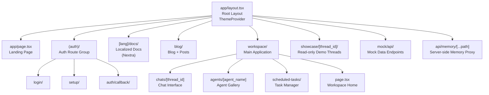
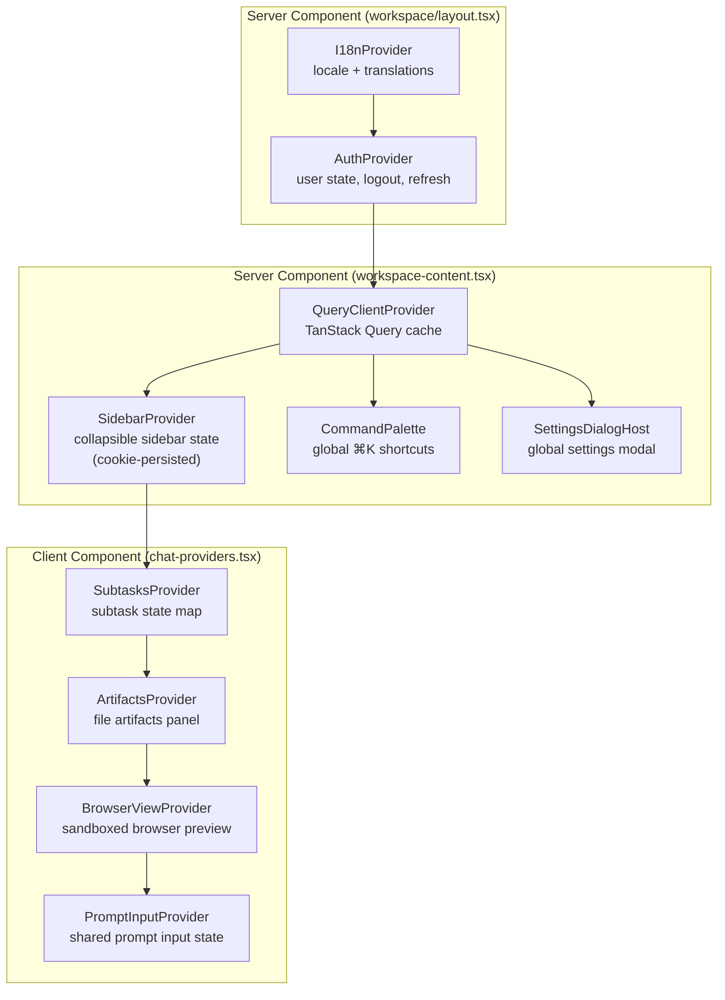
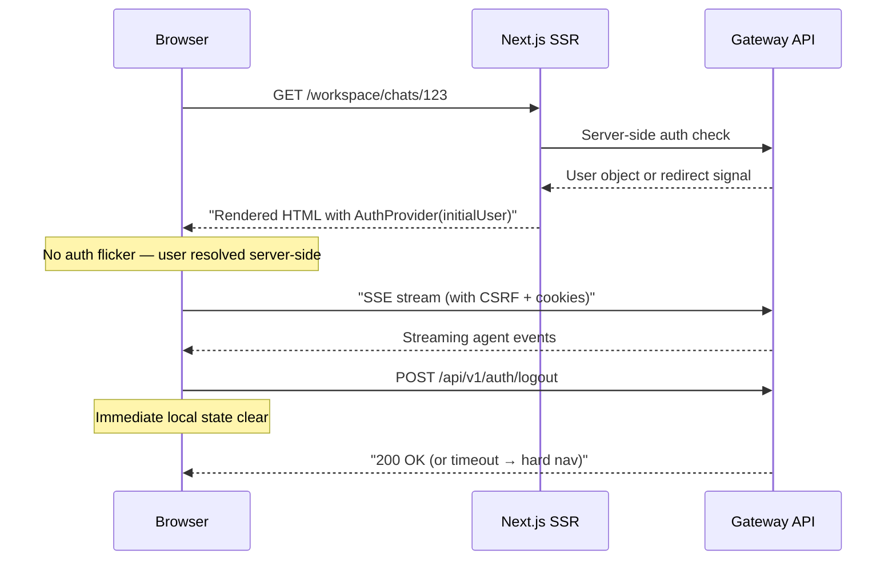

---
slug:22-next-js-frontend-architecture
blog_type:normal
---

DeerFlow 的前端是一个基于 App Router 构建的 Next.js 16 应用，旨在作为 AI Agent 编排的实时聊天工作区。本页面将解析其架构基础——涵盖技术栈、路由拓扑、Provider 层次结构、API 客户端设计、流式处理管道以及认证模型——帮助你建立数据如何从后端网关流入 React 组件树的心智模型。

## 技术栈与构建配置

该前端是一个基于 React 19 + Next.js 16 的现代 SPA 风格应用，并由 Turbopack 驱动开发。其依赖特征揭示了三项经过深思熟虑的架构选择：集成 **LangGraph SDK** 用于 Agent 编排流式传输、使用 **TanStack Query** 进行 REST 数据缓存，以及采用 **Radix UI + Tailwind CSS v4** 构建可组合的设计系统。

| 关注点 | 技术 | 作用 |
|---|---|---|
| 框架 | Next.js 16 (App Router, Turbopack) | 路由、SSR、API 重写 |
| 运行时 | React 19 | UI 渲染 |
| Agent 流式传输 | `@langchain/langgraph-sdk` | 基于 SSE 的运行流式传输、线程状态 |
| 数据获取 | `@tanstack/react-query` | REST 缓存、变更、无限滚动查询 |
| 设计系统 | Radix UI 原语 + Tailwind CSS v4 + `class-variance-authority` | 无障碍、可主题化组件 |
| Markdown 渲染 | `streamdown` + `rehype-katex` + `remark-gfm` | 富 AI 消息渲染 |
| 流程可视化 | `@xyflow/react` | Agent 图 / 思维链 |
| 代码编辑 | CodeMirror 6 + `@uiw/react-codemirror` | Artifact 编辑、多语言支持 |
| 环境变量校验 | `@t3-oss/env-nextjs` + `zod` | 类型安全的环境变量 |
| 测试 | Rstest (单元) + Playwright (E2E) | 测试金字塔覆盖率 |

`next.config.js` 文件配置了一个关键的**重写层**，将前端的 `/api/*` 请求代理至位于 `DEER_FLOW_INTERNAL_GATEWAY_BASE_URL`（默认为 `http://127.0.0.1:8001`）的后端网关。当未设置 `NEXT_PUBLIC_LANGGRAPH_BASE_URL` 或 `NEXT_PUBLIC_BACKEND_BASE_URL` 时，重写规则会拦截 `/api/langgraph/*`、`/api/agents/*`、`/api/skills/*` 以及最终的兜底规则 `/api/*`——将它们路由至网关。这种设计意味着前端既可以作为代理到本地后端的独立开发服务器运行，也可以作为通过公共环境变量指向远程端点的静态配置 SPA 运行。

来源：[package.json](frontend/package.json#L1-L129), [next.config.js](frontend/next.config.js#L1-L84), [tsconfig.json](frontend/tsconfig.json#L1-L46)

## App Router 拓扑与路由段

`src/app/` 目录遵循 Next.js App Router 约定，包含多个路由组，将身份认证、文档、营销展示和核心工作区的关注点分离开来。

`app/layout.tsx` 中的根布局非常简洁：它将整个应用包裹在 `ThemeProvider` (next-themes) 中，实现了基于类名的暗/亮主题切换，并支持系统偏好检测。`suppressHydrationWarning` 属性是刻意为之的——`next-themes` 会在 React 水合之前应用主题类，否则会引发不匹配警告。

**工作区布局**（`app/workspace/layout.tsx`）是架构的基石。它被标记为 `export const dynamic = "force-dynamic"` 以防止静态渲染，因为每个工作区页面都依赖于服务端的身份验证状态。该布局通过 `getServerSideUser()` 执行服务端鉴权检查，并根据判别联合体的不同结果对用户进行路由：

| `result.tag` | 动作 | 渲染的组件 |
|---|---|---|
| `authenticated` | 继续 | `AuthProvider` → `WorkspaceContent` |
| `needs_setup` | 重定向至 `/setup` | — |
| `system_setup_required` | 重定向至 `/setup` | — |
| `unauthenticated` | 重定向至 `/login` | — |
| `gateway_unavailable` | 渲染降级 UI | `GatewayOfflineFallback` → `WorkspaceContent` |
| `config_error` | 抛出错误 | — |

这种模式确保不会发生客户端鉴权状态闪烁——用户对象在服务端解析，并作为 `initialUser` 传递给 `AuthProvider`，随后由其在客户端进行响应式管理。

来源：[layout.tsx](frontend/src/app/layout.tsx#L1-L30), [workspace/layout.tsx](frontend/src/app/workspace/layout.tsx#L1-L57), [workspace-content.tsx](frontend/src/app/workspace/workspace-content.tsx#L1-L48)

## Provider 层次结构与状态管理

工作区内容层组装了一个精心设计的 Provider 栈，为整个聊天应用划定了依赖边界。每个 Provider 负责特定的横切关注点，它们的嵌套顺序反映了数据流的依赖关系。

**TanStack QueryClientProvider** 使用模块级的 `QueryClient` 单例进行实例化——这是为了实现 SPA 风格行为而刻意为之的选择，使得缓存在工作区内的路由切换期间得以保留。该单例避免了在每次导航时重新获取线程列表、模型配置和技能目录。

**SubtasksProvider**（`core/tasks/context.tsx`）展示了一种用于管理流式 Agent 状态的复杂模式。它暴露了一个 `tasksRef` 和 `tasks` 状态——该 ref 在渲染期间被更新，始终指向最新状态。这确保了异步回调（例如，延迟解析的 `fetchSubtaskSteps().then(updateSubtask)`）会合并到当前状态，而不是过时的闭包快照中。`useUpdateSubtask` Hook 区分了“即时”通知（立即执行 `setTasks`）和“延迟”通知（批处理到渲染后的 `useEffect` 中），从而防止了在每次渲染 `MessageList` 时重新解析终端工具消息所导致的无限重渲染循环。

**ChatProviders** 组件（`components/workspace/chats/chat-providers.tsx`）嵌套了四个特定领域的 Provider——SubtasksProvider、ArtifactsProvider、BrowserViewProvider 和 PromptInputProvider——将交互式工作区状态限制在聊天子树内。这种隔离使得侧边栏、页眉和设置对话框处于聊天的重渲染边界之外。

来源：[workspace-content.tsx](frontend/src/app/workspace/workspace-content.tsx#L1-L48), [chat-providers.tsx](frontend/src/components/workspace/chats/chat-providers.tsx#L1-L19), [context.tsx](frontend/src/core/tasks/context.tsx#L1-L102), [query-client-provider.tsx](frontend/src/components/query-client-provider.tsx#L1-L21), [AuthProvider.tsx](frontend/src/core/auth/AuthProvider.tsx#L1-L207)

## API 客户端架构与流式处理管道

API 客户端层是前端架构中最关键的部分。它将 LangGraph SDK 的流式原语与 DeerFlow 网关的特定需求（CSRF 防护、流式重放间隙恢复、终端运行短路处理以及非活跃 Worker 检测）连接起来。

### 感知 CSRF 的请求获取

两条并行路径负责处理发往网关的 HTTP 请求。`fetcher.ts` 模块导出了一个自定义的 `fetch()` 函数，该函数通过两个契约包装了 `globalThis.fetch`：用于跨域基于 Cookie 鉴权的 `credentials: "include"`，以及在改变状态的方法（POST、PUT、DELETE、PATCH）上自动注入 `X-CSRF-Token` 请求头。该 Token 在每次请求时从 `csrf_token` Cookie 中读取，而不是在构造时硬编码到请求头中，因此登录/登出/密码更改期间的 Cookie 轮换得到了透明处理。当遇到 401 响应时，该包装器会执行硬重定向至登录页面。

### LangGraph SDK 客户端包装

`api-client.ts` 模块通过猴子补丁修改了 SDK 的三个方法：`runs.stream`、`runs.joinStream` 和 `runs.cancel`，从而创建了一个**兼容的 LangGraph SDK 客户端**。每个补丁都解决了一个实际场景中的失败模式：

| 被打补丁的方法 | 解决的问题 | 机制 |
|---|---|---|
| `runs.stream` | SSE 缓存被清除导致的流重放间隙 | `recoverStreamReplayGaps` 异步生成器：拦截 `gap` 事件，通过 `threads.getState` 重新加载持久化检查点状态，然后从 `latest_available_event_id` 恢复（最多重试 5 次） |
| `runs.joinStream` | 重连到已终止的运行会导致永久阻塞 | `shouldSkipReconnect` 预检：获取运行状态，若为 `success`/`error`/`timeout`/`interrupted` 则短路返回 |
| `runs.cancel` | 停止已完成的运行会抛出 409 错误 | `isRunNotCancellableError` 匹配器：吞掉终端状态的 409 冲突，清除过期的重连密钥 |
| `runs.stream` (非活跃) | 运行存在于存储中但未在此 Worker 上激活 | `handleInactiveRunStream`：捕获“未在此 Worker 上激活”的 409 错误，静默返回空流 |

<CgxTip>`sanitizeRunStreamOptions` 函数在每次调用 `runs.stream` 之前运行，以拒绝不受支持的 LangGraph 流模式（总是丢弃 `streamResumable`；仅允许 `values`、`messages-tuple`、`updates`、`debug`、`tasks`、`checkpoints`、`custom`）。这可以防止在升级 LangGraph SDK 版本时出现静默的 SDK 行为漂移。</CgxTip>

### useThreadStream Hook

位于 `core/threads/hooks.ts` 中的 `useThreadStream` Hook 是主要的数据集成点。它包装了 LangGraph SDK 的 `useStream` React Hook（来自 `@langchain/langgraph-sdk/react`），并叠加了 DeerFlow 特定的关注点：文件上传处理、子任务生命周期事件、Token 使用量追踪、消息去重以及线程历史无限滚动。该 Hook 接受回调函数（`onSend`、`onStart`、`onFinish`），允许 `ChatPage` 组件在不与流式内部实现耦合的情况下编排 UI 转换。

`ChatPage` 中的一个关键实现细节：当创建新线程时，导航使用**原生 History API**（`history.replaceState`）而不是 Next.js 的路由器。代码注释解释了原因：“在这种情况下绝对不要使用 Next.js 路由器进行导航，否则会导致线程重新挂载并丢失所有状态。”这是因为 Next.js 路由器在路由更改时会触发组件重新挂载，这将破坏由 `useStream` 持有的内存中流式状态。

来源：[api-client.ts](frontend/src/core/api/api-client.ts#L1-L472), [fetcher.ts](frontend/src/core/api/fetcher.ts#L1-L105), [stream-mode.ts](frontend/src/core/api/stream-mode.ts#L1-L76), [hooks.ts](frontend/src/core/threads/hooks.ts#L1-L120), [chat-page.tsx](frontend/src/components/workspace/chats/chat-page.tsx#L1-L200), [errors.ts](frontend/src/core/api/errors.ts#L1-L18)

## 身份验证流程

身份验证遵循**服务端守卫 + 客户端 Provider** 的模式，消除了未认证内容的闪烁现象。该流程分为三层运行：

**第一层——服务端守卫**（`core/auth/server.ts`）：工作区布局的 `getServerSideUser()` 函数在每次加载工作区页面时运行。它返回一个判别联合体，布局根据该联合体决定是渲染已认证的内容、重定向至登录/设置页面，还是显示网关离线降级 UI。这是初始认证状态的唯一事实来源。

**第二层——客户端上下文**（`AuthProvider.tsx`）：`AuthProvider` 从服务端守卫接收 `initialUser` 并对其进行响应式管理。它提供了 `logout()`（在调用网关之前立即清除本地状态，如果网关不可达则回退到硬导航）、`refreshUser()`（获取 `/api/v1/auth/me`）以及一个自动的可见性更改处理器，该处理器在标签页再次可见时刷新用户状态（节流至 60 秒一次）。

**第三层——请求拦截器**（`fetcher.ts`）：每个 API 调用都流经自定义的 `fetch()` 包装器。遇到 401 时，它会带上返回路径查询参数重定向至 `/login`。对于改变状态的方法，它从 `csrf_token` Cookie 中注入 CSRF Token——实现了网关 CSRFMiddleware 强制执行的双重提交 Cookie 模式。

<CgxTip>`AuthProvider` 刻意在进行登出请求解析完成*之前*清除本地用户状态。如果网关不可达，则执行硬导航 `window.location.href = "/"`——这确保所有进行中的 SSE 订阅、Fetch Promise 和 React Query 缓存都被销毁，与传统的表单 POST 登出行为保持一致。</CgxTip>

来源：[AuthProvider.tsx](frontend/src/core/auth/AuthProvider.tsx#L1-L207), [fetcher.ts](frontend/src/core/api/fetcher.ts#L52-L90), [workspace/layout.tsx](frontend/src/app/workspace/layout.tsx#L1-L57)

## 国际化架构

国际化（i18n）系统是一个自定义的轻量级实现，避免了繁重的 i18n 框架。它通过服务端/客户端分离机制运行：

**服务端**（`core/i18n/server.ts`）：`detectLocaleServer()` 函数在工作区布局中运行，从 Cookie 或请求头中检测用户的区域设置，并将结果作为 `initialLocale` 传递给 `I18nProvider`。

**客户端**（`core/i18n/context.tsx`）：`I18nProvider` 维护区域设置状态和翻译对象。翻译内容从以区域设置（`en-US`、`zh-CN`）为键的静态映射（`clientTranslations`）中同步加载，因此不存在异步加载延迟。`useI18n()` Hook 向所有消费者暴露 `{ locale, setLocale, t }`。

`next.config.js` 中 Next.js 的内置 i18n 配置声明了 `locales: ["en", "zh"]`，默认区域设置为 `defaultLocale: "en"`，而 `[lang]/docs/` 路由段利用此配置实现了由 Nextra 驱动的本地化文档。工作区本身使用基于自定义上下文的系统，将翻译包保留在客户端包中，无需运行时获取。

来源：[context.tsx](frontend/src/core/i18n/context.tsx#L1-L60), [next.config.js](frontend/next.config.js#L18-L21)

## 静态模式与静态网站生成

一个独特的架构特性是**静态网站模式**（`NEXT_PUBLIC_STATIC_WEBSITE_ONLY=true`）。启用后，前端将作为纯静态站点运行，不依赖任何后端。代码库中多处检查 `isStaticWebsiteOnly()` 函数，以短路鉴权检查、禁用 API 调用并提供模拟数据。

在静态模式下，LangGraph SDK 客户端被替换为 `createStaticClient()`，该客户端从 `core/threads/static-demo.ts` 提供预录制的演示线程。`showcase/[thread_id]` 路由以只读格式渲染这些演示线程。`app/mock/api/` 下的模拟 API 路由为模型、技能、线程、MCP 和集成提供静态 JSON 响应——使得无需任何后端即可实现功能完整的演示部署。

来源：[static-mode.ts](frontend/src/core/static-mode.ts#L1-L6), [env.js](frontend/src/env.js#L1-L51), [config/index.ts](frontend/src/core/config/index.ts#L1-L41)

## 核心领域模块

`src/core/` 目录将所有领域逻辑封装为与框架无关的 TypeScript 模块，每个模块都遵循一致的 `api.ts`（数据获取）、`hooks.ts`（React Hooks）、`types.ts`（类型定义）和 `index.ts`（统一导出）模式。这种分离将特定于 React 的关注点排除在数据层之外，并允许相同的 API 模块在服务端组件、路由处理器或测试中使用。

| 模块 | 职责 | 核心模式 |
|---|---|---|
| `core/threads/` | 线程 CRUD、流式传输、搜索、Token 使用量 | `useThreadStream` 包装 LangGraph SDK 的 `useStream` |
| `core/tasks/` | 子任务生命周期、步骤解析、展示 | 使用 Context + ref 模式实现异步安全状态 |
| `core/agents/` | Agent 配置、特性缓存 | 带有特性缓存层的 TanStack Query |
| `core/skills/` | 技能目录、斜杠命令解析 | `slash.ts` 用于解析 `/skill` 输入 |
| `core/memory/` | 长期记忆管理 | 位于 `app/api/memory/[...path]` 的 API 路由处理器 |
| `core/scheduled-tasks/` | 基于 Cron 的任务调度 | 预设方案 + Cron 表达式构建器 |
| `core/channels/` | IM 渠道连接 | 基于轮询的连接状态检查 |
| `core/uploads/` | 文件上传校验与处理 | 文件类型校验 + 提示词附件 |
| `core/sidecar/` | 参考面板上下文 | 由线程元数据驱动的 Sidecar 状态 |
| `core/streamdown/` | Markdown 渲染管道 | 自定义插件 + Mermaid 集成 |

`use-thread-chat.ts` 中的**线程聊天编排**值得一提。它管理跨 URL 变更、新线程创建和删除后重置的线程 ID 生命周期。该 Hook 使用 `useRef` 来保存预先生成的 UUID，确保客户端可以在后端确认创建之前乐观地创建线程 ID。一个自定义事件系统（`THREAD_CHAT_RESET_EVENT`）协调跨组件的线程删除——当从侧边栏删除线程时，会分发一个 `CustomEvent`，如果当前活动的 `ChatPage` 正在查看被删除的线程，则会重置为新建线程状态。

来源：[use-thread-chat.ts](frontend/src/components/workspace/chats/use-thread-chat.ts#L1-L134), [config/index.ts](frontend/src/core/config/index.ts#L1-L41), [env.js](frontend/src/env.js#L1-L51)

## 组件架构

组件层按明确的职责分为三个层级：

**`components/ui/`** —— 使用 Tailwind CSS 和 `class-variance-authority` 包装以管理变体的 Radix UI 原语。这些是通用的、领域无关的基础构建块（Button、Dialog、Select、Tabs 等），遵循 shadcn/ui 模式。`components.json` 文件证实了这是一个基于 shadcn/ui 的设计系统。

**`components/ai-elements/`** —— 特定于 AI 领域的交互组件，可在不同聊天界面中复用。包括 `Conversation`、`Message`、`Reasoning`、`ChainOfThought`、`Sources`、`PromptInput`、`Artifact`、`Canvas` 和 `Streamdown`（Markdown 渲染器）。这些组件是任何 AI 聊天界面的构建块，与 DeerFlow 特定的业务逻辑解耦。

**`components/workspace/`** —— DeerFlow 特定的工作区组件，将 ai-elements 组合成完整的应用。`ChatBox` 组件是主要的布局编排器，使用 `react-resizable-panels` 创建三面板布局（对话区 + 可调整大小的侧边栏/Artifact/浏览器面板）。它使用 `next/dynamic` 懒加载重型面板组件（ArtifactFileDetail、BrowserViewPanel、SidecarPanel）并提供加载降级 UI——从而保持初始聊天包精简。

`ChatPage` 组件（`components/workspace/chats/chat-page.tsx`）是应用中最复杂的组件。它负责协调：线程流式传输、模型选择、上下文使用追踪、人工输入请求、文件上传、浏览器控制、目标状态、待办列表、Token 使用量、定时任务以及欢迎模式转换。它使用 `useThreadChat` Hook 管理线程标识，使用 `useThreadStream` 进行流式传输，并使用由子 Hook（`useActiveGoal`、`useModels`、`useNotification`、`useSpecificChatMode`）组成的网络处理特定关注点。

来源：[chat-box.tsx](frontend/src/components/workspace/chats/chat-box.tsx#L1-L80), [chat-page.tsx](frontend/src/components/workspace/chats/chat-page.tsx#L1-L200), [workspace-sidebar.tsx](frontend/src/components/workspace/workspace-sidebar.tsx#L1-L41)

## 环境配置

环境变量通过 `@t3-oss/env-nextjs` 和 Zod Schema 校验进行管理，在整个应用中提供类型安全的访问。项目根目录下的 `env.js` 文件定义了三个客户端变量和一个服务端变量：

| 变量 | 作用域 | 用途 |
|---|---|---|
| `NEXT_PUBLIC_BACKEND_BASE_URL` | 客户端 | 直接的后端 URL（绕过重写代理） |
| `NEXT_PUBLIC_LANGGRAPH_BASE_URL` | 客户端 | 直接的 LangGraph API URL（绕过重写代理） |
| `NEXT_PUBLIC_STATIC_WEBSITE_ONLY` | 客户端 | 启用静态演示模式 |
| `GITHUB_OAUTH_TOKEN` | 服务端 | 用于博客内容的 GitHub OAuth |
| `NODE_ENV` | 服务端 | 运行环境 |

`SKIP_ENV_VALIDATION` 标志允许在 Docker 构建中跳过校验，因为在构建时环境变量可能不可用。空字符串被视为 `undefined`，防止因空环境变量赋值导致的配置错误。

配置模块（`core/config/index.ts`）通过回退链解析基础 URL：显式环境变量 → `window.location.origin`（客户端） / `http://localhost:2026`（SSR 回退）。这种双重解析机制确保了相同的代码能在开发环境（代理模式）、生产环境（直接模式）和 SSR（回退模式）中正常工作。

来源：[env.js](frontend/src/env.js#L1-L51), [config/index.ts](frontend/src/core/config/index.ts#L1-L41)

## 后续步骤

既然你已经了解了前端的架构，以下相关页面提供了关于其集成系统的更深入背景：

- [Gateway API and Auth](23-gateway-api-and-auth) —— 重写代理目标的后端网关，包括 CSRF 中间件和认证端点
- [Stream Bridge and Event Pipeline](24-stream-bridge-and-event-pipeline) —— `useThreadStream` 消费的服务端 SSE 基础设施，包括流重放间隙机制
- [Architecture Overview](7-architecture-overview) —— 展示前端、网关和 Agent 运行时如何连接的全栈架构图
- [Sandbox and File System](14-sandbox-and-file-system) —— BrowserView 和代码编辑器组件与之交互的沙箱执行环境
