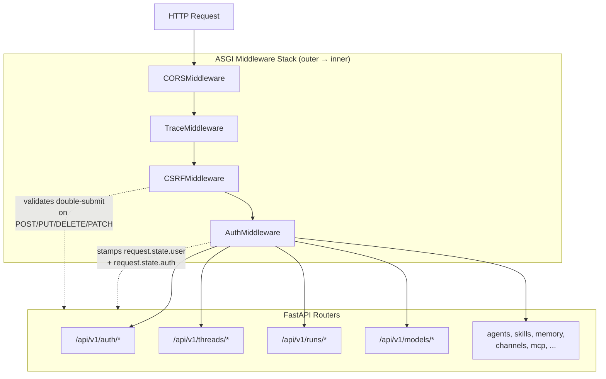
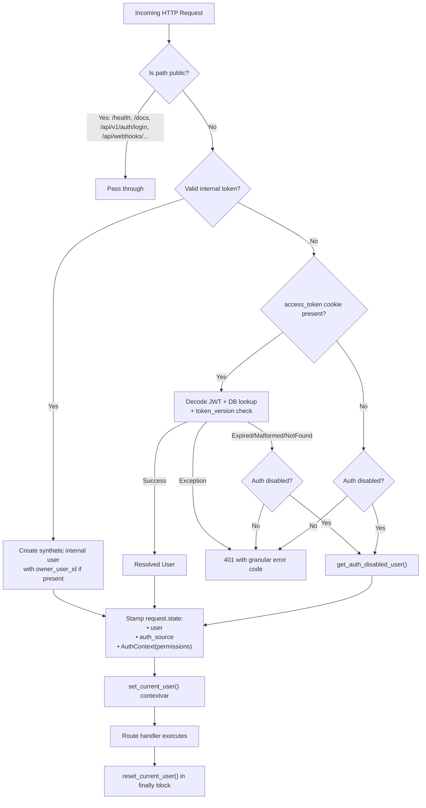
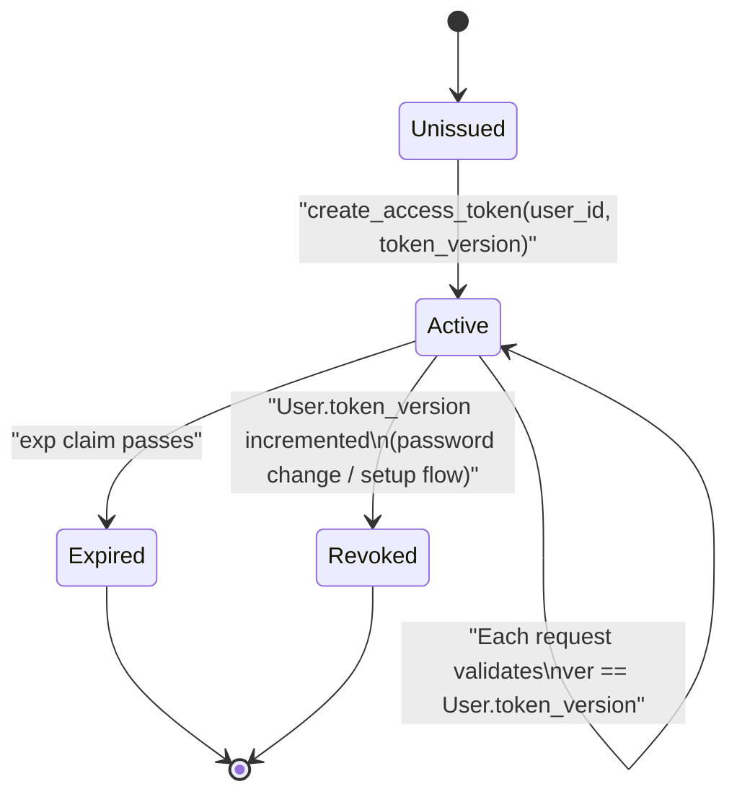
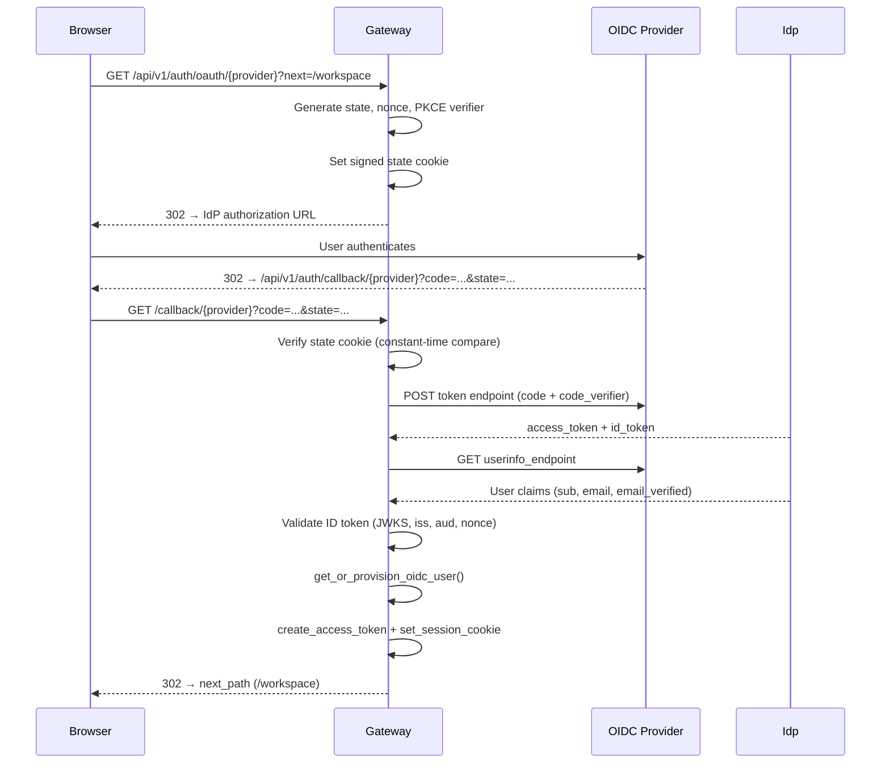

---
slug:23-gateway-api-and-auth
blog_type:normal
---


DeerFlow 网关是一个 FastAPI 应用，作为所有前端、IM 渠道和编程式 API 流量的统一 HTTP 入口。其认证架构采用**失败即拒绝、纵深防御**模型：在路由处理器执行前，每个非公开路径都会受到中间件级别的认证拦截，并通过装饰器组合以声明式方式实施细粒度授权。本文档记录了完整的请求认证管道、三种信任源模型、会话管理、CSRF 防护、OIDC/SSO 集成，以及控制资源级访问控制的授权框架。

来源：[app.py](backend/app/gateway/app.py#L1-L55), [auth_middleware.py](backend/app/gateway/auth_middleware.py#L1-L164)

## 网关应用架构

网关构建为一个标准的 FastAPI 应用，并配备了自定义的异步生命周期处理器。在启动时，生命周期函数会引导 LangGraph 运行时（持久化引擎、检查点程序、存储、流桥、运行管理器），初始化 IM 渠道，预热内存检索索引，并执行首次启动管理员检查。中间件以特定顺序注册，以确保 ASGI 调用链正确处理请求：CORS → TraceMiddleware → CSRFMiddleware → AuthMiddleware。



应用注册了 **18 个路由**，涵盖线程、运行、agents、skills、内存、模型、渠道、MCP、上传、制品、反馈、定时任务、浏览器、控制台、功能特性、GitHub webhooks、集成以及身份认证。除了 webhooks 挂载在 `/api/webhooks/` 下，其他每个路由都挂载在 `/api/v1/` 下。生命周期处理器还执行**无认证 → 带认证迁移**：在存在管理员后的后续启动中，会使用游标分页存储迭代，将缺少 `user_id` 的孤立 LangGraph 线程元数据迁移至管理员账户。

来源：[app.py](backend/app/gateway/app.py#L68-L174), [app.py](backend/app/gateway/app.py#L189-L200)

## 三种认证信任源

DeerFlow 的认证中间件通过**三种不同的信任源**解析传入请求，每种信任源都有各自的验证路径和安全属性。`AuthMiddleware.dispatch` 方法按严格的优先级顺序对其进行评估：内部令牌 → 会话 Cookie → 禁用认证旁路。如果全部不成功，则请求被拒绝并返回 `401 NOT_AUTHENTICATED` 响应。

| 信任源 | Header / Cookie | 验证方式 | 用例 | `auth_source` 值 |
|---|---|---|---|---|
| **内部** | `X-DeerFlow-Internal-Token` | 通过 `secrets.compare_digest` 进行常数时间比较 | IM 渠道工作进程、调度器、受信任的后端服务 | `AUTH_SOURCE_INTERNAL` |
| **会话** | `access_token` (HttpOnly cookie) | JWT 解码 + 数据库用户查找 + token_version 匹配 | 浏览器前端、拥有登录会话的 API 客户端 | `AUTH_SOURCE_SESSION` |
| **禁用认证** | 无 | 环境变量标志 `DEER_FLOW_AUTH_DISABLED=1` | 本地开发、单用户测试 | `AUTH_SOURCE_AUTH_DISABLED` |

### 内部认证 — 受信任的后端调用方

内部认证机制允许受信任的服务（IM 渠道适配器、调度器）在没有浏览器会话的情况下调用网关路由。令牌在进程启动时从 `DEER_FLOW_INTERNAL_AUTH_TOKEN` 环境变量加载，如果未设置则自动生成。伴随的 Header `X-DeerFlow-Owner-User-Id` 可选地携带真实的渠道所有者身份，该身份通过 `make_safe_user_id` 进行规范化，以防止通过构造的 Header 值进行路径遍历或跨用户冒充。

合成的内部用户被构造为一个 `SimpleNamespace`，其 `system_role="internal"` —— 而非真实的 RBAC 角色。当启用授权时，该角色会被移除，从而应用配置中的 `default_role`，这与 LangGraph 工具路径中未经身份验证的调用者的行为一致。此设计确保内部调用方可以访问路由，而不会被意外授予管理员权限。

来源：[internal_auth.py](backend/app/gateway/internal_auth.py#L1-L86), [auth_middleware.py](backend/app/gateway/auth_middleware.py#L92-L105)

### 会话认证 — HttpOnly Cookie 中的 JWT

基于会话的认证遵循**两阶段检查**：先检查 Cookie 是否存在，然后进行严格的 JWT 验证。中间件首先检查 `access_token` Cookie。如果存在，则调用 `get_current_user_from_request`，该方法会解码 JWT，在数据库中查找用户，并验证令牌的 `ver`（版本）声明是否与 `User.token_version` 匹配。此版本字段在每次密码更改时递增，会立即使该用户之前签发的所有令牌失效 —— 这是一种无需令牌黑名单的服务器端撤销机制。

如果 JWT 已过期、格式错误、签名无效或引用的用户已不存在，中间件将返回具体的错误代码（`token_expired`、`token_invalid`、`user_not_found`），而不是通用的 401 错误。这是通过从严格的解析器中捕获 `HTTPException` 并将其渲染为带有结构化 `AuthErrorResponse` 负载的 `JSONResponse` 来实现的，因为 `BaseHTTPMiddleware` 原生不支持异常向上冒泡。

<CgxTip>`BaseHTTPMiddleware` 的限制意味着 HTTPException 无法通过中间件栈正常传播。AuthMiddleware 手动捕获它并将其转换为 JSONResponse —— 这就是为什么来自认证的错误响应总是具有结构化的 `{"detail": {"code": "...", "message": "..."}}` 形状，而不是 FastAPI 默认的 `{"detail": "string"}`。</CgxTip>

来源：[auth_middleware.py](backend/app/gateway/auth_middleware.py#L106-L164), [jwt.py](backend/app/gateway/auth/jwt.py#L1-L56), [errors.py](backend/app/gateway/auth/errors.py#L1-L47)

### 禁用认证 — 开发旁路

当设置了 `DEER_FLOW_AUTH_DISABLED=1` 时，中间件会通过 `get_auth_disabled_user()` 替换合成的用户对象。此旁路仅适用于本地开发，并在启动时会给出明确的警告。`change-password` 端点会直接阻止此来源，返回 400 错误，以防止运维人员在生产环境中意外依赖此旁路。禁用认证时，CSRF 检查也会被完全跳过。

来源：[auth_middleware.py](backend/app/gateway/auth_middleware.py#L130-L136), [routers/auth.py](backend/app/gateway/routers/auth.py#L394-L405)

## 请求认证管道

通过认证栈的完整请求生命周期遵循确定的顺序。中间件解析信任源后，会在 `request.state` 上标记三个值：`User` 对象、`auth_source` 字符串以及包含已解析权限的 `AuthContext`。它还会设置 `deerflow.runtime.user_context` contextvar，以便存储层所有者过滤能够自动工作，而无需每个路由显式注入用户。



权限解析步骤（`resolve_route_permissions`）是评估授权配置的地方。当授权**禁用**（默认）时，所有六个权限（`threads:read`、`threads:write`、`threads:delete`、`runs:create`、`runs:read`、`runs:cancel`）均被无条件授予。当**启用**时，通过 `asyncio.gather` 并行针对配置的 `AuthorizationProvider` 评估每个权限，并按配置对象标识缓存结果，以确保热重载安全。

来源：[auth_middleware.py](backend/app/gateway/auth_middleware.py#L88-L163), [authz.py](backend/app/gateway/authz.py#L197-L263)

## JWT 令牌生命周期

DeerFlow 使用 **HS256 签名的 JWT** 作为其会话令牌格式。令牌负载包含四个声明：`sub`（字符串形式的用户 UUID）、`exp`（过期时间戳）、`iat`（签发时间戳）和 `ver`（令牌版本整数）。签名密钥从 `AUTH_JWT_SECRET` 环境变量解析，如果未设置，则自动生成并持久化到 DeerFlow 主目录的 `.jwt_secret` 文件中，权限为 `0o600`。默认令牌有效期为 **7 天**，可在 1 到 30 天之间配置。



`token_version` 机制是主要的服务器端撤销路径。当用户通过 `/api/v1/auth/change-password` 更改密码时，`token_version` 会递增并签发新的 Cookie。该用户之前签发的所有令牌会立即验证失败，因为其 `ver` 声明不再匹配数据库中的值。这避免了对独立令牌黑名单的需求，同时仍能实现即时会话失效。

来源：[jwt.py](backend/app/gateway/auth/jwt.py#L1-L56), [config.py](backend/app/gateway/auth/config.py#L1-L86), [routers/auth.py](backend/app/gateway/routers/auth.py#L422-L434)

## 会话 Cookie 策略

会话 Cookie 系统实施了一套精细的策略，在安全要求与部署灵活性之间取得平衡。每次成功认证后都会设置两个 Cookie：`access_token`（HttpOnly，包含 JWT）和 `deerflow_session_persistent`（HttpOnly，将“记住我”的首选项存储为 `"1"` 或 `"0"`）。`access_token` Cookie 始终使用 `samesite="lax"`，以允许顶层导航重定向（OIDC 回调所需），同时防止跨站 POST 请求。

| 场景 | `secure` | `max_age` | 原因 |
|---|---|---|---|
| HTTPS + 记住我 | `true` | `token_expiry_days * 86400` | `secure_persistent` |
| HTTP + localhost | `false` | `token_expiry_days * 86400` | `localhost_persistent` |
| HTTP + `DEER_FLOW_AUTH_ALLOW_INSECURE_PERSISTENT_COOKIE=1` | `false` | `token_expiry_days * 86400` | `operator_insecure_persistent` |
| HTTP + 公网主机 (无环境变量标志) | `false` | `None` (会话) | `public_http_session` |
| 任意协议 + 禁用记住我 | `依协议而定` | `None` (会话) | `session_requested` |

`secure` 标志通过受信任的代理 Header（`Forwarded: proto=`、`X-Forwarded-Proto`）检查原始请求协议来解析。当请求不是 HTTPS 且主机不是回环地址时，持久化 Cookie 将降级为会话范围（无 `max_age`），这意味着浏览器关闭时它们即过期。这可以防止持久化凭据在公共 HTTP 连接上以明文形式传输。接受此风险的运维人员可以设置 `DEER_FLOW_AUTH_ALLOW_INSECURE_PERSISTENT_COOKIE=1` 以强制在 HTTP 上持久化。

<CgxTip>`is_local_browser_origin` 检查使用 `ip_address(host).is_loopback` 而不是字符串比较，因此 IPv6 回环（`::1`、`fe80::1`）和所有 `127.0.0.0/8` 地址都能被正确识别为本地地址。这对于容器化开发环境非常重要，因为浏览器可能通过 `127.0.0.1` 连接，而服务器监听在 `[::1]` 上。</CgxTip>

来源：[session_cookie.py](backend/app/gateway/auth/session_cookie.py#L1-L111)

## CSRF 防护

CSRF 防御采用**双重提交 Cookie** 模式，在 `CSRFMiddleware` 中实现。会改变服务器状态的 HTTP 方法（`POST`、`PUT`、`DELETE`、`PATCH`）需接受 CSRF 验证；安全方法（`GET`、`HEAD`、`OPTIONS`、`TRACE`）则根据 RFC 7231 予以豁免。中间件生成一个 64 字节的 URL 安全随机令牌，将其设置为 `csrf_token` Cookie（非 HttpOnly 以便 JavaScript 读取），并在后续的更改请求中验证 `X-CSRF-Token` Header 值是否与 Cookie 值匹配。

某些路径**豁免 CSRF 检查**：

| 豁免路径 | 原因 |
|---|---|
| `/api/v1/auth/login/local` | 首次登录，尚无 CSRF 令牌 |
| `/api/v1/auth/logout` | 终止会话，而非创建 |
| `/api/v1/auth/register` | 首次注册，尚无 CSRF 令牌 |
| `/api/v1/auth/initialize` | 首次启动管理员设置 |
| `/api/v1/auth/me` | 只读端点 (GET) |
| `/api/webhooks/*` | 通过特定提供商的签名进行认证，而非 CSRF |

对于创建会话的豁免认证端点（登录、注册、初始化），中间件通过 `is_allowed_auth_origin` 实施 **Origin 检查**：`Origin` Header 必须与请求自身的源（同源）匹配，或者位于 `GATEWAY_CORS_ORIGINS` 允许列表中。允许没有 `Origin` Header 的请求（如 curl、移动端集成）。这可以防止**登录 CSRF** 攻击，即恶意网站迫使受害者的浏览器以攻击者身份进行认证。

Origin 解析遵循 `Forwarded` 和 `X-Forwarded-Host` / `X-Forwarded-Proto` Header，以正确确定反向代理后面向客户端的源。`CSRF_COOKIE_NAME` Cookie 使用 `samesite="strict"`，其生命周期与 `access_token` Cookie 配对，两者同时过期，防止因缺少 CSRF 令牌而产生孤立会话（例如 iOS Safari PWA 终止）。

来源：[csrf_middleware.py](backend/app/gateway/csrf_middleware.py#L1-L200), [routers/auth.py](backend/app/gateway/routers/auth.py#L587-L601)

## 认证路由端点

认证路由挂载在 `/api/v1/auth` 下，提供完整的认证生命周期：本地登录、注册、OIDC/SSO 发起与回调、密码管理、用户信息、设置状态以及管理员初始化。每个端点都经过精心设计，使用带有类型化 `AuthErrorCode` 值的 `AuthErrorResponse` 返回结构化错误响应。

| 端点 | 方法 | 需要认证 | 用途 |
|---|---|---|---|
| `/api/v1/auth/login/local` | POST | 否 | 带速率限制的邮箱/密码登录 |
| `/api/v1/auth/register` | POST | 否 | 自行注册（受 `auth.local.allow_registration` 控制） |
| `/api/v1/auth/logout` | POST | 否 | 清除会话 + CSRF Cookie |
| `/api/v1/auth/me` | GET | 是 | 当前用户信息 |
| `/api/v1/auth/change-password` | POST | 是 | 更改密码 + 使旧令牌失效 |
| `/api/v1/auth/setup-status` | GET | 否 | 是否存在管理员（按 IP 缓存，60秒 TTL） |
| `/api/v1/auth/initialize` | POST | 否 | 首次启动创建管理员（如已存在返回 409） |
| `/api/v1/auth/providers` | GET | 否 | 列出已启用的 SSO 提供商 |
| `/api/v1/auth/oauth/{provider}` | GET | 否 | 发起 OIDC 流程（302 重定向） |
| `/api/v1/auth/callback/{provider}` | GET | 否 | OIDC 回调（状态验证、令牌交换） |

### 速率限制

登录尝试受进程内速率限制器保护：**每个 IP 5 次失败尝试 → 锁定 5 分钟**。仅当 TCP 对端位于 `AUTH_TRUSTED_PROXIES` 允许列表（逗号分隔的 CIDR 或单个 IP）中时，客户端 IP 解析才信任 `X-Real-IP`。系统有意不使用 `X-Forwarded-For`，因为它在第一跳受客户端控制。锁定表上限为 10,000 条记录，超过上限时会驱逐过期条目，并淘汰最可能丢失的一半条目。

<CgxTip>在多进程部署中（gunicorn -w N），每个进程维护各自的锁定表，因此攻击者实际上会获得 N × 5 次猜测机会才会在所有进程中被锁定。在生产环境中，应将其替换为共享存储（Redis、基于数据库的计数器）以实施真正的基于 IP 的限制。</CgxTip>

来源：[routers/auth.py](backend/app/gateway/routers/auth.py#L160-L315), [routers/auth.py](backend/app/gateway/routers/auth.py#L464-L518)

### 密码强度

注册和密码更改均强制要求最小长度为 8 个字符，并对照约 36 个常见密码的黑名单进行检查（取自 SecLists 的“10k 最差密码”集，已转换为小写）。此检查不区分大小写，但不对数字替换进行规范化 —— `p@ssw0rd` 作为字面条目被包含在内。这被称为**下限**防御，并非完整的 HIBP 检查。

来源：[routers/auth.py](backend/app/gateway/routers/auth.py#L56-L123)

## OIDC / SSO 集成

DeerFlow 通过 `OIDCService` 类支持**与提供商无关的 OIDC 认证**，该类负责处理发现、授权 URL 生成、令牌交换、ID 令牌验证以及用户信息检索。该服务按签发方缓存提供商元数据和 JWKS 密钥 5 分钟，并通过 RFC 8414 签发方锁定来防止发现文档被篡改。



OIDC 流程实施了几项安全强化措施：

- **状态验证**：state 参数存储在已签名的 Cookie 中，并使用 `secrets.compare_digest` 进行比较以防止时序攻击。不匹配则返回 403。
- **PKCE (Proof Key for Code Exchange)**：当提供商配置中的 `pkce_enabled` 为 true 时，会生成一个 code verifier，并将其 SHA-256 挑战发送到授权请求中。verifier 存储在 state Cookie 中，并在令牌交换期间重放。
- **Nonce**：当 `nonce_enabled` 为 true 时，授权请求中会包含一个 nonce，并根据 ID 令牌的 `nonce` 声明进行验证。
- **签发方锁定**：发现响应的 `issuer` 字段必须与配置的签发方 URL 完全匹配，防止被篡改的发现文档将令牌验证重定向到攻击者控制的 JWKS URI。
- **防止开放重定向**：`next` 参数通过 `validate_next_param` 进行验证，仅允许同源的相对路径。

`get_or_provision_oidc_user` 函数处理用户配置：如果存在具有相同 `oauth_provider` + `oauth_id` 的用户，则进行关联；否则，根据 OIDC 配置策略（`allowed_email_domains`、`require_verified_email`、`auto_create_users`）创建新用户。

来源：[oidc.py](backend/app/gateway/auth/oidc.py#L1-L200), [routers/auth.py](backend/app/gateway/routers/auth.py#L650-L797)

## 授权框架

授权层建立在受 LangGraph 授权系统启发的**装饰器组合模式**之上。两个装饰器协同工作：`@require_auth`（强制认证）和 `@require_permission(resource, action, owner_check=...)`（强制细粒度权限）。装饰器链从下到上处理，这意味着在源代码顺序中 `@require_auth` 位于 `@require_permission` 之上。

```python
@router.get("/{thread_id}")
@require_auth                              # Executes second (enforces 401)
@require_permission("threads", "read",     # Executes first (enforces 403)
                     owner_check=True)
async def get_thread(thread_id: str, request: Request):
    auth: AuthContext = request.state.auth
    ...
```

### 权限模型

权限系统使用 `resource:action` 字符串格式。目前定义了六个权限：

| 权限 | 资源 | 操作 | 用途 |
|---|---|---|---|
| `threads:read` | threads | read | 查看线程 |
| `threads:write` | threads | write | 创建/更新线程 |
| `threads:delete` | threads | delete | 删除线程 |
| `runs:create` | runs | create | 运行 agent |
| `runs:read` | runs | read | 查看运行 |
| `runs:cancel` | runs | cancel | 取消运行 |

当授权**禁用**（默认）时，所有六个权限均授予给每个已认证用户。当**启用**时，将从热重载的 `config.yaml` 授权部分解析 `AuthorizationProvider`，并并行独立评估每个权限。提供者缓存以配置对象标识（`id()`）作为键，并以内容签名（`repr(sorted(config.model_dump().items()))`）作为后备，因此只有当配置包装对象在内容未变的情况下改变标识时，才会执行开销较大的 `model_dump()` 调用。

### 主体构造

`build_principal_from_context` 函数根据解析出的用户创建一个 `Principal`，包含 `user_id`、`user_role`、`oauth_provider`、`oauth_id` 和 `is_internal` 标志。内部调用方（`system_role="internal"`）的角色被移除并置为 `None`，从而应用配置中的 `default_role` —— 这与 LangGraph 工具路径中的行为一致，即没有解析出所有者的内部调用方遵循默认权限，而不是继承等效于管理员的角色。

来源：[authz.py](backend/app/gateway/authz.py#L1-L128), [authz.py](backend/app/gateway/authz.py#L197-L318), [authz.py](backend/app/gateway/authz.py#L361-L399)

## AuthContext 与请求状态

中间件解析认证后，`AuthContext` 对象会被标记到 `request.state.auth` 上。此对象携带已解析的 `User` 和已授予的权限字符串列表。路由处理器通过 `get_auth_context(request)` 或直接通过 `request.state.auth` 访问它。`AuthContext` 提供了两个便捷方法：用于检查特定权限的 `has_permission(resource, action)`，以及在不存在用户时引发 401 的 `require_user()`。

即使 ASGI 栈中不存在 `AuthMiddleware`（例如在测试配置中），`@require_auth` 装饰器也会独立强制执行认证。它调用 `get_optional_user_from_request` 解析用户，构造包含权限的完整 `AuthContext`，如果用户为 `None` 则引发 `HTTPException(401)`。请求存根上的 `_deerflow_test_bypass_auth` 标志允许单元测试在无需 FastAPI 请求注入的情况下直接调用被装饰的处理器。

来源：[authz.py](backend/app/gateway/authz.py#L70-L117), [authz.py](backend/app/gateway/authz.py#L321-L399)

## 首次启动设置流程

DeerFlow 实现了**首次启动初始化**流程，确保系统可用前存在管理员账户。在没有管理员的首次启动时，生命周期处理器会记录一条醒目的横幅，引导运维人员前往 `/setup`。当不存在管理员时，`/api/v1/auth/setup-status` 端点返回 `{"needs_setup": true, "registration_enabled": ...}`，前端将重定向至设置页面。

`/api/v1/auth/initialize` 端点创建首个管理员账户。如果管理员已存在，则返回 `409 Conflict`，防止两个设置尝试并发执行时产生竞态条件。创建管理员后，将设置会话 Cookie 并立即登录用户。`setup-status` 端点按 IP 缓存“已初始化”结果 60 秒（使用正在进行中的保护机制防止惊群效应），但从不缓存“需要设置”的结果，确保设置重定向永不过时。

来源：[app.py](backend/app/gateway/app.py#L68-L137), [routers/auth.py](backend/app/gateway/routers/auth.py#L464-L565)

## 错误响应分类

所有与认证相关的错误均使用 `AuthErrorResponse` 模型返回结构化响应，其中包含类型化的 `AuthErrorCode` 和人类可读的消息。这使用机器可解析的错误分类法取代了原始的 `detail` 字符串：

| `AuthErrorCode` | HTTP 状态码 | 触发条件 |
|---|---|---|
| `not_authenticated` | 401 | 非公开路径上无有效会话 |
| `invalid_credentials` | 401 | 邮箱/密码错误，或禁用认证下更改密码 |
| `token_expired` | 401 | JWT `exp` 声明已过期 |
| `token_invalid` | 401 | JWT 签名不匹配、令牌格式错误或未找到用户 |
| `email_already_exists` | 400 | 使用已存在的邮箱注册 |
| `system_already_initialized` | 409 | 管理员已存在时调用 `/initialize` |
| `registration_disabled` | 403 | 配置阻止自行注册 |
| `provider_not_found` | 400 | 未知的 SSO 提供商 ID |

`TokenError` 枚举（`EXPIRED`、`INVALID_SIGNATURE`、`MALFORMED`）通过 `token_error_to_code` 映射到 `AuthErrorCode`，后者是此映射的唯一事实来源。`EXPIRED` 映射到 `TOKEN_EXPIRED`；所有其他变体映射到 `TOKEN_INVALID`。

来源：[errors.py](backend/app/gateway/auth/errors.py#L1-L47), [routers/auth.py](backend/app/gateway/routers/auth.py#L300-L365)

## 用户模型与提供者抽象

`User` Pydantic 模型是已认证身份的内部表示。它携带 UUID 主键、邮箱、bcrypt 密码哈希（对于仅使用 OAuth 的用户可为空）、`system_role`（`"admin"` 或 `"user"`）、OAuth 关联字段（`oauth_provider`、`oauth_id`）以及生命周期字段（`needs_setup`、`token_version`）。`UserResponse` 模型是面向外部的投影，有意省略了 `password_hash` 和 `token_version`。

`AuthProvider` 抽象基类定义了凭据验证和用户检索的接口。`LocalProvider`（在 `auth/repositories/` 中的具体实现）负责针对共享持久化数据库处理 bcrypt 哈希密码验证和用户 CRUD。`deps.py` 中的 `get_local_provider()` 依赖访问器从 `app.state` 检索单例提供者，如果尚未初始化则引发 503 错误。

来源：[models.py](backend/app/gateway/auth/models.py#L1-L43), [providers.py](backend/app/gateway/auth/providers.py#L1-L25)

## 公开路径豁免

认证中间件维护两类完全绕过认证的公开路径：

**前缀匹配**（`_PUBLIC_PATH_PREFIXES`）：`/health`、`/docs`、`/redoc`、`/openapi.json`、`/api/v1/auth/oauth/`、`/api/v1/auth/callback/` 和 `/api/webhooks/`。入站 Webhook 通过特定提供商的签名（如 GitHub 的 `X-Hub-Signature-256`）进行认证，而非会话 Cookie，因此它们豁免会话检查。

**精确匹配**（`_PUBLIC_EXACT_PATHS`）：`/api/v1/auth/login/local`、`/api/v1/auth/register`、`/api/v1/auth/logout`、`/api/v1/auth/setup-status`、`/api/v1/auth/initialize`、`/api/v1/auth/providers`。请注意，`/api/v1/auth/me` 和 `/api/v1/auth/change-password` **并非**公开路径 —— 它们需要认证。

来源：[auth_middleware.py](backend/app/gateway/auth_middleware.py#L32-L62)

## 网关后续步骤

网关 API 和认证层是所有 HTTP 流量的守门人。要了解已认证请求随后如何通过流式管道进行处理，请参阅[流桥与事件管道](24-stream-bridge-and-event-pipeline)。关于前端如何使用这些认证端点及进行会话管理，请参阅 [Next.js 前端架构](22-next-js-frontend-architecture)。有关包括反向代理配置（nginx、CORS 源、受信任的代理）在内的部署注意事项，请参阅 [Docker 部署策略](26-docker-deployment-strategies)。
