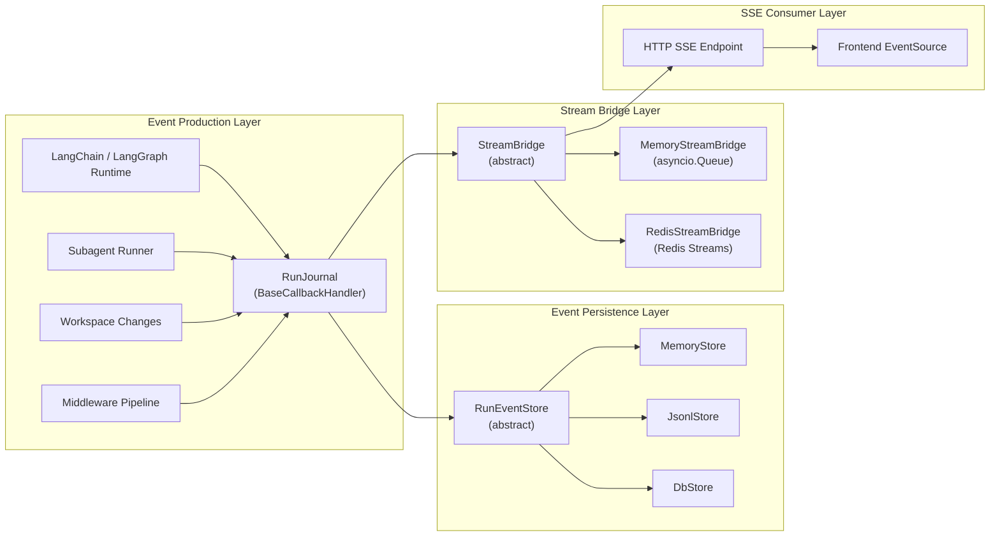
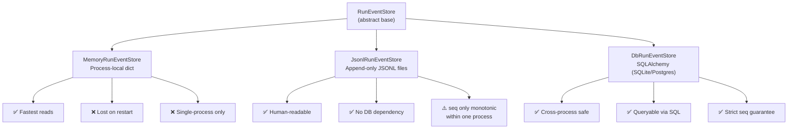
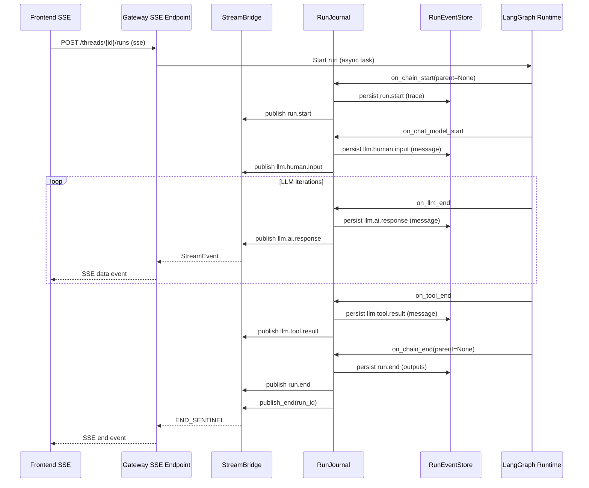

---
slug:24-stream-bridge-and-event-pipeline
blog_type:normal
---


Stream Bridge 和 Event Pipeline 构成了 DeerFlow 的实时通信主干，在后端 Worker 中长时间运行的 Agent 执行与前端消费的 Server-Sent Events (SSE) 端点之间架起了桥梁。**StreamBridge** 通过可插拔的传输层将生产者（Agent Worker）与消费者（HTTP SSE 端点）解耦，而 **RunJournal** 则通过 LangChain 回调捕获结构化的执行证据，并通过带有固定且版本化契约的 **RunEventStore** 进行持久化。这两个子系统协同工作，确保生成的每一个 token、调用的每一个工具，以及 subagent 生命周期的每一次状态转换都能被实时观察，并支持持久化重放。

## 架构概述

事件管道跨越三个独立的层运作：事件生产（RunJournal 回调）、事件持久化以及事件流。每一层都有明确的边界和规范来管控数据流。



RunJournal 处于生产层的核心位置，负责将 LangChain 基于回调的执行模型转化为结构化的 `RunEvent` 记录，这些记录包含稳定的 `event_type`、`category`、`content` 和 `metadata`。这些记录会同时流入 RunEventStore 进行持久化存储，并流入 StreamBridge 进行实时 SSE 分发。这种双路径设计确保了即使客户端在流传输过程中断开连接，完整的事件历史记录依然可以在重连时从持久化存储中查询获取。

来源：[__init__.py](backend/packages/harness/deerflow/runtime/stream_bridge/__init__.py#L1-L32), [base.py](backend/packages/harness/deerflow/runtime/stream_bridge/base.py#L1-L92), [journal.py](backend/packages/harness/deerflow/runtime/journal.py#L1-L50)

## Stream Bridge 协议

`StreamBridge` 抽象基类定义了一个精简但强大的协议，用于将 Agent Worker 与 SSE 端点解耦。它与 LangGraph Platform 的 Queue + StreamManager 架构保持一致，在入队事件的生产者与作为异步迭代器消费事件的消费者之间实现了清晰的分离。

### 核心数据类型

三个不可变的数据类构成了 stream bridge 协议的基础词汇：

| 类型 | 用途 | 关键字段 |
|------|---------|------------|
| `StreamEvent` | 单个可分发事件 | `id` (单调递增的 SSE ID), `event` (SSE 事件名称), `data` (JSON 负载) |
| `StreamGap` | 订阅者落后于留存的历史记录 | `requested_event_id`, `earliest_available_event_id`, `latest_available_event_id` |
| `StreamItem` | `subscribe()` 产出的联合类型 | `StreamEvent \| StreamGap` |

两个哨兵值补充了这些数据类型。当在心跳间隔（默认 15 秒）内没有事件到达时，会产出 `HEARTBEAT_SENTINEL`，这有助于通过代理和负载均衡器保持 SSE 连接的活跃状态。`END_SENTINEL` 则表示生产者已调用 `publish_end()`，且当前运行不会再产生后续事件。

### 抽象接口契约

`StreamBridge` 协议定义了每个实现都必须满足的四个核心操作：

```python
class StreamBridge(abc.ABC):
    supports_cross_process: bool = False

    async def publish(self, run_id: str, event: str, data: Any) -> None: ...
    async def publish_end(self, run_id: str) -> None: ...
    def subscribe(self, run_id: str, *, last_event_id: str | None = None,
                  heartbeat_interval: float = 15.0) -> AsyncIterator[StreamItem]: ...
    async def cleanup(self, run_id: str, *, delay: float = 0) -> None: ...
```

`subscribe` 方法是消费端的入口点。它接受一个 `last_event_id` 参数，以支持 **Last-Event-ID 重连** —— 当客户端在网络断开后重新连接时，它会传递其最后接收到的事件 ID，bridge 随后会重放所有后续留存的事件，然后再转入实时追踪模式。如果订阅者的游标已落后于留存缓冲区的下限，bridge 将产出一个 `StreamGap` 并终止操作，以此通知消费者从 RunEventStore 重新加载持久化状态，而不是呈现一份看似完整实则缺失的重放记录。

<CgxTip>`supports_cross_process` 标志用于区分单进程 bridge（基于内存）与多进程 bridge（基于 Redis）。拥有多个 Worker 的网关部署必须使用跨进程 bridge；否则，由某个 Worker 发布的 SSE 事件将永远无法到达连接在其他 Worker 上的订阅者。</CgxTip>

来源：[base.py](backend/packages/harness/deerflow/runtime/stream_bridge/base.py#L1-L92)

## MemoryStreamBridge：进程内实现

`MemoryStreamBridge` 是默认实现，底层由基于进程内事件日志的 `asyncio.Condition` 负责生产者-消费者的协调。每次运行都会分配一个专属的 `_RunStream` 数据结构，其中包含一个有界事件列表、一个用于阻塞唤醒的 `asyncio.Condition`、一个 `ended` 标志，以及一个用于记录从缓冲区头部移除了多少事件的 `start_offset`。

### 事件 ID 方案与重放

事件 ID 采用 `{timestamp_millis}-{seq}` 格式，其中 `seq` 是每次运行内从零开始单调递增的计数器。由于 `seq` 等同于事件在本次运行中的绝对偏移量，因此 bridge 可以通过 **O(1)** 的算术运算将 `Last-Event-ID` 游标解析为缓冲区索引，而无需扫描整个留存缓冲区：

```
Event ID: 1718437200000-42
                       ^^-- seq = 42 = 运行内的绝对偏移量
```

`_resolve_start_offset` 方法负责处理三种场景。当 `last_event_id` 为 `None` 时，重放从当前的 `start_offset` 开始。当解析出的 `seq` 低于留存水位线（`start_offset`）时，bridge 会返回一个 `StreamGap` —— 表示请求的游标指向已被移除的历史记录。当 `seq` 处于留存缓冲区范围内时，它会验证计算出的索引处的事件 ID 是否匹配，然后从下一个位置恢复重放。如果遇到未知 ID 格式，则会回退到从最早的留存事件开始重放，并记录一条警告日志。

### 有界留存与订阅者延迟检测

缓冲区强制执行可配置的 `queue_maxsize`（默认为 256）。当缓冲区溢出时，最旧的事件将被删除，`start_offset` 也会随之推进。这形成了一个留存历史的滑动窗口。如果实时订阅者的 `next_offset` 在流传输过程中低于 `start_offset` —— 意味着新事件已将订阅者的游标推出了留存窗口 —— bridge 将产出带有订阅者最后已知游标的 `StreamGap` 并终止。这可以防止流传输路径中出现无声的数据丢失。

订阅循环使用 `asyncio.Condition.wait()`，其超时时间等于 `heartbeat_interval`。当等待超时时，会产出 `HEARTBEAT_SENTINEL`。当有新事件到达时，条件变量会被通知，循环随即恢复并清空缓冲区。一旦生产者设置了 `ended` 标志且所有缓冲事件均被消费完毕，即会产出 `END_SENTINEL`。

来源：[memory.py](backend/packages/harness/deerflow/runtime/stream_bridge/memory.py#L1-L191)

## RedisStreamBridge：跨进程实现

`RedisStreamBridge` 将 stream bridge 扩展到了多进程部署场景，使用 Redis Streams 作为底层传输层。每次运行映射到一个 Redis Stream 键（`{key_prefix}:{run_id}`），订阅者通过 `XREAD` 直接读取，从而使得 SSE bridge 能够跨越多个网关 Worker 进程使用，同时保留 Last-Event-ID 重放语义。

### Redis Stream 映射

Redis Streams 原生支持 stream bridge 所需的模式 —— 单调递增的 ID、通过 `MAXLEN` 实现的有界留存，以及通过 `BLOCK` 实现的阻塞读取。bridge 将其协议映射到 Redis 原语之上：

| StreamBridge 概念 | Redis 原语 |
|---------------------|-----------------|
| `StreamEvent.id` | Redis Stream 条目 ID (`{ms}-{seq}`) |
| 有界缓冲区 (`queue_maxsize`) | `XADD ... MAXLEN N` |
| `publish_end()` | 带有 `kind=end` 字段的 `XADD` |
| `subscribe()` 重放 | `XREAD ... AFTER {last_event_id}` |
| `subscribe()` 实时追踪 | `XREAD ... BLOCK {ms}` |
| 基于 TTL 的清理 | `EXPIRE key {ttl}` (默认 86400s) |
| Gap 检测 | 原子化 `XRANGE` + `XREVRANGE` + `XREAD` 管道 |

事件负载以 JSON 字符串的形式编码在 Redis Stream 字段（`kind`、`event`、`data`）中，其中 `data` 字段包含了 JSON 序列化后的负载。bridge 使用 `json.dumps(data, default=str, ensure_ascii=False, separators=(",", ":"))` 进行紧凑编码，`default=str` 回退机制确保非 JSON 可序列化的值会被转换为字符串，而不会导致发布路径崩溃。

### 原子化 Gap 检测

Redis 实现中的一个关键挑战在于，阻塞式 `XREAD` 无法参与 Redis 事务。因此，为了保证正确性，实时订阅者会使用**非阻塞的原子化快照**，即在一个 `MULTI/EXEC` 管道中读取留存边界（使用 `XRANGE` 获取最早记录，`XREVRANGE` 获取最新记录）以及任何待处理条目（使用不带 BLOCK 的 `XREAD`）。这可以防止在边界检查和后续读取之间添加新事件时产生竞态条件，避免导致订阅者错过 gap 信号。

快照逻辑如下：如果订阅者的游标（`stream_id`）小于最早可用的条目 ID，说明订阅者已落后于留存的历史记录，此时将产出 `StreamGap`。只有在确认游标处于边界范围内后，订阅者才会继续执行阻塞式 `XREAD`，将其作为唤醒信号。在下一轮迭代中，阻塞读取的响应会在产出给客户端之前，先与留存水位线进行校验，从而确保无游标的订阅者也能获得与内存实现相同的落后保障机制。

### 瞬时错误韧性

Redis bridge 在传播异常之前，最多可以容忍 `_MAX_SUBSCRIBE_RETRIES`（3）次连续的瞬时错误（`ConnectionError`、`TimeoutError`）。瞬时错误会触发指数退避策略，上限为 `heartbeat_interval` 秒。错误计数器仅在接收到非空响应时才会重置，这防止了永久失败的阻塞读取在非阻塞事务尝试间不断无限重试。

<CgxTip>有意为之的是，`RedisStreamBridge` 并未在 `__init__.py` 中导入。`redis` 包是一个可选的额外依赖，立即导入会将每个进程——哪怕是仅使用单进程内存的部署——都耦合到 Redis 依赖上。只有在配置了 `stream_bridge.type == "redis"` 时，该类才会在 `make_stream_bridge()` 内部进行懒加载。</CgxTip>

来源：[redis.py](backend/packages/harness/deerflow/runtime/stream_bridge/redis.py#L1-L382), [__init__.py](backend/packages/harness/deerflow/runtime/stream_bridge/__init__.py#L1-L32)

## Stream Bridge 工厂与配置

`make_stream_bridge()` 异步上下文管理器作为 bridge 初始化的统一入口，沿用了由 `make_checkpointer()` 建立的模式。它按优先级顺序从多个来源解析配置，并处理 Redis 实现的懒加载。

```mermaid
flowchart TD
    A["make_stream_bridge(app_config)"] --> B{"config resolved?"}
    B -->|"app_config.stream_bridge"| C["StreamBridgeConfig"]
    B -->|"None"| D{"DEER_FLOW_STREAM_BRIDGE_REDIS_URL<br/>env var set?"}
    D -->|"Yes"| E["StreamBridgeConfig(type=redis)"]
    D -->|"No"| F["config = None"]
    C --> G{"config.type?"}
    E --> G
    F --> G
    G -->|"None or memory"| H["MemoryStreamBridge<br/>queue_maxsize=256"]
    G -->|"redis"| I["RedisStreamBridge<br/>lazy import redis.asyncio"]
    G -->|"other"| J["ValueError"]
    H --> K["yield bridge"]
    I --> K
    K --> L["bridge.close&#40;&#41; on exit"]
```



配置解析遵循三级优先级：显式的 `app_config.stream_bridge` → `DEER_FLOW_STREAM_BRIDGE_REDIS_URL` 环境变量 → 全局 `get_stream_bridge_config()`。当未找到任何配置时，工厂默认使用 `MemoryStreamBridge`，其队列最大容量为 256。Redis URL 本身遵循自身的解析链：`config.redis_url` → `DEER_FLOW_STREAM_BRIDGE_REDIS_URL` → `REDIS_URL` → `redis://localhost:6379/0`。

| 配置字段 | 默认值 | 描述 |
|---------------------|---------|-------------|
| `type` | `"memory"` | bridge 后端：`"memory"` 或 `"redis"` |
| `queue_maxsize` | `256` | 每次运行保留的最大事件数 |
| `redis_url` | `"redis://localhost:6379/0"` | Redis 连接 URL（仅限 redis 类型） |
| `max_connections` | `None` (无限制) | Redis 连接池上限（仅限 redis 类型） |
| `stream_ttl_seconds` | `86400` (24小时) | 用于自动清理的 Redis Stream TTL（仅限 redis 类型） |

来源：[async_provider.py](backend/packages/harness/deerflow/runtime/stream_bridge/async_provider.py#L1-L92)

## RunJournal：基于回调的事件生产

`RunJournal` 是一个 `BaseCallbackHandler`，位于 LangChain 回调机制与可插拔的 `RunEventStore` 之间。它将回调数据标准化为结构化的 `RunEvent` 记录，并负责处理 token 使用量的累积。两个设计约束决定了它的行为：它运行在运行时事件循环线程上，采取内联方式（`run_inline = True`）执行，以串行化处理来自并行工具调用的变更；同时它是绑定到事件循环的（`deerflow_loop_bound = True`），以防止被运行在独立事件循环上的 subagent 所继承。

### 回调到事件的映射

RunJournal 将 LangChain 回调调用转换为事件目录中定义的规范事件类型。每个回调方法从 LangChain 运行时对象中提取结构化数据，并将缓冲写入排入 RunEventStore 队列。

| LangChain 回调 | 事件类型 | 类别 | 内容 |
|-------------------|------------|----------|---------|
| `on_chain_start(parent=None)` | `run.start` | `trace` | `{"chain": chain_name}` |
| `on_chain_end(parent=None)` | `run.end` | `outputs` | 不透明的根图输出 |
| `on_chain_error` | `run.error` | `error` | `str(error)` |
| `on_chat_model_start` | `llm.human.input` | `message` | 第一个持久化的 `HumanMessage.model_dump()` |
| `on_llm_end` | `llm.ai.response` | `message` | 包含 `tool_calls` 的 `AIMessage.model_dump()` |
| `on_tool_end` | `llm.tool.result` | `message` | `ToolMessage.model_dump()` |
| `on_llm_error` | `llm.error` | `trace` | `str(error)` |

`on_chat_model_start` 回调是捕获第一条人类消息的规范位置，因为此时消息已完全结构化，且该回调仅在真正的 LLM 调用时触发（而非每个图节点都会触发），其内容也绝不会因检查点修剪而被压缩。人类输入持久化规则（`_should_persist_human_input_message`）会过滤掉历史摘要消息和隐藏消息，除非它们携带 `ask_clarification` 响应 —— 这与历史记录初始化时应用的规则相同。

### 写入缓冲与刷新

RunJournal 维护着一个内存写入缓冲区，具有可配置的 `flush_threshold`（默认为 20 个事件）。事件经过缓冲后异步刷新至 RunEventStore，并在遇到终止事件（`on_chain_end` 和 `on_chain_error`）时触发同步刷新。进度报告回调可以配置为以可定制的间隔（默认为 5 秒）将中间状态推送到 StreamBridge，这使得 SSE 消费者能够近乎实时地洞察长时间运行的过程，而无需等待缓冲区被填满。

### Token 使用量累积

Token 使用量在内存中按每次 LLM 调用进行累积，并根据调用者身份（`lead_agent`、`subagent`、`middleware`）以及模型名称进行分桶。去重集合机制防止了当 LangChain 针对同一个运行 ID 多次触发 `on_llm_end` 时出现重复计数。运行完成后，累积的总量将写入 `RunRecord`，作为可查询的运行级指标。

来源：[journal.py](backend/packages/harness/deerflow/runtime/journal.py#L1-L399), [catalog.py](backend/packages/harness/deerflow/runtime/events/catalog.py#L1-L114)

## 事件契约：固定的 Schema 与类别

运行事件流契约（`contracts/run_event_stream_contract.json`）是一份**固定且版本化**的规范，用于管控流经管道的每一个事件。它冻结了现有的事件名称和类别，描述了生产者负载，并记录了兼容性规则 —— 这一切均不会改变运行时行为。该契约会在 CI 测试中与事件目录进行比对校验，确保双方保持同步更新。

### 兼容性规则

该契约确立了清晰的“仅新增”演进策略：

| 变更类型 | 是否允许？ | 示例 |
|-------------|----------|----------|
| 新增事件类型 | ✅ 是 | 可以引入新的事件类型 |
| 新增可选负载字段 | ✅ 是 | content/metadata 中的新可选字段 |
| 新增信封字段 | ✅ 是 | 新的顶层记录字段 |
| 移除事件类型 | ❌ 否 | 破坏性变更 —— 消费者依赖现有类型 |
| 重命名事件类型 | ❌ 否 | 破坏性变更 —— 会中断所有消费者 |
| 更改事件类别 | ❌ 否 | 破坏性变更 —— 类别会驱动投影过滤器 |
| 移除必需字段 | ❌ 否 | 破坏性变更 —— 消费者期望必需字段存在 |
| 更改必需字段类型 | ❌ 否 | 破坏性变更 —— 类型预设会失效 |

**消费者规则**是明确的：消费者必须忽略未知的事件类型、未知的信封字段，以及未知的可选负载或元数据字段。这种前向兼容的立场使得管道能够在无需协同部署的情况下进行演进。

### 事件类别

事件被划分为八个类别，用于驱动可见性和投影过滤器：

| 类别 | 用途 | 事件类型 |
|----------|---------|-------------|
| `trace` | 从消息投影中排除的执行证据 | `run.start`, `llm.error` |
| `message` | 候选消息投影（仍需应用可见性过滤器） | `llm.human.input`, `llm.ai.response`, `llm.tool.result` |
| `outputs` | 根图完成输出（非权威生命周期状态） | `run.end` |
| `error` | 回调观察到的运行或链失败证据 | `run.error` |
| `middleware` | 中间件状态变更审计证据 | `middleware:{tag}` (动态) |
| `context` | 关于有效隐藏上下文的仅标识证据 | `context:memory` |
| `subagent` | subagent 生命周期和持久化步骤证据 | `subagent.start`, `subagent.step`, `subagent.end` |
| `workspace` | 运行作用域内的 workspace 和输出文件变更证据 | `workspace_changes` |

### 动态中间件事件

中间件事件遵循 `middleware:{tag}` 模式，而非固定的事件类型。目录定义了一个 `RunEventPattern`，其 `prefix` 为 `"middleware:"`，类别为 `"middleware"`。已知的标签包括 `guardrail`、`safety_termination`、`skill_activation` 和 `skill_secrets`。该模式将标签长度限制为 `RUN_EVENT_TYPE_MAX_LENGTH - len("middleware:")` 个字符，且总事件类型长度不得超过 32 个字符。

### 记录 Schema

每个事件记录均包含以下必需字段：

```json
{
  "thread_id": "string",
  "run_id": "string",
  "seq": "integer (min 1)",
  "event_type": "string (1-32 chars)",
  "category": "string (1-16 chars)",
  "content": "any JSON type",
  "metadata": "object",
  "created_at": "ISO 8601 date-time",
  "user_id": "string | null (optional)"
}
```

`seq` 字段在单个 thread 内**严格递增**，为事件重放提供全局顺序。契约指出了一个重要限制：`JsonlRunEventStore` 仅能保证在单个进程内单调分配 `seq`；对于共享的多进程写入，必须使用 `DbRunEventStore` 以维持序列保证。

### 已知缺陷

契约透明地记录了消费者必须考虑的五个已知缺陷：

1. **混合的事件名称分隔符** —— 为了兼容性，现有的点号、冒号及纯单词事件名称保持原样。规范化处理需要进行版本化的迁移。
2. **工具调用意图** —— 工具调用请求内嵌在 `llm.ai.response` 内容中；缺失或超时的工具结果可能不会产生专门的产出事件。
3. **终止运行状态** —— `run.end` 始终显示为 `success`（它仅是根图完成的标志）。关于 success、error、interrupted 和 timeout 状态，`RunRow.status` 才是权威来源。
4. **依赖后端的序列化** —— 内存模式在 `run.end` 内容中保留嵌套的 Python 值；而 JSONL 和数据库持久化则通过 `json.dumps(default=str)` 将非 JSON 值字符串化。
5. **中间件覆盖范围** —— 循环检测和延迟工具提升目前不会发出中间件事件。

来源：[run_event_stream_contract.json](contracts/run_event_stream_contract.json#L1-L456), [catalog.py](backend/packages/harness/deerflow/runtime/events/catalog.py#L1-L114)

## Subagent 事件生命周期

subagent 执行会生成一个结构化的三事件生命周期，这些事件通过与 journal 事件相同的管道流转。`subagent.start`、`subagent.step` 和 `subagent.end` 事件携带了任务作用域的标识符以及步骤级别的粒度。

| 事件 | 触发条件 | 必需内容字段 |
|-------|---------|------------------------|
| `subagent.start` | `task_started` | `task_id`, `description` |
| `subagent.step` | `task_running` | `task_id`, `message_index`, `kind` (`ai`/`tool`), `text`, `truncated` |
| `subagent.end` | `task_completed` / `task_failed` / `task_cancelled` / `task_timed_out` | `task_id`, `status` |

`subagent.step` 事件采用条件化 schema：当 `kind` 为 `"ai"` 时，`tool_calls` 是必需的（包含每次调用的名称和参数）；当 `kind` 为 `"tool"` 时，`tool_name` 是必需的。`truncated` 标志指示步骤文本是否为了存储而被截断，而 `tool_calls` 条目则携带各自的 `args_truncated` 标志，以实现细粒度的截断追踪。

`subagent.end` 事件携带一个 `status` 字段，其取值受 subagent 状态契约约束，包括：`completed`、`failed`、`cancelled`、`timed_out` 和 `polling_timed_out`。可选的 `subagent_stop_reason` 字段（契约 v2 版本）记录了 guardrail 限制导致运行提前结束的原因，有效值为：`token_capped`、`turn_capped`、`loop_capped`。

来源：[run_event_stream_contract.json](contracts/run_event_stream_contract.json#L219-L300), [subagent_status_contract.json](contracts/subagent_status_contract.json#L1-L7)

## 事件存储后端

RunEventStore 抽象基类定义了 RunJournal 写入的持久化接口。三种实现提供了不同的持久性和并发性权衡：



事件存储后端的选择直接影响 `seq` 序列保证。`MemoryRunEventStore` 和 `JsonlRunEventStore` 在单个进程内分配序列号，这对于单 Worker 部署已足够。`DbRunEventStore` 利用数据库级别的事务性写入，保证了跨多进程严格递增的 `seq`，使其成为多 Worker 网关部署的必选项。

来源：[run_event_stream_contract.json](contracts/run_event_stream_contract.json#L38-L41), [base.py](backend/packages/harness/deerflow/runtime/events/store/base.py#L1-L1)

## Workspace 变更事件

`workspace_changes` 事件用于捕获运行作用域内的文件修改，其采用专为前端 diff 渲染设计的丰富 schema。该事件由 `workspace_changes.record_workspace_changes()` 产生，携带一个内嵌于元数据中的 `workspace_changes` 对象，其中包含版本、摘要、文件以及限制信息。

摘要提供汇总统计数据（创建、修改、删除、创建符号链接、增加行数、删除行数、是否截断），而每个文件条目则携带详细的元数据，包括变更前后的 SHA-256 哈希值、带有截断标志的 diff 文本、二进制/敏感文件标志以及符号链接目标信息。限制对象记录了所应用的阈值（max_files, max_scanned_files, max_file_bytes_for_diff, max_total_diff_bytes），允许消费者区分“无变更”和“因限制而被截断的变更”。

来源：[run_event_stream_contract.json](contracts/run_event_stream_contract.json#L301-L398)

## 端到端事件流

单个用户查询的完整生命周期展示了所有组件是如何交互的：



双路径架构在此处清晰可见：每个事件都会同时流向 RunEventStore（用于持久化历史记录和重连重放）和 StreamBridge（用于实时 SSE 分发）。如果客户端在任意时刻断开连接，它可以携带 `Last-Event-ID` 请求头重新连接。StreamBridge 会从该游标开始重放留存的事件；如果游标已落后于留存缓冲区，则会产出 `StreamGap` —— 此时网关将从 RunEventStore 重新加载完整的历史记录，并随后恢复实时流传输。

来源：[base.py](backend/packages/harness/deerflow/runtime/stream_bridge/base.py#L60-L92), [journal.py](backend/packages/harness/deerflow/runtime/journal.py#L330-L399)

## 实现对比

| 维度 | MemoryStreamBridge | RedisStreamBridge |
|-----------|-------------------|-------------------|
| **跨进程** | ❌ 否 | ✅ 是 |
| **底层存储** | `asyncio.Condition` + list | Redis Streams (`XADD`/`XREAD`) |
| **事件 ID 格式** | `{ts_ms}-{seq}` | Redis 原生 (`{ms}-{seq}`) |
| **重放解析** | 基于 `seq` 的 O(1) 算术运算 | `XREAD AFTER {id}` |
| **Gap 检测** | 比较 `seq` 与 `start_offset` | 原子化 `XRANGE` + `XREVRANGE` + `XREAD` 管道 |
| **留存策略** | 有界列表（默认 256） | `MAXLEN N` + TTL（默认 24h） |
| **心跳机制** | `asyncio.wait_for` 超时 | `XREAD BLOCK {ms}` 超时 |
| **错误韧性** | 不适用（进程内） | 指数退避，最大重试 3 次 |
| **清理操作** | 字典弹出 | `DEL key`（在可选延迟之后） |
| **依赖项** | 无（仅标准库） | 可选额外依赖 `redis` |
| **导入策略** | 立即导入（始终可用） | 懒加载（仅在配置时） |

来源：[memory.py](backend/packages/harness/deerflow/runtime/stream_bridge/memory.py#L1-L191), [redis.py](backend/packages/harness/deerflow/runtime/stream_bridge/redis.py#L1-L382)

## 相关页面

- **[网关 API 与认证](23-gateway-api-and-auth)** — 介绍网关如何暴露 SSE 端点并管理流连接的身份验证
- **[检查点与状态管理](18-checkpointing-and-state-management)** — 介绍检查点器如何补充事件管道以实现状态恢复
- **[Subagent 执行引擎](9-subagent-execution-engine)** — 介绍 subagent 生命周期事件的产生与消费方式
- **[Agent 中间件管道](10-agent-middleware-pipeline)** — 介绍中间件事件的生成方式及其含义
- **[Next.js 前端架构](22-next-js-frontend-architecture)** — 介绍前端如何消费 SSE 事件并处理重连
