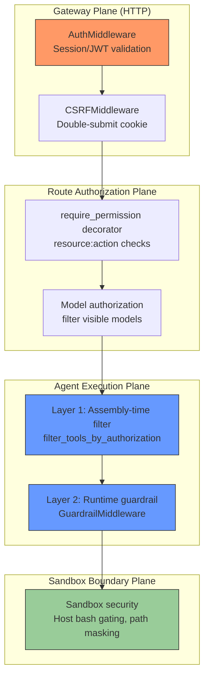
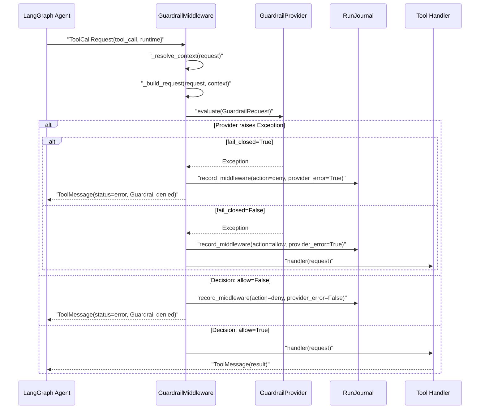
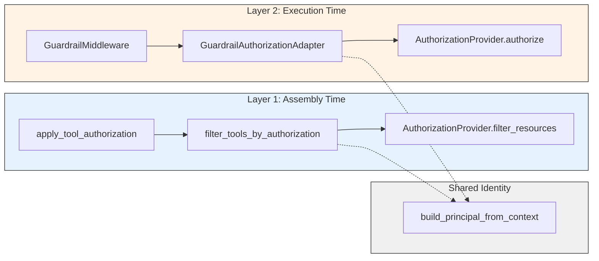
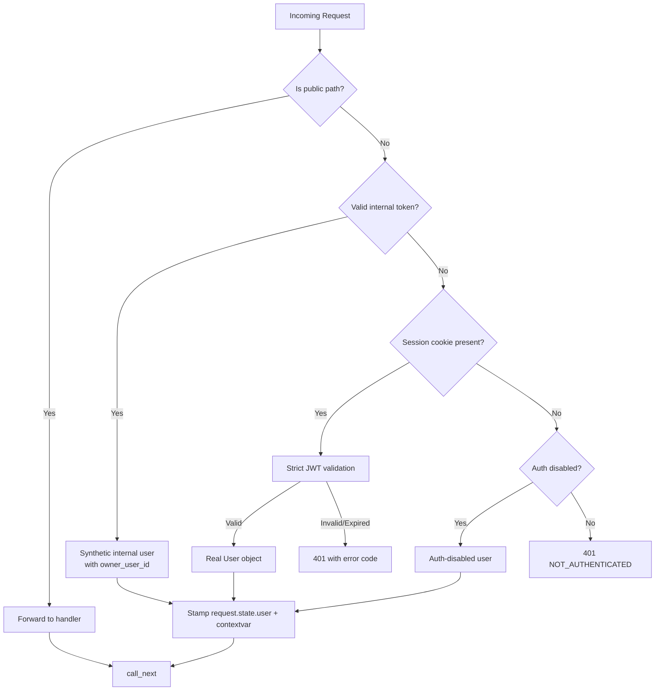

---
slug:25-guardrails-and-safety-middleware
blog_type:normal
---

DeerFlow 的安全架构是一个多层防御系统，能够在每次工具调用、API 请求和沙箱操作进入执行阶段前，对其进行拦截、评估和管控。系统并未依赖于单一的安全策略检查点，而是将安全控制分布在四个独立的层面上——网关认证、路由授权、Agent 级别的工具调用防护，以及沙箱边界强制执行。每个层面都具备独立的“默认拒绝”语义和可插拔的提供者契约。本文档将逐一剖析各个层级的细节、数据结构、故障模式，以及将它们串联起来的运作机制。

## 架构概述：四层防御模型

安全中间件流水线可以被视为一系列的“关卡”，每个关卡在请求生命周期的不同阶段发挥作用。例如，来自 IM 渠道用户的一次工具调用，在工具实际执行前，需要依次经过 HTTP 认证、CSRF 校验、路由权限解析、工具组装期过滤，以及最后的单次调用防护评估。

每一层均可独立配置，亦会独立发生故障。系统的核心设计原则是**默认拒绝**——当任何提供者抛出异常时，默认行为是拒绝操作，而非予以放行。

来源: [auth_middleware.py](/backend/app/gateway/auth_middleware.py#L1-L164), [csrf_middleware.py](/backend/app/gateway/csrf_middleware.py#L1-L271), [middleware.py](/backend/packages/harness/deerflow/guardrails/middleware.py#L1-L218), [security.py](/backend/packages/harness/deerflow/sandbox/security.py#L1-L46)

## GuardrailMiddleware：工具调用拦截器

`GuardrailMiddleware` 是核心的执行期安全关卡。它实现了 LangChain 的 `AgentMiddleware` 协议，通过 `wrap_tool_call`（同步）和 `awrap_tool_call`（异步）钩子拦截并包装每一次工具调用。在工具处理器被调用前，中间件会根据工具调用的元数据和运行时上下文构建一个 `GuardrailRequest`，将评估工作委托给 `GuardrailProvider`，进而决定是将调用转发给处理器，还是返回一个合成的错误 `ToolMessage`。

### GuardrailMiddleware 数据流转

### GuardrailRequest：授权上下文

中间件从运行时提取身份与执行上下文，以此构建内容详尽的授权请求。提供者在进行策略决策时可能需要的每一个字段，都在此予以填充：

| 字段 | 来源 | 用途 |
|-------|--------|---------|
| `tool_name` | `request.tool_call["name"]` | 主要评估目标 |
| `tool_input` | `request.tool_call["args"]` | 基于参数的限制 |
| `agent_id` | `passport` 参数 | 用于多 Agent 范围界定的 Agent 身份 |
| `thread_id` | `context["thread_id"]` | 会话级别的策略控制 |
| `is_subagent` | `context["is_subagent"]` | 针对子 Agent 的特定限制 |
| `user_id` / `user_role` | `context["user_id"]` / `context["user_role"]` | 基于身份的 RBAC |
| `oauth_provider` / `oauth_id` | 运行时上下文 | SSO 身份关联 |
| `run_id` | `context["run_id"]` | 审计轨迹关联 |
| `channel_user_id` | `context["channel_user_id"]` | IM 渠道身份 |
| `is_internal` | `context["is_internal"]` | 内部调用者旁路逻辑 |
| `authz_attributes` | `context["authz_attributes"]` (规范化处理后) | 基于自定义属性的策略 |

`authz_attributes` 字段会经过 `normalize_authz_attributes()` 处理，该函数强制执行类型安全检查——仅接受 `None` 或 `Mapping` 类型。若传入非 Mapping 类型的值，系统将在边界处直接抛出 `TypeError`，而不会进行隐式类型转换。

### 故障关闭与故障开启语义

中间件的 `fail_closed` 参数（默认值为 `True`）是最为关键的安全控制开关。当提供者抛出异常时，系统的行为会发生分野：

- **`fail_closed=True`**：中间件会生成一个拒绝决策，附带原因码 `oap.evaluator_error`，并在 RunJournal 中记录该事件且标记 `provider_error=True`，最后返回一个错误 `ToolMessage`，指示 Agent 选择替代方案。
- **`fail_closed=False`**：中间件会生成一个放行决策，附带相同的原因码，记录事件后，将调用转发给处理器。

上述两条路径均会保留 `GraphBubbleUp` 异常——LangGraph 用于中断、暂停和恢复的控制流信号，绝不会被错误处理器吞没。

### 审计轨迹：RunJournal 集成

只要 RunJournal 可用，每一次防护决策——无论放行、拒绝还是提供者错误——都会被持久化到 RunJournal 中。`_record_guardrail_event` 方法被刻意设计为尽力而为模式：如果 `context["__run_journal"]` 不存在（如嵌入式运行、子 Agent 执行），事件将被静默跳过。如果日志的 `record_middleware` 调用本身失败，异常将被捕获并记录为警告，且不会影响工具的执行行为。

被记录的事件包含工具名称、调用 ID、Agent ID、子 Agent 标志、用户角色、允许/拒绝裁定、策略 ID、原因码、原因消息（截断至 500 个字符）、`fail_closed` 设置以及 `provider_error` 标志——为任何安全相关决策提供完整的取证轨迹。

来源: [middleware.py](/backend/packages/harness/deerflow/guardrails/middleware.py#L24-L218), [provider.py](/backend/packages/harness/deerflow/guardrails/provider.py#L1-L69), [principal.py](/backend/packages/harness/deerflow/authz/principal.py#L16-L31)

## GuardrailProvider 协议：可插拔授权契约

`GuardrailProvider` 是一个带有 `@runtime_checkable` 装饰器的协议——任何实现了 `evaluate` 和 `aevaluate` 方法的类都能满足该协议的要求，且无需继承特定的基类。提供者通过类路径加载，其机制与 DeerFlow 加载模型、工具和沙箱提供者所使用的 `resolve_variable()` 一致，从而保证了系统扩展的一致性。

### 内置提供者：AllowlistProvider

系统自带了一个最简单的提供者。`AllowlistProvider` 实现了双列表模型，并谨慎处理了 `None` 与空列表的语义差异：

| 配置模式 | `allowed_tools` | `denied_tools` | 行为表现 |
|---------------|----------------|----------------|----------|
| 全部允许（默认） | `None` | `None`/`[]` | 所有工具均放行 |
| 显式白名单 | `["web_search", "read_file"]` | `[]` | 仅列表中的工具放行 |
| 显式拒绝 | `None` | `["update_agent"]` | 除被拒绝的工具外均放行 |
| 全部拒绝 | `[]` | `[]` | 拒绝所有工具 |

这里的关键设计决策在于区分 `None`（未配置白名单 → 全部允许）和 `[]`（显式配置为空列表 → 全部拒绝）。如果简单地使用真值测试，会将 `[]` 视作 `None`，从而导致系统在静默中转为“故障开启”状态——该提供者使用了显式的 `is not None` 检查来防范这一问题。

拒绝规则永远优先于允许规则：同时存在于两个列表中的工具将被拒绝，原因码为 `oap.tool_not_allowed`。

来源: [provider.py](/backend/packages/harness/deerflow/guardrails/provider.py#L51-L69), [builtin.py](/backend/packages/harness/deerflow/guardrails/builtin.py#L1-L28)

## 两层授权架构

DeerFlow 的授权系统在 Agent 生命周期的两个不同节点强制执行同一套策略，从而消除了模型*可见*的工具与运行时*可执行*的工具之间的缝隙。

### 第一层：组装期能力过滤

在工具绑定到 Agent 之前，`filter_tools_by_authorization` 会移除当前主体角色绝对无法使用的任何工具。此操作依赖于 `AuthorizationProvider.filter_resources` 方法，该方法会返回候选工具名称中符合策略可见性的子集。该过滤器会保持原有顺序，绝不增加新项，并且会抛出与单次调用授权一致的 role/resource 错误。

组装期过滤器通过 `apply_tool_authorization` 调用，这是一个单行的包装函数，负责解析提供者、从运行时上下文构建主体，并应用过滤器。当 `authorization.enabled` 为 false 时，这是一个纯粹的无操作，直接返回原始工具列表。

### 第二层：运行时执行拒绝

在工具组装完成后，`GuardrailAuthorizationAdapter` 会将 `AuthorizationProvider` 桥接到 `GuardrailProvider` 协议上，使现有的 `GuardrailMiddleware` 能够在工具调用阶段执行授权决策，而无需引入新的中间件类。该适配器通过 `build_principal_from_context` 将 `GuardrailRequest` 的字段映射为 `AuthzRequest` 的字段，调用授权提供者，并将 `AuthzDecision` 转换回 `GuardrailDecision`。

### 基础设施工具旁路

该适配器支持一个 `infrastructure_tool_names` 集合——这些框架工具是基于已经过滤的能力集创建的。这些工具会直接获得放行决策，原因码为 `authz.infrastructure_tool`，策略 ID 为 `authz:infrastructure`，从而完全绕过提供者。这避免了对其可用性已在第一层受限的工具进行冗余的二次评估。

### 异常传播设计

适配器刻意**不**捕获提供者抛出的异常。这是一个关键的设计决策：消费该适配器的 `GuardrailMiddleware` 已经通过自身的 try/except 包装实现了故障关闭语义。在适配器中捕获异常不仅会重复该逻辑，还可能导致两层之间出现行为不一致的风险。适配器的文档字符串已明确记录了这一考量，以防未来的重构引入 catch 代码块。

来源: [provider.py](/backend/packages/harness/deerflow/authz/provider.py#L1-L124), [adapter.py](/backend/packages/harness/deerflow/authz/adapter.py#L1-L139), [enforcement.py](/backend/packages/harness/deerflow/authz/enforcement.py#L1-L43), [tool_filter.py](/backend/packages/harness/deerflow/authz/tool_filter.py#L1-L73)

## RBAC 提供者：内置策略引擎

`RbacAuthorizationProvider` 是默认的授权提供者，通过 `config.yaml` 中的 `roles` 映射进行配置。它会在构造阶段将所有策略编译为不可变的 `frozenset` 结构，并进行详尽的校验，在处理任何请求之前即拒绝拼写错误、空值及未知键。

### 策略编译与校验

RBAC 提供者在构造期的校验刻意采取严格策略。未知的策略键（例如将 `"allow"` 误拼为 `"alow"`）会立即抛出 `ValueError`，防止在静默中错误授予权限。`allow` 字段接受四种形式：

| 取值 | 语义 |
|-------|-----------|
| 省略 | 允许全部（拒绝规则依然生效） |
| `"*"` 或 `True` | 允许全部（拒绝规则依然生效） |
| `False` | 拒绝全部 |
| `["tool_a", "tool_b"]` | 显式白名单 |

`deny` 字段仅接受字符串列表或省略形式。这两个字段的空值都会被明确拒绝——`allow: null` 和 `deny: null` 均会抛出 `ValueError`，强制操作者使用省略而非空值来表达“未配置”之意。

### 资源类型映射

提供者通过显式的映射表，将单数形式的请求资源类型映射为复数形式的配置键。这防止了当 `AuthzRequest.resource`（单数，如 `"tool"`）与配置键（复数，如 `"tools"`）不匹配时发生静默的查找错误：

| 请求 `resource` | 配置键 | 示例 |
|--------------------|-----------|----------|
| `tool` | `tools` | `web_search`, `read_file` |
| `model` | `models` | `gpt-4`, `claude-3` |
| `skill` | `skills` | `code_review`, `translate` |
| `sandbox` | `sandbox` | 沙箱访问 |
| `mcp_server` | `mcp_servers` | MCP server 名称 |
| `route` | `routes` | `threads:read`, `runs:create` |

### 决策语义

在 `_CompiledPolicy.is_allowed` 中，拒绝规则永远优先于允许规则。如果未对给定的角色+资源组合配置任何策略，提供者将返回一个不受限制的允许决策，其策略 ID 为 `rbac:unrestricted`。未知或缺失的角色会抛出 `ValueError`，而非静默放行——最终决策由执行层的 `fail_closed` 设置决定。

<CgxTip>RBAC 提供者的 `validate_role` 方法会在提供者构造期间对配置的 `default_role` 进行调用。如果默认角色未定义，将在启动时快速失败。这可以防止配置错误的系统在不存在的后备角色下运行，从而避免所有未认证请求在运行时陷入抛出 `ValueError` 的境地。</CgxTip>

来源: [rbac.py](/backend/packages/harness/deerflow/authz/rbac.py#L1-L262), [runtime.py](/backend/packages/harness/deerflow/authz/runtime.py#L1-L59)

## 主体构建：单一身份构造器

第一层（工具组装）和第二层（运行时防护适配器）必须从运行时上下文中构建完全一致的 `Principal` 对象。`build_principal_from_context` 函数是完成此操作的唯一标准途径——它是一个纯函数，不读取全局配置，不使用缓存，也不会修改输入参数。

角色解析逻辑十分微妙：当 `user_role` 为 `None` 或空字符串时，系统会替换为 `AuthorizationConfig` 中的 `default_role`。然而，对于未知但非空的角色字符串，系统**不会**进行替换——仅替换缺失的角色。这确保了配置为 `"viewer"` 角色的提供者在遇到无法识别的角色字符串时，不会静默回退为 `"user"`；相反，RBAC 提供者的 `validate_role` 会抛出 `ValueError`，而故障关闭关卡将拒绝该请求。

对于内部调用者（IM 渠道工作进程、调度器），路由权限解析器会在构建主体前显式移除 `INTERNAL_SYSTEM_ROLE`，从而使 `default_role` 生效。这与网关服务中的 `inject_authenticated_user_context` 行为保持一致。

来源: [principal.py](/backend/packages/harness/deerflow/authz/principal.py#L34-L63), [authz.py](/backend/app/gateway/authz.py#L197-L263)

## 网关认证：第一道防线

`AuthMiddleware` 是一个 Starlette `BaseHTTPMiddleware`，对于访问非公开路径的未认证请求，它会返回 HTTP 401 拒绝访问。它实现了三级认证解析机制：

### 可信调用者的内部认证

IM 渠道工作进程和调度器通过独立的内部令牌机制进行认证。系统会根据每个工作进程的令牌（从 `DEER_FLOW_INTERNAL_AUTH_TOKEN` 环境变量加载或在启动时生成）校验 `X-DeerFlow-Internal-Token` 头部。验证通过后，请求将获得一个合成的 `SimpleNamespace` 用户对象，其 `.id` 可被 `X-DeerFlow-Owner-User-Id` 头部覆盖——这使得 IM 渠道消息能够以渠道所有者的身份执行，从而适配基于用户的文件系统路径。

所有者用户 ID 会经过 `make_safe_user_id()` 净化，该函数会对 IM 渠道标识符（如飞书 `open_id`、Telegram chat ID）进行规范化处理，以防通过篡改头部值引发的路径遍历攻击和跨用户身份冒用。

### CSRF 防护：双重提交 Cookie 模式

`CSRFMiddleware` 对所有会改变状态的 HTTP 方法（POST、PUT、DELETE、PATCH）实现了双重提交 Cookie 模式。CSRF 令牌是一个 64 字节的 `secrets.token_urlsafe` 值，存储在非 HttpOnly 的 Cookie 中（以便 JavaScript 读取），并通过 `X-CSRF-Token` 头部提交。中间件使用 `secrets.compare_digest` 进行恒定时间比较。

认证端点（登录、注册、初始化）免受双重提交令牌的限制，但需进行 Origin 验证：带有恶意 `Origin` 头部的请求将被拒绝并返回 HTTP 403，以防范登录 CSRF 和会话固定攻击。非浏览器客户端（无 `Origin` 头部）则予以放行，以支持 curl 和移动端集成。

CSRF Cookie 的 `max_age` 与会话 Cookie 的生命周期显式同步，以防止出现差异 Bug：此前 iOS Safari 终止主屏幕 PWA 时，会清除仅限会话的 CSRF Cookie，而长期有效的访问令牌却得以保留——导致用户处于“已登录”状态却无法发起任何更改状态的请求。

来源: [auth_middleware.py](/backend/app/gateway/auth_middleware.py#L1-L164), [internal_auth.py](/backend/app/gateway/internal_auth.py#L1-L86), [csrf_middleware.py](/backend/app/gateway/csrf_middleware.py#L206-L261)

## 路由授权：按资源粒度强制执行权限

`authz.py` 模块为 FastAPI 路由提供了基于装饰器的授权机制。`@require_permission("resource", "action", owner_check=True)` 装饰器会根据 `resource:action` 字符串评估用户权限，并提供可选的所有权检查以实现资源隔离（例如，“用户 A 无法通过猜测 URL 读取用户 B 的会话线程”）。

### 基于提供者缓存的权限解析

当授权功能开启时，`resolve_route_permissions` 会利用 `asyncio.gather` 并发评估所有已注册的权限。每个权限独立评估，因此提供者的故障仅影响受检路由——`threads:read` 上的失败不会波及到 `runs:create`。

路由级提供者按配置签名进行缓存。缓存采用两级检查机制：首先通过 `id(config)` 检查（同一对象的快速路径），其次通过 `repr(sorted(config.model_dump().items()))` 检查（热重载配置下内容相同但对象标识不同的慢速路径）。只有实际内容发生改变才会触发重新解析，从而避免了在每次请求时都进行昂贵的 `model_dump()` 调用。

| 场景 | 故障关闭行为 | 故障开启行为 |
|----------|---------------------|-------------------|
| 提供者解析失败 | `[]`（拒绝所有路由） | `_ALL_PERMISSIONS`（遗留的允许全部） |
| 提供者 `aauthorize` 抛出异常 | 权限拒绝 | 权限授予 |
| `filter_resources` 返回非列表类型 | 拒绝所有工具 | 保留原始工具集 |

来源: [authz.py](/backend/app/gateway/authz.py#L139-L263), [authz.py](/backend/app/gateway/authz.py#L361-L399)

## 沙箱边界安全

沙箱层提供了防止主机系统被攻陷的最后一道防线。其中两项机制与安全中间件栈尤为相关。

### 主机 Bash 管控

除非显式开启，否则 `is_host_bash_allowed` 会阻止在使用 `LocalSandboxProvider` 时执行 bash。本地提供者并非安全的沙箱边界——它直接在主机上运行命令。该检查会审查配置的沙箱提供者类路径，如果其匹配 `_LOCAL_SANDBOX_PROVIDER_MARKERS` 中的任意一项，则要求配置中包含 `sandbox.allow_host_bash: true`。这可以防止生产系统因意外配置而运行在不安全的沙箱提供者下。

### 输出路径掩码

`build_output_mask_pattern` 会编译正则表达式，在模型可见的输出中，将主机文件系统路径重写回其虚拟形式。该模式利用 `(?=/|$|[^\w./-])` 正向先行断言强制实施严格的段边界，防止诸如 `/app/skills` 这样的挂载根路径匹配到 `/app/skills-extra` 这样的同级路径。两个独立的调用点——用于 bash 输出的 `LocalSandbox._reverse_output_patterns` 和用于 glob/grep/ls 结果的 `sandbox.tools._compiled_mask_patterns`——共享这一定义规则，从而避免了此前因跨文件重复定义规则而导致的偏差。

<CgxTip>`build_output_mask_pattern` 中的 `separator_agnostic` 参数是两个调用点之间有意设计的不对称所在。`sandbox.tools` 需要它，因为它从 `_path_variants`（会生成 Windows 风格的路径拼写）派生基础路径，并将其与分隔符未知的输出进行匹配。`LocalSandbox` 则不需要——它的基础路径来自 `Path.resolve()`，已经携带了平台的原生分隔符，放宽匹配条件会将掩码范围扩大到预期之外。</CgxTip>

来源: [security.py](/backend/packages/harness/deerflow/sandbox/security.py#L1-L46), [path_patterns.py](/backend/packages/harness/deerflow/sandbox/path_patterns.py#L1-L69)

## 提供者解析与配置

授权系统通过 `resolve_authorization_provider` 串联，该函数根据 `AuthorizationConfig` 构建提供者。解析器执行三个验证步骤：通过 `resolve_variable` 进行类解析、使用配置参数进行实例构造，以及通过 `isinstance(instance, AuthorizationProvider)` 进行协议一致性检查。如果解析出的实例是 `RbacAuthorizationProvider`，则在解析阶段会针对提供者已知的角色校验 `default_role`——确保在启动时而非首次请求时快速失败。

`AuthorizationConfig` 通过以下三个关键字段驱动整个系统：

| 配置字段 | 类型 | 默认值 | 作用 |
|-------------|------|---------|--------|
| `enabled` | `bool` | `False` | 主开关；为 `False` 时，所有授权逻辑将被旁路 |
| `provider.use` | `str` | — | 提供者的类路径（如 `deerflow.authz.rbac:RbacAuthorizationProvider`） |
| `provider.config` | `dict` | — | 提供者构造器的关键字参数（如 RBAC 的 `roles` 映射） |
| `default_role` | `str` | `"user"` | 当 `user_role` 缺失或为空时分配的角色 |
| `fail_closed` | `bool` | `True` | 决定提供者发生错误时的行为 |

来源: [runtime.py](/backend/packages/harness/deerflow/authz/runtime.py#L15-L59), [authz.py](/backend/app/gateway/authz.py#L139-L194)

## 跨层安全特性

四层模型提供了若干涌现的安全特性，这是任何单一层级都无法独立实现的：

**纵深防御**：通过了第一层组装期过滤的工具，依然会在第二层的运行时防护中接受再次评估。如果攻击者以某种方式将工具名称注入到模型的上下文中（例如通过 `tool_search`），运行时防护会将其拦截。

**身份一致性**：两层均使用相同的 `build_principal_from_context` 函数，确保“可见”工具与“可执行”工具之间的身份语义永不分歧。适配器按请求重建主体，因此绝不会缓存过期的运行时身份信息。

**独立故障隔离**：路由权限解析中的提供者错误不会级联影响到工具授权。每个 `@require_permission` 评估独立捕获其自身的异常，并且故障关闭/故障开启的决策是针对每次评估作出的，而非全局设定。

**可审计性**：每一次防护决策都会连同完整的取证元数据持久化到 RunJournal 中——包括工具名称、调用 ID、Agent ID、子 Agent 标志、用户角色、策略 ID、原因码，以及用于区分策略拒绝与基础设施故障的 `provider_error` 标志。

来源: [middleware.py](/backend/packages/harness/deerflow/guardrails/middleware.py#L75-L123), [adapter.py](/backend/packages/harness/deerflow/authz/adapter.py#L114-L139), [authz.py](/backend/app/gateway/authz.py#L238-L263)

## 延伸阅读

- **[Agent Middleware Pipeline](10-agent-middleware-pipeline)** — 探讨 `GuardrailMiddleware` 如何与 Agent 执行链中的其他中间件协同工作
- **[Sandbox and File System](14-sandbox-and-file-system)** — 深入解析沙箱提供者架构与路径虚拟化机制
- **[Gateway API and Auth](23-gateway-api-and-auth)** — 详述包含 JWT、OIDC 及会话管理的完整网关认证流程
- **[Tracing and Observability](27-tracing-and-observability)** — 了解防护事件如何通过 `MIDDLEWARE_GUARDRAIL_TAG` 在链路追踪流水线中呈现
