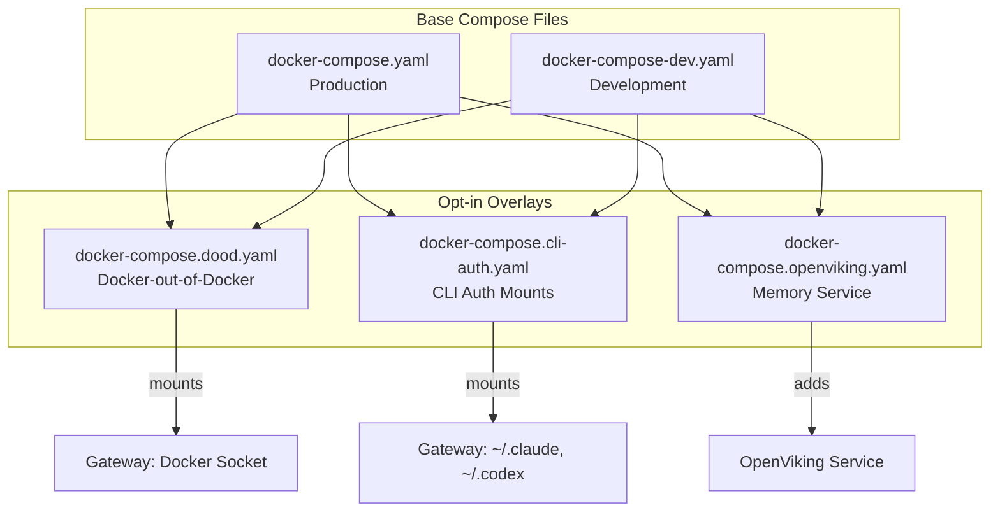
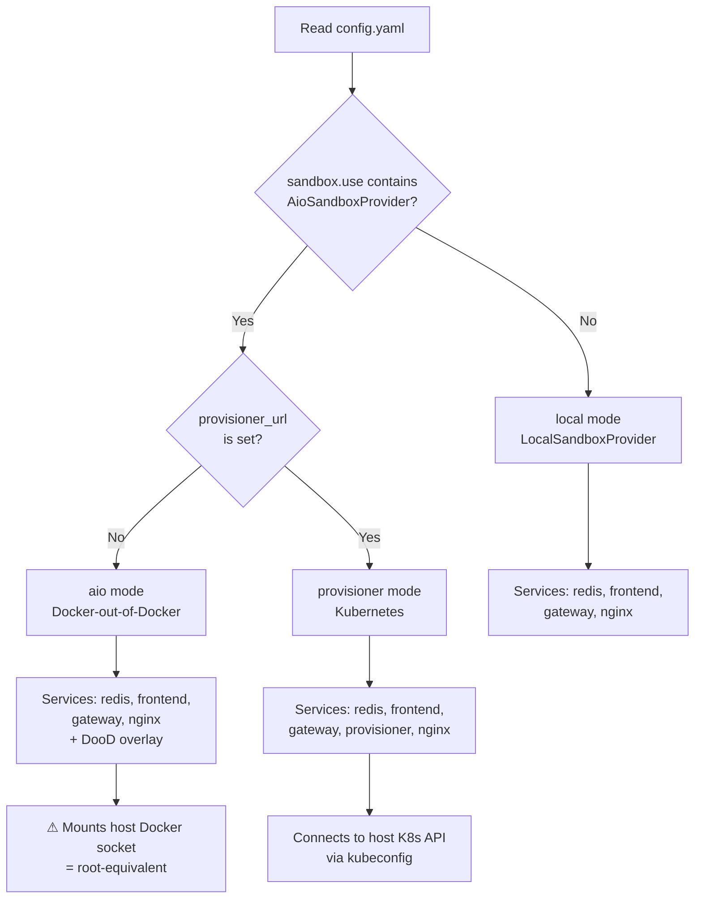
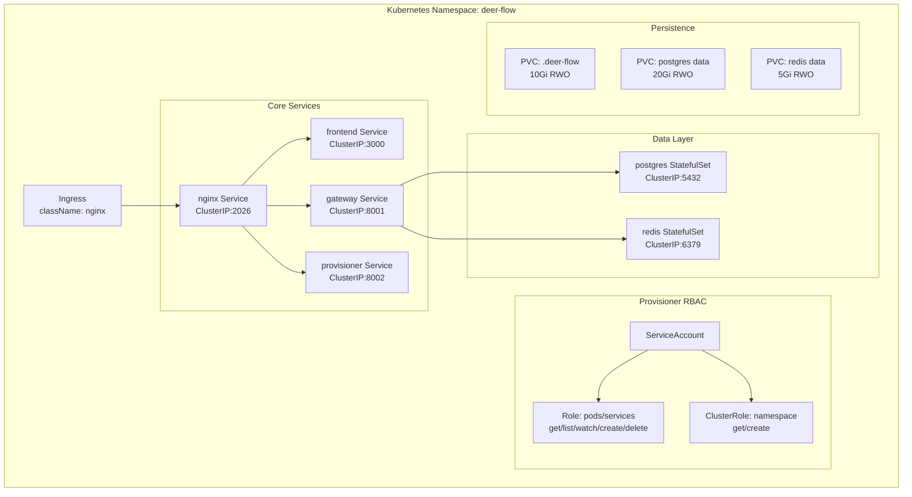
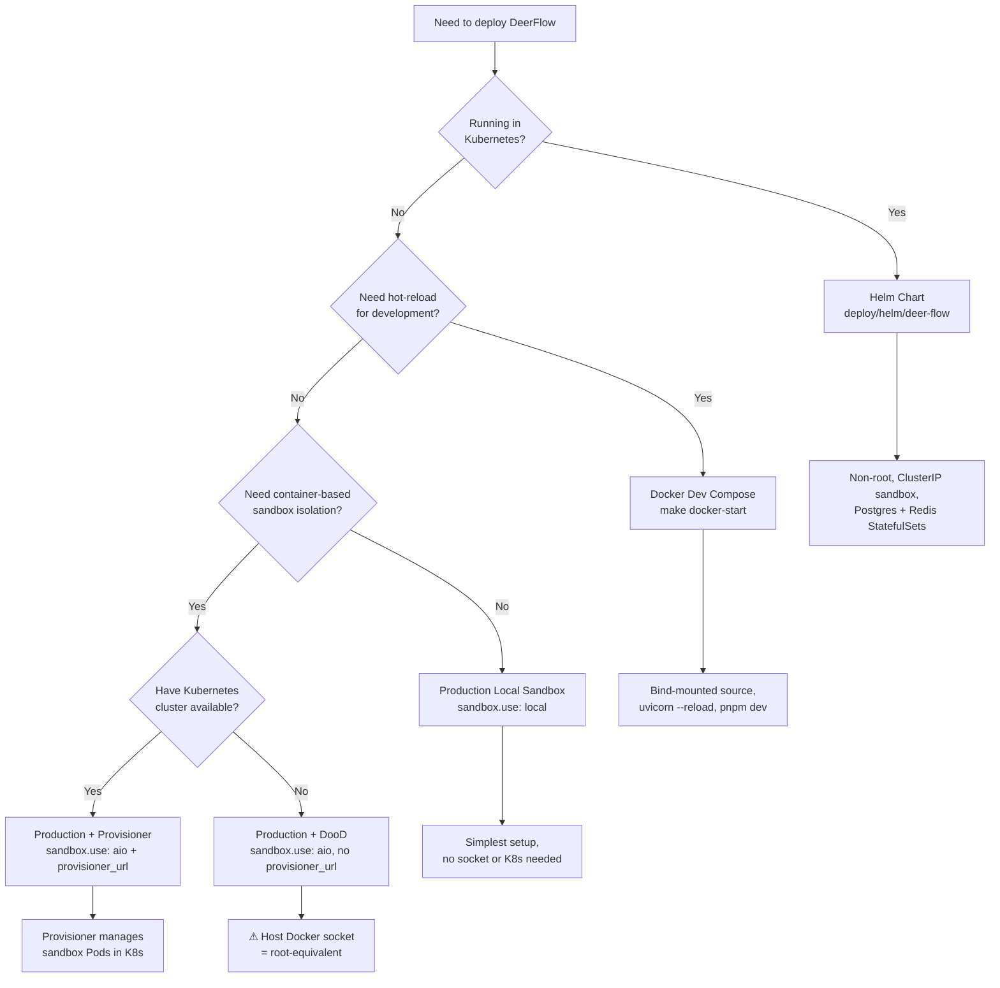

---
slug:26-docker-deployment-strategies
blog_type:normal
---

DeerFlow 的容器化架构涵盖三种不同的部署层面——支持热重载的本地开发、生产环境的单机 Docker Compose，以及通过 Helm 实现的云原生 Kubernetes。这三者均构建在同一套多阶段 Dockerfile、可组合的 overlay 文件以及编排脚本之上。本页将深入剖析构建流水线、compose overlay 系统、驱动运行时拓扑的沙箱模式检测机制，以及将整个 compose 技术栈转换为原生 Kubernetes 资源的 Helm chart。旨在为你提供必要的心智模型，助你选择正确的部署路径、调试配置问题，并通过自定义 overlay 扩展技术栈。

来源：[docker-compose.yaml](docker/docker-compose.yaml#L1-L197)、[docker-compose-dev.yaml](docker/docker-compose-dev.yaml#L1-L239)、[Makefile](Makefile#L1-L177)

## 容器构建流水线：多阶段 Dockerfile

### 后端 Dockerfile —— 三阶段渐进瘦身

后端 Dockerfile 采用**三阶段构建**，将镜像从完整的编译器工具链逐步精简至精简的运行时。阶段 1（`builder`）安装 `build-essential`、Node.js 22、Lark CLI 和 `uv`，随后执行 `uv sync --extra redis` 以及用户指定的 `UV_EXTRAS`，将所有原生 Python 扩展编译至可直接使用的 virtualenv 中。阶段 2（`dev`）完整继承 builder 阶段——保留编译器工具链，以便在添加新的开发依赖时，`uv sync` 能够在容器启动时构建源码发行版。阶段 3（`runtime`）从全新的 `python:3.12-slim-bookworm` 开始，仅从 builder 阶段复制预构建的 virtualenv、Node.js 二进制文件和 `uv`，使镜像体积缩减约 200 MB，并消除了 `build-essential` 带来的攻击面。

`UV_EXTRAS` 构建参数是关键的扩展点。它接受以逗号分隔的可选依赖组列表（例如 `postgres`、`discord`），在传递给 `uv sync` 之前，会根据 `[A-Za-z][A-Za-z0-9_-]*` 模式进行校验。该校验逻辑同时存在于 Dockerfile 的 RUN 命令和开发环境入口脚本中，确保 `.env` 中偶然出现的 shell 元字符无法传递给 `uv sync`。由于 Docker Compose 默认将流桥接器设为 Redis，因此 `redis` 扩展始终会被无条件安装。

<CgxTip>`redis` 扩展被硬编码在 Dockerfile RUN 命令和开发环境入口的 `uv sync` 调用中。如果你正在构建非 Docker 部署并希望排除 Redis，请改用本地的 `make dev` 路径——因为 Dockerfile 始终需要感知 Redis。</CgxTip>

来源：[backend/Dockerfile](backend/Dockerfile#L1-L127)、[docker/dev-entrypoint.sh](docker/dev-entrypoint.sh#L1-L104)

### 前端 Dockerfile —— 四阶段 Next.js 流水线

前端 Dockerfile 延续了后端渐进瘦身的理念，但采用了针对 Next.js 优化的四个阶段。`base` 阶段通过 corepack 安装 `pnpm`，并支持配置 NPM 镜像源。`dev` 阶段使用 `--frozen-lockfile` 安装依赖并暴露 3000 端口，将启动命令留给 docker-compose 覆盖。`builder` 阶段执行 `pnpm build` 并设置 `SKIP_ENV_VALIDATION=1`（运行时变量由 nginx/容器注入），同时为“关于”页面打上可选的 `APP_VERSION` 标记。`prod` 阶段从全新的 `node:22-alpine` 开始，仅复制预构建的产物，从而最小化最终镜像体积。

这两个 Dockerfile 均接受 `NPM_REGISTRY` 和 `APT_MIRROR` 构建参数以适配受限网络部署，前端还额外支持 `COREPACK_NPM_REGISTRY`，用于控制 corepack 获取包管理器本身的来源。

来源：[frontend/Dockerfile](frontend/Dockerfile#L1-L56)、[backend/Dockerfile](backend/Dockerfile#L22-L39)

## Docker Compose 架构：基础文件与 Overlay

DeerFlow 的 Docker Compose 策略遵循**基础加 overlay** 模式。两个基础 compose 文件定义了完整的服务拓扑，三个可选 overlay 文件针对特定运行时场景对其进行扩展或修改。Compose 会将 overlay 文件合并到基础文件之上，因此 overlay 可以添加卷、依赖项或全新的服务，而无需重复基础配置。

来源：[docker-compose.yaml](docker/docker-compose.yaml#L27-L196)、[docker-compose-dev.yaml](docker/docker-compose-dev.yaml#L16-L239)、[docker-compose.dood.yaml](docker/docker-compose.dood.yaml#L1-L27)、[docker-compose.cli-auth.yaml](docker/docker-compose.cli-auth.yaml#L1-L37)、[docker-compose.openviking.yaml](docker/docker-compose.openviking.yaml#L1-L43)

### 生产环境 Compose：服务拓扑

生产环境 `docker-compose.yaml` 在单个 `deer-flow` 桥接网络上定义了五个服务：

| 服务 | 镜像 | 端口 | 角色 |
|---|---|---|---|
| **nginx** | `nginx:alpine` | 2026 (宿主机) | 反向代理，基于路径的路由 |
| **frontend** | 基于 `frontend/Dockerfile` 构建 (target: `prod`) | 3000 (内部) | Next.js 生产服务器 |
| **gateway** | 基于 `backend/Dockerfile` 构建 | 8001 (内部) | FastAPI 网关 + 内嵌 Agent 运行时 |
| **redis** | `redis:7-alpine` | 6379 (内部) | 用于 SSE 流桥接的 Redis Streams 后端 |
| **provisioner** | 基于 `docker/provisioner/Dockerfile` 构建 | 8002 (内部) | 沙箱 Pod 生命周期管理（仅限 Kubernetes 模式） |

网关是架构的核心。它承载了包含进程内 `RunManager` 和 `StreamBridge` 单例的 Agent 运行时——运行状态存在于该工作进程的内存中。Compose 文件默认使用单个工作进程（`GATEWAY_WORKERS=1`），因为即使 Redis 流桥接解决了跨工作进程的 SSE 交付问题，运行取消、请求去重以及按工作进程划分的 IM 通道服务仍然局限于各自的工作进程。

nginx 服务默认**仅绑定至回环地址**（`${BIND_HOST:-127.0.0.1}:${PORT:-2026}:2026`）。这是有意为之的安全姿态：DeerFlow 的 Agent 能够执行命令，因此文档记录的默认部署目标是本地受信任环境。设置 `BIND_HOST=0.0.0.0` 会将技术栈暴露于网络中，应仅在具备 TLS/身份验证的前置防护下进行。

来源：[docker-compose.yaml](docker/docker-compose.yaml#L29-L149)、[docker/nginx/nginx.conf](docker/nginx/nginx.conf#L43-L65)

### 开发环境 Compose：热重载 Bind Mount

开发环境 `docker-compose-dev.yaml` 沿用了生产环境的拓扑，但将预构建镜像替换为 bind mount 的源码目录和开发服务器命令。前端运行 `pnpm dev` 并设置 `WATCHPACK_POLLING=true`，以便跨 Docker Desktop 的挂载层进行文件系统监听。网关通过自定义入口脚本（`docker/dev-entrypoint.sh`）运行，该脚本在启动时执行 `uv sync --all-packages`，若 `.venv` 损坏则通过重建并重试进行自愈，随后交由 `uvicorn --reload` 处理，并监听 YAML 和 `.env` 文件变化。

开发环境 Compose 引入了生产环境中缺失的两个命名卷：`gateway-venv`（保留构建时的 `.venv`，避免挂载宿主机 `backend/` 目录时将其覆盖）和 `gateway-uv-cache`（避免在共享宿主机目录中出现 macOS 符号链接失败）。网络使用固定子网（`192.168.200.0/24`）以实现确定性寻址。

来源：[docker-compose-dev.yaml](docker/docker-compose-dev.yaml#L117-L238)、[docker/dev-entrypoint.sh](docker/dev-entrypoint.sh#L76-L104)

### Overlay 系统：DooD、CLI Auth 与 OpenViking

这三个 overlay 文件**默认不加载**。仅当检测到或明确请求其特定运行时场景时，才会将它们追加到 compose 命令行中。

**Docker-out-of-Docker (DooD)** overlay 将宿主机的 Docker 套接字挂载到网关容器中，使 `AioSandboxProvider` 能够通过宿主机的 Docker 守护进程生成按线程划分的沙箱容器。这是对安全性最敏感的 overlay：宿主机的 Docker 套接字授予了等同于宿主机 root 的控制权。`deploy.sh` 和 `docker.sh` 仅在 `detect_sandbox_mode()` 返回 `"aio"` 时才会自动追加此 overlay。

**CLI Auth** overlay 以只读方式将宿主机的 `~/.claude` 和 `~/.codex` 目录挂载到网关中。这会暴露对话历史、项目、全局配置和长期有效的凭据——网关一旦被攻破，这些信息将全部泄露。此 overlay 的存在是为了满足在容器内运行 Claude/Codex CLI 且不仅需要凭据文件的 ACP Agent 的需求。推荐的替代方案是仅通过环境变量（`CLAUDE_CODE_OAUTH_TOKEN`、`ANTHROPIC_AUTH_TOKEN`）传递令牌。

**OpenViking** overlay 增加了一项全新的服务：一个长期记忆后端，在 1933 端口上运行 `openviking-server`，并配备专用的持久化卷和健康检查。网关新增了 `depends_on` 约束且条件为 `condition: service_healthy`，确保在网关启动前记忆服务已准备就绪。

来源：[docker-compose.dood.yaml](docker/docker-compose.dood.yaml#L1-L27)、[docker-compose.cli-auth.yaml](docker/docker-compose.cli-auth.yaml#L1-L37)、[docker-compose.openviking.yaml](docker/docker-compose.openviking.yaml#L1-L43)

## 沙箱模式检测：驱动运行时拓扑

部署脚本中包含一个 `detect_sandbox_mode()` 函数，用于读取 `config.yaml` 并返回三种模式之一。这一单一决策点决定了要启动哪些服务、是否追加 Docker 套接字 overlay，以及是否将 provisioner 包含在服务列表中。

| 模式 | Provider | Docker 套接字 | Provisioner | 适用场景 |
|---|---|---|---|---|
| **local** | `LocalSandboxProvider` | 不挂载 | 不启动 | 默认；沙箱在进程内运行 |
| **aio** | `AioSandboxProvider` (无 `provisioner_url`) | 通过 DooD overlay 挂载 | 不启动 | 通过宿主机 Docker 实现的基于容器的沙箱 |
| **provisioner** | `AioSandboxProvider` (有 `provisioner_url`) | 不挂载 | 启动 | 原生 Kubernetes 沙箱 Pod |

检测逻辑在 `deploy.sh` 和 `docker.sh` 中均存在重复，使用相同的基于 `awk` 的 YAML 解析方式。如果 `config.yaml` 不存在，这两个脚本都会从 `config.example.yaml` 自动生成它；如果未提供 `BETTER_AUTH_SECRET` 和 `DEER_FLOW_INTERNAL_AUTH_TOKEN`，则会自动生成它们（持久化至 `DEER_FLOW_HOME` 以便在重启后依然有效）。

来源：[scripts/deploy.sh](scripts/deploy.sh#L272-L305)、[scripts/docker.sh](scripts/docker.sh#L44-L87)、[scripts/deploy.sh](scripts/deploy.sh#L170-L200)

## Nginx 反向代理：基于路径的路由与 SSE

nginx 配置是所有 HTTP 流量的**统一入口**，监听 2026 端口，并根据 URL 路径将流量路由至网关（8001 端口）或前端（3000 端口）。现有两个 nginx 配置文件：用于 Docker Compose 的 `nginx.conf`（通过 `127.0.0.11` 的 Docker DNS 解析上游服务），以及用于本地开发的 `nginx.local.conf`（使用 `127.0.0.1` 作为上游服务）。

路由逻辑遵循**最具体优先**原则。LangGraph API 路由（`/api/langgraph/`）在代理前会被重写为 `/api/`。特定的 API 端点（模型、记忆、MCP、技能、Agent、上传、浏览器流）各自拥有独立的 location 块，并配置了专属的缓冲区和请求体大小设置。一个兜底的 `/api/` 块将剩余的 API 流量代理至网关，而最后的 `/` 兜底规则将其他所有请求发送至前端。

有三个关键的 nginx 行为值得关注：

1. **SSE/流式支持**：在 LangGraph 路由上设置 `proxy_buffering off`、`proxy_cache off` 以及 `X-Accel-Buffering no`，确保服务器发送事件（SSE）无需经过缓冲即可直达客户端。各处超时时间均设为 600 秒，以适应长时间运行的 Agent 执行过程。

2. **WebSocket 升级处理**：`$connection_upgrade` 映射变量仅在浏览器实际请求升级时才设置 `Connection: upgrade`，防止 Next.js 开发环境 HMR 的长连接 HTTP 流被误判为无效的升级握手。

3. **保留 Forwarded-proto**：`$forwarded_proto` 映射变量保留了上游代理的 `X-Forwarded-Proto` 头，确保当 nginx 运行在另一个负责 TLS 终止的反向代理（如 Cloudflare、Traefik、Caddy）之后时，网关能感知真实的客户端协议。若缺少此项，HTTPS 浏览器流量会被视为 HTTP，导致登录 POST 请求失败并报 403 "Cross-site auth request denied"。

来源：[docker/nginx/nginx.conf](docker/nginx/nginx.conf#L1-L310)、[docker/nginx/nginx.local.conf](docker/nginx/nginx.local.conf#L1-L200)

## Provisioner 服务：Kubernetes 沙箱生命周期

Provisioner 是一个独立的 FastAPI 应用（`docker/provisioner/app.py`），负责管理 Kubernetes 集群中每个沙箱的 Pod 和 Service 生命周期。它在 8002 端口暴露 REST API，提供创建、销毁、列出和检查沙箱状态的端点。当 `AioSandboxProvider` 配置了 `provisioner_url` 时，后端网关会调用这些端点。

Provisioner 通过挂载的 kubeconfig（`~/.kube/config`）或集群内 ServiceAccount 凭据连接至宿主机 Kubernetes 集群。每个 `sandbox_id` 都会获得独立的 Pod + Service。后端通过 NodePort（适用于网关不在 K8s 中的 Docker Compose/混合设置）或 ClusterIP（适用于集群内的网关部署）访问沙箱。

通过 provisioner 支持两种 Lark CLI 集成模式：

| 模式 | 机制 | 镜像 | 安全性 |
|---|---|---|---|
| **A (Init)** | Init 容器 + 共享的 `emptyDir` 暂存 lark-cli 二进制文件 | `docker/lark-cli-init/Dockerfile` | 仅含二进制文件；沙箱内无凭据 |
| **B (Broker)** | Init 容器写入垫片；长期运行的 sidecar 通过回环地址持有凭据 | `docker/lark-cli-broker/Dockerfile` | 明文配置/数据绝不挂载至沙箱；取代模式 A |

两个 Lark CLI 镜像均使用共享的 `build-runtime.sh` 脚本，在构建时下载并校验官方 `larksuite/cli` Linux 发行版二进制文件的 SHA-256，并暂存一个架构分发的启动器（`bin/lark-cli` 会根据架构分发至 `linux-amd64` 或 `linux-arm64`）。Broker 镜像还额外包含一个 Python 模块（`lark_broker.py`），负责驱动垫片安装和 HTTP broker 服务器。

来源：[docker/provisioner/app.py](docker/provisioner/app.py#L1-L129)、[docker/provisioner/Dockerfile](docker/provisioner/Dockerfile#L1-L30)、[docker/lark-cli-init/Dockerfile](docker/lark-cli-init/Dockerfile#L1-L64)、[docker/lark-cli-broker/Dockerfile](docker/lark-cli-broker/Dockerfile#L1-L80)

## 部署脚本与 Makefile 集成

Makefile 为两个部署脚本提供了清晰的抽象层：

| Makefile 目标 | 脚本 | Compose 文件 | 环境 |
|---|---|---|---|
| `make up` | `scripts/deploy.sh` | `docker-compose.yaml` | 生产环境 |
| `make down` | `scripts/deploy.sh down` | `docker-compose.yaml` | 生产环境 |
| `make docker-init` | `scripts/docker.sh init` | `docker-compose-dev.yaml` | 开发环境 |
| `make docker-start` | `scripts/docker.sh start` | `docker-compose-dev.yaml` | 开发环境 |
| `make docker-stop` | `scripts/docker.sh stop` | `docker-compose-dev.yaml` | 开发环境 |

### deploy.sh —— 生产环境编排

`deploy.sh` 脚本通过定义良好的初始化序列编排整个生产环境的生命周期。在启动容器前，它会执行：（1）解析 `DEER_FLOW_HOME` 并创建目录，（2）检查 `config.yaml` 是否存在，若不存在则从 `config.example.yaml` 自动生成，（3）检查 `extensions_config.json` 是否存在，若不存在则回退至空配置，（4）生成并持久化 `BETTER_AUTH_SECRET`（依次尝试 `python3`、`python`，最后是 `openssl`），（5）使用相同的回退链生成 `DEER_FLOW_INTERNAL_AUTH_TOKEN`，（6）通过 `scripts/detect_uv_extras.py` 从 `config.yaml` 自动检测 `UV_EXTRAS`，（7）检测沙箱模式以确定服务列表及是否需要 DooD overlay。

`build` 命令与模式无关——它生成的镜像适用于所有沙箱模式。`start` 命令直接从预构建镜像启动，不会重新构建。默认执行（无参数）会同时执行两者：构建 + 启动。`down` 命令会为未设置的环境变量设置占位值，以便 Compose 在运行 `docker compose down` 之前能无警告地解析文件。

### docker.sh —— 开发环境编排

`docker.sh` 脚本与 `deploy.sh` 类似，但针对开发环境的 compose 文件。其 `init` 命令会预拉取沙箱容器镜像以加速首次 Pod 启动，但在 `local` 沙箱模式下会跳过拉取（因为不需要容器镜像）。其 `start` 命令会自动检测沙箱模式，构建服务列表（仅在 Kubernetes 模式下添加 `provisioner`），在 `aio` 模式下追加 DooD overlay，确保 `config.yaml` 和 `extensions_config.json` 存在，从 `.env` 加载代理环境变量，然后执行 `docker compose up --build -d`。

<CgxTip>这两个脚本都会从 `.env` 读取代理设置（`HTTP_PROXY`、`HTTPS_PROXY`、`ALL_PROXY`、`NO_PROXY`），并显式注入带有内部服务主机名（gateway、frontend、nginx、provisioner、host.docker.internal）的 `NO_PROXY`，确保内部流量绝不经过企业代理。如果你添加了新的内部服务，请务必更新两个 compose 文件中的 `NO_PROXY` 配置。</CgxTip>

来源：[Makefile](Makefile#L138-L177)、[scripts/deploy.sh](scripts/deploy.sh#L1-L431)、[scripts/docker.sh](scripts/docker.sh#L1-L416)

## Kubernetes 部署：Helm Chart

Helm chart（`deploy/helm/deer-flow/`，chart 版本 2.1.0）将生产环境的 `docker-compose.yaml` 转换为原生 Kubernetes 资源。它部署了同样的四个核心服务（gateway、frontend、nginx、provisioner），外加内置的 PostgreSQL 和 Redis StatefulSet，且均位于单一命名空间内。

### 关键 Helm 配置维度

该 chart 的 `values.yaml` 暴露了几个关键配置维度：

**数据库**：默认为 PostgreSQL（内置 `postgres:16` StatefulSet，密码自动生成）。DSN 存储在 Secret（键为 `database-url`）中，并作为 `DATABASE_URL` 注入；`config.yaml` 通过 `$DATABASE_URL` 引用。对于托管数据库，需设置 `postgresql.enabled: false`，并提供 `postgresql.external.databaseUrl` 或 `existingSecret`。

**Redis 流桥接**：内置的 `redis:7-alpine` StatefulSet 将每次运行的 SSE 事件存储在 Redis Streams 中，实现跨 Pod 的 SSE 交付和重连重播。URL 存储在 Secret（键为 `redis-url`）中，并作为 `DEER_FLOW_STREAM_BRIDGE_REDIS_URL` 注入。默认无密码（通过 ClusterIP 隔离），可选配置 `redis.auth.password` 进行 AUTH 认证。

**网关副本数**：尽管 Postgres 和 Redis 保证了持久化状态和实时流在跨 Pod 下的安全性，但默认仍为 **1 个副本**。运行控制——包括 `create_or_reject` 去重、`cancel` 以及孤儿任务对账——仍然局限于工作进程（进程内 `asyncio.Lock` + 内存中 `record.task`）。将副本数提升至 1 以上可能会导致以下风险：重复提交导致检查点损坏、取消请求命中非归属 Pod 引发 409，以及崩溃后出现孤立的 `pending`/`running` 状态运行。

**优雅关闭**：网关 Pod 设置了 `terminationGracePeriodSeconds: 45`（必须超过 30 秒的内存队列排空超时及缓冲时间），外加可选的 5 秒 `preStop` 延迟，确保 Service/Ingress 在优雅关闭开始前注销该 Pod。K8s 默认的 30 秒宽限期会在内存排空期间发送 SIGKILL 信号，从而悄无声息地重新引发内存丢失问题。

**沙箱服务类型**：`ClusterIP`（默认，推荐）返回集群 DNS URL，使网关完全在集群网络内部访问沙箱——无需节点 IP，无需高端口。`NodePort` 是当网关不在 K8s 中时，Docker Compose/混合部署的应急方案。

来源：[deploy/helm/deer-flow/values.yaml](deploy/helm/deer-flow/values.yaml#L1-L342)、[deploy/helm/deer-flow/Chart.yaml](deploy/helm/deer-flow/Chart.yaml#L1-L16)、[deploy/helm/deer-flow/README.md](deploy/helm/deer-flow/README.md#L213-L265)

### Kubernetes 安全姿态

Helm chart 对所有工作负载强制执行严格的安全姿态：

| 工作负载 | runAsUser | fsGroup | Capabilities | 权限提升 |
|---|---|---|---|---|
| gateway | 1000 | 1000 | ALL dropped | false |
| frontend | 1000 (node) | 1000 | ALL dropped | false |
| nginx | 101 (nginx) | 101 | ALL dropped | false |
| provisioner | 1000 | — | ALL dropped | false |
| postgres | 999 (postgres) | 999 | ALL dropped | false |
| redis | 999 (redis) | 999 | ALL dropped | false |

每个容器均设置了 `runAsNonRoot: true`、`allowPrivilegeEscalation: false`、`capabilities.drop: ["ALL"]` 以及 `seccompProfile: { type: RuntimeDefault }`。所有监听端口均大于 1024，因此无需 `NET_BIND_SERVICE` 权限。ConfigMap 通过 `subPath` 挂载（不会接收原地更新），因此每个 Pod 模板都带有 `checksum/*` 注解（渲染后 ConfigMap 内容的 SHA256），从而在配置变更时触发滚动重启。

该 chart 记录了三个**待完成的安全加固**项：`readOnlyRootFilesystem: true`（需审查所有运行时写入路径，由于 socket 目录的存在，postgres 是难点）、provisioner RBAC 收窄（Role 的 verbs 仍应用于命名空间内的所有 Pod，而不仅是沙箱 Pod），以及 `startupProbe`（目前由 `livenessProbe.initialDelaySeconds: 30` 覆盖，但启动探针将允许任意长的冷启动时间而不被存活探针终止）。

来源：[deploy/helm/deer-flow/README.md](deploy/helm/deer-flow/README.md#L267-L336)

## 环境变量契约

部署技术栈依赖于一组定义良好的环境变量，这些变量贯穿 compose 文件、Helm values 以及网关运行时。理解此契约对于故障排查和定制化至关重要：

| 变量 | 作用域 | 默认值 | 用途 |
|---|---|---|---|
| `DEER_FLOW_PROJECT_ROOT` | 网关 | `/app` | 相对运行时路径的项目根目录 |
| `DEER_FLOW_HOME` | 全部 | `$REPO_ROOT/backend/.deer-flow` | 运行时数据目录（sqlite、记忆、自定义 Agent） |
| `DEER_FLOW_CONFIG_PATH` | 网关 | `$REPO_ROOT/config.yaml` | config.yaml 的路径 |
| `DEER_FLOW_EXTENSIONS_CONFIG_PATH` | 网关 | `$REPO_ROOT/extensions_config.json` | MCP 服务器 + 技能状态 |
| `DEER_FLOW_STREAM_BRIDGE_REDIS_URL` | 网关 | `redis://redis:6379/0` | 用于 SSE 桥接的 Redis Streams URL |
| `BETTER_AUTH_SECRET` | 前端 | 自动生成 | 认证/会话安全所需 |
| `DEER_FLOW_INTERNAL_AUTH_TOKEN` | 网关 | 自动生成 | 用于多工作进程通道的共享内部认证 |
| `GATEWAY_WORKERS` | 网关 | `1` | Uvicorn 工作进程数（为运行控制安全请保持为 1） |
| `BIND_HOST` | nginx | `127.0.0.1` | 宿主机绑定地址（默认仅回环） |
| `PORT` | nginx | `2026` | 外部端口 |
| `UV_EXTRAS` | 构建 | 自动检测 | 可选依赖组（逗号分隔） |
| `DEER_FLOW_DOCKER_SOCKET` | DooD overlay | `/var/run/docker.sock` | 宿主机 Docker 套接字路径（仅限 aio 模式） |

来源：[docker-compose.yaml](docker/docker-compose.yaml#L11-L25)、[docker-compose-dev.yaml](docker/docker-compose-dev.yaml#L195-L213)、[scripts/deploy.sh](scripts/deploy.sh#L115-L200)、[deploy/helm/deer-flow/values.yaml](deploy/helm/deer-flow/values.yaml#L1-L60)

## 部署路径选择

选择合适的部署路径取决于你的环境、安全要求和扩展性需求：

对于大多数初学者，使用 `make docker-start`（开发环境）或 `make up`（生产环境）的**本地沙箱模式**是最简单的途径。已经在运行 Kubernetes 的团队应直接使用 Helm chart，它开箱即用地处理了安全上下文、RBAC、持久化和优雅关闭。对于需要容器隔离但没有 Kubernetes 集群的用户，DooD 路径是一个折中选项——只需注意，挂载宿主机 Docker 套接字等同于授予宿主机 root 权限。

在掌握部署机制之后，你可以查阅[沙箱与文件系统](14-sandbox-and-file-system)以深入了解沙箱 Provider 内部原理，查阅[网关 API 与认证](23-gateway-api-and-auth)了解位于 nginx 背后的运行时架构，以及[链路追踪与可观测性](27-tracing-and-observability)来监控你已部署的技术栈。
