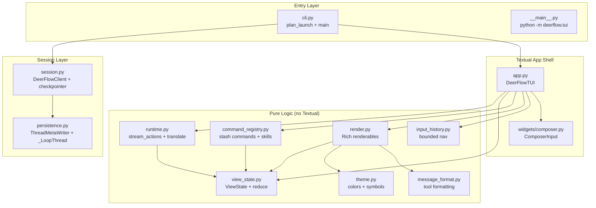
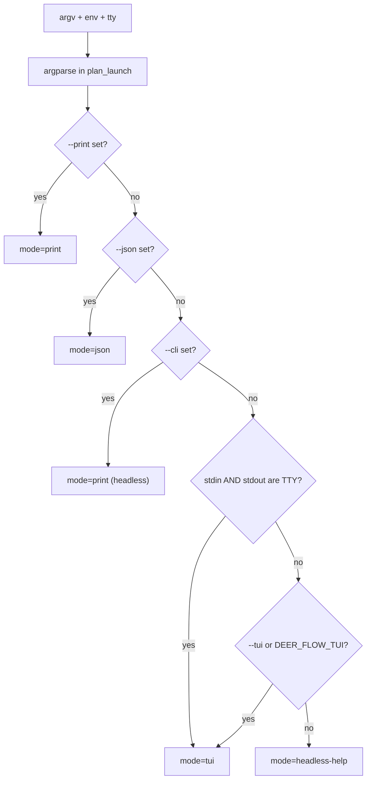
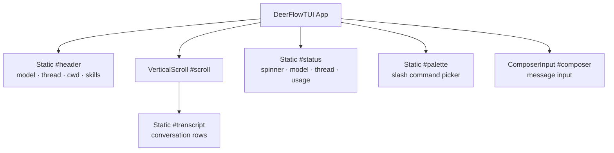

---
slug:28-terminal-workbench-tui
blog_type:normal
---

DeerFlow Terminal Workbench (TUI) 是一个基于 **Textual** 框架构建的全屏交互式终端用户界面，直接在 shell 中提供了一个功能丰富的对话式 Agent 工作台。它将 `DeerFlowClient` 运行引擎作为同步流式传输引擎嵌入其中，并通过纯的、可测试的视图状态 reducer 来渲染实时的 Agent 活动——包括助手输出内容、工具调用、状态指示器和系统消息。与 Web UI 不同，TUI 无需 Gateway 进程即可作为独立的 CLI 运行，同时仍会将线程元数据写入共享数据库，从而确保终端会话在两个界面中均可见。

## 架构概述

TUI 遵循严格的**单向数据流**架构，包含三个解耦层：纯视图状态 reducer、无 Textual 依赖的运行时桥接层，以及将它们组合在一起的轻量级 Textual 应用外壳。这种分离确保了最复杂的逻辑——流式增量合并、工具卡片去重和匿名行跟踪——能够在没有任何终端依赖的情况下进行完整的单元测试。

入口点 [`cli.py`](backend/packages/harness/deerflow/tui/cli.py) 执行一个纯的、无 I/O 的决策过程（`plan_launch`），该过程会检查 argv、TTY 状态和环境变量，以决定是启动完整的交互式 TUI、无头模式的一次性打印，还是 JSON 流式传输模式。只有在选择 TUI 模式时，系统才会延迟导入 Textual——这确保了即使未安装 `textual` 依赖，`deerflow` 控制台脚本仍能在无头模式下正常运行。

来源：[cli.py](backend/packages/harness/deerflow/tui/cli.py#L1-L303), [app.py](backend/packages/harness/deerflow/tui/app.py#L1-L200), [__main__.py](backend/packages/harness/deerflow/tui/__main__.py#L1-L7)

## 启动模式与 CLI 接口

`plan_launch` 函数是所有执行入口的唯一决策点。它被刻意设计为纯函数——无 I/O 操作，不构造客户端——从而具备完整的可单元测试性。在给定参数向量、TTY 状态和环境变量后，它会返回一个 `LaunchPlan` 数据类，其中编码了运行模式、消息、线程解析及渲染选项。

| 标志 | 模式 | 描述 |
|------|------|-------------|
| *(无，检测到 TTY)* | `tui` | 完整的交互式终端 UI |
| `--tui` | `tui` | 即使没有 TTY 也强制启动 TUI |
| `--tui-transparent` | `tui` | 使用终端的默认背景色 |
| `--print [MSG]` | `print` | 无头模式一次性运行：打印最终答案并退出 |
| `--json [MSG]` | `json` | 无头流式传输：换行符分隔的 JSON StreamEvents |
| `--cli` | `print` | 为单次调用强制使用无头模式 |
| `--continue` | *(任意)* | 恢复最近的线程 |
| `--resume THREAD` | *(任意)* | 通过 ID 或标题恢复线程 |
| `--recursion-limit N` | *(无头模式)* | Agent 循环超级步限制（默认：100） |

`--tui-transparent` 标志（或 `DEER_FLOW_TUI_TRANSPARENT=1` 环境变量）会注入一个透明的 CSS 层，使用 `ansi_default` 覆盖所有容器的背景色，从而允许终端模拟器的原生背景色透出，而非使用硬编码的 Tokyo-Night 调色板。

当未安装 Textual 时，TUI 会优雅降级：如果显式强制使用了 `--tui`，它会打印安装提示并以代码 1 退出；否则，它会回退到无头模式的帮助文本。

来源：[cli.py](backend/packages/harness/deerflow/tui/cli.py#L43-L200), [cli.py](backend/packages/harness/deerflow/tui/cli.py#L200-L303)

## 视图状态 Reducer：纯核心

`view_state.py` 模块是架构的核心——一个零 Textual 或渲染依赖的**纯 reducer**。它将可见的对话建模为类型化 `Row` 数据类的不可变元组，并暴露一个单一的 `reduce(state, action) -> state` 函数。这种设计使得流式增量合并、工具卡片生命周期和错误处理都可以通过普通的 pytest 和合成动作进行测试。

### 行类型

| 行类型 | 用途 | 关键字段 |
|----------|---------|------------|
| `UserRow` | 用户输入 | `text` |
| `AssistantRow` | Agent 响应（流式或最终） | `text`, `id`, `error` |
| `ToolRow` | 工具调用生命周期卡片 | `tool_call_id`, `tool_name`, `title`, `detail`, `result`, `status` |
| `SystemRow` | 系统消息（信息/错误） | `text`, `tone` |

### 动作类型与状态转换

reducer 处理一组封闭的不可变动作数据类。`RunStarted` 会重置流式传输状态（清除 `streaming_id` 和 `streaming_anonymous_row_index`），而 `RunEnded` 会将其终结。`AssistantDelta` 是最复杂的动作——它为按数据块标记 ID 的提供者处理**基于 ID 的合并**，并为不标记 ID 的提供者按位置处理**匿名行跟踪**。

<CgxTip>
`streaming_anonymous_row_index` 字段的存在是为了解决一个微妙的跨轮次歧义问题：某些提供者从不分配按数据块的 ID，导致每一轮的每个数据块都共享空字符串（`""`）ID。如果在整个对话记录中匹配 `row.id == ""`，就会将新轮次的文本错误地合并到早期轮次的旧行中。相反，该索引通过**位置**锁定“当前轮次”的匿名行，并在每次 `RunStarted`/`RunEnded`/`ClearRows` 时重置，且仅在其仍为尾部行时才重用——一旦追加了工具卡片，下一个空 ID 的增量就会开启一个新行。
</CgxTip>

`_merge_stream_text` 辅助函数处理三种合并情况：**累积重发**（传入内容严格扩展了现有内容 → 替换）、**陈旧重发**（现有内容已包含传入内容作为前缀 → 保留），以及**真正的增量更新**（追加）。这种方式吸收了提供者的重发和值快照的重新发射，避免了内容重复。

来源：[view_state.py](backend/packages/harness/deerflow/tui/view_state.py#L1-L200), [view_state.py](backend/packages/harness/deerflow/tui/view_state.py#L200-L391)

## 运行时桥接层：从流式传输到动作

`runtime.py` 模块将同步的 `DeerFlowClient.stream()` 生成器连接到纯 reducer。它包含两层，均无 Textual 依赖：

**`translate(event)`** 是一个纯函数，将一个 `StreamEvent` 映射为零个或多个 reducer 动作。它处理三种事件类型：`messages-tuple`（AI 文本增量、工具调用开始、工具结果）、`end`（附带使用量信息的运行完成）和 `values`（线程标题提取）。

**`stream_actions(client, message, thread_id)`** 是一个生成器，负责生成成对的动作序列——始终以 `RunStarted` 开始并以 `RunEnded` 结束，即使发生错误也是如此。模型/运行时异常会被捕获并作为 `AssistantError` 行呈现，而不是导致 UI 线程崩溃。

| 流事件类型 | 数据键 | 触发的 Reducer 动作 |
|-------------------|----------|------------------------|
| `messages-tuple` | `type=ai` | `AssistantDelta` + `ToolStarted`（每个工具调用） |
| `messages-tuple` | `type=tool` | `ToolResult` |
| `end` | `usage` | `RunEnded` |
| `values` | `title` | `ThreadTitle` |
| `custom` | *(任意)* | *(无 —— 不进行增量渲染)* |

`_as_str` 辅助函数用于防范一个微妙的提供者 bug：流式数据块可能会为 `id` 或 `name` 携带显式的 `None`（由于键存在，`.get(k, "")` 会返回 `None`），而 `str(None) == "None"` 的求值结果为真——这将破坏下游的空 ID 检查。相反，该辅助函数在遇到 `None` 值时会返回 `""`。

来源：[runtime.py](backend/packages/harness/deerflow/tui/runtime.py#L1-L131)

## Textual 应用外壳

`app.py` 模块是 Textual 集成层——一个轻量级外壳，用于持有一个不可变的 `ViewState`，通过纯渲染器对其进行渲染，并在工作线程上执行 Agent 运行。`DeerFlowTUI` 类继承自 `App`，并使用了由 `THEME` 常量驱动的自定义 CSS 主题。

### 组件组合

### 快捷键

| 按键 | 动作 | 上下文 |
|-----|--------|---------|
| `Enter` | 提交消息 / 接受调色板项 | 输入框（或调色板开启时） |
| `Ctrl+C` | 中断运行或退出 | 全局（优先） |
| `Ctrl+L` | 重绘屏幕 | 始终 |
| `Ctrl+U` | 清空输入框内容 | 始终 |
| `↑` / `↓` | 导航调色板（开启时）或输入历史（关闭时） | 输入框 |
| `Tab` | 补全高亮命令 | 调色板开启时 |
| `Esc` | 关闭调色板 / 中断运行 | 调色板开启或流式传输时 |

`check_action` 方法为所有自定义快捷键设置了关卡：当屏幕堆栈上存在模态覆盖层时，它会返回 `None`（禁用），确保模型/线程选择器的原生按键处理不会被拦截。即使调色板关闭，导航键（`↑`/`↓`）也始终会被消费，因此它们用于驱动输入历史记录，而不是滚动对话记录——从而使焦点锁定在输入框中。

### 流式工作线程化

Agent 运行通过 `run_worker` 在 `"agent"` 组中执行，并设置 `thread=True` 和 `exclusive=True`。`DeerFlowClient.stream()` 方法是一个同步生成器，因此它在专用的工作线程上运行。每个生成的动作都会通过 `call_from_thread` 被编排回 UI 线程，折叠进 reducer 中，并且对话记录会被标记为脏数据，以便以 60ms 的间隔（`_flush_transcript`）进行合并后的重新渲染。这种合并机制防止了逐个 token 的重排导致终端过载，同时将感知延迟保持在 100ms 以下。

在流式运行期间按下 `Ctrl+C` 时，应用会调用 `_interrupt_run()` 来设置 `_cancelled` 标志。工作线程在流事件之间检查此标志并优雅退出，同时发出 `RunEnded` 动作。在执行 `/quit` 时，相同的拦截路径会在 `self.exit()` 之前运行，以防止孤立的工作线程针对已销毁的应用调用 `call_from_thread`。

来源：[app.py](backend/packages/harness/deerflow/tui/app.py#L1-L200), [app.py](backend/packages/harness/deerflow/tui/app.py#L200-L399), [app.py](backend/packages/harness/deerflow/tui/app.py#L399-L726)

## 斜杠命令系统

`command_registry.py` 模块将两个命令源标准化为一个可搜索的列表：**内置 TUI 命令**（18 个条目，如 `/help`、`/model`、`/threads`、`/goal`）和**已启用的技能**（每个启用的技能对应一个 `/<skill-name>`）。`build_registry` 函数将它们合并，通过排除与内置命令同名的技能来防止命名冲突。

### 内置命令

| 命令 | 描述 |
|---------|-------------|
| `/help` | 显示命令和快捷键 |
| `/new` | 开始新线程 |
| `/clear` | 清除对话记录显示 |
| `/threads` 或 `/switch` | 打开线程切换器模态框 |
| `/resume [id\|title]` | 通过 ID 或标题恢复线程 |
| `/goal [set\|status\|clear]` | 管理活动目标 |
| `/model` | 打开模型选择器模态框 |
| `/skills` | 列出已启用的技能 |
| `/tools` | 显示工具信息 |
| `/mcp` | 显示 MCP 服务器状态 |
| `/memory` | 显示记忆事实和首要事项 |
| `/uploads` | 显示此线程的上传文件 |
| `/artifacts` | 显示生成的产出物 |
| `/details` | 切换详细渲染模式 |
| `/usage` | 显示 token 使用量 |
| `/config` | 显示解析后的配置路径 |
| `/quit` | 退出 TUI |

选择器在 `filter_commands` 中使用三级排序：首先是**前缀匹配**（命令名以查询开头），然后是**子串匹配**（查询包含在名称中），最后是**描述匹配**（查询包含在描述中）。每个层级内保留原始顺序，`render_palette` 中的窗口化渲染器最多显示 8 个项目，并带有“… 还有 N 项”的指示器。

当通过 `resolve()` 解析命令时，它会返回一个 `Resolution` 数据类，其 kind 类型为 `builtin`、`skill`、`unknown` 或 `message`。技能需要任务参数，因此从调色板接受技能命令会在输入框中填充 `/<skill-name> `（带尾部空格）并让用户继续输入，而不是立即提交。

来源：[command_registry.py](backend/packages/harness/deerflow/tui/command_registry.py#L1-L129), [app.py](backend/packages/harness/deerflow/tui/app.py#L300-L420)

## 渲染层

`render.py` 模块包含基于 Rich 的纯渲染器，它们接收 `ViewState` 并返回 Rich 可渲染对象——没有 Textual 导入，因此它们可以通过渲染到 Rich `Console` 并检查输出来进行单元测试。关键的设计决策是，**只有当前正在生成的消息渲染为纯文本**（以避免流式传输期间 Markdown 重排引起的跳动），而所有历史消息都渲染为 Rich `Markdown`，这样后续轮次永远不会将先前的答案还原为原始文本。

### 工具卡片渲染

工具活动被渲染为带有状态指示器的紧凑单行卡片：

| 状态 | 符号 | 颜色 | 含义 |
|--------|--------|-------|---------|
| `running` | ◐ | warning (琥珀色) | 工具正在执行 |
| `ok` | ✓ | accent (绿色) | 工具成功完成 |
| `error` | ✗ | error (红色) | 工具返回错误 |

`message_format.py` 模块提供了人性化的格式化：查找表将原始工具名映射为可读的标题（`read_file` → "Read", `web_search` → "Search", `bash` → "Bash"），而按工具划分的详细键表提取最突出的参数以内联方式显示（文件工具的路径、shell 工具的命令、搜索工具的查询）。结果被截断为单行 160 个字符。

### 主题

该主题遵循受 **Tokyo-Night 启发的调色板**——沉稳的深色背景搭配用于区分说话者的强调色：

| 元素 | 颜色 | 十六进制 |
|---------|-------|-----|
| 背景 | 深海军蓝 | `#1a1b26` |
| 面板 | 略浅的海军蓝 | `#1f2335` |
| 用户说话者 | 蓝色 | `#7aa2f7` |
| 助手说话者 | 浅薰衣草色 | `#c0caf5` |
| 工具活动 | 紫色 | `#bb9af7` |
| 主色/强调色 | 青色 / 绿色 | `#7dcfff` / `#9ece6a` |
| 警告（运行中） | 琥珀色 | `#e0af68` |
| 错误 | 红色 | `#f7768e` |

相同的十六进制常量既驱动 Rich 可渲染对象（Rich 样式中使用的 Python 字符串），也驱动 Textual CSS 变量（通过 f-string 插值到 `CSS` 类属性中），确保两条渲染路径在视觉上保持一致。

来源：[render.py](backend/packages/harness/deerflow/tui/render.py#L1-L153), [theme.py](backend/packages/harness/deerflow/tui/theme.py#L1-L43), [message_format.py](backend/packages/harness/deerflow/tui/message_format.py#L1-L109)

## 会话与持久化桥接层

`session.py` 模块负责构建带有持久化检查点器的 `DeerFlowClient`，处理 `--continue` / `--resume` 的线程解析，以及可选的共享持久化写入器。线程解析同时支持线程 ID 和**精确标题匹配**——`resolve_ref` 方法首先按 ID 检查现有线程，然后按标题检查，最后回退到将字面引用验证为规范线程 ID。

`persistence.py` 模块通过将 `threads_meta` 行写入 Gateway 读取的**相同数据库**，将 TUI 桥接到 Web UI。如果没有这个模块，终端会话将在 Web 侧边栏中不可见，因为 Gateway 从 `threads_meta` 而非检查点器列出对话。写入器在一个长期存在的守护线程（`_LoopThread`）上运行所有的 SQLAlchemy 异步工作，并带有自己的 asyncio 事件循环，因为引擎绑定到创建它的循环中——每次调用都使用一次全新的 `asyncio.run` 会将连接绑定到一次性的循环上。

<CgxTip>
所有持久化操作都是尽力而为的：当数据库由内存支持或不可用时，`ThreadMetaWriter` 方法会吞掉异常并降级为无操作。持久化可见性是为了提供便利，绝不应成为中断对话的理由。无头模式的一次性运行（`--print`、`--json`）会向 `open_session` 传递 `persistence=False`，避免仅仅为了丢弃而建立后台事件循环和连接池的开销。
</CgxTip>

来源：[session.py](backend/packages/harness/deerflow/tui/session.py#L1-L104), [persistence.py](backend/packages/harness/deerflow/tui/persistence.py#L1-L112)

## 输入历史

`input_history.py` 模块提供了一个有界的纯输入历史，具备类似 shell 的上/下导航功能。它默认最多存储 200 个条目，忽略空白和连续重复的提交，并在向后导航时暂存进行中的草稿，以便再次向前遍历时恢复用户正在输入的内容。`InputHistory` 类没有持久化机制——应用可以在其他地方填充和保存条目——也没有 Textual 依赖，使其能够独立进行单元测试。

来源：[input_history.py](backend/packages/harness/deerflow/tui/input_history.py#L1-L59)

## 模态覆盖层

`SelectScreen` 类是一个居中的 `ModalScreen`，由模型选择器（`/model`）和线程切换器（`/threads`）使用。它渲染一个带有标题标签和 `OptionList` 选项的 `Vertical` 容器，每个选项都带有一个 ID（模型名称或线程 ID）和一个人类可读的标签。选择后会关闭屏幕并返回选定的 ID，而 `Esc` 则返回 `None` 关闭屏幕。主应用中的 `check_action` 防护机制确保当模态框在屏幕堆栈上时，所有自定义快捷键都被禁用——覆盖层原生处理自己的导航。

来源：[app.py](backend/packages/harness/deerflow/tui/app.py#L55-L89), [app.py](backend/packages/harness/deerflow/tui/app.py#L410-L470)

## 模块依赖关系摘要

| 模块 | 依赖 Textual？ | 依赖 Rich？ | 职责 |
|--------|----------|-------|----------------|
| `cli.py` | 否 | 否 | 启动规划，无头调度 |
| `session.py` | 否 | 否 | 客户端构建，线程解析 |
| `persistence.py` | 否 | 否 | 用于 Web UI 可见性的共享数据库写入器 |
| `runtime.py` | 否 | 否 | StreamEvent → Action 转换 |
| `view_state.py` | 否 | 否 | 纯 reducer，不可变状态 |
| `command_registry.py` | 否 | 否 | 斜杠命令标准化与解析 |
| `message_format.py` | 否 | 否 | 工具名称/详情/结果格式化 |
| `input_history.py` | 否 | 否 | 有界输入导航 |
| `theme.py` | 否 | 否 | 颜色和符号常量 |
| `render.py` | 否 | 是 | 从 ViewState 生成 Rich 可渲染对象 |
| `widgets/composer.py` | 是 | 否 | 自定义 Textual 输入组件 |
| `app.py` | 是 | 是 | Textual 应用外壳，线程化，快捷键处理 |

将纯逻辑（10 个无 Textual 依赖的模块）与集成层（2 个依赖 Textual 的模块）刻意隔离，意味着绝大多数行为复杂性都无需终端即可测试，而 Textual 应用外壳仍然是一个轻量级的编排层。

来源：[__init__.py](backend/packages/harness/deerflow/tui/__init__.py#L1-L2), [app.py](backend/packages/harness/deerflow/tui/app.py#L1-L726), [cli.py](backend/packages/harness/deerflow/tui/cli.py#L1-L303), [runtime.py](backend/packages/harness/deerflow/tui/runtime.py#L1-L131), [view_state.py](backend/packages/harness/deerflow/tui/view_state.py#L1-L391), [render.py](backend/packages/harness/deerflow/tui/render.py#L1-L153), [command_registry.py](backend/packages/harness/deerflow/tui/command_registry.py#L1-L129), [session.py](backend/packages/harness/deerflow/tui/session.py#L1-L104), [persistence.py](backend/packages/harness/deerflow/tui/persistence.py#L1-L112), [theme.py](backend/packages/harness/deerflow/tui/theme.py#L1-L43), [message_format.py](backend/packages/harness/deerflow/tui/message_format.py#L1-L109), [input_history.py](backend/packages/harness/deerflow/tui/input_history.py#L1-L59)

## 后续步骤

- 要了解 `DeerFlowClient` 流式事件在上游是如何产生的，请参阅 [Stream Bridge and Event Pipeline](24-stream-bridge-and-event-pipeline)。
- 有关 TUI 会话层所依赖的检查点器和线程状态，请参阅 [Checkpointing and State Management](18-checkpointing-and-state-management)。
- 要了解填充 TUI 斜杠命令调色板的技能系统，请参阅 [Skills System](11-skills-system)。
- 有关通过持久化桥接层与 TUI 共享线程可见性的 Web UI，请参阅 [Next.js Frontend Architecture](22-next-js-frontend-architecture)。
