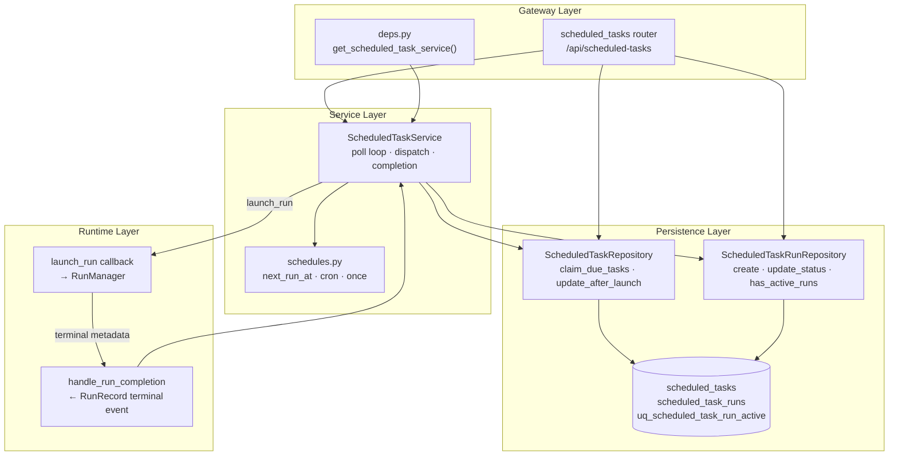
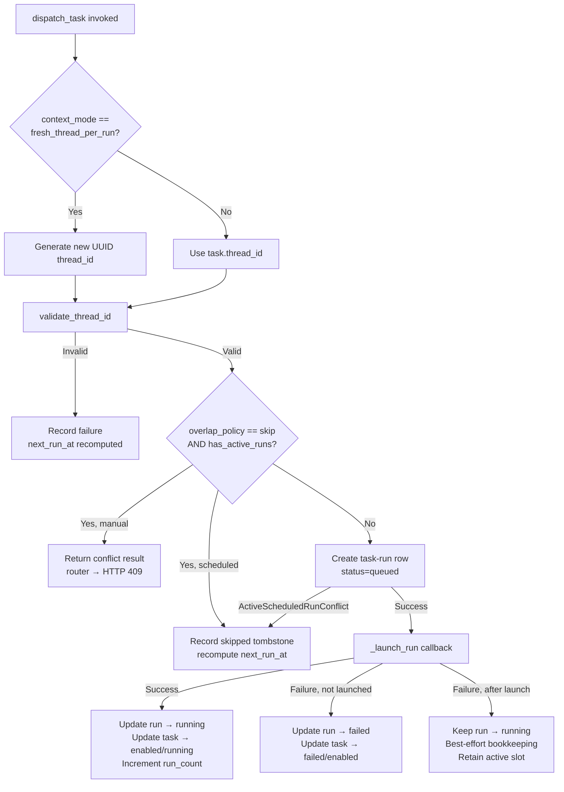
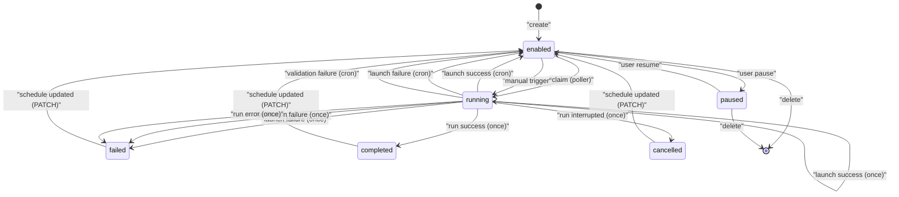

---
slug:29-scheduled-tasks-system
blog_type:normal
---

计划任务系统（Scheduled Tasks System）是一个持久化且支持 cron 的执行调度器，负责将用户定义的任务定义与 agent 运行时对接。它支持单次执行（`once`）和周期执行（`cron`）调度，通过数据库级的部分唯一索引强制执行“单任务单活跃运行”语义，并在进程重启时协调过期状态。本页涵盖调度引擎的架构、并发模型、持久化模式、REST API 接口以及崩溃恢复保障。

## 架构概述

系统分解为三层：**调度计算模块**负责将人类可读的规格转化为 UTC 时间戳；**服务层**负责编排轮询、分发和完成处理；**持久化层**由 SQLAlchemy 模型支持，采用基于租约的认领机制。网关的生命周期处理器将调度器作为长期运行的 asyncio 任务进行引导，并将其接入提供请求服务的 FastAPI 应用中。

轮询循环 `ScheduledTaskService._run_loop` 是在网关启动期间创建的 `asyncio.Task`。它在每次滴答时调用 `run_once`，并在循环之间休眠 `poll_interval_seconds`。该循环具有弹性：瞬时的数据库错误（例如 SQLite 的“database is locked”）会被捕获并记录，因此单次故障不会导致轮询器在进程生命周期的剩余时间内停止运行。

来源：[service.py](/backend/app/scheduler/service.py#L487-L531), [app.py](/backend/app/gateway/app.py#L33-L39)

## 调度计算

`schedules.py` 模块是将调度规格转化为 UTC 时间的唯一事实来源。它支持两种调度类型 —— `once` 和 `cron` —— 并通过 Python 的 `zoneinfo` 标准库处理时区归一化。

`once` 调度类型从 `schedule_spec` 读取 ISO 8601 格式的 `run_at` 字段。不带时区偏移的简单日期时间会被解释为任务声明时区下的本地时间，随后归一化为 UTC 以进行持久化。如果计算出的时间已经过去，`next_run_at` 将返回 `None`，表明单次执行的时间窗口已失效。

`cron` 调度类型要求恰好五个字段（分钟、小时、日期、月份、星期）。`croniter` 库计算相对于任务本地时区的下一次触发时间，然后再转换回 UTC。表达式归一化会合并空白字符，并在求值前验证字段数量。

来源：[schedules.py](/backend/packages/harness/deerflow/scheduler/schedules.py#L1-L60)

## 任务与运行数据模型

两张表构成了持久化的主干。`scheduled_tasks` 表保存任务定义和可变的运行时状态；`scheduled_task_runs` 表将每次执行尝试（已启动、已跳过、已失败或已中断）记录为不可变的审计行。

### scheduled_tasks 模式

| 列名 | 类型 | 描述 |
|--------|------|-------------|
| `id` | String(64) PK | 以 `task-` 为前缀的 UUID 十六进制字符串 |
| `user_id` | String(64) | 所有者；所有访问权限均以此进行限定 |
| `thread_id` | String(64), nullable | 目标线程（`fresh_thread_per_run` 模式下为 None） |
| `context_mode` | String(32) | `fresh_thread_per_run` 或 `reuse_thread` |
| `schedule_type` | String(16) | `once` 或 `cron` |
| `schedule_spec` | JSON | `{"run_at": "..."}` 或 `{"cron": "..."}` |
| `timezone` | String(64) | IANA 时区名称 |
| `status` | String(16) | `enabled`, `running`, `paused`, `completed`, `failed`, `cancelled` |
| `overlap_policy` | String(16) | `skip`（MVP 默认值；唯一支持的值） |
| `next_run_at` | DateTime | 下次触发的 UTC 时间；`None` 表示终态 |
| `last_run_at` | DateTime | 上次分发的时间戳 |
| `last_run_id` | String(64), nullable | 上次启动时 RunManager 的运行 ID |
| `last_error` | Text, nullable | 上次失败尝试的错误字符串 |
| `lease_owner` | String(128), nullable | 认领轮询器实例的 Hostname:UUID |
| `lease_expires_at` | DateTime, nullable | 租约截止时间；未认领时为 `None` |
| `run_count` | Integer | 仅在成功启动时递增 |

来源：[model.py](/backend/packages/harness/deerflow/persistence/scheduled_tasks/model.py#L1-L40)

### scheduled_task_runs 模式

| 列名 | 类型 | 描述 |
|--------|------|-------------|
| `id` | String(64) PK | 以 `task-run-` 为前缀的 UUID 十六进制字符串 |
| `task_id` | String(64) | 指向 `scheduled_tasks.id` 的外键 |
| `thread_id` | String(64) | 执行线程（新建或复用） |
| `run_id` | String(64), nullable | 启动后 RunManager 的运行 ID |
| `trigger` | String(16) | `scheduled` 或 `manual` |
| `status` | String(16) | `queued`, `running`, `success`, `failed`, `skipped`, `interrupted` |
| `error` | Text, nullable | 非成功结果的错误详情 |
| `started_at` | DateTime, nullable | 运行开始执行的时间 |
| `finished_at` | DateTime, nullable | 运行达到终态的时间 |

关键的数据库不变式是定义在 `task_id` 上的**部分唯一索引** `uq_scheduled_task_run_active`，其条件限制为 `status IN ('queued', 'running')` 的行。该索引是“单任务单活跃运行”保障的原子仲裁者。它同时在 ORM 的 `__table_args__` 和数据库迁移中声明，因为空数据库的引导路径使用 `create_all` + `stamp head`，从不执行迁移。

<CgxTip>部分唯一索引是系统并发的安全网。应用层的 `has_active_runs` 检查是一条非原子的快速路径 —— 两个并发的分发操作（双击、客户端重试、手动触发与轮询器竞争）可能都会通过此检查。只有数据库索引能以原子方式拒绝第二次插入，该拒绝会在仓储层边界被捕获为 `ActiveScheduledRunConflict`，并最终折叠为相同的“跳过”结果。</CgxTip>

来源：[run model.py](/backend/packages/harness/deerflow/persistence/scheduled_task_runs/model.py#L26-L53), [run sql.py](/backend/packages/harness/deerflow/persistence/scheduled_task_runs/sql.py#L17-L34)

## 轮询与认领

每个轮询周期执行 `run_once`，遵循严格的“先预算后认领”顺序：

1. **预算检查**：跨所有任务全局查询 `count_active_runs()`。`max_concurrent_runs` 上限并非针对单次轮询 —— 长时间运行的任务会跨周期累积，因此每个周期只会认领剩余预算内的任务。如果预算为零，则立即返回当前周期。

2. **认领**：`claim_due_tasks` 发起 `SELECT ... FOR UPDATE SKIP LOCKED` 查询，选择 `next_run_at <= now`、状态为 `enabled`（或 `running` 但租约已过期）且不存在活跃租约的任务。被认领的行会在同一事务中原子性地更新其 `lease_owner`、`lease_expires_at` 和 `status`（设置为 `running`）。

3. **分发**：每个被认领的任务通过 `dispatch_task` 以 `trigger="scheduled"` 依次进行分发。

租约机制确保了如果轮询器进程在认领和分发之间死亡，一旦租约过期，该任务就可以被未来的周期重新认领。停留在 `running` 状态且租约已过期的任务是可以被显式重新认领的 —— 查询包含此条件以防止任务永久成为孤儿。

<CgxTip>`SKIP LOCKED` 策略意味着多个轮询器实例（在多 Worker 的 Postgres 部署中）可以认领不同的任务而不会互相阻塞。然而，启动协调逻辑（`mark_stale_active_runs`、`cancel_stuck_once_tasks`）仅在 MVP 的单调度器实例假设下才有效，因为它假设启动时发现的任何 `queued`/`running` 行都属于已经死亡的进程。</CgxTip>

来源：[service.py](/backend/app/scheduler/service.py#L46-L62), [sql.py](/backend/packages/harness/deerflow/persistence/scheduled_tasks/sql.py#L111-L156)

## 分发与启动生命周期

`dispatch_task` 方法是系统中最复杂的操作，负责处理线程解析、重叠检测、启动执行以及多层故障恢复。它由轮询器（`trigger="scheduled"`）和手动触发端点（`trigger="manual"`）共同调用。

### 线程解析

当 `context_mode` 为 `fresh_thread_per_run` 时，每次分发都会生成一个新的 UUID 线程，从而提供执行之间的隔离。当为 `reuse_thread` 时，使用任务存储的 `thread_id`，运行继承先前的对话上下文。线程 ID 验证采用集中式模式 —— 在该契约强制执行之前持久化的行可能持有遗留 ID，但验证失败会通过常规的故障记录机制进行处理，而不是抛出异常，从而防止未捕获的 `ValueError` 中断其余被认领批次的处理。

### 重叠处理

重叠策略（MVP 中为 `skip`）可防止同一任务的并发执行。该检查采用“先快速路径后原子保障”的两阶段设计：

- **快速路径**：`has_active_runs(task_id)` 查询任何 `queued`/`running` 行。这是非原子的 —— 它在单独的会话中运行，在检查和随后的 `create()` 之间存在 await 间隙。
- **原子保障**：部分唯一索引 `uq_scheduled_task_run_active` 拒绝第二次并发的 `create()` 调用，并作为 `ActiveScheduledRunConflict` 抛出。此异常会被捕获，并以与快速路径相同的方式处理。

对于计划内触发，重叠会导致生成**跳过的墓碑记录**：直接以终态 `skipped` 创建运行行（绕过 `queued` 状态，因为该状态本身会触发唯一索引）。对于手动触发，重叠会返回 `conflict` 结果而不记录任何运行历史，因为本身就没有计划内操作要发生。

### 启动及启动后的簿记

`_launch_run` 回调（由网关的运行时连接提供）通过 RunManager 创建实际的 agent 运行，传入任务的提示词、assistant ID、所有者用户 ID以及包含 `scheduled_task_id`、`scheduled_task_run_id` 和 `scheduled_trigger` 的元数据。此元数据是实现关联的关键，使得 `handle_run_completion` 能将终态运行事件关联回其原始的计划任务。

一个关键的设计决策是 `launch_succeeded` 标志，它会在 `_launch_run` 成功返回后立即被设置为 `True`，且位于任何可能抛出异常的后续代码**之前**。该标志决定了启动后的簿记失败是保留活跃槽位（防止重复启动）还是释放它。如果启动成功但簿记失败，运行行将保持 `running` 状态，并且已启动的 `run_id` 会通过尽力而为的写入进行持久化 —— 无论出现何种瞬时数据库问题，该运行依然有效。

启动后写入操作中的 `protect_terminal=True` 参数可防范一种竞态条件：即快速失败的运行在启动路径写入提交之前就进入了 `handle_run_completion`。在这种情况下，完成钩子的终态将被保留，仅回填簿记字段（如 `run_id` 和 `started_at`）。

来源：[service.py](/backend/app/scheduler/service.py#L101-L353), [service.py](/backend/app/scheduler/service.py#L436-L485)

## 运行完成处理

当运行达到终态（成功、错误、超时或中断）时，RunManager 会调用 `handle_run_completion` 并传入 `RunRecord`。此方法从运行的元数据字典中提取计划任务元数据，并更新运行行和父任务行。

终态状态映射区分了三种结果：

| RunRecord 状态 | 任务运行状态 | `once` 任务状态 | `cron` 任务状态 | 记录错误 |
|-----------------|----------------|--------------------|--------------------|----------------|
| `success` | `success` | `completed` | (无变化) | 已清除 |
| `error` / `timeout` | `failed` | `failed` | (无变化) | 已设置 |
| `interrupted` | `interrupted` | `cancelled` | (无变化) | 从记录中设置 |

对于 `cron` 任务，父任务的状态绝不会由完成钩子修改 —— 它保持 `enabled`（如果手动暂停则为 `paused`）并按计划继续触发。仅更新 `last_error`。对于 `once` 任务，单次执行机会已被消耗：状态转换为终态，而 `next_run_at` 保持为启动路径已计算的值（对于已过期的单次执行通常为 `None`）。

来源：[service.py](/backend/app/scheduler/service.py#L436-L485)

## 崩溃恢复与启动协调

当网关进程重启时，任何 `queued` 或 `running` 状态的任务运行行都属于其进程已不存在的运行 —— agent 运行是在进程内执行的，因此没有外部进程来完成它们。`start()` 方法在进入轮询循环之前执行两轮协调：

1. **清理过期运行行**：`mark_stale_active_runs` 选择所有处于活跃状态的行，并将它们标记为 `interrupted`，错误信息为“interrupted: gateway restarted before the run reached a terminal state.”。这会释放唯一索引槽位，以便任务可以在下次轮询时再次被分发。

2. **协调卡住的 `once` 任务**：`cancel_stuck_once_tasks` 查找停滞在 `running` 状态（在启动期间设置，表示单次执行正在进行中）且其完成钩子永远不会触发的 `once` 任务。这些任务会以相同的重启错误信息被取消。

两轮协调均包裹在 try/except 中，因此协调失败不会阻止轮询器启动。错误将以 WARNING 级别记录并附带计数。

来源：[service.py](/backend/app/scheduler/service.py#L487-L514), [sql.py](/backend/packages/harness/deerflow/persistence/scheduled_task_runs/sql.py#L154-L171)

## REST API 接口

位于 `/api/scheduled-tasks` 的路由器提供了完整的 CRUD 及生命周期控制 API。所有端点均需身份验证，并受用户 ID 限制。写操作需要 `threads:write` 权限；读操作需要 `threads:read` 权限。

| 方法 | 路径 | 权限 | 描述 |
|--------|------|------------|-------------|
| `GET` | `/api/scheduled-tasks` | `threads:read` | 列出认证用户的所有任务 |
| `POST` | `/api/scheduled-tasks` | `threads:write` | 创建新的计划任务 |
| `GET` | `/api/scheduled-tasks/{task_id}` | `threads:read` | 按 ID 获取单个任务 |
| `PATCH` | `/api/scheduled-tasks/{task_id}` | `threads:write` | 更新任务字段（提示词、调度、时区等） |
| `POST` | `/api/scheduled-tasks/{task_id}/pause` | `threads:write` | 暂停任务（状态 → `paused`） |
| `POST` | `/api/scheduled-tasks/{task_id}/resume` | `threads:write` | 恢复已暂停的任务（状态 → `enabled`） |
| `POST` | `/api/scheduled-tasks/{task_id}/trigger` | `threads:write` | 手动触发立即执行 |
| `DELETE` | `/api/scheduled-tasks/{task_id}` | `threads:write` | 永久删除任务 |
| `GET` | `/api/scheduled-tasks/{task_id}/runs` | `threads:read` | 列出执行历史（分页，最大 200 条） |
| `GET` | `/api/threads/{thread_id}/scheduled-tasks` | `threads:read` | 列出限定于特定线程的任务 |

### 创建请求模式

`ScheduledTaskCreateRequest` 请求体需要标题、提示词、调度类型、调度规格和时区。`context_mode` 默认为 `fresh_thread_per_run`；`reuse_thread` 则需要用户拥有的有效 `thread_id`。调度验证在持久化之前进行：时区通过 `ZoneInfo` 验证，cron 表达式归一化为五个字段，且对于 `once` 任务，计算出的 `next_run_at` 必须是在未来（由 `config.scheduler.min_once_delay_seconds` 强制执行最小延迟）。

### 手动触发行为

`trigger` 端点以 `trigger="manual"` 调用 `dispatch_task`。如果任务已存在活跃运行，服务将返回 `conflict` 结果，路由器将其转化为 HTTP 409。如果启动本身失败，路由器返回 HTTP 502。成功触发则返回 `{"id": task_id, "triggered": true}`。

关键区别在于：失败的手动触发**不会**消耗 `once` 任务计划内的未来执行。`_task_status_for_failure` 方法针对手动触发会返回任务现有的状态（而非 `failed`），因此具有未来 `run_at` 的 `once` 任务依然可被轮询器认领。

### 暂停/恢复与可变性保护

`_ensure_task_mutable` 辅助方法会以 HTTP 409 拒绝对当前处于 `running` 状态的任务的修改。这可防止在执行过程中更改调度而破坏分发生命周期。当 `PATCH` 更新终态任务（completed/failed/cancelled）的调度规格或时区，并将 `next_run_at` 推至未来时，任务会自动重新启用为 `enabled` —— 否则更新后的 `next_run_at` 将默默永不触发，因为 `claim_due_tasks` 只允许 `enabled` 行通过。

来源：[scheduled_tasks.py](/backend/app/gateway/routers/scheduled_tasks.py#L1-L312), [service.py](/backend/app/scheduler/service.py#L63-L99)

## 配置

调度器参数定义在调度器配置模块中，并通过 `AppConfig` 层级暴露。`ScheduledTaskService` 构造函数在启动时接收这些值：

| 参数 | 来源 | 默认值 | 用途 |
|-----------|--------|---------|---------|
| `poll_interval_seconds` | `config.scheduler` | — | 轮询周期之间的休眠时长 |
| `lease_seconds` | `config.scheduler` | — | 认领在变得可被重新认领前持有的时长 |
| `max_concurrent_runs` | `config.scheduler` | — | 跨所有任务的活跃计划运行的全局上限 |
| `min_once_delay_seconds` | `config.scheduler` | — | 创建 `once` 任务的最小未来时间 |

租约所有者按进程生成为 `{hostname}:{uuid4_hex}`，确保来自不同进程或重启的认领是可区分的。这对于 `SKIP LOCKED` 认领策略以及调试孤儿租约至关重要。

来源：[service.py](/backend/app/scheduler/service.py#L25-L44), [scheduled_tasks.py](/backend/app/gateway/routers/scheduled_tasks.py#L104-L110)

## 状态机

任务及运行级别的状态转换构成了一个经过精心设计的状态机，涵盖了计划分发、手动触发、重叠、崩溃和完成钩子等情况。

`once` 任务类型具有最复杂的生命周期，因为其单次执行机会可能被成功、失败、跳过或中断所消耗 —— 每种情况都会产生不同的终态。`cron` 任务永远不会通过正常执行达到终态；它会在 `enabled`、`running` 和 `paused` 之间无限循环，只有删除或调度修改才会改变其轨迹。

来源：[service.py](/backend/app/scheduler/service.py#L63-L99), [service.py](/backend/app/scheduler/service.py#L436-L485)

## 后续步骤

计划任务系统与此目录中其他地方记录的几个子系统进行交互：

- **[Stream Bridge and Event Pipeline](24-stream-bridge-and-event-pipeline)** —— `handle_run_completion` 消费的运行生命周期事件流经 stream bridge。
- **[Checkpointing and State Management](18-checkpointing-and-state-management)** —— `reuse_thread` 任务的线程上下文依赖于检查点存储。
- **[Gateway API and Auth](23-gateway-api-and-auth)** —— 计划任务路由器所依赖的权限模型和请求级配置解析。
- **[Lead Agent Design](8-lead-agent-design)** —— 将分发的任务连接到 agent 编排层的 `assistant_id: "lead_agent"` 连接配置。
