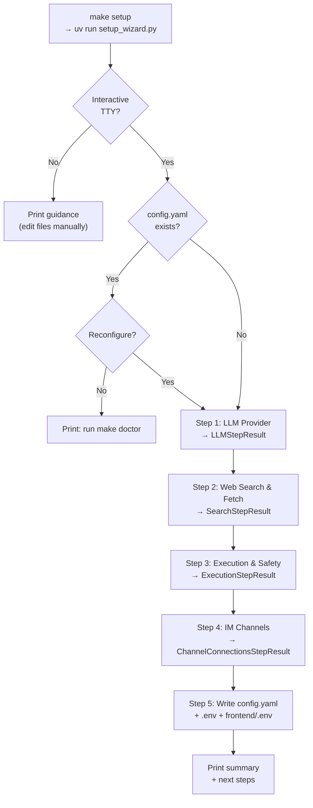
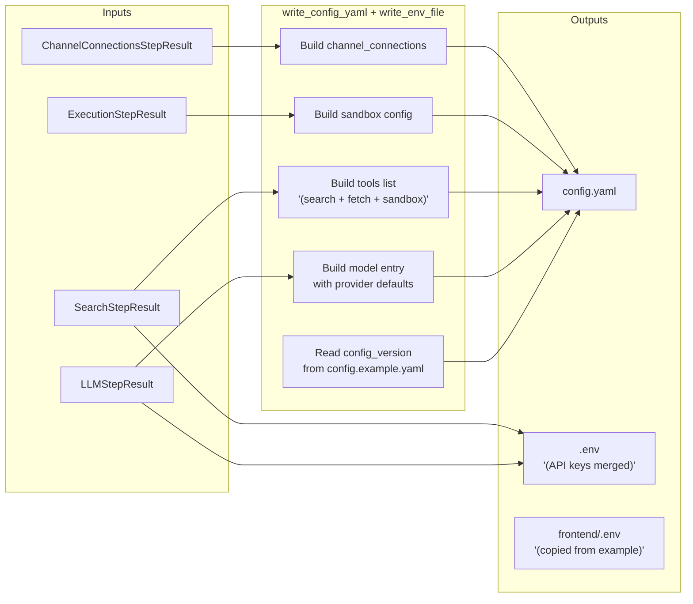
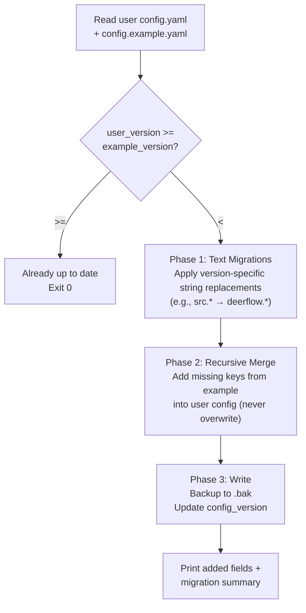

---
slug:3-configuration-and-setup-wizard
blog_type:normal
---


DeerFlow 内置了一个引导式的**交互式设置向导**，它会引导你完成所有核心配置决策——从选择 LLM 提供商到选择执行沙箱——并在五分钟内生成可直接运行的 `config.yaml` 和 `.env` 文件。本页面涵盖了该向导的架构、每个配置步骤的详细说明、配套的健康检查工具（`make doctor`）以及配置版本的升级路径，帮助你全面了解 DeerFlow 是如何从零启动并进入运行状态的。

## 向导架构一览

该设置系统是一个位于 `scripts/wizard/` 目录下的模块化 Python 包，通过 `make setup` 命令启动，并委托给 `backend/` 的 `uv` 环境执行。入口点会验证终端是否支持交互，随后执行五个串行步骤。每个步骤都会生成一个带类型的结果数据类（dataclass），并汇入集中的配置写入器。



该向导严格遵循关注点分离原则：`scripts/wizard/steps/` 下的每个步骤模块仅处理用户交互并返回一个数据类，而 `scripts/wizard/writer.py` 负责处理所有文件 I/O 操作。这意味着你可以独立重新运行任何步骤，或者在无需交互提示词的情况下以编程方式构建配置。

来源：[setup_wizard.py](scripts/setup_wizard.py#L21-L167), [Makefile](Makefile#L55-L56)

## 向导的项目结构

```
scripts/
├── setup_wizard.py          ← 入口点：验证 TTY，编排 5 个步骤
├── configure.py             ← 非交互式引导 (make config)
├── doctor.py                ← 健康检查 (make doctor)
├── check.py                 ← 依赖检查器 (make check)
├── config-upgrade.sh        ← 配置版本迁移 (make config-upgrade)
└── wizard/
    ├── __init__.py
    ├── providers.py          ← 所有 LLM/搜索/抓取提供商定义
    ├── ui.py                 ← 终端 UI 基础组件 (箭头、密码输入、菜单)
    ├── writer.py             ← config.yaml + .env 文件生成
    └── steps/
        ├── __init__.py
        ├── llm.py            ← 步骤 1：LLM 提供商与模型选择
        ├── search.py         ← 步骤 2：网络搜索与抓取提供商
        ├── execution.py      ← 步骤 3：沙箱模式与工具权限
        └── channels.py       ← 步骤 4：IM 渠道启用
```

<CgxTip>该向导需要交互式 TTY（`sys.stdin.isatty() and sys.stdout.isatty()`）。在 CI 流水线、Docker 非交互式 Shell 或 VS Code 输出面板中，它将拒绝运行，并提示你手动编辑 `config.yaml` 和 `.env`，或使用 `make config` 进行非交互式模板拷贝。</CgxTip>

来源：[setup_wizard.py](scripts/setup_wizard.py#L17-L28), [wizard/ directory](scripts/wizard)

## Make 目标概览

DeerFlow 将所有设置、诊断和生命周期命令统一整合在一个 `Makefile` 中。下表映射了每个目标到其用途、前置条件及产出物：

| Make 目标 | 调用的脚本 | 用途 | 产出 |
|---|---|---|---|
| `make setup` | `scripts/setup_wizard.py` | 交互式 5 步向导 | `config.yaml`, `.env`, `frontend/.env` |
| `make config` | `scripts/configure.py` | 非交互式模板拷贝 | `config.yaml` (源自 `config.example.yaml`), `.env`, `frontend/.env` |
| `make config-upgrade` | `scripts/config-upgrade.sh` | 将新字段合并到旧配置中 | 更新后的 `config.yaml` + `.bak` 备份 |
| `make check` | `scripts/check.py` | 验证系统依赖 | 针对 Node.js 22+, pnpm, uv, nginx 的通过/失败报告 |
| `make doctor` | `scripts/doctor.py` | 深度配置 + 环境健康检查 | 包含可执行修复建议的多段落报告 |
| `make install` | Makefile 内联 | 安装所有项目依赖 | 后端 (uv sync), 前端 (pnpm install), pre-commit hooks |
| `make setup-sandbox` | `scripts/setup-sandbox.sh` | 预拉取沙箱容器镜像 | 本地缓存的 Docker 镜像 |

关键区别在于：`make config` 执行的是从 `config.example.yaml` 到 `config.yaml` 的**纯复制**操作，如果任何配置文件已存在则会中止；而 `make setup` 执行的是**智能生成**——它会提出针对性的问题，并仅写入你选定的提供商所需的最少字段。

来源：[Makefile](Makefile#L1-L177), [configure.py](scripts/configure.py#L20-L54)

## 步骤 1：LLM 提供商选择

向导的第一个也是最关键的步骤，会展示一份精选的 LLM 提供商列表。每个提供商都被定义为一个 `LLMProvider` 数据类，内置了 API 基础 URL、超时值、思考/推理支持以及视觉能力的默认配置——因此你只需选择提供商、挑选模型并输入 API 密钥即可。

该步骤的流程为：**提供商选择 → 模型选择（如有多个） → 基础 URL 提示词（如为自定义网关） → 思考支持探测（如未知） → API 密钥输入**。部分提供商（如 Codex CLI 和 Claude Code OAuth）会完全跳过 API 密钥步骤，转而使用本地授权文件。

<CgxTip>带有 `auth_hint` 的提供商（Ollama、Codex CLI、Claude Code OAuth）无需 API 密钥——它们通过本地文件（`~/.codex/auth.json`、`~/.claude/.credentials.json`）进行身份验证，或根本不需要验证（如 Ollama）。向导会自动检测这些情况并跳过密钥输入步骤。</CgxTip>

### 支持的 LLM 提供商

| 提供商 | 显示名称 | 默认模型 | API 密钥环境变量 | 思考 | 视觉 | 认证类型 |
|---|---|---|---|---|---|---|
| 火山引擎豆包 | Volcengine Doubao | `doubao-seed-1-8-251228` | `VOLCENGINE_API_KEY` | ✅ | ✅ | API 密钥 |
| 火山引擎编程计划 | Volcengine Coding Plan | `glm-5.2` | `VOLCENGINE_API_KEY` | ✅ | 视模型而定 | API 密钥 (多供应商) |
| OpenAI | OpenAI | `gpt-5` | `OPENAI_API_KEY` | ❌ | ✅ | API 密钥 |
| OpenAI Responses API | OpenAI Responses API | `gpt-5` | `OPENAI_API_KEY` | ❌ | ✅ | API 密钥 |
| Anthropic | Anthropic | `claude-sonnet-4-20250514` | `ANTHROPIC_API_KEY` | ✅ | ✅ | API 密钥 |
| DeepSeek | DeepSeek | `deepseek-v4-pro` | `DEEPSEEK_API_KEY` | ✅ | ❌ | API 密钥 |
| Google Gemini | Google Gemini | `gemini-2.5-pro` | `GEMINI_API_KEY` | ❌ | ✅ | API 密钥 |
| Gemini OpenAI 兼容版 | Gemini OpenAI-compatible | `google/gemini-2.5-pro-preview` | `GEMINI_API_KEY` | ✅ | ✅ | API 密钥 + 网关 URL |
| Ollama Qwen3 | Ollama Qwen3 | `qwen3:32b` | 无 | ✅ | ❌ | 本地 (无密钥) |
| Ollama Gemma | Ollama Gemma | `gemma4:27b` | 无 | ✅ | ✅ | 本地 (无密钥) |
| 小米 MiMo | Xiaomi MiMo | `mimo-v2.5-pro` | `MIMO_API_KEY` | ✅ | ❌ | API 密钥 |
| Moonshot Kimi | Moonshot Kimi | `kimi-k2.5` | `MOONSHOT_API_KEY` | ✅ | ✅ | API 密钥 |
| Novita AI | Novita AI | `deepseek/deepseek-v3.2` | `NOVITA_API_KEY` | ✅ | ✅ | API 密钥 |
| MiniMax | MiniMax | `MiniMax-M3` | `MINIMAX_API_KEY` | ✅ | 视模型而定 | API 密钥 |
| MiniMax CN | MiniMax CN | `MiniMax-M3` | `MINIMAX_API_KEY` | ✅ | 视模型而定 | API 密钥 |
| OpenRouter | OpenRouter | `google/gemini-2.5-flash-preview` | `OPENROUTER_API_KEY` | ❌ | ❌ | API 密钥 |
| OrcaRouter | OrcaRouter | `openai/gpt-5.5` | `ORCAROUTER_API_KEY` | ❌ | ❌ | API 密钥 |
| vLLM | vLLM | `Qwen/Qwen3-32B` | `VLLM_API_KEY` | ✅ | ❌ | API 密钥 (自托管) |
| MindIE | MindIE | `Qwen3-Coder-480B-A35B-Instruct-Client` | `OPENAI_API_KEY` | ❌ | ❌ | API 密钥 (自托管) |
| Codex CLI | Codex CLI | `gpt-5.4` | 无 | ✅ | ❌ | 本地授权文件 |
| Claude Code OAuth | Claude Code OAuth | `claude-sonnet-4-6` | 无 | ✅ | ❌ | OAuth 凭证 |
| 其他 OpenAI 兼容版 | Other OpenAI-compatible | `gpt-4o` | `OPENAI_API_KEY` | 用户指定 | ❌ | API 密钥 + 基础 URL |

对于**“其他 OpenAI 兼容版”**提供商，向导会提示词输入自定义基础 URL、模型名称，以及模型是否支持思考/推理——这使得无需修改代码即可连接任何兼容 OpenAI 的网关。

来源：[wizard/steps/llm.py](scripts/wizard/steps/llm.py#L27-L91), [wizard/providers.py](scripts/wizard/providers.py#L116-L546)

## 步骤 2：网络搜索与抓取配置

DeerFlow Agent 可以执行实时的网络检索，但这需要两种截然不同的能力：一个**搜索提供商**（用于查找 URL）和一个**抓取提供商**（用于从这些 URL 中提取内容）。该向导在一个步骤中完成这两者的配置，且各自均可独立跳过——Agent 依然可以运行，只是失去了网络访问能力。

该步骤会智能复用 API 密钥：如果你为搜索和抓取选择了相同的提供商家族（例如两者均使用 Exa），向导会检测到共享的环境变量并跳过第二次密钥输入提示词。

### 网络搜索提供商

| 提供商 | 描述 | 需要 API 密钥 | 环境变量 |
|---|---|---|---|
| DuckDuckGo | 免费，无需密钥 | 否 | 无 |
| Tavily | 推荐，提供免费额度 | 是 | `TAVILY_API_KEY` |
| InfoQuest | 更高质量的垂直搜索 | 是 | `INFOQUEST_API_KEY` |
| Exa | 神经网络 + 关键词网络搜索 | 是 | `EXA_API_KEY` |
| Firecrawl | 通过 Firecrawl API 搜索与爬取 | 是 | `FIRECRAWL_API_KEY` |
| fastCRW | 兼容 Firecrawl，自托管或云端 | 是 | `CRW_API_KEY` |
| Brave Search | 独立索引，官方 API | 是 | `BRAVE_SEARCH_API_KEY` |
| GroundRoute | 一个密钥覆盖六大引擎并支持故障转移 | 是 | `GROUNDROUTE_API_KEY` |

### 网络抓取提供商

| 提供商 | 描述 | 需要 API 密钥 | 环境变量 |
|---|---|---|---|
| Jina AI Reader | 优秀的默认阅读器 | 否 | 无 |
| Exa | 需要 API 密钥 | 是 | `EXA_API_KEY` |
| InfoQuest | 需要 API 密钥 | 是 | `INFOQUEST_API_KEY` |
| Firecrawl | 搜索级爬取，输出 Markdown | 是 | `FIRECRAWL_API_KEY` |
| GroundRoute | 通过路由引擎抓取页面 | 是 | `GROUNDROUTE_API_KEY` |
| fastCRW | 兼容 Firecrawl 的抓取器，自托管或云端 | 是 | `CRW_API_KEY` |
| Crawl4AI | 自托管无头 Chromium，无需密钥 | 否 | 无 |

对于初学者而言，**DuckDuckGo + Jina AI Reader** 的组合提供了一个完全免费的网络检索流水线，且无需任何 API 密钥。

来源：[wizard/steps/search.py](scripts/wizard/steps/search.py#L19-L66), [wizard/providers.py](scripts/wizard/providers.py#L548-L680)

## 步骤 3：执行与安全配置

此步骤控制 Agent 在你的工作区中拥有多大的执行权限——这是一个关键的安全决策。你需要选择一种沙箱模式，然后独立切换 bash 命令执行和文件写入工具的开关。

### 沙箱模式

| 模式 | 提供商类 | 隔离级别 | 适用场景 |
|---|---|---|---|
| **本地沙箱** | `deerflow.sandbox.local:LocalSandboxProvider` | 低 — 使用宿主机文件系统路径 | 最快的本地开发，受信任的工作流 |
| **容器沙箱** | `deerflow.community.aio_sandbox:AioSandboxProvider` | 较高 — 需要 Docker 或 Apple Container | 不受信任的代码，多租户，生产环境 |

当你选择本地沙箱时，向导会显示一条明确的警告：*“本地沙箱虽然方便，但并非安全的 Shell 隔离边界。”* 如果你随后在本地沙箱下启用 bash，`allow_host_bash` 标志将被设置为 `true`，这意味着 bash 命令将直接在你的宿主机上执行。

### 工具权限开关

| 开关 | 默认值 | 描述 |
|---|---|---|
| 启用 bash 命令执行 | `false` | 添加 `bash` 工具 — Agent 可运行任意 Shell 命令 |
| 启用文件写入工具 | `true` | 添加 `write_file` 和 `str_replace` 工具 — Agent 可创建和修改文件 |

写入器逻辑会在根据你的选择重新添加这些工具之前，从默认工具列表中移除任何已存在的 `bash`、`write_file` 和 `str_replace` 条目，从而确保配置始终反映你的真实意图，而不是累积过期条目。

来源：[wizard/steps/execution.py](scripts/wizard/steps/execution.py#L21-L51), [wizard/writer.py](scripts/wizard/writer.py#L95-L148)

## 步骤 4：IM 渠道启用

向导可选的第四步允许你预先选择哪些即时通讯平台应出现在 DeerFlow 的侧边栏和设置界面中。这**不会**配置凭证——它仅切换启用哪些渠道连接适配器。你稍后需通过浏览器界面输入实际的 Bot Token 和应用凭证。

### 支持的 IM 渠道

| 渠道 | 键值 | 描述 |
|---|---|---|
| Telegram | `telegram` | 通过你的 DeerFlow Bot 进行私信 |
| Slack | `slack` | 工作区消息与提及 |
| Discord | `discord` | 通过你的 DeerFlow Bot 收发服务器消息 |
| 飞书 / Lark | `feishu` | 通过你的 DeerFlow 应用收发消息 |
| 钉钉 | `dingtalk` | 通过你的 DeerFlow Bot 推送流消息 |
| 微信 | `wechat` | 通过你的 DeerFlow Bot 收发 iLink 消息 |
| 企业微信 | `wecom` | 通过你的 DeerFlow AI Bot 收发消息 |

多选菜单支持以逗号分隔的数字、输入 `all` 全选，或按 Enter 键全不选。生成的配置会写入一个 `channel_connections` 块，包含一个 `enabled` 布尔值以及针对各个提供商的 `{enabled: true/false}` 条目。

来源：[wizard/steps/channels.py](scripts/wizard/steps/channels.py#L26-L46), [wizard/writer.py](scripts/wizard/writer.py#L164-L173)

## 步骤 5：配置文件生成

最后一步是非交互式的——向导会收集所有结果并写入三个文件：



**config.yaml 写入器**（`write_config_yaml`）的处理方式比较巧妙：它将 `config.example.yaml` 作为基础模板读取，然后将你在向导中的选择叠加其上。这意味着你生成的 `config.yaml` 会继承示例文件中的所有默认字段（日志、token 预算、递归限制等），同时仅自定义模型、工具、沙箱和渠道部分。`config_version` 会从示例文件中提取，以确保你的配置始终始于最新的模式版本。

**.env 写入器**（`write_env_file`）执行的是合并操作，而非覆盖。它会读取现有的 `.env` 内容，原地更新与向导输入匹配的键，并追加任何新键。注释和格式都会予以保留。

来源：[setup_wizard.py](scripts/setup_wizard.py#L83-L131), [wizard/writer.py](scripts/wizard/writer.py#L258-L318)

## 非交互式替代方案：`make config`

如果你正在编写部署脚本或偏好手动编辑，`make config` 会运行 `scripts/configure.py`——这是一个最小化的引导程序，会将 `config.example.yaml` 拷贝为 `config.yaml`，`.env.example` 拷贝为 `.env`，`frontend/.env.example` 拷贝为 `frontend/.env`，但**前提是这些文件尚不存在**。如果检测到任何配置文件已存在，它会报错并中止，以防止意外覆盖。

这种方式为你提供了包含所有内联文档、长达 2560 行的完整 `config.example.yaml`，供你手动编辑。当你需要向导未涵盖的高级配置（多模型设置、自定义中间件扩展、token 预算调优等）时，这是正确的选择。

来源：[configure.py](scripts/configure.py#L20-L54), [config.example.yaml](config.example.yaml#L1-L200)

## 健康检查：`make doctor`

设置完成后，`make doctor` 会运行全面的多维度健康检查，验证你的整个配置栈。它会生成一份带有颜色标记的报告，包含 `✓`（正常）、`!`（警告）、`✗`（失败）和 `—`（跳过）图标，并为每个失败项提供可操作的修复建议。

### Doctor 检查类别

| 类别 | 执行的检查 | 失败严重程度 |
|---|---|---|
| **系统要求** | Python 3.12+, Node.js 22+, pnpm, uv, nginx | 失败 |
| **配置文件** | `config.yaml` 存在，且可通过 `AppConfig.from_file()` 加载 | 失败 |
| **配置版本** | 用户 `config_version` 与 `config.example.yaml` 版本对比 | 警告 |
| **模型** | `config.yaml` 中至少存在一个模型条目 | 失败 |
| **LLM API 密钥** | 环境中解析出每个 `$ENV_VAR` 引用 | 失败 |
| **LLM 安装包** | 可导入所需的 LangChain 提供商包 | 失败 |
| **LLM 认证** | Codex CLI / Claude Code OAuth 凭证文件存在 | 失败 |
| **网络搜索** | `web_search` 工具配置了有效的提供商 + 密钥 | 警告 |
| **网络抓取** | `web_fetch` 工具配置了有效的提供商 + 密钥 | 警告 |

Doctor 在检查环境变量之前会通过 `dotenv` 加载 `.env`，因此它测试的是与运行时相同的解析路径。对于网络工具，它会区分无需密钥的**免费提供商**（DuckDuckGo、Jina AI Reader、Crawl4AI）和需要特定环境变量的**付费提供商**——如果付费提供商的密钥缺失，它会返回警告（而非失败），因为 Agent 在没有网络访问的情况下依然可以运行。

<CgxTip>在每次配置更改或 `git pull` 后运行 `make doctor`。它能在你浪费时间调试运行时错误之前，捕获最常见的设置失败——缺失环境变量、未安装的提供商包、过期的配置版本。当所有必要检查通过时（允许存在警告），退出代码为 `0`，这使其非常适配 CI 环境。</CgxTip>

来源：[doctor.py](scripts/doctor.py#L1-L200), [doctor.py](scripts/doctor.py#L200-L598)

## 配置版本升级：`make config-upgrade`

DeerFlow 的 `config.example.yaml` 包含一个 `config_version` 整数（当前为 `33`），每当模式发生变化时该数字就会递增。当你执行 `git pull` 且示例文件的版本超越了本地 `config.yaml` 的版本时，Doctor 会向你发出警告。运行 `make config-upgrade` 会执行三个阶段的迁移：



该迁移系统是可扩展的：每个版本升级都可以在 `MIGRATIONS` 字典中注册一个迁移条目，包含 `description` 和 `replacements`（旧字符串 → 新字符串）。目前仅定义了版本 1（即 `src.*` → `deerflow.*` 的模块路径重命名）。递归合并只会**添加缺失的键**——它绝不会覆盖你的现有值，从而保留你所做的所有自定义配置。

来源：[config-upgrade.sh](scripts/config-upgrade.sh#L1-L156), [config.example.yaml](config.example.yaml#L18)

## 配置文件层级结构

DeerFlow 通过具有明确优先级的分层系统来解析配置：

| 文件 | 用途 | 创建者 | Git 忽略？ |
|---|---|---|---|
| `config.example.yaml` | 包含内联文档的完整参考模板 | 随仓库分发 | 否 |
| `config.yaml` | 你的当前活动配置 | `make setup` 或 `make config` | 是 |
| `.env` | API 密钥与凭证 | `make setup` 或 `make config` | 是 |
| `frontend/.env` | 前端环境变量 | `make setup` 或 `make config` | 是 |
| `.env.example` | `.env` 的模板 | 随仓库分发 | 否 |
| `frontend/.env.example` | `frontend/.env` 的模板 | 随仓库分发 | 否 |

环境变量可以覆盖配置路径：`DEER_FLOW_CONFIG_PATH` 指向特定的配置文件，`DEER_FLOW_PROJECT_ROOT` 定义项目根目录，`DEER_FLOW_HOME` 覆盖可写数据目录（默认：项目根目录下的 `.deer-flow/`）。

来源：[config.example.yaml](config.example.yaml#L1-L11), [configure.py](scripts/configure.py#L36-L42)

## 终端 UI 体验

向导的 UI 层（`scripts/wizard/ui.py`）提供了经过精心打磨的终端体验，支持两种输入模式：

- **箭头键导航**：在支持 TTY 的 Unix 终端上，选项会呈现为交互式菜单，使用 `↑/↓` 移动，`Enter` 确认，数字键快速选择。被选中的选项会以反色高亮显示，并带有 `›` 标记。
- **数字回退**：在 Windows 或非 TTY 环境下，选项会呈现为带编号的列表，你只需输入数字并按 Enter 键即可。

所有 UI 基础组件均支持 ANSI 颜色并带有自动检测功能——如果 `stdout` 不是 TTY，颜色会自动剥离。隐秘输入（API 密钥）使用 `getpass.getpass()` 实现隐藏输入，且向导会确认每个密钥将存储在哪个环境变量名下。

来源：[wizard/ui.py](scripts/wizard/ui.py#L86-L305)

## 完整设置演练

对于从全新克隆仓库开始的新手，推荐的流程如下：

1. **`make check`** — 验证是否已安装 Node.js 22+、pnpm、uv 和 nginx
2. **`make setup`** — 运行交互式向导（5 个步骤，约 3 分钟）
3. **`make install`** — 安装后端、前端 (pnpm install) 和 pre-commit hooks
4. **`make doctor`** — 验证配置有效性并捕获任何缺失的环境变量
5. **`make dev`** — 以开发模式启动所有服务并支持热重载

如果你偏好使用 Docker，请将步骤 3–5 替换为 `make docker-init`（拉取沙箱镜像），然后执行 `make docker-start`。

向导的最终输出会打印已配置内容的摘要以及接下来要运行的确切命令，因此你始终明确下一步的操作，而无需查阅文档。

来源：[setup_wizard.py](scripts/setup_wizard.py#L133-L166), [check.py](scripts/check.py#L161-L180)

## 后续去向

既然你的环境已经配置完毕，接下来的合理步骤是：

- **[架构概览](7-architecture-overview)** — 了解你刚才生成的配置是如何流入 DeerFlow 的 Agent 编排、沙箱和网关层的
- **[快速开始](2-quick-start)** — 启动 DeerFlow 并向 Agent 发送你的第一条消息
- **[模型提供商集成](15-model-provider-intintegration)** — 深入了解每个 LLM 提供商的 `use` 路径是如何解析为 LangChain 聊天模型类的，以及思考/视觉/推理标志如何影响运行时行为
- **[沙箱与文件系统](14-sandbox-and-file-system)** — 理解你在步骤 3 中选择的本地沙箱与容器沙箱对安全性的影响
- **[IM 渠道适配器](19-im-channel-adapters)** — 学习如何完成你在步骤 4 中发起的 IM 渠道凭证设置
