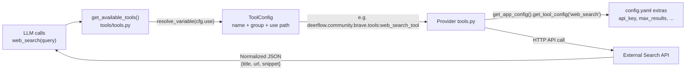
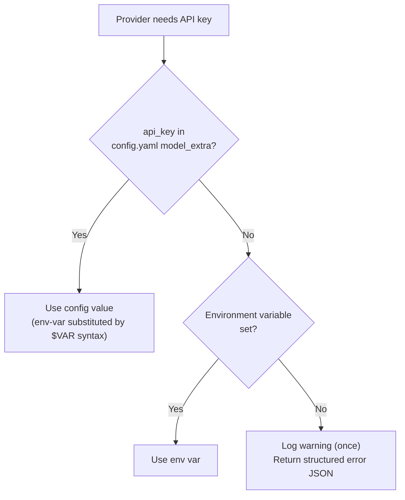

---
slug:30-community-search-providers
blog_type:normal
---


DeerFlow 的 Agent 运行时将网页搜索、页面抓取和图片搜索委托给**可插拔的社区提供者（pluggable community providers）**——这些独立模块均实现了相同的标准化工具接口（`web_search`、`web_fetch`、`image_search`），但连接至不同的搜索后端。本页将全景展示提供者生态，阐明所有提供者共同遵循的架构契约，并提供替换或新增搜索后端所需的配置参考。

## 提供者架构：`community` 模块契约

所有搜索提供者均位于 `backend/packages/harness/deerflow/community/` 目录下，每个提供者占据一个子目录并包含一个 `tools.py` 模块。该目录结构刻意保持扁平化——没有中心化注册表，也没有抽象基类——因为提供者的选择完全通过 **YAML 配置**完成，而非依赖 Python 导入。

其核心理念在于，每个提供者模块导出的 LangChain `@tool` 装饰器函数均具有**标准化的工具名称**。无论你使用 DuckDuckGo、Brave、Tavily 还是 Serper，LLM 看到的工具名称始终为 `web_search`。Agent 无需知晓当前激活的是哪个后端；它只需调用工具并接收格式化后的 JSON 结果。这种命名稳定性由每个提供者中均存在的 `@tool("web_search", parse_docstring=True)` 装饰器来保证。

来源：[tools.py](/backend/packages/harness/deerflow/community/tavily/tools.py#L17-L18), [tools.py](/backend/packages/harness/deerflow/community/brave/tools.py#L232-L233), [tools.py](/backend/packages/harness/deerflow/community/ddg_search/tools.py#L133-L134)

以下 Mermaid 流程图展示了搜索请求如何从 LLM 流经工具加载层，最终抵达特定的提供者后端：



### 配置模式：如何声明提供者

每个提供者都在 `config.yaml` 的 `tools:` 部分进行注册。`ToolConfig` Pydantic 模型定义了三个必填字段——`name`、`group` 和 `use`——其他特定于提供者的参数则通过 `ConfigDict(extra="allow")` 捕获至 `model_extra` 中：

| 字段 | 用途 | 示例 |
|---|---|---|
| `name` | LLM 看到的标准化工具名称 | `web_search`, `web_fetch`, `image_search` |
| `group` | 用于访问控制/过滤的工具组 | `web`, `browser` |
| `use` | 指向工具函数的点分导入路径 | `deerflow.community.brave.tools:web_search_tool` |
| `model_extra` | 特定于提供者的配置（API 密钥、限制等） | `api_key`, `max_results`, `base_url`, `region` |

在运行时，`tools/tools.py` 中的工具加载函数会遍历所有已配置的工具，调用 `resolve_variable(cfg.use, BaseTool)` 动态导入该函数，并按工具名称进行去重，以确保同一时间仅有一个 `web_search` 提供者处于激活状态。

来源：[tool_config.py](/backend/packages/harness/deerflow/config/tool_config.py#L4-L21), [tools.py](/backend/packages/harness/deerflow/tools/tools.py#L72-L93), [tools.py](/backend/packages/harness/deerflow/tools/tools.py#L171-L183)

### 运行时配置解析模式

每个提供者在调用时（而非导入时）读取其配置时，均遵循相同的模式。这一点至关重要，因为它允许通过重新加载配置来热插拔提供者，而无需重启进程。其经典模式如下：

```python
config = get_app_config().get_tool_config("web_search")
if config is not None:
    api_key = config.model_extra.get("api_key")
    max_results = config.model_extra.get("max_results", 5)
```

这种延迟解析机制意味着配置文件是唯一的真相源，提供者模块本身则是无状态的。

来源：[tools.py](/backend/packages/harness/deerflow/community/tavily/tools.py#L9-L14), [tools.py](/backend/packages/harness/deerflow/community/ddg_search/tools.py#L144-L154)

## 提供者目录

下表汇总了 `community` 模块中所有可用的搜索与抓取提供者、其功能、身份验证要求及默认状态：

| 提供者 | 工具 | 需要验证 | 默认？ | 核心特性 |
|---|---|---|---|---|
| **DuckDuckGo** (`ddg_search`) | `web_search` | 无 | ✅ 是 | 零配置，多后端聚合 |
| **SearXNG** (`searxng`) | `web_search` | 无（自托管） | 否 | 注重隐私的元搜索聚合 |
| **Serper** (`serper`) | `web_search`, `image_search` | `SERPER_API_KEY` | 否 | 通过 JSON API 获取实时 Google 搜索结果 |
| **Brave Search** (`brave`) | `web_search`, `image_search` | `BRAVE_SEARCH_API_KEY` | 否 | 独立索引，SSRF 安全的图片 URL |
| **Tavily** (`tavily`) | `web_search`, `web_fetch` | `TAVILY_API_KEY` | 否 | AI 优化的搜索与页面提取 |
| **Exa** (`exa`) | `web_search`, `web_fetch` | `EXA_API_KEY` | 否 | 神经网络与关键词搜索模式 |
| **Firecrawl** (`firecrawl`) | `web_search`, `web_fetch` | `FIRECRAWL_API_KEY` | 否 | 带内容提取的网页抓取 |
| **GroundRoute** (`groundroute`) | `web_search`, `web_fetch` | `GROUNDROUTE_API_KEY` | 否 | 跨 6 个引擎的元路由，支持故障转移 |
| **InfoQuest** (`infoquest`) | `web_search`, `web_fetch`, `image_search` | InfoQuest API key | 否 | 支持时间范围过滤的多工具提供者 |
| **fastCRW** (`fastcrw`) | `web_search`, `web_fetch` | `CRW_API_KEY`（仅云端） | 否 | 兼容 Firecrawl，可自托管的单一二进制文件 |
| **Jina AI** (`jina_ai`) | `web_fetch` | 无（免费层级） | ✅ 是（抓取） | 轻量级阅读器 API |
| **Browserless** (`browserless`) | `web_fetch`, `web_capture` | `BROWSERLESS_TOKEN`（云端） | 否 | 针对重 JS 页面的无头 Chrome |
| **Crawl4AI** (`crawl4ai`) | `web_fetch` | `CRAWL4AI_TOKEN` (≥0.9) | 否 | 自托管 Chromium，服务端清洗的 Markdown |
| **DuckDuckGo Images** (`image_search`) | `image_search` | 无 | ✅ 是 | 零配置图片搜索 |

<CgxTip>同一时间同一工具名称只能激活一个提供者。`tools/tools.py` 中的工具加载器会根据 `tool.name` 进行去重——`config.yaml` 中声明的第一个 `web_search` 将生效，后续条目将被静默跳过并输出警告日志。在为同一工具名称启用替代提供者之前，请务必注释掉默认的 DuckDuckGo/Jina 条目。</CgxTip>

来源：[config.example.yaml](/config.example.yaml#L677-L982), [tools.py](/backend/packages/harness/deerflow/tools/tools.py#L171-L183)

## 深入解析：DuckDuckGo —— 默认搜索提供者

DuckDuckGo 作为零配置默认选项，因其无需 API 密钥且支持多种聚合后端。该提供者封装了 `ddgs` 库，并提供了几项不甚显眼的功能：

`backend` 参数接受逗号分隔的值（如 `"duckduckgo,brave"`），允许 DDGS 聚合器在无需替换提供者的情况下，在多个搜索引擎间进行故障转移。该提供者还实现了**自动推断 Wikipedia 区域**——当使用全球区域（`wt-wt`）搭配 Wikipedia 后端时，代码会检查查询语句中的 Unicode 码位范围，以检测日语、韩语、中文、西里尔语、希腊语、希伯来语和阿拉伯语文本，随后映射至相应的 Wikipedia 语言区域。这可避免 DDGS 将 `wt-wt` 解析至不存在的 `wt.wikipedia.org` 的 Bug。

```yaml
# 默认配置 — 无需 API 密钥
tools:
  - name: web_search
    group: web
    use: deerflow.community.ddg_search.tools:web_search_tool
    max_results: 5
    # backend: auto          # auto, duckduckgo, brave, wikipedia, 或逗号分隔的值
    # region: wt-wt          # 全球默认；针对 Wikipedia 自动推断
    # safesearch: moderate   # on, moderate, off
```

来源：[tools.py](/backend/packages/harness/deerflow/community/ddg_search/tools.py#L14-L65), [tools.py](/backend/packages/harness/deerflow/community/ddg_search/tools.py#L87-L131), [config.example.yaml](/config.example.yaml#L678-L685)

## 深入解析：Brave Search —— 带有 SSRF 防护的双工具提供者

Brave Search 值得关注，因为它是两款（另一款为 Serper）同时实现了 **`web_search` 和 `image_search`** 的提供者之一，且在图片搜索路径中具备详尽的 SSRF 防护。该提供者通过 `httpx` 直接调用官方 Brave Search REST API，并使用 `X-Subscription-Token` 请求头进行身份验证。

图片搜索工具中的 SSRF 防护尤为精妙。`_safe_public_url()` 函数执行了多层验证：拒绝非 http(s) 协议、屏蔽 `localhost` 和 `.localhost` 后缀、检测混淆的 IPv4 字面量（十进制、十六进制和八进制编码，如 `2130706433`、`0x7f000001`、`0177.0.0.1`），甚至处理通过 NAT64、6to4、IPv4 映射及 IPv4 兼容形式内嵌非全局 IPv4 地址的 IPv6 字面量。这有效防止了攻击者通过注入带有恶意图片 URL 的搜索结果，将目标指向内部基础设施。

```yaml
# Brave 网页搜索
- name: web_search
  group: web
  use: deerflow.community.brave.tools:web_search_tool
  max_results: 5                  # 受限于 Brave Search API 的最大值 20
  # api_key: $BRAVE_SEARCH_API_KEY

# Brave 图片搜索（同样需要 BRAVE_SEARCH_API_KEY）
- name: image_search
  group: web
  use: deerflow.community.brave.tools:image_search_tool
  max_results: 5   # 受限于 Brave Image Search 的最大值 200
  # country: US
  # search_lang: en
  # safesearch: strict
  # spellcheck: true
```

来源：[tools.py](/backend/packages/harness/deerflow/community/brave/tools.py#L1-L11), [tools.py](/backend/packages/harness/deerflow/community/brave/tools.py#L96-L197), [tools.py](/backend/packages/harness/deerflow/community/brave/tools.py#L278-L382), [config.example.yaml](/config.example.yaml#L707-L982)

## 深入解析：GroundRoute —— 带有引擎故障转移的元搜索

GroundRoute 在架构上与其他所有提供者截然不同，因为它是一个**元搜索层**，而非直接的搜索引擎。单次 API 调用即可将查询路由至六个底层引擎（Serper、Brave、Exa、Tavily、Firecrawl、Perplexity），从中选择符合质量标准且成本最低的引擎，对重复查询进行缓存，并在引擎宕机时自动进行故障转移。其定价模式为收益共享——调用方可保留约一半的缓存节省费用。

其实现是自包含的（仅使用 httpx，无 GroundRoute SDK），且 `web_fetch` 变体巧妙地复用了相同的 `/v1/search` 端点并配合 `mode=page` 来提取页面内容。这两个工具共享同一个 `_post_search()` 辅助函数，仅在请求体载荷上有所区别。

```yaml
- name: web_search
  group: web
  use: deerflow.community.groundroute.tools:web_search_tool
  max_results: 5                  # 被 GroundRoute 限制在 1-50 之间
  # api_key: $GROUNDROUTE_API_KEY
```

来源：[tools.py](/backend/packages/harness/deerflow/community/groundroute/tools.py#L1-L17), [tools.py](/backend/packages/harness/deerflow/community/groundroute/tools.py#L74-L132), [config.example.yaml](/config.example.yaml#L747-L757)

## 网页抓取提供者：页面提取层

`web_search` 提供者返回摘要和 URL，而 `web_fetch` 提供者则用于获取特定 URL 的**完整提取内容**。默认提供者为 Jina AI 的阅读器 API（零配置，免费层级），但 `community` 模块还包含了具备不同渲染能力的多种替代方案：

| 提供者 | 渲染引擎 | 最适用场景 | SSRF 防护 |
|---|---|---|---|
| **Jina AI** | 服务端阅读器 API | 静态内容、文章、文档 | — |
| **Tavily** | `client.extract()` API | AI 摘要页面内容 | — |
| **Exa** | `get_contents()` API | 神经网络内容提取 | — |
| **Browserless** | 无头 Chrome | 重 JavaScript 单页应用 (SPA) | ✅ `allow_private_addresses: false` |
| **Crawl4AI** | 自托管 Chromium | 服务端清洗的 Markdown 输出 | ✅ `allow_private_addresses: false` |
| **Firecrawl** | 云端抓取器 | 结构化内容提取 | — |
| **GroundRoute** | 元层（`mode=page`） | 跨提取引擎的故障转移 | — |
| **fastCRW** | 可自托管二进制文件 | 兼容 Firecrawl，低开销 | ✅ `allow_private_addresses: false` |

Browserless 和 Crawl4AI 提供者包含一个 `allow_private_addresses` 标志（默认为 `false`），起到 SSRF 防护作用。启用该标志时，这些提供者还支持高级页面等待选项：`wait_for_event`（如 `networkidle`）、`wait_for_timeout_ms` 和 `wait_for_selector`——这对于异步加载内容的页面至关重要。

<CgxTip>Browserless 和 Crawl4AI 除 `web_fetch` 外，均支持 `web_capture` 工具（生成截图产物）。Crawl4AI 提供者要求版本 ≥0.9 以强制执行默认安全的 Bearer Token 认证——早期镜像（≤0.8.6）存在已知的预认证 RCE 漏洞，切勿使用。</CgxTip>

来源：[config.example.yaml](/config.example.yaml#L768-L942), [tools.py](/backend/packages/harness/deerflow/community/tavily/tools.py#L43-L63), [tools.py](/backend/packages/harness/deerflow/community/exa/tools.py#L56-L79), [tools.py](/backend/packages/harness/deerflow/community/groundroute/tools.py#L135-L167)

## 提供者对比：结果标准化

尽管使用不同的后端，所有 `web_search` 提供者均收敛于**统一的结果模式**，以确保无论激活哪个提供者，LLM 接收到的数据格式都是一致的。下表展示了各提供者的原始响应字段与标准化输出字段的映射关系：

| 提供者 | 标题字段 | URL 字段 | 内容/摘要字段 |
|---|---|---|---|
| **DuckDuckGo** | `title` | `href` / `link` | `body` / `snippet` |
| **Brave** | `title` | `url` | `description` |
| **Serper** | `title` | `link` | `snippet` |
| **Tavily** | `title` | `url` | `content` |
| **Exa** | `title` | `url` | `highlights`（拼接后） |
| **SearXNG** | `title` | `url` | `content` |
| **GroundRoute** | `title` | `url` | `snippet` |

所有提供者均向 LLM 返回 JSON 字符串（而非 Python 字典），其典型结构为 `{"query": ..., "total_results": N, "results": [...]}`。DuckDuckGo、Brave、Serper 和 GroundRoute 提供者在输出信封中包含 `total_results` 和 `query`；而 Tavily、Exa 和 SearXNG 则返回更简单的结果数组。这种差异是可接受的，因为 LLM 会按需解析这些 JSON。

来源：[tools.py](/backend/packages/harness/deerflow/community/ddg_search/tools.py#L167-L182), [tools.py](/backend/packages/harness/deerflow/community/brave/tools.py#L261-L275), [tools.py](/backend/packages/harness/deerflow/community/serper/tools.py#L177-L200), [tools.py](/backend/packages/harness/deerflow/community/tavily/tools.py#L31-L40), [tools.py](/backend/packages/harness/deerflow/community/exa/tools.py#L42-L50), [tools.py](/backend/packages/harness/deerflow/community/searxng/tools.py#L47-L55), [tools.py](/backend/packages/harness/deerflow/community/groundroute/tools.py#L123-L132)

## API 密钥解析策略

需要身份验证的提供者遵循一致的**两层密钥解析**模式：首先检查 `config.yaml` 的扩展配置，若未找到则回退至环境变量。这种机制允许运维人员直接在配置中内联密钥（使用 `$VAR` 语法进行环境变量替换），或完全依赖环境变量：



实现此模式的提供者包括 Brave（`BRAVE_SEARCH_API_KEY`）、Serper（`SERPER_API_KEY`）、GroundRoute（`GROUNDROUTE_API_KEY`）和 Tavily（仅限配置中的 `api_key`）。DuckDuckGo 和 SearXNG 无需密钥。每个提供者均使用模块级的 `_api_key_warned: set[str]`，确保每个工具名称最多只触发一次缺失密钥的警告，防止在重复调用失败时产生日志冗余。

来源：[tools.py](/backend/packages/harness/deerflow/community/brave/tools.py#L38-L47), [tools.py](/backend/packages/harness/deerflow/community/serper/tools.py#L27-L36), [tools.py](/backend/packages/harness/deerflow/community/groundroute/tools.py#L40-L52)

## 切换提供者：配置示例

要从默认的 DuckDuckGo 切换至其他搜索提供者，请注释掉默认的 `web_search` 条目，并取消注释（或添加）目标提供者。由于工具加载器会基于名称进行去重，因此同一时间只能保留一个 `web_search` 条目处于激活状态。

**示例：切换至 Serper（Google 搜索 API）**

```yaml
# 注释掉默认配置：
# - name: web_search
#   group: web
#   use: deerflow.community.ddg_search.tools:web_search_tool
#   max_results: 5

# 启用 Serper：
- name: web_search
  group: web
  use: deerflow.community.serper.tools:web_search_tool
  max_results: 5   # 受限于 Serper 提供者的最大值 10
  # api_key: $SERPER_API_KEY  # 或者设置 SERPER_API_KEY 环境变量
```

**示例：自托管 SearXNG（无需 API 密钥）**

```yaml
- name: web_search
  group: web
  use: deerflow.community.searxng.tools:web_search_tool
  base_url: http://localhost:8088   # Docker 环境：http://searxng:8080
  max_results: 5
```

**示例：开启神经网络搜索模式的 Exa**

```yaml
- name: web_search
  group: web
  use: deerflow.community.exa.tools:web_search_tool
  max_results: 5
  search_type: auto  # auto, neural, keyword
  contents_max_characters: 1000
  # api_key: $EXA_API_KEY
```

来源：[config.example.yaml](/config.example.yaml#L677-L738)

## 下一步

既然你已了解搜索提供者如何接入 Agent 的工具层面，以下相关页面将提供更深入的背景信息：

- [MCP Server 和工具桥接](20-mcp-server-and-tool-bridge) — 阐述外部 MCP 来源的工具如何与社区提供者一同加载、缓存，并在同一工具组装流水线中标记 MCP 元数据。
- [模型提供者集成](15-model-provider-integration) — 介绍 LLM 提供者的并行架构，该架构同样采用 `use:` 导入路径模式和 `config.yaml` 声明策略。
- [防护栏与安全中间件](25-guardrails-and-safety-middleware) — 说明 Brave 和 Serper 提供者内置的 SSRF 防护如何与更广泛的安全中间件流水线协同运作，在工具输出到达 LLM 之前对其进行检查。
