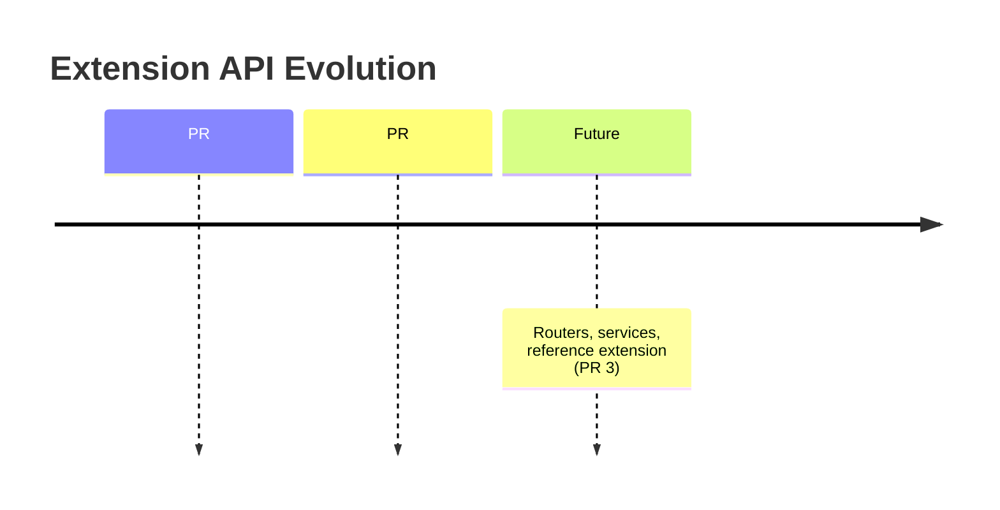

---
slug:4-latest-updates
blog_type:buzz
---

自 2026 年 6 月 25 日发布 v2.0.0 以来，DeerFlow 一直保持着高强度的开发节奏。目前，milestone-2 的 541 个 issue 中已有约 **494 个关闭**，仅剩 47 个待处理。项目正全速推进 2.1.0 版本的发布，尽管该版本尚未确定具体日期——这一点已被[社区公开提出](https://github.com/bytedance/deer-flow/issues/4774)。过去 48 小时（2026 年 8 月 11 日至 12 日）的提交记录表明，项目正处于巩固强化阶段：扩充内存后端、增强扩展 API 的可观测性、修复通道稳定性问题，以及持续推进测试基础设施的改进。接下来，让我们深入剖析这些关键变更。

---

## 内存系统：Honcho 后端落地，但仍有瑕疵

本批次中最重要的一项提交是贡献者 ajayr（与 Claude Fable 5 合作）发起的 [PR #4730](https://github.com/bytedance/deer-flow/commit/6cbf20fd39b34514f53f50fa097220a1deded65a)，该 PR 将 [Honcho](https://honcho.dev) 添加为新的长期记忆后端。Honcho 是一种用户模型记忆提供程序，它超越了简单的事实存储——能够对消息进行推理，从而构建出用户及其关系的持久化模型。

其实现的隔离性保障相当全面，令人印象深刻：

- **基于用户的独立工作区**派生机制，采用防冲突的 `_stable_id()`（清理特殊字符 + 8 位十六进制 SHA-256 后缀），以防止 `user.name@example.com` 和 `user-name@example.com` 塌缩到同一工作区而导致用户数据串扰。
- **失败关闭身份验证**——缺失或空的 `user_id` 会导致空写和空读，而不是回退到共享工作区。
- 在工具模式下通过 `MemoryMiddleware` 实现**被动写入保留**，因为 Honcho 唯一的写入路径是被动 `add()`，没有提供事实增删改查（CRUD）钩子。
- 通过 `asyncio.to_thread` 实现**异步卸载**，确保非阻塞回忆。
- 包含 37 个测试，覆盖写入/读取/异步/生命周期/工厂发现等场景。

但社区已经发现了一个尖锐的问题。[Issue #4782](https://github.com/bytedance/deer-flow/issues/4782) 报告称，`HonchoConfig.from_backend_config()` 会接受非正值的 `message_char_limit`，而 Python 的切片语义会将 `message_char_limit = -1` 转变为后缀删除操作（`text[:-1]`），而不是将其拒绝。`message_char_limit = 0` 则会静默丢弃整个对话轮次。该 Issue 作者指出，**Mem0 已经拒绝非正数的超时和 `max_injection_chars`，OpenViking 也已经拒绝非有限超时——但 Honcho 两者都没有做**。这是一个应该在 PR 审查阶段被发现的验证漏洞，也凸显了在没有统一配置验证契约的情况下快速增加后端所带来的代价。

更宏观的记忆后端版图目前至少包含四个提供程序：

| 后端 | 写入模型 | 搜索 | Token 效率 | 供应商锁定 |
|---------|-------------|--------|-----------------|----------------|
| JSON（默认） | 异步 LLM 提取 | 无（按置信度排序） | 2K token 预算 | 无 |
| [Mem0](https://github.com/mem0ai/mem0) | 事实 CRUD 钩子 | 是 | 可配置 | 低 |
| [OpenViking](https://github.com/bytedance/deer-flow) | 提供程序管理 | 是 | 提供程序管理 | 中 |
| [Honcho](https://honcho.dev) | 仅限被动 `add()` | 是（工作区作用域） | 提供程序管理（约 200ms 回忆） | 高 |

正如 [mem0 对 DeerFlow 记忆系统的分析](https://mem0.ai/blog/how-memory-works-in-deerflow) 所指出的，默认的 JSON 后端刻意避开了向量嵌入和语义搜索，转而采用基于置信度评分的事实注入。Honcho 的加入代表了一种理念上的对立——它将推理工作卸载给一个托管服务，声称其 Neuromancer 引擎能节省 60-90% 的 token。这种权衡是否值得引入外部依赖，需要每个部署实例自行定夺。

---

## 扩展 API：可观测性层达到关键规模

由 Nan Gao 发起的 [PR #4684](https://github.com/bytedance/deer-flow/commit/7389331e6593c7f39cdacd9b078cf946e4e0b22d) 是本批次中的另一项重量级提交。它为扩展 API（`deerflow-extension-api 0.1.1`）增加了两个新的观测面：

1. **任务生命周期钩子**（`on_task_start` / `on_task_stop`），采用保守的 `TaskOutcome`（completed/aborted/failed），覆盖主运行和子 Agent（提供 `parent_task_id` 用于重建委托树）。
2. **系统模型观察器**（`on_system_model_call`），用于中间件链无法感知的四种模型调用：目标评估、记忆提取、标题生成和摘要生成。

该设计在多个方面展现了相当成熟的工程水准：

- **通知“失败放行”由来源决定，而非基类**。贡献者抛出的 `CancelledError`（例如内部超时）不再会跳过后继钩子并破坏运行结果。只有真正的宿主任务取消才会传播。
- **循环安全调度**。扩展资源在创建它们的循环中被触碰。在隔离循环上执行的子 Agent 和在 Worker 线程上运行的 DeerMem 通过 `run_coroutine_threadsafe` 进行调度，共享 3 秒的时间预算。
- **关停顺序**。Gateway 在任何运行时依赖启动之前注册其服务循环，并在最后重置它，确保覆盖所有启动失败和取消路径。在刷新记忆（其本身也可能触发观测）之前，观测会被挂起，而循环会保持存活以等待任务钩子，直到排空完成。

唯一刻意留下的缺口：**同步摘要生成仍未被观测**。提交信息解释说，这是因为同步路径属于纯异步运行时的一部分，宿主永远不会到达那里，在那里发送通知会阻塞一个不可达调用点的线程。这是一个合理的决定，但这意味着构建成本监控或审计工具的扩展开发者，在同步摘要生成路径上会存在盲区。

该 PR 还将扩展 API 契约升级为要求所有三种贡献类型都必须提供 `needs_task_store`，而不仅仅是中间件。仅注册生命周期钩子的部署依然会获得一个任务存储——这是一个虽小但重要的正确性修复。

---

## 通道与 Gateway：死于无尽竞态

一组提交修复了 DeerFlow 消息通道适配器和 Gateway 端点中的竞态条件和生命周期缺陷。这类修复虽然不会成为头条新闻，但却决定了系统能否在生产环境中稳定运行。

| 提交 | 领域 | 修复 |
|--------|------|-----|
| [#4762](https://github.com/bytedance/deer-flow/commit/38ff44778a0d11d71597c2531bfd600df855307c) | 企业微信 | 序列化 websocket 关停——在关闭前等待连接任务完成 |
| [#4752](https://github.com/bytedance/deer-flow/commit/df01102dfc458559abb1acf29d9aee1fb6d9b30b) | Discord | 阻止停止后的打字任务；在事件循环上序列化打字清理 |
| [#4755](https://github.com/bytedance/deer-flow/commit/baaf2bad47508e809baa89849d9b938e4f3e905a) | Gateway | 仅在 `/messages/page` 的最后一条 AI 消息上标记 `turn_duration`（二次修复 #4152，在 #4065 中遗漏） |
| [#4767](https://github.com/bytedance/deer-flow/commit/9ba04bf80c2af38136d2e3c9e1738ffa0b6e64be) | 前端 | 复用剪贴板回退机制用于 Lark 认证 |
| [#4758](https://github.com/bytedance/deer-flow/commit/88252e9b318d34e7e1867155ad2c77993320788e) | Subagents | 将后台任务与复用的工具调用 ID 隔离 |

`turn_duration` 的修复值得特别关注。[PR #4755](https://github.com/bytedance/deer-flow/commit/baaf2bad47508e809baa89849d9b938e4f3e905a) 揭示，在 #4163 修复旧版 `/messages` 和 `/history` 端点的相同 Bug 时，遗漏了在 #4065 中引入的 `/messages/page` 端点。多步对话轮次会在**每条中间 AI 消息旁渲染相同的运行生命周期**，在读取时表现为重复的思考延迟。该修复用共享的 `stamp_turn_duration_on_last_ai` 辅助函数替换了内联循环。这是一个典型的案例：三个端点用三条不同的代码路径做同一件事，其中两个已经修复，而第三个却悄然发生了回退。

子 Agent 后台任务隔离修复（[#4758](https://github.com/bytedance/deer-flow/commit/88252e9b318d34e7e1867155ad2c77993320788e)）同样重要：复用的工具调用 ID 可能导致后台执行结果被错误地归因于其他子 Agent 调用。该修复保留了相关性作用域，并使使用情况归因幂等。

---

## MCP 与沙箱：OpenViking 集成与 E2B 账本强化

由 Hao Zhe 发起的 [PR #4745](https://github.com/bytedance/deer-flow/commit/a263af284527749b714535f1776f0247966ec8bb) 为 MCP 层添加了官方的 [OpenViking](https://github.com/bytedance/deer-flow) 工具集成，包括一个带有文档化防护机制的原生 `forget` 工具。该 PR 还针对无效的工具覆盖添加了警告，并明确了 OpenViking 资源移除的语义。

在沙箱方面，由 icn5381 发起的 [PR #4764](https://github.com/bytedance/deer-flow/commit/46fd5c8a00a582964d86061f60f71d39b8f72e8f) 解决了 E2B 沙箱账本中一个隐蔽但切实存在的正确性问题：准入逻辑将实时条目数推导为 `HLEN - 3`，其中 3 是一个魔数，代表 35 行之前写入的 `meta:*` 字段。这两者之间没有任何关联。如果添加第四个元字段，容量上限就会悄无声息地偏移一个。该修复在 `initialize()` 旁边将偏移量命名为 `META_FIELD_COUNT`，并添加了守卫测试。这正是那种能在生产环境中潜伏数月，直到有人添加新功能时才会暴露的潜在 Bug。

与此同时，[Issue #4771](https://github.com/bytedance/deer-flow/issues/4771) 报告称，`E2BSandboxProvider` 会将文档中记载的 `reconciliation_*` 配置字段警告为未知——提供程序读取并应用了这些字段，但验证允许列表中却没有包含它们。这些字段在 `CONFIGURATION.md` 中均有记录，因此这是代码与自身文档自相矛盾的情况。

---

## 测试基础设施：不可或缺的幕后工作

本批次中有几次提交仅涉及测试，但它们揭示了项目 CI 状态的重要信息：

- [PR #4744](https://github.com/bytedance/deer-flow/commit/2df7d47b2a52cf5e14298a43e1c68800bc3177bc) 修复了 `FakeError` 类突变 Bug，该 Bug 中 `FakeError` 实例上的 `exc.__class__.__name__ = "ReadError"` 会重命名**类本身**，导致后续所有断言 `error_type == "FakeError"` 的测试失败。声明顺序掩盖了这个问题。现在使用了一个 autouse fixture 来防止未来出现类似疏漏。
- [PR #4722](https://github.com/bytedance/deer-flow/commit/1fe71110af5b3b470bdb4b3c5e98c46b0bea37e4) 替换了 `/dev/null/cannot-mkdir-here`——这是一个只有在 `/dev/null` 是字符设备时才有效的魔数绝对路径——替换为使用常规文件作为父组件的跨平台方案。在 Windows 上，旧路径是一个普通的相对路径，因此 `os.makedirs` 会成功执行，测试套件**会在驱动器根目录下的 `C:\dev\null\cannot-mkdir-here\` 写入真实文件**。
- [PR #4736](https://github.com/bytedance/deer-flow/commit/6bb376abfd9934827678058ca15cba21238226d5) 修复了从任意工作目录（而不仅仅是项目根目录）解析诊断脚本路径的问题。

这些修复共同表明，**Windows CI 一直在静默通过本应失败的测试**，且测试隔离性比预期的要弱。`/dev/null` 路径 Bug 尤其令人担忧——这已经是相同的假设第三次引发问题了（之前当 CI 在容器中以 root 身份运行时，`/nonexistent/...` 被 `mkdir -p` 静默创建）。提交信息平淡地记录了这段历史。

---

## 待办问题：什么在阻碍 2.1.0？

以下几个悬而未决的问题作为潜在的 2.1.0 阻塞项值得重点关注：

1. **[旧版技能路径解析](https://github.com/bytedance/deer-flow/issues/4791)**：`read_file` 在 `/mnt/skills/legacy/` 路径上失败，因为 `_resolve_skills_path` 没有 `legacy/` 映射，而 `ls`、`glob` 和 `grep` 在同一路径上均能成功执行。这是两个代码路径之间在路径解析上的脑裂 Bug。建议的修复方案是在 `_resolve_skills_path` 中增加类似 `custom/` 逻辑的 `legacy/` 分支，或者统一解析逻辑并委托给沙箱的 `PathMapping`。

2. **[MCP 任务快照接受非有限轮询间隔](https://github.com/bytedance/deer-flow/issues/4749)**：`TaskSnapshot.poll_after_seconds` 接受 `NaN` 和 `Infinity`，导致 `McpTaskService` 在计算下一次轮询时间时出现 `ValueError` 和 `OverflowError`。驱动程序可以成功返回远程任务状态，但快照无法被调度或持久化。该修复应在 `TaskSnapshot` 边界处进行，而不是在各个驱动程序中。

3. **[子 Agent 日期注入](https://github.com/bytedance/deer-flow/issues/4781)**：主 Agent 通过 `DynamicContextMiddleware` 接收 `<current_date>`，但内置子 Agent 使用单独的运行时路径，**没有日期上下文**。涉及相对日期（“今天”、“昨天”、“本周”）的任务可能会因为主 Agent 直接处理还是委派给子 Agent 而产生不一致的解释。提议者提供了一种仅日期的中间件模式作为最小修复方案。

4. **[CODEOWNERS 治理 RFC](https://github.com/bytedance/deer-flow/issues/4777)**：该 RFC 提议添加 `.github/CODEOWNERS`，并为 Gateway、Agent Runtime、沙箱、MCP、持久化、集成和前端核心设立特定领域的 GitHub 团队。每个团队需要至少两名活跃的维护者。这是治理成熟度的信号——项目已经足够庞大，手动路由审查人员已不再足够，尤其是在 AI 辅助 PR 越来越普遍的情况下。

5. **[自定义 Agent 编排](https://github.com/bytedance/deer-flow/issues/4680)**：有用户询问主 Agent 是否可以调度他们通过 UI 创建的自定义 Agent。这是一个根本性的 UX 期望差距——用户创建了自定义 Agent，自然期望它们能被主 Agent 编排，但此功能尚不存在。该 Issue（中文）描述了多 Agent 协作的愿景，即由主 Agent 协调专门的自定义 Agent 来完成创意视频制作工作流。

---

## 已关闭的 RFC：预示未来方向

几个长期悬而未决的 RFC 和问题的关闭，预示着重大架构工作已经落地或即将到来：

- **[Agent 评估套件 RFC (#3804)](https://github.com/bytedance/deer-flow/issues/3804)**：一份关于 `deerflow eval` 工作流的综合提案，涵盖重放回归、轨迹评估、结果评估以及安全/策略评估。该 RFC 指出，DeerFlow 已经具备了必要的原始素材（`RunJournal`、`RunEventStore`、重放/黄金固定数据），但缺乏一个统一的评估套件。其关闭表明实现工作正在进行或已计划中。
- **[用户连接器 RFC (#3476)](https://github.com/bytedance/deer-flow/issues/3476)**：面向 GitHub 和 Linear 的一等连接器，支持每用户 OAuth、加密凭据存储和提供程序支持的工具。该 RFC 对安全要求（静态 Token 加密、Webhook 签名验证、审计跟踪）的描述非常详细，并明确拒绝在 MVP 中采用纯 MCP 和托管连接器平台方案。
- **[斜杠技能激活 (#3017)](https://github.com/bytedance/deer-flow/issues/3017)**：支持 `/skill-name task` 作为显式、确定性的技能激活语法，包括 IM 通道兼容性，这样 `/data-analysis analyze uploads/foo.csv` 就不会在飞书/企业微信/Slack 中被当成未知命令拒绝。
- **[UI 优化阶段 2-4 (#3490, #3491, #3492)](https://github.com/bytedance/deer-flow/issues/3490)**：工作流优化、设计系统整合，以及内容/可访问性/动效优化。

---

## 依赖更新

本批次合并了两个 Dependabot 的版本更新：

- [langgraph-checkpoint-postgres 从 3.1.0 升级到 3.1.1](https://github.com/bytedance/deer-flow/commit/a6652956356f86de6776f2fc34833c3275931a1f)——[LangGraph](https://github.com/langchain-ai/langgraph) 检查点生态系统的一个补丁版本。
- 前端中的 [nanoid 从 5.1.6 升级到 5.1.16](https://github.com/bytedance/deer-flow/commit/21e2cfd7197eb8a671bf28a7468bac661f77a472)——[nanoid](https://github.com/ai/nanoid) ID 生成器的十个次要版本更新。

这两个更新都不太可能造成破坏，但 langgraph-checkpoint-postgres 的升级值得密切关注，因为检查点机制位于长周期任务恢复的关键路径上。

---

## 宏观视角

DeerFlow 最近的开发速度毋庸置疑——在 48 小时内合并了大约 20 个实质性 PR，涵盖记忆后端、扩展 API、通道适配器、沙箱内部、MCP 集成和测试基础设施。该项目已从 [2026 年 2 月 GitHub Trending 的爆红现象](https://venturebeat.com/orchestration/what-is-deerflow-and-what-should-enterprises-know-about-this-new-local-ai)，成长为一个拥有近 8 万星和复杂内部架构（中间件链、多后端记忆、扩展 API、通道适配器）的系统，这需要严肃的治理。

[CODEOWNERS RFC](https://github.com/bytedance/deer-flow/issues/4777) 可能是本批次中最具指示性的信号。当一个项目开始讨论特定领域的审查团队和合并规则时，它就已经从“有趣的开源实验”跨越到了“人们在生产中依赖的系统”。关于 [2.1.0 何时发布](https://github.com/bytedance/deer-flow/issues/4774) 的问题，不如剩下的 47 个里程碑问题是否包含了正确的阻塞项来得重要。Honcho 的验证漏洞、旧版技能路径的脑裂问题，以及子 Agent 日期注入问题，感觉都应该是发布前而非发布后解决的。

项目的[官方网站](https://deerflow.tech)将其定位为从深度研究 Agent 进化为全栈超级 Agent。本批次的提交表明这种进化正在顺利进行中，但那些巩固强化工作——竞态条件、测试可靠性、配置验证——才是真正体现工程严谨性的地方。这虽然不如新的记忆后端那样令人兴奋，但却决定了系统能否在高负载下屹立不倒。
