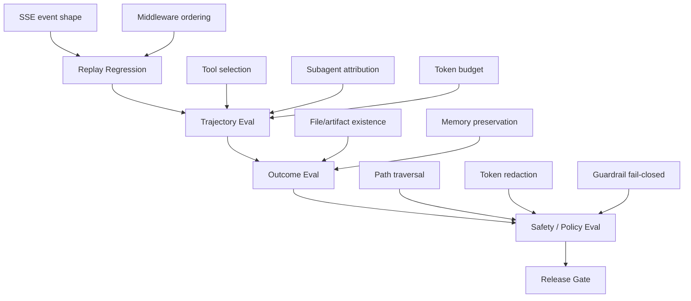
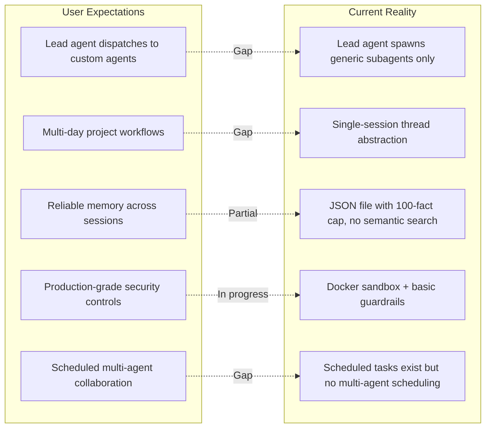

---
slug:5-issues-and-feedbacks
blog_type:buzz
---

截至 2026 年 8 月中旬，DeerFlow 已有 572 个开启的 issue 和 1,276 个已关闭的 issue，这一比例传递了两个信息：项目迭代极快，且在规模化应用中产生了摩擦。拥有近 80,000 个 GitHub Star 和 10,000 个 Fork，社区参与度极高，要求也日益严苛。本页将概述当前的 issue 现状、用户反复出现的痛点、重要的 RFC，以及 GitHub 之外更广泛的开发者社区的反馈。

## Issue 现状一览

| 类别 | 开启的 Issue | 核心主题 |
|---|---|---|
| Bug（核心运行时） | ~120 | 路径解析不一致、内存后端校验、IM 通道生命周期 |
| 功能需求 | ~180 | 多 Agent 编排、项目工作流、MCP 任务协议、技能管理 |
| RFC | ~25 | CODEOWNERS 治理、Agent 评估套件、连接器、沙箱配额 |
| 配置 / 打包 | ~30 | E2B 对账字段、依赖声明、Windows 兼容性 |
| UI / 前端 | ~45 | 聊天输入框、i18n、无障碍访问、消息渲染 |

最显著的特征是：**正是那些赋予 DeerFlow 强大能力的架构设计——沙箱化执行、可插拔内存后端、多 Agent 委派——也成为了最严重 Bug 的滋生地**。用户提交的 Issue 并非关于基础功能，而是关于那些确实复杂的子系统中出现的边缘场景。

## 开启的 Issue：用户遇到的阻碍

### 技能系统中的路径解析不一致

最近开启的 Bug [#4791](https://github.com/bytedance/deer-flow/issues/4791) 暴露了一个**双路径解析问题**，这种问题通常只在生产环境中才会被发现。`read_file` 在 `/mnt/skills/legacy/` 路径下执行失败，而 `ls`、`glob` 和 `grep` 在相同路径下却能成功执行。根本原因在于技能解析存在两条独立的代码路径：`LocalSandboxProvider._build_thread_path_mappings` 能正确将 `legacy/` 映射到 `custom/`，但 `tools.py` 中的 `_resolve_skills_path` 没有 `legacy/` 分支，从而回退到了一个不存在的目录。

这种结构性抱怨在 DeerFlow 的 Issue 中反复出现：**同一逻辑概念存在多套解析系统，且它们之间会产生偏差**。报告者建议的修复方案——统一解析逻辑并将其委托给同一个 `PathMapping` 处理——是正确的直觉，但它也凸显了技能子系统已经积累了太多的特殊处理，以至于保持一致性不再是理所当然的。

### 内存后端校验缺失

Issue [#4782](https://github.com/bytedance/deer-flow/issues/4782) 揭示，新合并的 [Honcho 内存后端](https://github.com/bytedance/deer-flow/commit/6cbf20fd39b34514f53f50fa097220a1deded65a)在接受非正的 `message_char_limit` 值时没有进行拒绝处理。`message_char_limit` 为 `0` 时会静默存储空字符串，从而将该轮对话从内存中丢弃。值为 `-1` 时会产生 `text[:-1]`——这实质上是伪装成长度限制的后缀删除。报告者指出，Mem0 和 OpenViking 后端已经对这些字段进行了校验，但 Honcho 没有。

这个问题反映了一个更普遍的现象：**新后端实现落地时，缺乏与现有后端防护机制对等的校验**。Honcho 后端本身是一个巨型 PR，由 Claude Fable 5 共同编写，其提交信息记录了在代码审查期间发现的多个关键修复（有损 ID 清理导致的跨用户数据泄露、异常遏制缺口、被动写入标志要求）。这些能在审查中被发现是好事，但配置校验对等性的缺失则表明，后端契约需要更有力的执行机制。

### MCP 任务快照接受非有限轮询间隔

Issue [#4749](https://github.com/bytedance/deer-flow/issues/4749) 是一个清晰且可完美复现的 Bug：`TaskSnapshot.poll_after_seconds` 接受 `NaN` 和 `Infinity`，这导致 `McpTaskService` 在计算下次轮询时间时引发 `ValueError` 和 `OverflowError`。修复方案很简单——在边界处拒绝非有限值——但这个问题之所以重要，是因为它揭示了 **MCP 任务协议层在其协议中立的边界处缺乏防御性校验**。

报告者明确将其定性为契约级别的修复，而非针对单个驱动程序的补丁，这是正确的架构直觉。随着 DeerFlow 的 MCP 集成不断扩展（最近的 [OpenViking 工具集成](https://github.com/bytedance/deer-flow/commit/a263af284527749b714535f1776f0247966ec8bb)就是一个很好的例子），协议级的不变性变得至关重要。

### 多 Agent 编排：自定义 Agent 调度缺口

Issue [#4680](https://github.com/bytedance/deer-flow/issues/4680) 在所有开启的 Issue 中引发了最热烈的社区讨论，共有 12 条评论。一位用户（用中文）询问主导 Agent 是否能将任务分派给他们创建的自定义 Agent——这是许多用户默认应该存在的功能：

> “我在页面上创建了自定义 Agent A、自定义 Agent B、自定义 Agent C。主导 Agent 应该能够将任务委派给它们并让它们协同工作。”

该 Issue 揭示了**用户期望与实际能力之间的严重脱节**。DeerFlow 的主导 Agent 可以生成通用子 Agent，但不存在让主导 Agent 直接分派给用户创建的自定义 Agent 的一等公民机制。这位用户的愿景——一个创意 Agent、一个文案 Agent 和一个视频生成 Agent 在主导 Agent 的编排下协同工作，甚至可以按计划执行——正是 DeerFlow 营销宣传中暗示支持的使用场景。

该 Issue 被打上了 `enhancement` 和 `P2` 标签，意味着已被承认但不会立即解决。对于一个定位为“SuperAgent 框架”的项目来说，这可以说是当前待办事项中最关键的功能缺口。

### 子 Agent 缺少时间上下文

Issue [#4781](https://github.com/bytedance/deer-flow/issues/4781) 是一个范围非常精确的功能请求：内置子 Agent 无法接收到主导 Agent 通过 `DynamicContextMiddleware` 获取的当前日期上下文。这意味着涉及相对日期（“今天”、“昨天”、“本周”）的委派任务，在主导 Agent 直接处理还是委派处理时，可能会产生不一致的解释。

报告者做了深入调查，引用了该中间件在 #2801 中的引入，以及 #4039/#4040 中相关的中间件对等修复。提出的解决方案——为现有中间件添加纯日期模式，或者提供一个更小的共享日期上下文中间件——理由非常充分。这类 Issue 表明，社区对代码库的理解已经足够深入，能够提出精准的手术式修复方案。

## RFC：治理与架构辩论

### CODEOWNERS 治理提案

Issue [#4777](https://github.com/bytedance/deer-flow/issues/4777) 提议添加 `.github/CODEOWNERS`，将关键领域——Gateway、Agent Runtime、Sandbox、MCP、持久化、通道、前端核心——的 PR 路由到特定领域的 GitHub Teams。该 RFC 非常详尽：定义了团队边界、合并规则（至少需要一名 Code Owner 批准，对于跨领域的 PR 需人工检查）以及验证标准。

这个 RFC 是对一种结构性矛盾的直接回应：**随着 AI 辅助 PR 越来越普遍且贡献者基数不断增长，现有的维护者人工路由模型正成为瓶颈**。该提案明确承认，GitHub 原生的 CODEOWNERS 仅保证一个匹配的 Owner 批准，并不保证每个被触及的领域都有独立的批准。第一阶段将依赖合并者手动检查跨领域批准，后续再跟进自动化强制执行。

该 RFC 与此规模的成熟开源项目的运作方式高度契合。问题在于字节跳动是否有内部带宽来建立所提议的 GitHub Teams，且每个团队至少配备两名活跃的维护者。

### Agent 评估套件 RFC（已关闭）

最近关闭的 [#3804](https://github.com/bytedance/deer-flow/issues/3804) 是该项目历史上最实质性的 RFC 之一。它提出了一个第一方的 `deerflow eval` 工作流，将现有的原语——`RunJournal`、`RunEventStore`、回放/黄金固定数据——转化为一个具有四层结构的连贯评估套件：

这个 RFC 之所以引人注目，是因为它识别出了一个真实的缺口：**对于用户可见的成功取决于执行轨迹而不仅仅是最终输出的 Agent 框架来说，普通的单元测试是必要的，但远远不够**。提议的 `Trajectory` 抽象——将工具调用、护栏决策、子 Agent 事件、Token 使用量和延迟捕获到标准化的 JSON 中——将赋予 DeerFlow 大多数 Agent 框架所缺乏的东西：一种可重复、确定性的方式来捕获行为回归。

该 RFC 的分阶段实施（首先是回放原语，然后是确定性评分器，接着是实时评估，最后是 LLM 裁决）非常务实。它的关闭表明维护者接受了这个方向，尽管实施时间表仍不明确。

### 一等公民用户连接器 RFC（已关闭）

Issue [#3476](https://github.com/bytedance/deer-flow/issues/3476) 提议为 GitHub、Linear 和未来的 SaaS 工具提供一个连接器 / 已连接应用层。该 RFC 异常详细：它规范了 OAuth 流程、令牌库加密、Webhook 签名验证、特定于提供商的方法（GitHub Apps 优于 OAuth Apps，带 PKCE 的 Linear OAuth2），以及一个清晰的安全模型，其中提供商令牌永远不会暴露给 LLM、前端或日志。

该 RFC 与评估套件及若干 UI 优化 Issue 一同关闭，这表明 **DeerFlow 的 2.0 后路线图正在围绕企业级就绪能力进行整合**——连接器、评估套件、治理和内存后端都表明，该项目正在为生产部署做准备，而不再仅仅是黑客实验。

## 已关闭的 Issue：修复了哪些问题

最近关闭的 Issue 揭示了一个正在多条战线上有条不紊地处理其待办事项的项目：

| Issue | 领域 | 解决方案 |
|---|---|---|
| [#3804](https://github.com/bytedance/deer-flow/issues/3804) | Agent 评估套件 | RFC 获批 |
| [#3492](https://github.com/bytedance/deer-flow/issues/3492) | UI 优化第 4 阶段（i18n、无障碍访问） | 已完成 |
| [#3491](https://github.com/bytedance/deer-flow/issues/3491) | 设计令牌整合 | 已完成 |
| [#3490](https://github.com/bytedance/deer-flow/issues/3490) | 工作区流程优化 | 已完成 |
| [#3476](https://github.com/bytedance/deer-flow/issues/3476) | 用户连接器 RFC | RFC 获批 |
| [#3017](https://github.com/bytedance/deer-flow/issues/3017) | 斜杠技能激活 | 已实现 |
| [#2999](https://github.com/bytedance/deer-flow/issues/2999) | 首次启动设置重定向 | 已修复（缓存响应替代速率限制） |
| [#2817](https://github.com/bytedance/deer-flow/issues/2817) | Redis 流桥接 | 已实现或已受限 |
| [#2814](https://github.com/bytedance/deer-flow/issues/2814) | 跨事件存储的用户作用域 | 已统一 |
| [#2551](https://github.com/bytedance/deer-flow/issues/2551) | 未声明的 `requests` 依赖 | 已修复 |

有几个模式值得关注：

**首先**，UI 优化工作（Issue #3490, #3491, #3492）是一个分为四个阶段的努力，涵盖设计令牌、工作区流程、设计系统整合以及无障碍访问/i18n。大多数开源 Agent 项目永远做不到这种系统性的前端工作。[Buzz 前端优化提交](https://github.com/bytedance/deer-flow/commit/1e8cedb9f4c1fd527e91729936c42be1f05d8438)和[共享展示聊天页面重构](https://github.com/bytedance/deer-flow/commit/e23dd8f88b5cc172e7ed67a0a791bd226108c80b)就是可见的成果。

**其次**，首次启动设置重定向 Bug（#2999）确实是个恶劣的问题：`/setup-status` 上的 60 秒速率限制导致新实例重定向到 `/login` 而不是 `/setup`，使得管理员初始化流程无法访问。修复方案——用缓存响应替代速率限制——是正确的做法。这个 Bug 影响了每一次新部署，这使得它居然存在了这么久令人瞩目。

**第三**，未声明的 `requests` 依赖（#2551）是一个打包规范问题，反映了一个常见的 Monorepo 通病：导入能成功是因为另一个包间接提供了该依赖，但独立安装时会失败。修复方案（将 `requests` 添加为直接依赖或迁移到 `httpx`）很简单，但随着代码库的增长，这种模式值得警惕。

## GitHub 之外的社区反馈

### 开发者博客与评论

自 2026 年 2 月发布以来，更广泛的开发者社区一直在积极测试并撰写关于 DeerFlow 的文章。反馈集中在几个主题上：

**执行优先的架构是差异化所在。** [dev.to 上的一篇详细评论](https://dev.to/arshtechpro/deerflow-20-what-it-is-how-it-works-and-why-developers-should-pay-attention-3ip3)称赞了 DeerFlow 的沙箱模型：“Agent 不是建议一条 bash 命令。它是直接运行它。Agent 不是草拟一个网页。它是构建并输出一个网页。”评论者指出，DeerFlow“弥合了”大多数 Agent 框架留给人类去处理的推理与执行之间的鸿沟。

**内存系统在架构上很有趣，但实际应用受限。** Mem0 对 DeerFlow 内存层的[深度分析](https://mem0.ai/blog/how-memory-works-in-deerflow)发现它“在当前形式下高效且具备生产就绪性，但存在一些明显的限制。”主要发现：
- 没有语义搜索（注入基于置信度，而非相关性）
- 没有语义去重（仅基于文本比较）
- 100 条事实上限，并采用基于置信度的淘汰机制
- 通过聊天删除内存不可靠

这些限制与关于改进 DeerMem 事实上限淘汰策略的开放 RFC [#4641](https://github.com/bytedance/deer-flow/issues/4641) 相吻合，表明社区和维护者在这一缺口上达成了共识。

**复杂度预算是一个切实的担忧。** [Termdock 评论](https://www.termdock.com/en/blog/deer-flow-bytedance-superagent)给出了客观的评价：“DeerFlow 解决了一个真实存在的问题——多 Agent 编排——但也增加了你必须理解和维护的抽象层。对于简单的编码任务来说，这是大材小用。”评论者建议将 DeerFlow 用于“跨越研究、代码和内容的任务”，而不是作为 Claude Code 或 Codex CLI 的替代品。

**安全和治理审查正在加强。** [一篇专注于安全的分析](https://kiledjian.com/2026/03/06/deerflow-bytedances-opensource-ai-agent.html)明确指出，不应将“可见的势头”与“运营成熟度”混为一谈，建议在生产使用前进行容器化部署、严格的网络出站控制和明确的威胁建模。这与 CODEOWNERS 治理 RFC 以及 #3804 中提出的安全/策略评估层相一致。

**字节跳动的出身仍然是一个组织层面的考量。** 多位评论者指出，无论代码的技术优势如何，字节跳动的所有权“在某些企业环境中会触发额外的审查流程”。这不是技术层面的批评，而是影响采用的部署现实。

### 社区生态系统

[deerflow](https://github.com/topics/deerflow) 的 GitHub Topics 页面显示，有 14 个公共存储库是基于 DeerFlow 构建或对其进行扩展的，包括：
- 一个 **DeerFlow Trace Edition** 分支，内置执行流程检查（无需 LangSmith）
- 一个 **OAuth 网桥**，使 DeerFlow 能够在没有 API 密钥的情况下使用 ChatGPT Plus/Pro 订阅
- 一个基于 DeerFlow 构建的**技术研究与评估 Agent**
- 多个**飞书/Lark 集成**项目

这种生态系统活动是一个强烈的信号。开发者不会在他们不信任的平台上进行构建。扩展的多样性——追踪、身份验证、垂直领域 Agent、IM 集成——表明 DeerFlow 正在被作为基础设施采用，而不仅仅是一个工具。

## 反复出现的模式：用户想要什么 vs. 实际存在什么

DeerFlow 的定位所暗示的内容与它目前提供的内容之间的差距，在三个领域最为突出：

1. **带有自定义 Agent 的多 Agent 编排**（#4680）：用户期望创建专门的 Agent 并由主导 Agent 进行分派。这目前还不存在。

2. **基于项目的工作流**（[#1114](https://github.com/bytedance/deer-flow/issues/1114)）：用户希望拥有跨会话保持持久上下文的命名项目。一位社区成员已经在分支中对此进行了原型设计，但尚未合并。

3. **内存可靠性**：基于 JSON 的内存系统适用于短会话，但存在已知的限制（无语义搜索、无语义去重、100 条事实上限），这些限制在长期使用中会暴露出来。Honcho 和 OpenViking 后端集成是朝着解决这个问题迈出的一步，但校验缺口依然存在。

## 关于 2.1.0 版本发布的问题

Issue [#4774](https://github.com/bytedance/deer-flow/issues/4774) 直接询问 2.1.0 何时发布。里程碑 2 已关闭约 494 个（共 541 个）Issue，还剩 47 个，但未设定截止日期。Q2 路线图（[#1669](https://github.com/bytedance/deer-flow/issues/1669)）也没有包含时间表。

这是一个合理的问题，反映了一种日益增长的压力：**项目正在快速积累功能和修复（近期窗口内每天超过 20 次提交），但发布节奏却不透明**。对于评估 DeerFlow 用于生产环境的团队来说，了解 2.1 版是在几周内还是几个月内发布至关重要。一个粗略的估计——哪怕是“目前尚无确定的日期”——也会有助于规划。

## 提交历史告诉了我们什么

最近的提交日志是了解团队注意力聚焦点的窗口：

| 提交主题 | 计数（近期窗口） | 信号 |
|---|---|---|
| 内存后端工作（Honcho, OpenViking） | 3 | 可插拔内存是优先事项 |
| IM 通道修复（企业微信, Discord） | 3 | 通道适配器正在稳定 |
| 子 Agent 隔离与生命周期 | 2 | 多 Agent 执行正在成熟 |
| 测试基础设施修复 | 4 | 正在投资提升测试可靠性 |
| 前端优化（Buzz, 展示, i18n） | 3 | UI 正在加固 |
| 扩展 API（任务生命周期, 模型观察者） | 1 | 可扩展性表面正在扩大 |
| 依赖升级（Dependabot） | 2 | 日常维护 |

[扩展 API 提交](https://github.com/bytedance/deer-flow/commit/7389331e6593c7f39cdacd9b078cf946e4e0b22d)特别值得注意：它增加了任务生命周期观察（`on_task_start` / `on_task_stop`）和系统模型调用观察，使扩展能够看到中间件链无法看到运行时表面。提交信息异常详细，记录了失败开放语义、取消传播、循环分派和关闭顺序。这是那种在几个月而非几天内才能看到回报的基础设施工作。

## 客观评价

DeerFlow 的 Issue 跟踪器讲述了一个项目的故事，它**脱离“实验”阶段的速度快于其治理适应的速度**。被提交的 Bug 不是玩具问题——它们涉及跨用户内存隔离、协议级校验和多 Worker 一致性。RFC 也不是简单的功能请求——它们涉及 CODEOWNERS、评估套件和连接器安全模型。社区提交的也不是“我该如何安装”的问题——他们正在分支中对基于项目的工作流进行原型设计，并为内存后端提出抗冲突的身份派生方案。

优势很明确：执行优先的沙箱、复杂到足以支撑其专属评估层的中间件链，以及一个尽管存在限制但比大多数框架都更深思熟虑的内存架构。劣势同样明显：跨子系统的路径解析不一致、新后端中的校验缺口、与项目自身营销宣传相矛盾的自定义 Agent 调度缺口，以及缺乏透明度的发布流程。

CODEOWNERS RFC（#4777）和评估套件 RFC（#3804）是当前最重要的两个开放讨论。如果两者都能落地，DeerFlow 将拥有与其技术野心相匹配的治理结构行为回归测试。如果两者都未能落地，项目将面临复杂性积累速度快于正确性验证速度的风险——这是一个框架在扩展纪律之前先扩展采用的经典轨迹。
