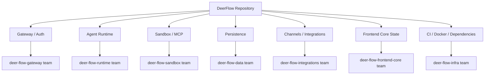

---
slug:6-about-contributors
blog_type:buzz
---

DeerFlow 从字节跳动内部的深度研究工具，跃升为斩获 79.9k Star 的开源 SuperAgent 框架，这并非源于某次天才般的提交，而是一段属于团队的壮举：他们决意推翻 v1 代码库并从零重建；同时，外部贡献者社区也倾力相助，将这一愿景化为现实。本页将聚焦这一发展轨迹背后的人物——探究他们的身份、背景，以及他们的工作如何揭示了 DeerFlow 的真实构建过程。

## 核心维护者圈子

### Willem Jiang (@WillemJiang) —— 开源老兵

如果说有一根线将 DeerFlow 的开源属性与更广阔的 Apache 生态系统紧密相连，那就是 [Willem Jiang](https://x.com/willemjiang)。他的 X 主页简直是一部开源治理的名人录：**Apache 孵化器导师**、**ApacheCon Asia 主席**、**ALC Initiative 北京分会负责人**，以及**前 Red Hat 员工**。他的 [LinkedIn](https://cn.linkedin.com/in/jiangning) 资料将其头衔列为“首席开源布道师”。

Willem 于 2026 年 1 月开启了具有里程碑意义的 [DeerFlow 2.0 发布计划 (#824)](https://github.com/bytedance/deer-flow/issues/824)，将 v1 到 v2 的过渡定义为对旧分支的刻意收尾。他也是在 GitHub 上与社区互动最频繁的维护者——解答关于链路追踪工具的问题、建议集成 LangSmith，甚至在用户请求聊天频道时主动提出创建 Discord。他近期的提交活动包括[修复主分支上的单元测试错误](https://github.com/bytedance/deer-flow/commit/23695a07a6b33238e1803cc1b071b3e9995615c9)，以及共同编写 [FakeError 类重命名的测试修复](https://github.com/bytedance/deer-flow/commit/2df7d47b2a52cf5e14298a43e1c68800bc3177bc)，期间他还采纳了 Copilot Autofix 的建议——这一细节虽小，却彰显了他对工具链务实的态度。

Willem 最突出的是他的治理直觉。近期的 [RFC：关键代码区域的 CODEOWNERS 治理方案 (#4777)](https://github.com/bytedance/deer-flow/issues/4777) 提议为 Gateway、Agent Runtime、Sandbox、MCP 及其他关键路径设立特定领域的 GitHub 团队，读起来就像是出自一位见证过 Apache 项目扩张与分化之手。该 RFC 明确要求“每个领域团队至少配备两名活跃维护者，以避免单点瓶颈”，这是许多 ASF 项目用血泪换来的教训。

### MagicCube —— 架构师

MagicCube 被列为协作者，正是他于 2026 年 2 月 14 日[宣布了 DeerFlow 2.0](https://github.com/bytedance/deer-flow/issues/824)，并附上视频演示，宣称 DeerFlow 现已成为“开源长周期超级 Agent”。MagicCube 将项目的定位从“研究工具”重塑为“SuperAgent 框架”，并确立了 DeerFlow 的心智模型：“一个具备虚拟计算机、文件系统和支持 MCP 及 Skills 扩展的 Web 界面的编码 Agent”。

MagicCube 还分享了 2.0 UI 的首个 [Vercel 预览版](https://github.com/bytedance/deer-flow/issues/824)，在代码合并至主分支前让社区先睹为快。这种“展示与说明”式的治理——先预览、收集反馈，再发布代码——正是一位深谙开源普及由可见的发展势能而非单纯合并频率所驱动的维护者应有的风范。

### Henry Li (@henry19840301)

Henry Li 在 X 上高调声援 DeerFlow，[推广 ACP 集成](https://x.com/willemjiang/status/2037445537268744376)，并称其能够连接 Codex、Claude Code 和 OpenClaw。当外部账号在 X 上发布关于 DeerFlow 的内容时，Henry 回复了“来自 DeerFlow 团队的欢呼”，证实了他在核心团队中的角色。他的社交媒体表现表明，他在团队中承担着产品/布道职能，是工程与开发者关系之间的桥梁。

### xunliu (@xunliu)

xunliu 被列为协作者，他对 2.0 的方向[表达了早期的乐观态度](https://github.com/bytedance/deer-flow/issues/824)，并承诺持续贡献。2.0.0 发布说明在致谢中提到，xunliu 是在该里程碑中合并了 180 个 PR 的 40 位贡献者之一。

## 博士级驱动的工程核心

### Daoyuan Li

[Daoyuan Li 的个人网站](https://daoyuan.li) 展现了一份在 Agent 框架领域极为罕见的履历：他拥有**计算机科学博士学位（2018年）**，专业领域涵盖时间序列数据分析、自然语言处理和大规模系统架构。他持有**两项已授权的实用专利**，并合著了**20多篇研究论文**。他自述为一名“拥有深厚计算机科学背景的技术领导者”，并“将技术卓越、导师指导以及培育创新文化放在首位”。这与 DeerFlow 提交历史中所体现的严谨工程文化不谋而合。

Daoyuan 近期的提交颇具说明性。他编写了[共享展示聊天页面的重构代码](https://github.com/bytedance/deer-flow/commit/e23dd8f88b5cc172e7ed67a0a791bd226108c80b)，以及[针对跨平台不可写路径假设的测试修复](https://github.com/bytedance/deer-flow/commit/1fe71110af5b3b470bdb4b3c5e98c46b0bea37e4)——后者是一项极其细致的工作，在最终得出确定性的跨平台解决方案之前，他追踪了此前两次失败假设引发的 Bug（一是 root 容器中 `mkdir -p` 静默创建了 `/nonexistent/` 目录，二是 `/dev/null/` 在 Windows 上引发崩溃）。他的学术背景在严谨性上展露无遗：提交信息读起来犹如一篇根因分析论文。

他还与 Willem Jiang 共同编写了 [FakeError 类重命名修复](https://github.com/bytedance/deer-flow/commit/2df7d47b2a52cf5e14298a43e1c68800bc3177bc)，展现了核心维护者之间的知识交叉融合。

### Nan Gao (@ggnnggez)

Nan Gao 的 [GitHub 主页](https://github.com/ggnnggez) 提供了一段引人入胜的背景故事：**“致力于 Agentic 系统评估。曾任 Youkia 引擎团队图形程序员。”** 他常驻德国柏林，个人网站为 nangao.dev。Nan 代表了那种转换职业跑道的贡献者，为 Agent 基础设施带来了全新的视角。

Nan 编写了近期提交历史中 arguably 架构意义最为重大的 PR：[feat(extensions): observe task lifecycle and system model calls (#4684)](https://github.com/bytedance/deer-flow/commit/7389331e6593c7f39cdacd9b078cf946e4e0b22d)。这是一次庞大的多层贡献，新增了两种扩展贡献类型（`task_lifecycle` 和 `system_model_observer`），处理了子 Agent 通知的循环分发，管理了关闭顺序，并包含了全面的测试覆盖。单是提交信息就长达数千字，读起来宛如一篇 RFC。这种 PR 透露出其作者思考的是系统架构，而不仅是孤立的功能。

他还编写了 [todo-middleware 修复](https://github.com/bytedance/deer-flow/commit/2bb230b334b6a925c4359a3984b9d1c94ad07aa4)以恢复提示词注入，展现了他在中间件管道中的影响范围。

## 社区贡献者

2.0.0 版本特别感谢了[40 位贡献者](https://github.com/bytedance/deer-flow/discussions/3795)，他们合并了 180 个 PR。近期的提交活动显示，多位外部贡献者做出了具有重要且实质性的贡献：

| 贡献者 | 近期核心工作 | 领域 |
|---|---|---|
| **ajayr** | [Honcho 记忆后端 (#4730)](https://github.com/bytedance/deer-flow/commit/6cbf20fd39b34514f53f50fa097220a1deded65a) | 记忆系统 |
| **Hao Zhe** | [OpenViking MCP 工具集成 (#4745)](https://github.com/bytedance/deer-flow/commit/a263af284527749b714535f1776f0247966ec8bb) | MCP / 工具桥接 |
| **ChiHaYa** | [子 Agent 后台任务隔离 (#4758)](https://github.com/bytedance/deer-flow/commit/88252e9b318d34e7e1867155ad2c77993320788e) | 子 Agent 执行 |
| **AoHanBei** | [企业微信 websocket 关闭 (#4762)](https://github.com/bytedance/deer-flow/commit/38ff44778a0d11d71597c2531bfd600df855307c), [Discord 输入状态清理 (#4752)](https://github.com/bytedance/deer-flow/commit/df01102dfc458559abb1acf29d9aee1fb6d9b30b) | IM 渠道适配器 |
| **Baldwinzc** | [Gateway turn_duration 戳记 (#4755)](https://github.com/bytedance/deer-flow/commit/baaf2bad47508e809baa89849d9b938e4f3e905a) | Gateway / 消息管道 |
| **icn5381** | [E2B 沙箱账本元字段命名 (#4764)](https://github.com/bytedance/deer-flow/commit/46fd5c8a00a582964d86061f60f71d39b8f72e8f) | 沙箱 |
| **Ryker_Feng** | [Buzz 前端 (#4727)](https://github.com/bytedance/deer-flow/commit/1e8cedb9f4c1fd527e91729936c42be1f05d8438), [Lark 授权剪贴板 (#4767)](https://github.com/bytedance/deer-flow/commit/9ba04bf80c2af38136d2e3c9e1738ffa0b6e64be) | 前端 |
| **MasonWight** | [诊断路径解析 (#4736)](https://github.com/bytedance/deer-flow/commit/6bb376abfd9934827678058ca15cba21238226d5) | 开发工具 |

### Honcho 记忆后端：社区贡献质量的案例研究

**ajayr** 提交的 [Honcho 记忆后端 PR (#4730)](https://github.com/bytedance/deer-flow/commit/6cbf20fd39b34514f53f50fa097220a1deded65a) 值得特别关注，因为它体现了该项目所坚守的质量标准。该 PR 由“Claude Fable 5”（Anthropic 的 AI 助手）共同编写，完成了以下工作：

- 实现了完整的 `HonchoMemoryManager`，支持用户级工作空间隔离、故障关闭身份验证，并通过 `asyncio.to_thread` 实现异步卸载
- 修复了评审中发现的**两个严重 Bug**：一是 `sanitize_id` 丢失精度导致的跨用户记忆泄漏；二是 `JSONDecodeError` 可能逃脱 `add()` 方法且无上游处理程序的异常遏制问题
- 新增了使用 SHA-256 后缀的防冲突 `_stable_id()` 派生方法
- 提供了 **37 个测试**，覆盖写入/读取/异步/生命周期/工厂发现等环节
- 更新了 README、配置示例和 AGENTS.md 中的文档

这绝非敷衍了事的 PR。作者深刻理解，在多用户 Agent 系统中，记忆隔离是一道安全边界，而非便利功能。项目能够接受如此细致的代码，且评审过程能敏锐捕获跨用户泄漏问题，充分彰显了贡献者与维护者双方的严谨态度。

## AI 辅助开发的真实现状

在近期的提交记录中，一个反复出现的细节是 AI 共同作者的身影。Honcho 的 PR 在多次提交中将“Claude Fable 5 <noreply@anthropic.com>”列为共同作者。FakeError 的测试修复则署名了“由 AI 驱动的 Copilot Autofix”。这一切并非暗箱操作，而是如实声明在提交元数据中，这正是处理此类问题的正确方式。

值得注意的是其中的**分工模式**。AI 助手被用于生成样板代码、搭建测试脚手架和撰写初稿。而人类贡献者则负责架构评审、安全分析及跨系统逻辑推理。例如，Nan Gao 的扩展 PR 中包含了关于循环分发、关闭顺序和 `CancelledError` 遏制的逻辑推演，这是当前任何 AI 助手都无法自主完成的。DeerFlow 中展现出的模式是：AI 放大了贡献者的产出效能，但并未取代保障代码安全合并所需的人类判断力。

## 治理演进

[CODEOWNERS RFC (#4777)](https://github.com/bytedance/deer-flow/issues/4777) 表明团队的思考已超越代码层面。该提案划分了特定领域的所有权团队：

该 RFC 对其局限性直言不讳：GitHub 原生的 CODEOWNERS 仅能保证获得一名匹配所有者的批准，而无法确保每个受影响领域均获得独立批准。第一阶段依赖于手动跨领域评审。这种对工具能力边界的诚实态度——而非假装该文件是万能银弹——正是该团队文档风格的典型特征。

## 贡献者周围的生态系统

DeerFlow 的贡献者群体并非在真空中运作。该项目已孕育出一个可见的生态系统：[deerflow GitHub 主题](https://github.com/topics/deerflow)列出了 14 个社区仓库，包括 OAuth 桥接器、Hugging Face Docker 封装、链路追踪增强版分支，甚至还有一个 Obsidian 第二大脑集成。[Patrick Aaron Murphy 在 Facebook 上](https://www.facebook.com/groups/2600net/posts/4497194367170320)描述了通过轻量级 MCP 封装器将 DeerFlow 作为 OpenClaw 的“sidecar”运行——这正是 Skills 和 MCP 架构旨在实现的可组合性。

[trendshift.io 快照](https://trendshift.io/repositories/14699)显示，截至最新数据，项目共有 286 位贡献者、79.9k Stars 和 10.9k Forks。该项目于 2026 年 2 月 26 日首次登上 GitHub Trending 第一名，并保持着每日提交的活跃开发状态。

## 贡献者折射出的项目特质

审视 DeerFlow 的构建者，有三点变得清晰可见：

**首先，核心团队具备 Apache 级别的治理直觉。** Willem Jiang 的 ASF 背景体现在基于 RFC 驱动的功能设计方法、明确的非目标（non-goals）部分，以及对单点瓶颈的担忧上。这不是一个“野蛮生长、破坏式迭代”的项目。而是一个“撰写 RFC、定义验收标准、然后再实施”的项目。

**其次，外部贡献的门槛确实很高。** Honcho PR、扩展 API PR 以及 E2B 账本修复绝非纠正拼写错误。它们是架构级的贡献，需要对代码库的隔离模型、事件循环语义和契约边界有深刻理解。从 Honcho PR 多轮提交历史可见的项目评审流程，在合并前成功拦截了真实的 Bug。

**第三，团队对 AI 辅助持透明态度。** 他们没有遮掩，也没有将其视为争议，而是直接在提交元数据中声明，并让评审流程发挥其应有的作用。这很可能是目前开源界处理 AI 辅助开发最健康的方式，其他项目理应借鉴学习。

DeerFlow 背后的团队并非在构建一个简单的聊天机器人封装器。他们正在为自主数字工作者打造基础设施，并以基础设施所要求的耐心、严谨和治理纪律付诸实践。这是否足以让 DeerFlow 成为占据主导地位的开源 Agent 框架仍是一个未知数，但这样的贡献者基础无疑为其赢得了放手一搏的胜算。
