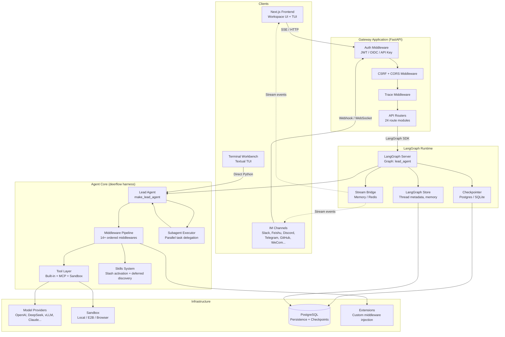

---
slug:7-architecture-overview
blog_type:normal
---


DeerFlow 是一个开源的、基于 LangGraph 的 AI agent 平台，旨在将大型语言模型转化为具备自主性、多渠道接入能力及工具增强的工作实体。该系统采用全栈 monorepo 架构构建：后端基于 Python、FastAPI 和 LangGraph，前端则采用 Next.js 提供工作区 UI、终端工作台及配置界面。本页将梳理其顶层架构，追踪从接收消息到流式响应的完整请求生命周期，并界定各子系统边界，为后续文档的详细展开奠定基础。

## 仓库拓扑

该仓库划分为三个主要层级：作为 HTTP 入口并编排外部集成的 **网关应用**（`backend/app/`）；包含 agent 运行时、中间件管道、沙箱、技能及持久化层的 **核心 harness 库**（`backend/packages/harness/deerflow/`）；以及提供浏览器端与终端用户体验的 **前端工作区**（`frontend/src/`）。此外，还有一个轻量级的 **扩展 API 包**（`backend/packages/extension-api/`），用于定义第三方中间件注入的契约。

```
deer-flow/
├── backend/
│   ├── app/                          # 网关应用 (FastAPI)
│   │   ├── gateway/                  # HTTP 路由、认证、中间件、服务
│   │   ├── channels/                 # IM 渠道适配器 (9 个平台)
│   │   ├── scheduler/                # 定时任务服务
│   │   └── mcp_tasks/                # MCP 任务轮询服务
│   ├── packages/
│   │   ├── harness/deerflow/         # 核心 agent 运行时库
│   │   │   ├── agents/               # Lead agent、工厂、中间件、记忆
│   │   │   ├── subagents/            # Subagent 执行器、注册表、内置项
│   │   │   ├── tools/                # 内置工具、MCP 工具桥接
│   │   │   ├── skills/               # 技能目录、解析器、安全扫描器
│   │   │   ├── sandbox/              # 代码执行沙箱抽象
│   │   │   ├── models/               # 模型提供方工厂 + 补丁过的提供方
│   │   │   ├── runtime/              # 检查点、流桥接、事件
│   │   │   ├── persistence/          # SQLAlchemy 模型、迁移、仓库
│   │   │   ├── mcp/                  # MCP 客户端、会话池、OAuth
│   │   │   ├── guardrails/           # 安全中间件 + 提供方
│   │   │   ├── extensions/           # 扩展加载器、注册表、栈编排器
│   │   │   ├── config/               # 40+ 类型化配置 dataclass
│   │   │   ├── tracing/              # Langfuse/LangSmith/Monocle 追踪
│   │   │   └── tui/                  # 终端工作台
│   │   └── extension-api/            # 公共扩展契约类型
│   ├── langgraph.json                # LangGraph Server 图注册
│   └── pyproject.toml                # uv workspace 根目录
├── frontend/
│   └── src/
│       ├── app/                      # Next.js App Router 页面
│       ├── components/               # UI 组件（工作区、落地页、认证）
│       └── core/                     # 客户端状态、API、流式传输、工具
├── config.example.yaml               # 2560 行配置参考
├── docker/                           # Docker Compose profiles、nginx、provisioner
└── skills/public/                    # 内置技能定义
```

后端使用包含两个成员包的 **uv workspace**：`deerflow-harness`（核心库，作为 `deerflow` 导入）和 `deerflow-extension-api`（公共扩展契约，作为 `deerflow_extension_api` 导入）。这种分离确保了扩展开发者仅需依赖轻量级的 API 包，而无需引入完整的运行时。

来源：[pyproject.toml](backend/pyproject.toml#L1-L90), [langgraph.json](backend/langgraph.json#L1-L18)

## 系统架构

下面的 Mermaid 图展示了端到端架构，说明了用户请求如何从前端或 IM 渠道流入网关，进入 LangGraph agent 运行时，并最终以流式响应返回。

> **前提条件**：本图假设你已熟悉 LangGraph 基于图的 agent 模型，在该模型中，编译后的状态图以超步执行节点（LLM 调用、工具调用），并由中间件包装每次模型调用。



来源：[app.py](backend/app/gateway/app.py#L1-L80), [agent.py](backend/packages/harness/deerflow/agents/lead_agent/agent.py#L660-L799), [langgraph.json](backend/langgraph.json#L1-L18), [service.py](backend/app/channels/service.py#L1-L60)

## 请求生命周期

DeerFlow 的请求会流经五个独立的层级，各层职责分明。理解这一流程对于浏览代码库及阅读后续文档至关重要。

### 1. 入口层

请求通过以下三种途径之一进入系统。**前端工作区**通过 HTTP REST 端点与网关通信，并使用 Server-Sent Events (SSE) 接收流式响应。**IM 渠道**（Slack、Feishu、Discord、Telegram、GitHub、WeCom、DingTalk、WeChat、Buzz）通过 webhook 或 WebSocket 连接接收消息，并转发至网关的 LangGraph 运行时。**终端工作台**（基于 Textual 的 TUI）可在进程内直接调用 agent 运行时，完全绕过 HTTP 层。

网关通过 `langgraph.json` 注册了唯一的 LangGraph 图 —— `lead_agent`，指向 `deerflow.agents:make_lead_agent` 作为图工厂。这意味着无论请求来源何处，每一次运行都会进入相同的 agent 组装路径。

来源：[langgraph.json](backend/langgraph.json#L1-L18), [service.py](backend/app/channels/service.py#L25-L40)

### 2. 网关层

FastAPI 网关（`app/gateway/app.py`）是系统的 HTTP 边界。它组装了一个中间件栈，包含 **CORS**、**CSRF**、**AuthMiddleware**（支持 JWT、OIDC 及 API Key 认证）和 **TraceMiddleware**（请求关联 ID）。该网关暴露了 24 个路由模块，涵盖线程、运行、技能、渠道、记忆、文件上传、MCP、定时任务、模型等功能。

网关的 `lifespan` 处理器负责执行关键的启动工作：加载 `config.yaml`，配置日志，初始化 LangGraph 运行时（StreamBridge、checkpointer、store），确保管理员用户引导，启动 IM 渠道服务，启动定时任务服务，并初始化 MCP 任务轮询服务。配置在每次请求时通过 `get_app_config()` 解析，这意味着修改 `config.yaml` 无需重启进程即可生效。

来源：[app.py](backend/app/gateway/app.py#L200-L320), [routers directory](backend/app/gateway/routers)

### 3. Agent 组装层

`make_lead_agent` 函数是 LangGraph 的图工厂 —— LangGraph Server 在每次运行时调用的唯一入口。它执行多阶段组装过程：

| 阶段 | 职责 | 关键代码 |
|-------|---------------|----------|
| **配置解析** | 合并请求配置、运行时上下文及应用配置；解析检查点模式（进程内冻结） | `make_lead_agent` → `_get_runtime_config` |
| **身份解析** | 从 LangGraph 认证字段提取权威用户 ID，解析用户维度的技能和 agent 配置 | `resolve_config_user_id` |
| **模型解析** | 通过请求 → agent 配置 → 全局默认值解析模型名称；强制执行 `model:use` 授权 | `_resolve_model_name` → `_authorize_model_name` |
| **中间件组装** | 构建有序中间件链（14+ 中间件）并进行扩展组合 | `_assemble_middlewares` |
| **工具注册** | 注册内置工具、MCP 工具（延迟或即时加载）、沙箱工具、技能管理工具 | `get_available_tools` + `assemble_deferred_tools` |
| **追踪挂载** | 在图调用根节点挂载 Langfuse/LangSmith 回调 | `build_tracing_callbacks` |
| **图编译** | 使用组装好的中间件、工具和状态模式调用 `langchain.agents.create_agent` | `create_agent(...)` |

来源：[agent.py](backend/packages/harness/deerflow/agents/lead_agent/agent.py#L660-L799), [factory.py](backend/packages/harness/deerflow/agents/factory.py#L60-L140)

### 4. 中间件管道

中间件管道是 DeerFlow agent 运行时的架构骨干。每个中间件包装模型调用周期（before_model / after_model 钩子）或工具执行周期（before_tool / after_tool 钩子），从而在不修改核心 agent 逻辑的前提下实现横切关注点。Lead agent 按照严格且文档化的顺序组装其中间件链：

| 位置 | 中间件 | 触发条件 | 目的 |
|----------|-----------|---------|---------|
| 0–2 | ThreadData → Uploads → Sandbox | 始终 | 初始化线程级数据、文件上传及沙箱上下文 |
| 3 | DanglingToolCall | 始终 | 处理因运行中断产生的孤儿工具调用 |
| 4 | Guardrail | 可配置 | 执行前安全检查 |
| 5 | ToolErrorHandling | 始终 | 捕获并格式化工具执行错误 |
| 6 | DynamicContext | 始终 | 将日期、记忆作为系统提醒注入首条 HumanMessage |
| 7 | SkillActivation | 始终 | 在 `/skill-name` 斜杠激活时加载 SKILL.md |
| 8 | SkillToolPolicy | 始终 | 在运行时应用各技能允许使用的工具过滤 |
| 9 | DurableContext | 始终 | 在压缩过程中保留摘要、委派账本及技能 |
| 10 | Summarization | 可配置 | 超出 token 阈值时执行上下文窗口压缩 |
| 11 | TodoMiddleware | 计划模式 | 结构化任务列表管理 |
| 12 | TokenUsage | 可配置 | 记录每次模型调用的 token 消耗 |
| 13 | TitleMiddleware | 始终 | 自动生成会话标题 |
| 14 | MemoryMiddleware | 可配置 | 长期记忆注入与被动写入 |
| 15 | ViewImage | 视觉模型 | 为具备视觉能力的模型提取图像内容 |
| 16 | DeferredToolFilter | 工具搜索 | 隐藏延迟加载的 MCP 工具模式，直至被提升 |
| 17 | SystemMessageCoalescing | 始终 | 将多条 SystemMessage 合并为一条首部消息 |
| 18 | SubagentLimit | Subagent 模式 | 强制执行并发及总数 subagent 限制 |
| 19 | LoopDetection | 可配置 | 检测并打断重复的工具调用循环 |
| 20 | TokenBudget | 可配置 | 强制执行每次运行的硬性 token 限制 |
| 21 | TerminalResponse | 始终 | 重试空的最终响应；持久化错误回退 |
| 22 | ModelLengthFinishReason | 始终 | 为长度受限的补全标记 stop_reason |
| 23 | SafetyFinishReason | 可配置 | 在安全终止时抑制工具执行 |
| 24 | Clarification | 始终（末位） | 意图不明确时请求你澄清 |

在内置栈确定后，扩展中间件通过 `compose_with_extensions` 函数组合进该链，利用 `@Next` / `@Prev` 锚点装饰器进行精确定位。`ClarificationMiddleware` 是一个不变量 —— 它必须始终是链中的最后一个中间件。

<CgxTip>中间件的顺序受到 SDK 级别的 `create_deerflow_agent` 工厂和应用级别的 `make_lead_agent` 双重强制执行。工厂的 `_assemble_from_features` 方法记录了标准的 14 个中间件序列，而 `make_lead_agent` 则通过 Lead 专属中间件（DynamicContext、SkillActivation、DurableContext 等）对其进行扩展。在调试 agent 行为时，请务必追踪哪些中间件处于激活状态 —— 缺失或乱序的中间件可能会悄然改变模型行为。</CgxTip>

来源：[factory.py](backend/packages/harness/deerflow/agents/factory.py#L200-L350), [agent.py](backend/packages/harness/deerflow/agents/lead_agent/agent.py#L400-L600), [features.py](backend/packages/harness/deerflow/agents/features.py#L1-L71)

### 5. 执行与流式传输层

图编译完成后，LangGraph Server 会以超步执行。每个超步包含一次 LLM 调用（由中间件管道包装），随后是零次或多次工具执行。工具调用会路由至内置工具（文件操作、网页搜索、代码执行）、MCP 服务器工具（通过会话池）或沙箱工具（本地或云端代码执行）。

**StreamBridge** 是连接 LangGraph 运行时与消费者的事件分发机制。它支持两种后端 —— 用于单进程部署的内存桥接，以及用于多 worker 水平扩展的 Redis 桥接。事件通过 StreamBridge 流向前端 SSE 端点、IM 渠道适配器及其他任何已注册的消费者。

状态持久化由 **checkpointer** 处理，它支持 PostgreSQL 和 SQLite 后端，并具有两种渠道模式：`"full"`（兼容模式，存储完整渠道状态）和 `"delta"`（优化模式，仅存储渠道增量并定期快照）。检查点模式在启动时按进程冻结，无法通过客户端请求重新配置 —— 这是由 `freeze_checkpoint_channel_mode` 强制执行的安全不变量。

来源：[stream_bridge directory](backend/packages/harness/deerflow/runtime/stream_bridge), [agent.py](backend/packages/harness/deerflow/agents/lead_agent/agent.py#L680-L700), [langgraph.json](backend/langgraph.json#L15-L18)

## 子系统边界映射

下表将各主要子系统映射至其代码位置、专属文档页面及主要架构关注点。

| 子系统 | 位置 | 文档页面 | 主要关注点 |
|-----------|----------|-------------------|-----------------|
| Lead Agent | `agents/lead_agent/` | [Lead Agent 设计](8-lead-agent-design) | 图工厂、模型解析、中间件编排 |
| Subagent 引擎 | `subagents/` | [Subagent 执行引擎](9-subagent-execution-engine) | 并行任务委派、token 收集、状态契约 |
| 中间件管道 | `agents/middlewares/` | [Agent 中间件管道](10-agent-middleware-pipeline) | 40+ 中间件类、顺序、扩展组合 |
| 技能系统 | `skills/` | [技能系统](11-skills-system) | 斜杠激活、延迟发现、安全扫描 |
| 沙箱 | `sandbox/` | [沙箱与文件系统](14-sandbox-and-file-system) | 本地/E2B/浏览器代码执行、路径安全 |
| 模型提供方 | `models/` | [模型提供方集成](15-model-provider-integration) | 提供方工厂、补丁过的提供方、思考/推理 |
| 上下文压缩 | `agents/middlewares/summarization_middleware.py` | [上下文工程与压缩](16-context-engineering-and-compaction) | Token 预算、摘要、持久上下文 |
| 长期记忆 | `agents/memory/` | [长期记忆后端](17-long-term-memory-backends) | 记忆工具、被动写入、检索索引 |
| 检查点 | `runtime/checkpointer/` | [检查点与状态管理](18-checkpointing-and-state-management) | Full/Delta 模式、快照频率、兼容性控制 |
| IM 渠道 | `app/channels/` | [IM 渠道适配器](19-im-channel-adapters) | 9 个平台适配器、运行策略、消息总线 |
| MCP 桥接 | `mcp/` | [MCP 服务器与工具桥接](20-mcp-server-and-tool-bridge) | 会话池、OAuth、延迟工具搜索 |
| 扩展 | `extensions/` | [扩展 API](21-extensions-api) | 加载器、注册表、栈编排器、锚点定位 |
| 前端 | `frontend/src/` | [Next.js 前端架构](22-next-js-frontend-architecture) | App Router、核心状态、流式客户端 |
| 网关 API | `app/gateway/` | [网关 API 与认证](23-gateway-api-and-auth) | 24 个路由、认证中间件、CSRF、分页 |
| 流桥接 | `runtime/stream_bridge/` | [流桥接与事件管道](24-stream-bridge-and-event-pipeline) | 内存/Redis 后端、事件目录 |
| Guardrails | `guardrails/` | [Guardrails 与安全中间件](25-guardrails-and-safety-middleware) | 安全结束原因、输入净化 |
| Docker | `docker/` | [Docker 部署策略](26-docker-deployment-strategies) | Compose profiles、nginx、provisioner、开发入口 |
| 追踪 | `tracing/` | [追踪与可观测性](27-tracing-and-observability) | Langfuse、LangSmith、Monocle 集成 |
| TUI | `tui/` | [终端工作台](28-terminal-workbench-tui) | Textual 应用、会话管理、渲染 |
| 定时任务 | `app/scheduler/` | [定时任务系统](29-scheduled-tasks-system) | 轮询、租约、并发运行限制 |
| 社区搜索 | `community/` | [社区搜索提供方](30-community-search-providers) | Tavily、Brave、Exa、SearXNG、DuckDuckGo 等 |

## 配置架构

DeerFlow 的配置系统是一个类型化的、分层的数据类层，跨越 `deerflow/config/` 中的 40 多个配置模块。根配置文件 `config.yaml`（参考了 2560 行的 `config.example.yaml`）会被解析为 `AppConfig` 对象，贯穿所有子系统。核心设计原则如下：

- **按请求解析**：`get_app_config()` 在请求时调用，而非缓存在 `app.state` 上，因此修改 `config.yaml` 无需重启即可生效。
- **环境变量插值**：所有字段值均支持 `$ENV_VAR` 语法以进行密钥注入。
- **可选附加项**：PostgreSQL、Redis、Discord、浏览器自动化及 memory-zh 均为可选依赖，可通过 `pyproject.toml` 附加项（`postgres`、`redis`、`discord`、`browser` 等）激活。
- **配置版本控制**：`config_version` 字段（当前为 33）可检测过期配置；`make config-upgrade` 可自动合并新字段。

来源：[config.example.yaml](config.example.yaml#L1-L100), [pyproject.toml](backend/pyproject.toml#L17-L25), [config directory](backend/packages/harness/deerflow/config)

## 部署拓扑

DeerFlow 通过 `docker/` 目录下的 Docker Compose 文件支持多种部署配置。标准的 `docker-compose.yaml` 将网关、前端及 PostgreSQL 作为独立服务运行。开发配置（`docker-compose-dev.yaml`）则增加了热重载与调试入口。此外，还有针对 OpenViking 部署、CLI 认证代理及 Lark (Feishu) CLI 集成的专用配置。Nginx 反向代理位于网关和前端之前，负责处理 TLS 终止和静态资源服务。

<CgxTip>`langgraph.json` 文件是 LangGraph Server 配置的唯一事实来源。它注册了图（`lead_agent`）、认证处理器（`langgraph_auth.py:auth`）及 checkpointer 提供方（`async_provider.py:make_checkpointer`）。任何对图注册或认证路径的更改都需要更新此文件 —— LangGraph Server 会在启动时读取它。</CgxTip>

来源：[docker directory](docker), [langgraph.json](backend/langgraph.json#L1-L18)

## 推荐阅读路径

对于初识 DeerFlow 的开发者，建议按照请求生命周期顺序阅读“深入解析”部分：

1. **[Lead Agent 设计](8-lead-agent-design)** —— 从这里开始，了解 `make_lead_agent` 如何组装图。
2. **[Agent 中间件管道](10-agent-middleware-pipeline)** —— 定义 agent 行为的 14+ 中间件。
3. **[Subagent 执行引擎](9-subagent-execution-engine)** —— 并行任务委派的工作机制。
4. **[技能系统](11-skills-system)** —— 斜杠激活与延迟发现机制。
5. **[沙箱与文件系统](14-sandbox-and-file-system)** —— 代码执行隔离。
6. **[网关 API 与认证](23-gateway-api-and-auth)** —— HTTP 边界与身份验证。
7. **[流桥接与事件管道](24-stream-bridge-and-event-pipeline)** —— 流式响应如何触达消费者。

对于侧重部署的读者，可直接跳转至 [Docker 部署策略](26-docker-deployment-strategies) 和 [追踪与可观测性](27-tracing-and-observability)。对于集成相关的工作，[IM 渠道适配器](19-im-channel-adapters) 和 [MCP 服务器与工具桥接](20-mcp-server-and-tool-bridge) 是主要入口。
