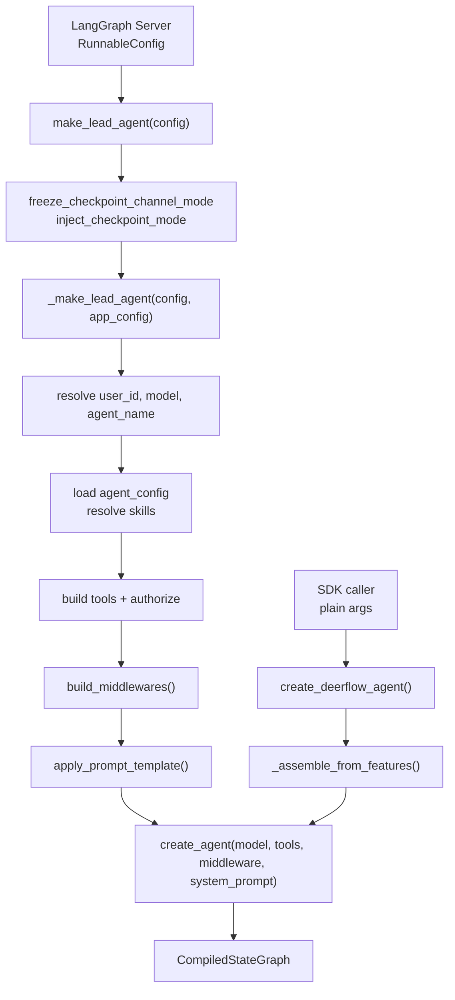
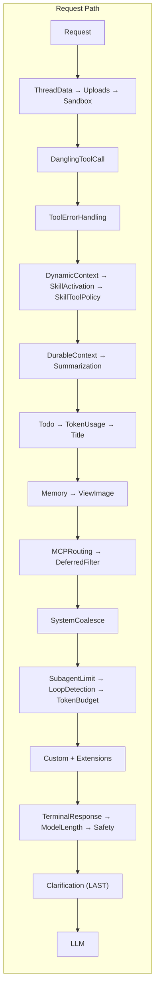
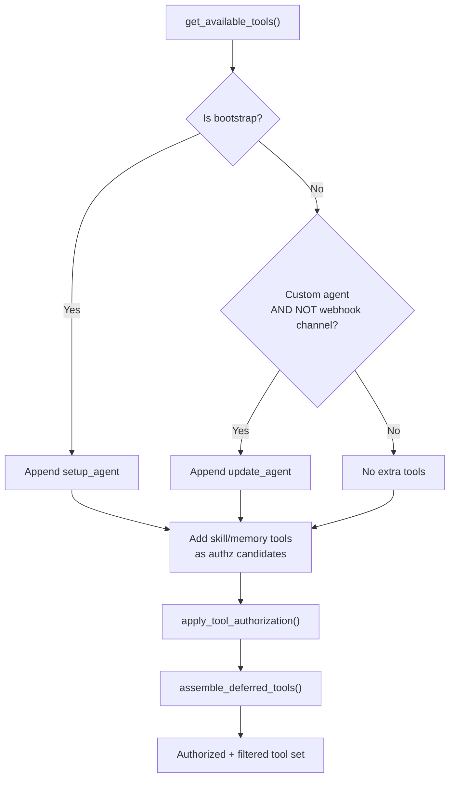

---
slug:8-lead-agent-design
blog_type:normal
---


Lead Agent 是 DeerFlow 的核心编排引擎——一个由 LangGraph 编译的 Agent，它将 LLM 推理与深度的中间件管道、声明式工具授权、动态提示词组装以及严格的子代理委派模型相融合。本页面将从工厂入口点开始，深入剖析其架构，涵盖提示词构建、中间件组装、工具解析及委派语义，旨在帮助需要扩展、定制或分析 Lead Agent 运行时行为的开发者。

来源：[agent.py](backend/packages/harness/deerflow/agents/lead_agent/agent.py#L1-L949), [prompt.py](backend/packages/harness/deerflow/agents/lead_agent/prompt.py#L1-L1085), [factory.py](backend/packages/harness/deerflow/agents/factory.py#L1-L440)

## 工厂入口点与 Agent 生命周期

Lead Agent 由两个协同工作的工厂构建。`make_lead_agent(config)` 是 **LangGraph Server 入口点**——其签名匹配 `RunnableConfig -> CompiledStateGraph`，以便 LangGraph 平台将其作为图工厂调用。它处理进程级检查点模式冻结和应用程序配置解析，然后将实际组装工作委托给内部的 `_make_lead_agent(config, app_config)`。

`factory.py` 中的 `create_deerflow_agent()` 提供了第二个无需配置的入口点。这个 SDK 级工厂接受纯 Python 参数（模型、工具、中间件、功能特性），不读取任何 YAML 或全局单例。它作为原始 LangChain `create_agent` 原语与配置驱动的应用工厂之间的桥梁。SDK 工厂通过 `RuntimeFeatures` 支持**声明式特性标志系统**，其中每个功能（`sandbox`、`guardrail`、`summarization`、`auto_title`、`memory`、`vision`、`subagent`、`loop_detection`、`token_budget`）控制是否实例化其对应的中间件。每个功能接受 `False`（跳过）、`True`（使用内置默认值）或自定义的 `AgentMiddleware` 实例（直接替换）。



`_make_lead_agent` 函数以严格的优先级解析一系列运行时参数：**请求 > Agent 配置 > 全局默认值**。辅助函数 `_resolve_runtime_option` 通过检查 `key in cfg` 而非 `cfg.get(key)` 来区分“请求省略了该字段”和“请求将其设为假值”，因此，请求中提供的 `thinking_enabled: false` 会被采纳，而不会回落到 Agent 的默认值。

来源：[agent.py#L700-L800](backend/packages/harness/deerflow/agents/lead_agent/agent.py#L700-L800), [agent.py#L51-L63](backend/packages/harness/deerflow/agents/lead_agent/agent.py#L51-L63), [factory.py#L92-L180](backend/packages/harness/deerflow/agents/factory.py#L92-L180), [factory.py#L200-L399](backend/packages/harness/deerflow/agents/factory.py#L200-L399)

## 模型解析与授权

模型选择遵循三层解析机制：首先检查请求中的 `model_name` 或 `model` 字段，其次是自定义 Agent 配置的 `model` 字段，最后是全局默认值（`config.models[0].name`）。未知的模型名称会触发警告并优雅地回退到默认值，而非抛出硬错误。

模型名称解析完成后，将经过 `_authorize_model_name` 处理。当授权子系统启用时，该函数会强制执行作用域为 `model:use` 的授权。授权检查与工具授权模式一致——从运行时上下文构建 `Principal`，并调用 provider 的 `authorize(resource="model", action="use", target=model_name)`。如果授权被拒绝，系统会执行**优雅降级**，尝试寻找第一个同时通过 `filter_resources` 可见性检查和 `authorize("model", "use")` 授权的模型，而不是让程序崩溃。如果没有允许的模型且 `fail_closed` 为 true，则抛出 `ValueError`；若 `fail_closed` 为 false（fail-open），则返回原始模型名称。

<CgxTip>追踪回调（Langfuse, LangSmith）在 `_make_lead_agent` 中的**图调用根节点**附加，而非在模型层级附加。Agent 模块内部——以及从图可达的任何中间件内部——的每一个 `create_chat_model(...)` 调用，**必须**传入 `attach_tracing=False`。若遗漏此标志，会产生重复的 span，并导致 `session_id` / `user_id` 无法传递到追踪记录中，因为 Langfuse handler 的 `propagate_attributes` 路径仅在模型是图根节点的子节点时才会触发，而非作为独立观测时触发。</CgxTip>

来源：[agent.py#L89-L120](backend/packages/harness/deerflow/agents/lead_agent/agent.py#L89-L120), [agent.py#L122-L260](backend/packages/harness/deerflow/agents/lead_agent/agent.py#L122-L260), [agent.py#L760-L790](backend/packages/harness/deerflow/agents/lead_agent/agent.py#L760-L790)

## 中间件管道

Lead Agent 的中间件链是其架构核心——这是一组有序的 `AgentMiddleware` 实例，用于拦截、转换和管控每一个请求/响应周期。该链条由 `build_middlewares()` 构建，它根据运行时配置、应用配置和特性标志有条件地组装中间件。其顺序经过精心设计，并通过内联注释解释了每个位置的作用。

### 完整中间件顺序

下表展示了由 Lead Agent 的 `build_middlewares` 组装的完整中间件栈，列出了每个中间件的位置、激活条件及架构职责：

| 位置 | 中间件 | 条件 | 职责 |
|----------|-----------|-----------|----------------|
| 0 | `ThreadDataMiddleware` | 始终 | 惰性初始化线程上下文；必须在 sandbox 之前 |
| 1 | `UploadsMiddleware` | 始终 | 从 ThreadData 访问 thread_id |
| 2 | `SandboxMiddleware` | 始终 | 惰性初始化 sandbox 环境 |
| 3 | `DanglingToolCallMiddleware` | 始终 | 在模型查看历史记录前修补缺失的 ToolMessages |
| 4 | `ToolErrorHandlingMiddleware` | 始终 | 将工具异常转换为 ToolMessages |
| 5 | `DynamicContextMiddleware` | 始终 | 将日期/内存作为 `<system-reminder>` 注入到首个 HumanMessage 中 |
| 6 | `SkillActivationMiddleware` | 始终 | 确定性的斜杠技能激活 |
| 7 | `SkillToolPolicyMiddleware` | 始终 | 在技能激活后于运行时强制执行允许的工具列表 |
| 8 | `DurableContextMiddleware` | 始终 | 在压缩前捕获委派账本和技能文件 |
| 9 | `DeerFlowSummarizationMiddleware` | 配置启用 | 在其他处理前进行上下文压缩 |
| 10 | `TodoMiddleware` | `is_plan_mode` | 结构化任务跟踪 |
| 11 | `TokenUsageMiddleware` | 配置启用 | Token 使用量核算 |
| 12 | `TitleMiddleware` | 始终 | 在首次交互后生成对话标题 |
| 13 | `MemoryMiddleware` | 配置启用 | 将对话排入记忆更新队列 |
| 14 | `ViewImageMiddleware` | 模型支持视觉 | 在 LLM 处理前注入图像细节 |
| 15 | `MCPRoutingMiddleware` | 存在延迟 MCP 工具时 | 自动提升延迟的 MCP schema |
| 16 | `DeferredToolFilterMiddleware` | 存在延迟名称时 | 在提升前隐藏延迟的工具 schema |
| 17 | `SystemMessageCoalescingMiddleware` | 始终 | 将 SystemMessages 合并为单个前导消息 |
| 18 | `SubagentLimitMiddleware` | `subagent_enabled` | 截断多余的并行任务调用 |
| 19 | `LoopDetectionMiddleware` | 配置启用 | 检测并打破重复的工具调用循环 |
| 20 | `TokenBudgetMiddleware` | 配置启用 | 强制执行单次运行的 Token 限制 |
| 21 | 自定义中间件 | 若已提供 | 用户注入的中间件 |
| 22 | 配置的扩展中间件 | 若已配置 | 扩展贡献的中间件 |
| 23 | `TerminalResponseMiddleware` | 始终 | 重试空的 AIMessage；持久化可见的错误降级方案 |
| 24 | `ModelLengthFinishReasonMiddleware` | 始终 | 为因长度限制而截断的补全打上运行级 stop_reason 标记 |
| 25 | `SafetyFinishReasonMiddleware` | 配置启用 | 在 provider 安全终止时抑制工具执行 |
| 26 | `ClarificationMiddleware` | **始终最后** | 在模型调用后拦截澄清请求 |

### 顺序不变量

三个不变量约束着中间件链的正确性：

1. **ClarificationMiddleware 始终在最后**——它在所有其他中间件处理完模型响应后，拦截 `ask_clarification` 工具调用。当注入自定义中间件或扩展中间件时，它们会被放置在 ClarificationMiddleware 之前。如果 `@Next(ClarificationMiddleware)` 锚定操作意外将其推离尾部，SDK 工厂会显式地重新追加它。

2. **Sandbox 基础设施优先于一切**——`ThreadDataMiddleware` 必须在 `SandboxMiddleware` 之前，以便提供 thread_id；`UploadsMiddleware` 必须在 `ThreadDataMiddleware` 之后，原因相同。

3. **DurableContextMiddleware 先于 SummarizationMiddleware**——持久上下文通道在摘要化压缩它们之前，捕获已完成的任务委派和加载的技能文件，确保委派历史在上下文压缩中得以保留。



来源：[agent.py#L390-L590](backend/packages/harness/deerflow/agents/lead_agent/agent.py#L390-L590), [agent.py#L590-L680](backend/packages/harness/deerflow/agents/lead_agent/agent.py#L590-L680), [factory.py#L200-L399](backend/packages/harness/deerflow/agents/factory.py#L200-L399)

### 扩展中间件组装

内置链条完全组装后，扩展贡献会通过 `compose_with_extensions()` 进行合并。这是刻意在完整栈存在**之后**执行的——如果将扩展中间件贡献放在 `build_lead_runtime_middlewares()` 内部，会将 `MODEL_PHYSICAL` 作用域的贡献置于 Lead Agent 专用中间件之上，从而改变“最终请求”对下游观察者的含义。该组装过程接收一个 `AgentBuildContext`，其中携带了 Agent 名称、模型名称，以及包含 Token 预算和子代理限制的投影宿主策略。

来源：[agent.py#L660-L700](backend/packages/harness/deerflow/agents/lead_agent/agent.py#L660-L700)

## 动态系统提示词组装

Lead Agent 的系统提示词并非静态字符串——它在 Agent 创建时由 `apply_prompt_template()` 组装，将 `SYSTEM_PROMPT_TEMPLATE` 与动态解析的各个部分组合而成。每个部分都根据运行时状态生成：已启用的技能、子代理配置、记忆模式、延迟工具、MCP 路由提示、Agent 灵魂（SOUL.md）以及 Agent 的自我更新能力。

### 提示词部分架构

| 部分 | 来源 | 缓存策略 | 目的 |
|---------|--------|---------------|---------|
| `{soul}` | `load_agent_soul(agent_name)` | 无 | 来自 SOUL.md 的 Agent 个性（HTML 转义） |
| `{self_update_section}` | `_build_self_update_section()` | 无 | 教导自定义 Agent 通过 `update_agent` 持久化更改 |
| `{subagent_section}` | `_build_subagent_section()` | 无 | 带有动态限制的委派路由规则 |
| `{skills_section}` | `get_skills_prompt_section()` | LRU 缓存 | 可用/禁用的技能元数据 |
| `{memory_tool_section}` | `_build_memory_tool_section()` | 无 | 工具模式下的记忆指引 |
| `{deferred_tools_section}` | `get_deferred_tools_prompt_section()` | 无 | 延迟 MCP 工具发现提示 |
| `{mcp_routing_hints_section}` | `get_mcp_routing_hints_prompt_section()` | 无 | MCP 自动提升提示 |
| `{acp_section}` | `_build_acp_section()` | 无 | ACP agent 任务指引 |

### 技能提示词缓存

技能提示词部分采用多层缓存策略，避免在每次调用 Agent 工厂时重新扫描技能存储。全局后台刷新线程（`_refresh_enabled_skills_cache_worker`）从磁盘加载已启用的技能，而 LRU 缓存（`_get_cached_skills_prompt_section`，maxsize=32）通过技能签名对渲染后的提示词部分进行记忆化处理。针对 `(app_config, user_id)` 的缓存（OrderedDict，maxsize=256）确保了请求作用域的配置注入能正确解析技能路径，且不会造成全局状态泄漏。

缓存失效协议基于版本号：`_invalidate_enabled_skills_cache()` 递增版本计数器并生成一个刷新线程。等待者会收到一个 `_EnabledSkillsRefreshHandle`，它会阻塞直到刷新完成（5 秒超时），从而确保提示词构建不会因磁盘 I/O 阻塞，且最终趋于最新状态。

<CgxTip>渲染到系统提示词中的所有 Agent 可编辑内容——SOUL.md、技能描述、子代理描述、记忆内容——在注入前均使用 `quote=False` 进行了 HTML 转义。这可防止提示词注入攻击，例如利用 `</soul><system-reminder>` 这样的值关闭结构化标签块并伪造框架保留指令。转义应用于每个渲染站点：`_render_available_skill`、`get_agent_soul`、`_build_available_subagents_description` 和 `_get_memory_context`。</CgxTip>

来源：[prompt.py#L1-L100](backend/packages/harness/deerflow/agents/lead_agent/prompt.py#L1-L100), [prompt.py#L200-L300](backend/packages/harness/deerflow/agents/lead_agent/prompt.py#L200-L300), [prompt.py#L460-L600](backend/packages/harness/deerflow/agents/lead_agent/prompt.py#L460-L600), [prompt.py#L800-L900](backend/packages/harness/deerflow/agents/lead_agent/prompt.py#L800-L900)

## 子代理委派模型

委派模型直接编码在系统提示词的 `<subagent_system>` 块中，由 `_build_subagent_section()` 生成。其设计哲学是**默认直接执行**：子代理是可选的，委派必须在成本效益分析中胜过直接执行才会被采用。

### 委派决策框架

提示词指示 LLM 在每次 `task` 调用前计算**净效益对比**：

```
预期收益 = 并行延迟节省 + 专家能力 + 上下文隔离
预期成本 = 委派开销 + 重复上下文发现 + 协调/综合 + 状态冲突风险 + 副作用风险
```

定义了三种有效的委派收益来源：**并行延迟**（减少实际耗时的独立任务）、**专家能力**（子代理拥有直接路径中不可用的工具/技能/模型）和**上下文隔离**（有界的、上下文密集的调研，若不隔离则会挤占 Lead Agent 的上下文）。并行调度的硬性否决条件包括代理间的依赖关系和不安全的共享状态（重叠的文件、可变状态、没有独立所有权的外部副作用）。

### 动态限制配置

委派限制从运行时配置中动态注入，提示词文本会根据并发级别进行调整：

| 配置 | 来源 | 默认值 | 对提示词的影响 |
|--------------|--------|---------|-----------------|
| `max_concurrent_subagents` | 运行时配置 | 3 | 设置单次响应的 `task` 调用限制；当为 1 时，省略并行调度指引 |
| `max_total_subagents` | 运行时配置 / 应用配置 | `DEFAULT_MAX_TOTAL_SUBAGENTS_PER_RUN` | 设置单次运行的 `task` 调用限制 |
| `subagent_enabled` | 运行时配置 | `False` | 控制是否存在 `task` 工具和 `SubagentLimitMiddleware` |

当 `max_concurrent` 为 1 时，提示词会移除所有并行调度指引，并将收益分析简化为仅包含“专家能力 + 上下文隔离”。当大于 1 时，提示词包含并行调度的硬性否决条件、多批次工作流示例，以及每批次后的重新评估指引。

### 可用子代理发现

子代理描述通过 `_build_available_subagents_description()` 从注册表中动态生成。内置角色（`general-purpose`、`bash`）具有硬编码的描述。自定义角色从 `get_subagent_config()` 加载其描述，提取描述的首行并进行 HTML 转义。bash 子代理的描述会动态反映当前 sandbox 配置中是否实际可用 bash。

来源：[prompt.py#L300-L460](backend/packages/harness/deerflow/agents/lead_agent/prompt.py#L300-L460), [prompt.py#L280-L340](backend/packages/harness/deerflow/agents/lead_agent/prompt.py#L280-L340), [agent.py#L530-L555](backend/packages/harness/deerflow/agents/lead_agent/agent.py#L530-L555)

## 工具解析与授权

### 工具组装管道

工具解析在 `_make_lead_agent` 中遵循五阶段管道：

1. **原始工具** — `get_available_tools()` 返回基础工具集，并根据模型名称、工具组（来自 Agent 配置）和子代理启用情况进行过滤。
2. **额外工具** — 为自定义 Agent（非引导、非 Webhook 渠道）追加 `update_agent`。为引导 Agent 追加 `setup_agent`。
3. **迟到的工具** — 技能描述工具和记忆工具作为授权候选被追加。
4. **授权** — `apply_tool_authorization()` 根据 RBAC 策略过滤工具，返回已授权的工具和解析出的授权 provider。该 provider 会被中间件链的执行时授权复用。
5. **延迟工具组装** — `assemble_deferred_tools()` 根据 `tool_search.enabled` 将工具拆分为即时集合和延迟集合。延迟工具在通过 `tool_search` 或 MCP 路由提升之前，对模型绑定不可见。

### Webhook 渠道安全

围绕 `update_agent` 工具存在一个关键的安全边界。当运行由 Webhook 渠道（目前为 `{"github"}`）触发时，`update_agent` 会被完全保留（禁用）。Webhook 提示词来源于任意外部评论者——任何能在配置的 GitHub 仓库发帖并提及该机器人的人都能通过触发门限。在那里暴露 `update_agent` 将为外部评论者提供一条途径，使其能够修改 Agent 的 `tool_groups`、`SOUL.md` 或 `model`，并且该更改在随后的每次运行中都会持续存在。自我变更应属于操作员信任的交互面（聊天 UI、HTTP API），而不应属于 Webhook 扇出。



来源：[agent.py#L800-L949](backend/packages/harness/deerflow/agents/lead_agent/agent.py#L800-L949), [agent.py#L39-L46](backend/packages/harness/deerflow/agents/lead_agent/agent.py#L39-L46), [agent.py#L740-L760](backend/packages/harness/deerflow/agents/lead_agent/agent.py#L740-L760)

## 澄清优先工作流

系统提示词通过 `<clarification_system>` 块强制执行严格的 **CLARIFY → PLAN → ACT**（澄清 → 规划 → 执行）工作流。定义了五种必须澄清的场景：缺少信息（`missing_info`）、需求模糊（`ambiguous_requirement`）、方案选择（`approach_choice`）、高风险操作（`risk_confirmation`）和建议（`suggestion`）。提示词禁止在开始工作后于执行中途寻求澄清——澄清必须始终先于行动。

该工作流由作为链中**最终中间件**的 `ClarificationMiddleware` 强制执行。当 LLM 调用 `ask_clarification` 时，中间件会拦截该工具调用，中断执行，并将问题抛出给用户。只有在用户回复后，运行才会恢复。在非交互模式（如定时任务、Webhook 触发）下，`ask_clarification` 工具会通过 `_NON_INTERACTIVE_DISABLED_TOOL_NAMES` 被完全过滤掉，以防止 Agent 在无人回答的问题上陷入死锁。

来源：[prompt.py#L460-L560](backend/packages/harness/deerflow/agents/lead_agent/prompt.py#L460-L560), [agent.py#L40-L42](backend/packages/harness/deerflow/agents/lead_agent/agent.py#L40-L42), [agent.py#L820-L840](backend/packages/harness/deerflow/agents/lead_agent/agent.py#L820-L840)

## 引导 Agent 变体

针对初始自定义 Agent 创建流程，存在一个专门的引导 Agent 路径。当 `is_bootstrap=True` 时，该 Agent 构建时刻意收窄了技能集（`_BOOTSTRAP_SKILL_NAMES = {"bootstrap"}`），使用 `setup_agent` 工具而非 `update_agent`，且不包含子代理功能。引导提示词使用相同的 `SYSTEM_PROMPT_TEMPLATE`，但限制了技能和子代理部分。这确保了在自定义 Agent 自身的配置存在之前，Agent 的创建过程是确定性的。

来源：[agent.py#L800-L860](backend/packages/harness/deerflow/agents/lead_agent/agent.py#L800-L860), [agent.py#L640-L660](backend/packages/harness/deerflow/agents/lead_agent/agent.py#L640-L660)

## SDK 工厂与特性组装

`factory.py` 中的 `create_deerflow_agent()` 工厂提供了一个不读取配置文件的底层组装路径。它使用 `RuntimeFeatures` 作为声明式特性系统，其中每个特性控制中间件的实例化。`_assemble_from_features()` 函数在 14 个位置构建中间件链，与 Lead Agent 的顺序相匹配。特性值遵循三态约定：`False` 跳过中间件，`True` 创建内置默认实例（如果可用），而 `AgentMiddleware` 实例则直接使用自定义替换。

有两个特性——`summarization` 和 `guardrail`——不能使用 `True`，因为它们的中间件需要构造函数参数（摘要化需要模型，护栏需要自定义实例）。尝试传入 `True` 会引发 `ValueError`，指示调用者提供自定义实例。

该工厂还支持 `extra_middleware`——通过 `@Next`/`@Prev` 锚定插入的额外中间件。`_insert_extra()` 函数会验证锚点冲突，将未锚定的额外中间件插入到 `ClarificationMiddleware` 之前，迭代地插入已锚定的额外中间件（支持跨外部锚定），并强制确保 `ClarificationMiddleware` 始终保持在最后。

| 特性 | 位置 | 支持 `True` | 额外工具 |
|---------|----------|-------------------|-------------|
| `sandbox` | 0-2 | 是 | — |
| `guardrail` | 4 | 否（需自定义实例） | — |
| `summarization` | 6 | 否（需模型参数） | — |
| `auto_title` | 8 | 是 | — |
| `memory` | 9 | 是 | 记忆工具（工具模式） |
| `vision` | 10 | 是 | `view_image_tool` |
| `subagent` | 11 | 是 | `task_tool` |
| `loop_detection` | 12 | 是 | — |
| `token_budget` | 13 | 是 | — |
| *(始终)* | 3, 5, 14 | — | `ask_clarification_tool` |

来源：[factory.py#L200-L399](backend/packages/harness/deerflow/agents/factory.py#L200-L399), [factory.py#L399-L440](backend/packages/harness/deerflow/agents/factory.py#L399-L440)

## 检查点模式集成

Lead Agent 工厂在进程级别强制执行检查点模式安全。`freeze_checkpoint_channel_mode()` 在首次调用时固定检查点表示形式（`"full"` 或 `"delta"`）。后续调用必须匹配已冻结的模式——若不匹配则会执行失败关闭（fail closed），防止伪造的可配置密钥或 config.yaml 更改静默地重新配置进程并破坏线程状态。快照频率（`freeze_checkpoint_snapshot_frequency`）随模式一同固定，且刻意设计为不可由客户端注入。

SDK 工厂 `create_deerflow_agent()` 拒绝 `checkpoint_channel_mode="delta"` 与 `checkpointer` 的组合，因为通过 SDK 构建的持久化图会绕过检查点模式标记注入和失败关闭的兼容性门限。允许不带 checkpointer 的 Delta 模式，因为此时的图是临时的。

来源：[agent.py#L700-L730](backend/packages/harness/deerflow/agents/lead_agent/agent.py#L700-L730), [factory.py#L130-L145](backend/packages/harness/deerflow/agents/factory.py#L130-L145)

## 后续步骤

Lead Agent 通过 `task` 工具将执行工作委派给子代理——请在[子代理执行引擎](9-subagent-execution-engine)中探索子代理隔离、执行和状态报告的机制。此处所述的中间件管道包含许多具有自身语义的独立组件——请参阅 [Agent 中间件管道](10-agent-middleware-pipeline)深入了解每个中间件。有关为 Lead Agent 角色提供上下文的更广泛系统架构，请参阅[架构概述](7-architecture-overview)。
