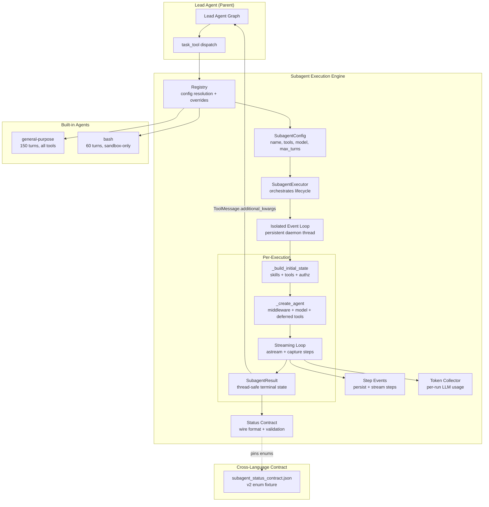
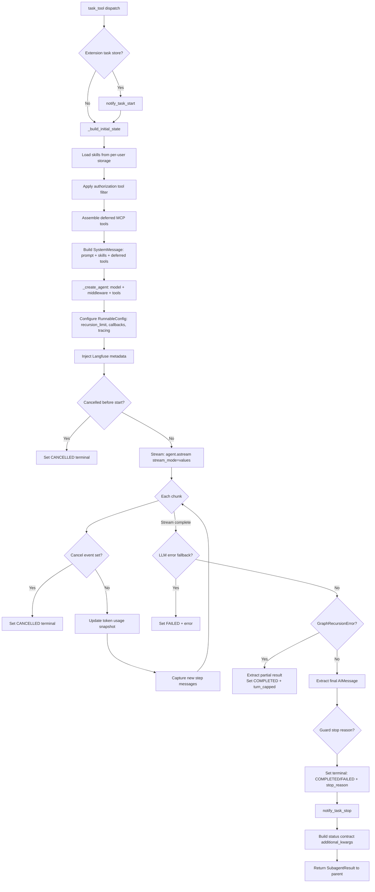

---
slug:9-subagent-execution-engine
blog_type:normal
---

子代理执行引擎是 DeerFlow 多代理架构的委派中枢。当主控 Agent（Lead Agent）判定某部分工作适合独立处理——无论是为了压缩上下文、调用专用工具，还是实现真正的并行处理——它都会发起 `task` 工具调用，从而实例化一个完全独立的 LangGraph agent。该引擎统管此生命周期：从配置解析与工具过滤，到带有实时流式传输的隔离事件循环执行，再到通过版本化跨语言契约进行结构化结果传递。每个子代理都运行在各自的中间件管道、token 预算和保护机制之下，同时继承父代理的沙箱环境、身份信息和追踪上下文，从而确保委派工作既自主又可追溯。

## 架构概述

该引擎由位于 `backend/packages/harness/deerflow/subagents/` 目录下的六个紧密协作的模块组成。每个模块各自负责单一的架构关注点，它们之间的边界通过数据流而非约定来划定：配置信息自上而下从注册中心流向执行器，再传入代理；执行状态自下而上从流式循环流向结果持有器，再传至状态契约；而步骤/token 元数据则通过专门的收集器横向流入持久化层和追踪层。

注册中心通过三层叠加模型解析配置——内置定义、来自 `config.yaml` 的自定义 Agent 定义，以及针对单个代理的覆盖配置——从而确保针对特定部署的调优无需修改代码。随后，执行器接收已解析的配置，并通过 `langchain.agents.create_agent` 构建独立的 LangGraph agent，同时配备由 `build_subagent_runtime_middlewares` 构建的专属中间件栈。这种中间件复用是刻意为之的：子代理享有与主控 Agent 相同的保护机制（如 token 预算、循环检测、工具错误处理、技能激活），但作用域仅限各自的执行上下文。

来源：[executor.py](/backend/packages/harness/deerflow/subagents/executor.py#L1-L47), [registry.py](/backend/packages/harness/deerflow/subagents/registry.py#L1-L11), [builtins/__init__.py](/backend/packages/harness/deerflow/subagents/builtins/__init__.py#L1-L16)

## 配置解析与子代理注册中心

配置是引擎强制执行的第一个架构边界。`SubagentConfig` 数据类定义了委派代理的完整规范：包括名称、描述（用于指导主控 Agent 的委派决策）、系统提示词、工具允许/拒绝列表、技能白名单、模型解析策略、最大轮次以及超时时间。`task` 工具通过 `disallowed_tools` 的默认设置被全局禁用于子代理，以防止可能导致系统资源耗尽的递归委派链。

| 字段 | 类型 | 默认值 | 用途 |
|-------|------|---------|---------|
| `name` | `str` | — | 唯一标识符；由主控 Agent 的委派逻辑进行匹配 |
| `description` | `str` | — | 委派指南；告知主控 Agent *何时* 使用该子代理 |
| `system_prompt` | `str \| None` | `None` | 作为单个 `SystemMessage` 注入的行为指令 |
| `tools` | `list[str] \| None` | `None` | 允许列表；`None` 表示继承所有父级工具 |
| `disallowed_tools` | `list[str] \| None` | `["task"]` | 拒绝列表；始终在允许列表之后应用 |
| `skills` | `list[str] \| None` | `None` | 技能白名单；`None` = 启用所有，`[]` = 禁用所有 |
| `model` | `str` | `"inherit"` | 模型名称或 `"inherit"`（使用父级模型） |
| `max_turns` | `int` | `50` | 图递归限制；控制执行深度 |
| `timeout_seconds` | `int` | `900` | 基础兜底挂钟时间上限（内置代理会被全局默认值覆盖） |

注册中心采用与 Codex 配置分层相呼应的**三层解析顺序**：内置定义作为基础，`config.yaml` 中 `custom_agents` 部分的自定义代理扩展目录，而 `agents` 部分的单代理覆盖配置则用于微调各项属性。关键在于，全局默认值（`subagents.timeout_seconds`、`subagents.max_turns`）**仅适用于内置代理**——自定义代理在 `custom_agents` 部分定义各自的默认值，且绝不能被静默覆盖。model 和 skills 字段没有全局默认值，它们完全通过单代理覆盖配置进行解析。

系统内置了两个子代理。**通用**代理继承所有工具（除去 `task`、`ask_clarification` 和 `present_files`），最多运行 150 轮，专为有界探索和重上下文调查而设计。**bash** 代理仅限使用沙箱工具（`bash`、`ls`、`read_file`、`write_file`、`str_replace`），最多运行 60 轮，专精于多命令 Shell 工作流。两者默认均使用 `model="inherit"`，确保在未显式覆盖的情况下，通过复用父级模型实现成本的可预测性。

来源：[config.py](/backend/packages/harness/deerflow/subagents/config.py#L1-L64), [registry.py](/backend/packages/harness/deerflow/subagents/registry.py#L50-L116), [general_purpose.py](/backend/packages/harness/deerflow/subagents/builtins/general_purpose.py#L1-L71), [bash_agent.py](/backend/packages/harness/deerflow/subagents/builtins/bash_agent.py#L1-L51)

## SubagentExecutor：生命周期与隔离

`SubagentExecutor` 是中央协调器。其构造函数会捕获完整的父级上下文——沙箱状态、线程数据、用户身份、授权属性、追踪 ID，以及父级运行的扩展快照——并对它们进行预先绑定，从而确保在主控运行启动与子代理执行之间并发的 `set_loaded_extensions()` 调用无法在委派工作期间替换底层扩展版本。当模型解析需要加载 `config.yaml` 时，该操作会延迟至 `_create_agent` 中执行，这使得单元测试在缺少配置文件的情况下也能构建执行器。

### 隔离事件循环架构

引擎最精妙的设计决策之一是**持久化隔离事件循环**。当子代理从已处于运行状态的父级 LangGraph 循环中被派发时，它不能简单地在同一循环中 `await` 子代理的异步执行——这会导致 LangGraph 的回调机制和上下文变量发生冲突。为此，引擎在一个专用的守护线程（`subagent-persistent-loop`）中维护了一个长生命周期的 `asyncio.AbstractEventLoop`。该循环在首次使用时惰性创建，受线程锁保护，并通过 `atexit` 注册进行关闭。

上下文拷贝机制（`_copy_isolated_subagent_context`）精准划定了隔离边界。它调用 `copy_context()` 捕获运行时的 `ContextVar` 状态，随后精准剔除**绑定至循环的回调**——即标记了 `deerflow_loop_bound = True` 的处理程序（如父级 `RunJournal`）——同时保留框架的流式回调，确保带有命名空间的子级 token 帧依然能传回父级流。这保证了检查点血脉、运行时元数据、用户身份和追踪上下文都能跨越循环边界，而父级特定的副作用处理程序则不会越界。

<CgxTip>在正常运行期间，持久化循环刻意保持开启，绝不关闭。关闭 asyncio 循环会销毁绑定其上的所有资源（传输对象、协议实例、回调句柄）。在所有隔离的子代理执行中复用同一循环，可以避免“为每次执行创建新循环并随之关闭绑定其上的异步资源”所引发的资源泄漏模式。</CgxTip>

### 代理构建与工具组装

`_create_agent` 方法利用 `langchain.agents` 中的 `create_agent` 构建 LangGraph agent，配置为 `checkpointer=False`（子代理是临时的；检查点管理由父级负责）且 `state_schema=ThreadState`。中间件栈由 `build_subagent_runtime_middlewares` 组装，它共享主控 Agent 的中间件构建逻辑，但加入了子代理专属参数，如 `agent_name`（用于单代理 token 预算解析）、`available_skills`（在构建时发现的确切技能集）以及 `lazy_init=True`。

在构建代理期间，执行器会将所有暴露了 `consume_stop_reason` 方法的防护中间件（目前包括 `TokenBudgetMiddleware` 和 `LoopDetectionMiddleware`）收集至列表中。执行完毕后，`_consume_guard_stop_reason` 会遍历此列表，以查明是哪个上限（若有）提前终止了运行。这种鸭子类型的处理方式避免了将中间件类导入执行器模块，并且能自动兼容未来采用相同接口的防护中间件。

来源：[executor.py](/backend/packages/harness/deerflow/subagents/executor.py#L260-L368), [executor.py](/backend/packages/harness/deerflow/subagents/executor.py#L438-L633), [executor.py](/backend/packages/harness/deerflow/subagents/executor.py#L549-L614)

## 执行流程：从任务派发到结果传递

`_aexecute` 方法是执行生命周期的核心。它编排了一个多阶段管道：扩展生命周期通知、初始状态构建、代理创建、带协作取消的流式执行，以及结构化结果最终化。

### 初始状态构建

在代理运行之前，`_build_initial_state` 会执行四项关键操作。首先，它通过 `get_or_new_user_skill_storage` 从用户级存储中加载已启用的技能，并按子代理的 `config.skills` 白名单进行过滤。其次，它通过 `apply_tool_authorization` 应用**授权层 1**，根据用户身份、角色、OAuth 提供者和通道上下文过滤工具——被拒绝的工具绝不会进入 `DeferredToolCatalog`。第三，它使用 `assemble_deferred_tools` 组装延迟 MCP 工具，这呼应了主控 Agent 的模式，使子代理不再预先绑定完整的 MCP schema。第四，它将系统提示词、技能发现元数据、延迟工具名称和 MCP 路由提示组合成单个 `SystemMessage`（部分 LLM API 会拒绝多个 `SystemMessage` 实例）。

### 流式循环

执行过程采用 `agent.astream(state, config=run_config, context=context, stream_mode="values")` 而非 `agent.ainvoke`。这是一项深思熟虑的架构选择：流式传输支持协作取消、实时步骤捕获和实时的 token 用量更新。`stream_mode="values"` 模式会在每个超级步骤重新输出完整的消息历史，步骤捕获机制通过 O(1) 基于游标的去重系统进行处理（详见下一节）。

在每个流式迭代边界，引擎通过 `result.cancel_event.is_set()` 检查协作取消状态。该 `threading.Event` 会在用户请求中断或触发超时时由父级设定。引擎明确记录了其局限性：取消仅在 `astream` 迭代边界被检测到，因此在单次迭代中长时间运行的工具调用在下一个 chunk 产生前不会被中断。

### 结果提取与防护上限处理

当流式传输完成后，引擎通过 `_extract_final_result` 从会话中最后一个 `AIMessage` 提取最终结果。此函数同时用于正常完成路径和最大轮次路径：当 `GraphRecursionError` 在运行过程中中止任务时，`final_state` 会保留触发限制前流式传输的最后一个 chunk，从而恢复而非丢弃部分工作。当无可提取内容时，将返回哨兵字符串 `"No response generated"`，确保调用方不会将缺失的结果与合法的空结果混淆。

引擎还会通过 `_extract_llm_error_fallback` 检查 LLM 错误回退。`LLMErrorHandlingMiddleware` 会将提供商异常转换为带有标记的 `AIMessage` 对象，使图得以干净地终止，但干净的图终止并不代表任务成功。此函数仅扫描**最后一个** `AIMessage`（而非所有消息）以查找 `deerflow_error_fallback` 元数据标记——这是刻意为之，因为扫描所有消息会再次引入 `runtime/runs/worker.py` 在主控 Agent 路径中防范的、由父级历史重放导致的陈旧标记误报问题。

提取完成后，`_consume_guard_stop_reason` 会检查每个防护中间件。如果触发了上限（如 token 预算耗尽或检测到循环），`stop_reason` 字段将分别被设置为 `"token_capped"` 或 `"loop_capped"`。产生了可用输出的受限运行将保持 `status=completed` 并附带上限 `stop_reason`；而没有输出的受限运行则变为 `status=failed` + `stop_reason`。

来源：[executor.py](/backend/packages/harness/deerflow/subagents/executor.py#L666-L791), [executor.py](/backend/packages/harness/deerflow/subagents/executor.py#L793-L996), [executor.py](/backend/packages/harness/deerflow/subagents/executor.py#L166-L257), [executor.py](/backend/packages/harness/deerflow/subagents/executor.py#L616-L632)

## 线程安全的结果管理

`SubagentResult` 是一个可变状态持有器，用于追踪从 `RUNNING` 到终止状态的执行过程。其设计旨在解决特定的并发风险：后台超时/取消与执行工作线程可能会在同一个结果持有器上发生竞态。`try_set_terminal` 方法使用 `threading.Lock` 保证**第一个终止状态转换生效**——迟到的终止写入会被静默拒绝，且不得更改状态或载荷字段。这一点至关重要，因为超时线程可能在流式循环刚好完成并得出有效结果的瞬间设置 `TIMED_OUT`；此时， whichever acquires the lock first is authoritative。

`SubagentStatus` 枚举定义了六种状态，并通过 `is_terminal` 属性提供清晰的边界检查：

| 状态 | 终止状态 | 含义 |
|--------|----------|---------|
| `PENDING` | 否 | 已创建但尚未启动 |
| `RUNNING` | 否 | 正在执行 |
| `COMPLETED` | 是 | 已完成并带有可用输出（可能带有 `stop_reason`） |
| `FAILED` | 是 | 在无可用输出情况下终止 |
| `CANCELLED` | 是 | 被父级/用户中断 |
| `TIMED_OUT` | 是 | 超出挂钟时间超时 |

`update_token_usage_records` 方法允许在子代理仍在运行时发布实时的 token 快照，但前提是状态未处于终止态——一旦设置了终止状态，token 更新将被静默丢弃，从而防止迟到的回调破坏最终的用量统计。

来源：[executor.py](/backend/packages/harness/deerflow/subagents/executor.py#L58-L163)

## 步骤事件捕获与持久化

步骤事件模块（`step_events.py`）解决了 Issue #3779：子代理执行步骤此前仅作为最新的流式帧可见，且从未被持久化，导致用户在刷新页面后无法查看子代理运行了哪些工具。该模块是一个**纯粹的数据整形层**——它将捕获的 LangGraph 消息字典转换为紧凑且可 JSON 序列化的步骤载荷，这些载荷既被实时流式传输，也会作为运行事件被持久化。

### 基于游标的去重系统

由于 `stream_mode="values"` 会在每个超级步骤重新输出完整的消息历史，简单的捕获方式要么会导致消息重复，要么需要对每个 chunk 进行 O(n) 扫描。引擎通过一个跟踪已检查消息数量的游标（`processed_message_count`）解决了这一问题。`capture_new_step_messages` 实现了三个分支逻辑：

1. **历史增长**（`total > processed_count`）：遍历 `messages[processed_count:total]` 中每个新增的消息并进行捕获。这处理了一个关键场景，即单个超级步骤追加了多个 `ToolMessage` 实例（当模型在一轮中发出多个工具调用时）——如果仅捕获 `messages[-1]`，将丢失除最后一个输出外的所有内容。

2. **历史未变**（`total == processed_count`）：仅重新检查末尾消息。这用于捕获无 ID 的原地替换（长度相同，内容更新），通过 `capture_step_message` 的去重机制，未发生变化的重复输出将变成空操作。

3. **历史收缩**（`total < processed_count`）：将游标重置至新的末尾。这种情况发生在上下文压缩期间，`DeerFlowSummarizationMiddleware` 通过 `RemoveMessage(id=REMOVE_ALL_MESSAGES)` 重写消息通道时。如果不进行此重置，在总长度超过陈旧游标之前，压缩点之后追加的每个步骤都将被丢弃。

### 步骤载荷结构

每个步骤由 `build_subagent_step` 构建，并包含一个 `kind` 字段（`"ai"` 代表助手轮次，`"tool"` 代表工具输出）。AI 步骤包含其 `tool_calls`（仅含名称和参数，大参数会被 `_bounded_tool_call` 截断至 8192 个字符，并标记 `args_truncated`）。工具步骤则包含发起方的 `tool_name`。`text` 字段会被截断至 `SUBAGENT_STEP_MAX_CHARS`（8192）并附带 `truncated` 标志——这同时限定了持久化运行事件行和流式帧的大小，而子代理自身的 LLM 上下文则由 `ToolOutputBudgetMiddleware` 独立限制。

<CgxTip>步骤事件模块维持着一个严格的不变量：在由压缩引发的游标重置之后，无增长分支仅会重新检查 `messages[-1]`。如果在重置游标下方插入真正的新消息，将会被遗漏。目前这是安全的，因为摘要中间件会将摘要放入单独的 `summary_text` 状态键中，且压缩后的消息通道仅包含已见过的保留末尾消息。如果未来的中间件违反了此不变量，重置分支将需要进行全量重新扫描。</CgxTip>

来源：[step_events.py](/backend/packages/harness/deerflow/subagents/step_events.py#L1-L200), [executor.py](/backend/packages/harness/deerflow/subagents/executor.py#L850-L992)

## Token 用量收集

`SubagentTokenCollector` 是一个轻量级的 `BaseCallbackHandler`，用于累积单次子代理执行内的 LLM token 用量记录。每个子代理都会创建自己的收集器实例，并标记 `caller="subagent:<agent_name>"`，从而确保在通过 `record_external_llm_usage_records` 传递给父级 `RunJournal` 时，用量能被正确归属。

除了简单的 token 计数外，收集器还追踪其他几个维度：它从 `response_metadata` 中捕获**实际模型名称**（而非主控 Agent 解析的模型），从而实现准确的单模型成本分桶。当提供商报告时，它还会通过 `input_token_details.cache_read` 记录**提示词缓存命中**，支持缓存感知的成本核算。通过 `run_id` 进行去重，可防止 LangGraph 在回调链中重放消息时发生重复计数。

| 字段 | 来源 | 用途 |
|-------|--------|---------|
| `source_run_id` | LangGraph `run_id` | 去重键；防止重放时重复计数 |
| `caller` | 构造器参数 (`"subagent:<name>"`) | 父级日志的归属标签 |
| `model_name` | `response_metadata.model_name` | 产生响应的实际模型 |
| `input_tokens` | `usage_metadata.input_tokens` | 提示词 token 计数 |
| `output_tokens` | `usage_metadata.output_tokens` | 补全 token 计数 |
| `total_tokens` | `usage_metadata.total_tokens` | 总和（或计算的回退值） |
| `cache_read_tokens` | `input_token_details.cache_read` | 稀疏数据；仅在提供商报告缓存命中时出现 |

来源：[token_collector.py](/backend/packages/harness/deerflow/subagents/token_collector.py#L1-L84)

## 跨语言状态契约

状态契约模块（`status_contract.py`）定义了结构化子代理结果元数据的**网络传输格式**。它有别于模型可见的结果文本（后者仅用于展示内容）——运行时消费者从 `ToolMessage.additional_kwargs` 读取结构化事实。该契约通过位于 `contracts/subagent_status_contract.json`（版本 2）的共享测试夹具在 Python 和 TypeScript 之间实现锚定。

### 契约字段

| 键 | 类型 | 必填 | 描述 |
|-----|------|----------|-------------|
| `subagent_status` | enum | 是 | 枚举值之一：`completed`、`failed`、`cancelled`、`timed_out`、`polling_timed_out` |
| `subagent_stop_reason` | enum | 否 | 上限原因：`token_capped`、`turn_capped`、`loop_capped`（v2 新增） |
| `subagent_error` | string | 否 | 人类可读的错误信息块（仅在非完成状态下出现） |
| `subagent_result_brief` | string | 否 | 有界（2000 字符）的结果预览（仅在 `completed` 时出现） |
| `subagent_result_sha256` | string | 否 | 完整结果的 SHA-256 摘要（64 位小写十六进制字符） |
| `subagent_model_name` | string | 否 | 本次运行使用的实际模型标识符 |
| `subagent_token_usage` | object | 否 | 累积的 `{input_tokens, output_tokens, total_tokens}` |

该契约的设计理念是**增量演进**：受限运行不会获得独立的状态值。产生了输出的受限运行为 `completed` + `stop_reason`；无输出的受限运行为 `failed` + `stop_reason`。这意味着不支持 `stop_reason` 的旧版前端仍能正常工作——它们只会看到 `completed` 或 `failed`，而不会看到上限细节。`stop_reason` 字段是 v2 的新增特性，它允许主控 Agent 区分“自然结束”与“被保护机制提前终止”。

### 遗留状态归一化

读取端的归一化映射表处理 `max_turns_reached`——这是第一阶段（#3949）发出、并在 #3980 中从生产者中移除的状态值。历史的检查点线程历史记录可能仍会在持久化的 `ToolMessage.additional_kwargs` 中包含此值。读取端将其映射至 `stop_reason` 的 `turn_capped`，以便历史数据能被解析为终止状态，而不是在委派账本中滞留为 `in_progress`。

### 校验与完整性

`make_subagent_additional_kwargs` 函数在生产者边界强制执行严格的校验：无效的 status 或 stop_reason 值会引发 `ValueError`，而不会静默泄漏。`_bound_metadata_text` 辅助函数采用头尾截断策略（2/3 头部，1/3 尾部，附带省略号标记），以保持 `result_brief` 和 `error` 在 2000 字符上限内，同时保留内容的开头和结尾。`normalize_token_usage` 校验器在终止态 `ToolMessage` 元数据路径和持久化运行事件路径之间共享，防止两套接口发生逻辑偏移——该单一函数会拒绝 `bool` 值（在 Python 中是 `int` 的子类）以及任何非负整数违规。

来源：[status_contract.py](/backend/packages/harness/deerflow/subagents/status_contract.py#L1-L200), [subagent_status_contract.json](/contracts/subagent_status_contract.json#L1-L7)

## 工具过滤与授权

`_filter_tools` 函数通过两步操作应用子代理的工具允许/拒绝列表：首先是允许列表（若指定，仅保留匹配的工具），其次是拒绝列表（始终应用，移除明确禁止的工具）。这是**名称级别**的过滤器；授权过滤稍后在 `_build_initial_state` 中通过 `apply_tool_authorization` 进行，该步骤会考虑用户身份、角色和 OAuth 上下文。

通用子代理继承所有父级工具（`tools=None`），但拒绝 `task`、`ask_clarification` 和 `present_files`——第一项用于防止递归委派，后两项则用于贯彻子代理的自主性原则（子代理不得请求人工输入）。bash 子代理使用仅包含沙箱工具（`bash`、`ls`、`read_file`、`write_file`、`str_replace`）的显式允许列表，提供了更为收紧的执行面。

延迟 MCP 工具的组装发生在名称级过滤和授权**之后**，因此被拒绝的工具绝不会进入 `DeferredToolCatalog`。生成的 `tool_search` 辅助程序有意不受子代理名称级允许/拒绝列表的限制——其目录由已过滤的列表构建，且活跃的技能策略稍后由中间件同时应用于 schema 可见性和执行，从而确保提升操作无法扩大活跃技能的权限。

来源：[executor.py](/backend/packages/harness/deerflow/subagents/executor.py#L408-L436), [executor.py](/backend/packages/harness/deerflow/subagents/executor.py#L700-L737), [general_purpose.py](/backend/packages/harness/deerflow/subagents/builtins/general_purpose.py#L66-L68), [bash_agent.py](/backend/packages/harness/deerflow/subagents/builtins/bash_agent.py#L46-L47)

## 扩展生命周期集成

当加载的扩展声明了任务存储或任务生命周期能力时，执行器会与 DeerFlow 的扩展系统进行集成。在执行之前，如果 `loaded_extensions.needs_task_store` 为真，将使用子代理的任务 ID 创建一个 `ExtensionData` 容器。如果 `loaded_extensions.has_task_lifecycle` 为真且存在 `run_id`，则会构造一个 `TaskInfo` 对象，包含 `kind="subagent"`、父级运行 ID、线程 ID 和代理名称——随后以 3 秒的超时时间调用 `notify_task_start`。

传递给 `agent.astream` 的 `context` 字典通过 `EXTENSION_TASK_STORE_KEY` 携带此任务存储，同时包含所有传播的身份字段（`user_id`、`user_role`、`oauth_provider`、`oauth_id`、`run_id`、`channel_user_id`、`is_internal`、`authz_attributes`）以及 `is_subagent = True` 标志。这确保了子代理的中间件管道——尤其是 `GuardrailMiddleware`——会使用父级运行的身份来评估委派的工具调用，从而实现基于角色的策略和审计归属。

来源：[executor.py](/backend/packages/harness/deerflow/subagents/executor.py#L815-L948)

## 追踪与可观测性

子代理追踪在图级别进行配置，这与主控 Agent 的模式相呼应。执行器调用 `build_tracing_callbacks()` 并将结果追加到 `RunnableConfig` 的回调列表中，确保单个子代理运行能生成一个包含所有节点、LLM 和工具调用作为子 span 的追踪记录。模型级别的追踪被显式禁用（在 `create_chat_model` 中设置 `attach_tracing=False`），以避免重复计数追踪。

Langfuse 元数据通过 `inject_langfuse_metadata` 注入，携带线程 ID、用户 ID、助手 ID（归一化为 `subagent:<name>`）、模型名称、环境和 DeerFlow 追踪 ID。助手 ID 的归一化（仅小写、连字符）采用内联方式处理，因为 `runtime/runs/naming.py` 仅处理主控 Agent 的运行。此元数据将子代理追踪与可观测性看板中的父线程关联起来。

来源：[executor.py](/backend/packages/harness/deerflow/subagents/executor.py#L877-L920)

## 超时与取消语义

执行器的超时和取消架构在两个层面运作。**挂钟时间超时**（`config.timeout_seconds`，内置代理默认 900 秒，全局覆盖为 1800 秒）由后台调度程序执行，该调度程序运行在拥有 3 个工作线程的专用 `ThreadPoolExecutor` 中。当超时触发时，它会将结果持有器的终止状态设置为 `TIMED_OUT`。**协作取消**机制使用 `threading.Event`（`cancel_event`），流式循环会在每次迭代边界对其进行检查。

这些机制与正常完成路径之间的竞态，通过 `try_set_terminal` 受锁保护的首个写入者胜出语义来解决。如果流式循环在超时触发的瞬间刚好正常完成，谁先获取到锁谁就决定最终状态。这是可以接受的，因为两种结果都是终止态，且结果持有器的载荷字段（结果文本、错误消息、token 记录）仅由胜出的转换写入。

来源：[executor.py](/backend/packages/harness/deerflow/subagents/executor.py#L127-L163), [executor.py](/backend/packages/harness/deerflow/subagents/executor.py#L260-L265), [config.py](/backend/packages/harness/deerflow/subagents/config.py#L28-L42)

---

子代理执行引擎将 DeerFlow 从单代理系统转变为真正的多代理编排平台。其设计优先考虑隔离性而不牺牲可追溯性——每一次委派运行都携带完整的身份传递、独立的保护机制和结构化的结果元数据。跨语言契约确保了前后端独立演进，同时共享的测试夹具防止了枚举偏移。

有关上游委派决策逻辑，请参阅 [Lead Agent Design](8-lead-agent-design)。有关管控主控与子代理执行的中间件管道，请参阅 [Agent Middleware Pipeline](10-agent-middleware-pipeline)。有关子代理结果如何呈现于事件流中，请参阅 [Stream Bridge and Event Pipeline](24-stream-bridge-and-event-pipeline)。
